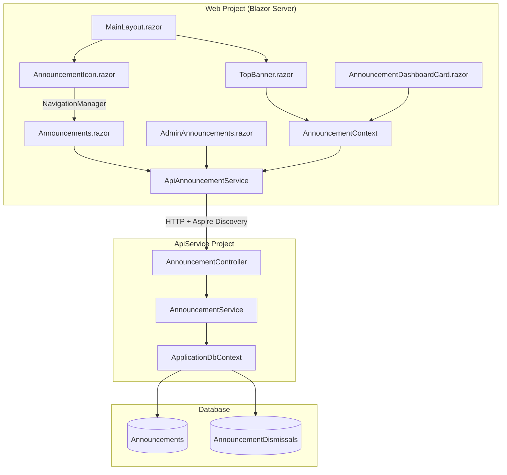

# Design Document: Announcement Banner System

## Overview

The announcement banner system adds a multi-surface communication layer to the enterprise application. Administrators create announcements with scheduling, severity levels, and display types. Users see urgent announcements in a persistent top-of-layout banner, a dashboard summary card, and a dedicated list page.

The system follows established patterns: thin controller delegating to a full service layer, per-circuit caching via a scoped `AnnouncementContext`, typed HttpClient (`ApiAnnouncementService`) with Aspire service discovery, and MudBlazor UI components. Banner dismissals are per-user via a join table, ensuring one user's dismissal does not affect others.

### Key Design Decisions

1. **Single status computation method** — A shared `ComputeStatus(announcement, utcNow)` method centralizes the Active/Scheduled/Expired/Draft classification logic. Both filtering and display use the same method, eliminating divergence.
2. **Two query endpoints for user-facing data** — One endpoint returns active, non-dismissed Banner-type announcements (for the banner), and a combined endpoint returns all active announcements (for dashboard) plus recently expired (for list page). This minimizes API calls while keeping concerns separated.
3. **No SignalR for announcements** — Unlike notifications, announcements do not require real-time push. The `AnnouncementContext` loads once per circuit and refreshes on navigation or explicit user action (dismissal). This keeps complexity low.
4. **Priority as a computed value** — Priority is not stored; it's computed at query time from Severity (Critical > Warning > Info) and CreatedAtUtc (newest first for ties). This avoids manual ordering and stays consistent as announcements are added/removed.

## Architecture



### Data Flow

1. **Circuit initialization** — `AnnouncementContext.InitializeAsync()` calls `ApiAnnouncementService` to load active Banner-type (non-dismissed) and all active announcements.
2. **Banner rendering** — `TopBanner` reads `AnnouncementContext.BannerAnnouncements` synchronously. Displays the first item (highest priority). Shows "N more" link if count > 1.
3. **Banner dismissal** — User clicks dismiss → `ApiAnnouncementService.DismissAsync()` → API creates dismissal record → `AnnouncementContext` removes from local cache → `OnChange` fires → `TopBanner` re-renders.
4. **Dashboard card** — Reads `AnnouncementContext.AllActiveAnnouncements` (includes dismissed).
5. **Admin CRUD** — `AdminAnnouncements.razor` calls `ApiAnnouncementService` directly for all operations. No caching layer — always fresh data.
6. **List page** — `Announcements/Index.razor` calls `ApiAnnouncementService.GetForListPageAsync()` directly on load. Master-detail layout: left pane shows scrollable list items, selecting one populates the right detail pane with full content.

## Topbar Announcement Icon

### Location

`AspireWebAppTemplate.Web/Components/Layout/Topbar/AnnouncementIcon.razor`

### Purpose

A purely navigational icon button in the topbar that takes users to the Announcement List Page. Positioned adjacent to the `NotificationBell` component (after it, to maintain visual hierarchy: notifications first, then announcements).

### Implementation

```razor
@inject NavigationManager NavigationManager

<MudIconButton Icon="@Icons.Material.Filled.Campaign"
               Color="Color.Inherit"
               aria-label="Announcements"
               OnClick="NavigateToAnnouncements" />

@code {
    private void NavigateToAnnouncements()
    {
        NavigationManager.NavigateTo("/announcements");
    }
}
```

### Design Decisions

- **No badge or unread indicator** — Announcements are broadcast content and do not track per-user read status. This distinguishes it from the notification bell which shows an unread count.
- **No service injection** — The component is purely navigational. It does not need `AnnouncementContext`, `ApiAnnouncementService`, or any data-fetching logic.
- **Campaign icon** — Uses `Icons.Material.Filled.Campaign` (megaphone) to visually distinguish from the notification bell (`Icons.Material.Filled.Notifications`).
- **Positioned after NotificationBell** — In the topbar icon group, the order is: NotificationBell → AnnouncementIcon → DropdownProfile. Notifications are higher-urgency (personal, real-time), so they come first.
- **Color.Inherit** — Matches the existing topbar icon style (inherits from MudAppBar foreground color).

### Integration in MainLayout/Topbar

The icon is rendered in the topbar's icon area alongside the existing `NotificationBell`:

```razor
<!-- In Topbar area -->
<NotificationBell />
<AnnouncementIcon />
<DropdownProfile />
```

## Announcement List Page Design

### Layout Structure
```
┌─────────────────────────────────────────────────────────────────┐
│ PageHeader: "Announcements"                                      │
├────────────────────────────┬────────────────────────────────────┤
│ Left Pane (scrollable)     │ Right Pane (detail, scrollable)    │
│                            │                                     │
│ ┌─ List Item (selected) ─┐│ Title: "Scheduled Maintenance"     │
│ │ [Critical] Scheduled Ma ││ [Critical]  Published: Jun 28 · 2h ago │
│ │ The system will be una..││ ─────────────────────────────────  │
│ │ 2 hours ago             ││ <full HTML content rendered>       │
│ ┌─ List Item ────────────┐│                                     │
│ │ [Info] New Export Featu ││                                     │
│ │ You can now export aud..││                                     │
│ │ 1 day ago              ││                                     │
│ └─────────────────────────┘│                                     │
│ ┌─ List Item (dimmed) ───┐│                                     │
│ │ [Warning] Security Poli ││                                     │
│ │ All users must update..││                                     │
│ │ 15 days ago · Expired  ││                                     │
│ └─────────────────────────┘│                                     │
├────────────────────────────┴────────────────────────────────────┤
```

### Design Details
- **Pattern**: Same master-detail layout as the existing Notifications page (`/account/notifications`)
- **Left pane list item anatomy**: Severity chip (small, colored), Title (bold, one-line truncated), Content snippet (plain text, 2-line truncated, caption typography), Timestamp (relative), Expired label (for expired items, dimmed card)
- **Selected state**: Uses `.notification-selected` CSS class pattern (background + left bar pseudo-element indicator)
- **Detail pane header**: Title (h6), Severity colored chip (no label prefix — color communicates urgency), published date (absolute + relative tooltip), "Expired" chip with date for expired items. Display_Type is NOT shown — it is admin-only metadata.
- **Detail pane body**: Full sanitized HTML content rendered via `@((MarkupString)announcement.Content)`, scrollable independently
- **Empty state**: "Select an announcement to view details" centered in the detail pane
- **Expired items**: Dimmed opacity in left pane, "Expired" chip in detail pane header
- **Mobile responsive**: On narrow screens, collapse to single-column list; tapping an item shows detail view with back navigation
- **File location**: `AspireWebAppTemplate.Web/Components/Pages/Announcements/Index.razor` + `.razor.cs`

### Implementation Notes
- Reuses the same split-pane CSS pattern from the Notifications page
- Selected announcement state tracked via `_selectedAnnouncementId` (Guid?)
- Auto-selects the first item on page load (if any announcements exist)
- The left pane scrolls independently from the right pane (both have `overflow-y: auto` with fixed height)

### Page Title
"Announcements" — rendered via `<PageHeader Title="Announcements" />`

## Notification Integration

### Data Flow

```
Announcement created/activated (NotifyUsers=true)
    │
    ▼
Loop active users (ApplicationUser where IsActive=true)
    │
    ├── User 1 → CreateNotificationAsync(Category=System, Title="New Announcement", Message=announcement.Title)
    ├── User 2 → CreateNotificationAsync(...)
    ├── User 3 → CreateNotificationAsync(...)
    └── ... (continue for all active users)
```

### Design Decisions

1. **No FK to Announcement** — The notification entity does not reference the Announcement table. The deep-link URL (`/announcements?id={announcementId}`) is the integration seam. This keeps the notification system decoupled from announcements and avoids cascading schema changes.

2. **NotifyUsers toggle behavior** — Defaults to `true` for Standard display type and `false` for Banner display type. The rationale: Banner announcements are already highly visible in the persistent top-of-layout banner, so additional notifications would be redundant noise. Administrators can override either default.

3. **Error handling** — Notification failures for individual users are logged at Warning level and swallowed. They never disrupt announcement creation or activation. The announcement is the primary operation; notifications are best-effort secondary delivery.

4. **Scalability note** — For typical template scale (< 500 users), a simple sequential loop calling `CreateNotificationAsync` per user is sufficient. For larger scale deployments, a background job (e.g., via `IHostedService` or a queue) would be needed to avoid blocking the HTTP request. This is out of scope for this spec.

5. **Deep-link navigation** — The Announcement List Page reads the `?id={announcementId}` query parameter on load and auto-selects that item in the master-detail view. This enables notification snackbar click → navigate to `/announcements?id={id}` → announcement detail is immediately visible.

### Trigger Conditions

Notifications are created when ALL of the following are true:
- `NotifyUsers` is `true` on the request (create or update)
- The announcement is currently active or transitioning to active status

**On creation:**
- `IsActive=true` AND (`StartsAtUtc` is null OR `StartsAtUtc` is in the past)
- Notification title: "New Announcement"
- Scheduled activation (StartsAtUtc in the future) is out of scope — requires a background scheduler

**On update:**
- The announcement is currently active AND `NotifyUsers=true` on the update request
- Notification title: "Announcement Updated"
- The `NotifyUsers` flag on update is a per-request toggle (default: false) — it is NOT persisted. It only controls whether to send notifications for this specific edit.

This distinction ensures users see "New Announcement" vs "Announcement Updated" in their notification list, making it clear whether they're seeing fresh content or a revision.

## Components and Interfaces

### Core Project (DTOs and Enums)

```
Core/Domain/Enums/
├── AnnouncementDisplayType.cs     ← Banner, Standard
└── AnnouncementSeverity.cs        ← Info, Warning, Critical

Core/Contracts/Announcements/
├── AnnouncementDto.cs             ← Response DTO with all fields + computed Status
├── CreateAnnouncementRequest.cs   ← Title, Message, DisplayType, Severity, StartsAtUtc, ExpiresAtUtc, IsActive, NotifyUsers
├── UpdateAnnouncementRequest.cs   ← Same as create + ClearDismissals flag
└── AnnouncementStatusFilter.cs    ← Enum: All, Active, Scheduled, Expired, Draft
```

### ApiService Project

```
ApiService/
├── Abstractions/IAnnouncementService.cs
├── Controllers/AnnouncementController.cs
├── Data/Entities/
│   ├── Announcement.cs
│   └── AnnouncementDismissal.cs
└── Services/AnnouncementService.cs
```

### Web Project

```
Web/
├── Components/
│   ├── Layout/Topbar/TopBanner.razor + .razor.cs
│   ├── Layout/Topbar/AnnouncementIcon.razor
│   ├── Pages/Admin/AdminAnnouncements.razor + .razor.cs
│   ├── Pages/Announcements/Index.razor + .razor.cs
│   └── Shared/AnnouncementDashboardCard.razor + .razor.cs
├── Services/
│   ├── ApiClients/ApiAnnouncementService.cs
│   └── Contexts/AnnouncementContext.cs
└── Abstractions/IAnnouncementContext.cs
```

### Interface Definitions

**IAnnouncementService (ApiService)**

```csharp
public interface IAnnouncementService
{
    // CRUD Operations
    Task<AnnouncementDto> CreateAsync(CreateAnnouncementRequest request);
    Task<AnnouncementDto> UpdateAsync(Guid id, UpdateAnnouncementRequest request);
    Task DeleteAsync(Guid id);

    // Query Operations
    Task<List<AnnouncementDto>> GetAllAsync(AnnouncementStatusFilter? filter = null);
    Task<List<AnnouncementDto>> GetActiveForUserAsync(string userId);
    Task<List<AnnouncementDto>> GetForListPageAsync();

    // Dismissal
    Task DismissAsync(string userId, Guid announcementId);
}
```

**IAnnouncementContext (Web)**

```csharp
public interface IAnnouncementContext : IAsyncDisposable
{
    IReadOnlyList<AnnouncementDto> BannerAnnouncements { get; }
    IReadOnlyList<AnnouncementDto> AllActiveAnnouncements { get; }
    bool IsLoaded { get; }
    event Action? OnChange;
    Task InitializeAsync();
    Task DismissAsync(Guid announcementId);
}
```

## Data Models

### Announcement Entity

| Field | Type | Constraints |
|-------|------|-------------|
| Id | Guid | PK, generated on creation |
| Title | string | Required, max 200 chars |
| Message | string | Required, max 2000 chars |
| DisplayType | AnnouncementDisplayType | Stored as string |
| Severity | AnnouncementSeverity | Stored as string |
| StartsAtUtc | DateTime? | Nullable — null means no start constraint |
| ExpiresAtUtc | DateTime? | Nullable — null means no expiry |
| IsActive | bool | Default false |
| NotifyUsers | bool | Default false |
| CreatedByUserId | string | FK to ApplicationUser, max 450 |
| CreatedAtUtc | DateTime | Set on creation |
| UpdatedAtUtc | DateTime | Set on creation and update |

**Indexes:**
- `IX_Announcements_IsActive_StartsAtUtc_ExpiresAtUtc` — composite index for efficient active announcement queries
- `IX_Announcements_CreatedAtUtc` — for ordering

**Relationships:**
- `CreatedByUser` → ApplicationUser (Restrict delete — preserve announcement even if admin user deleted)
- `Dismissals` → Collection of AnnouncementDismissal

### AnnouncementDismissal Entity

| Field | Type | Constraints |
|-------|------|-------------|
| UserId | string | Composite PK part 1, FK to ApplicationUser |
| AnnouncementId | Guid | Composite PK part 2, FK to Announcement |
| DismissedAtUtc | DateTime | Set on dismissal |

**Relationships:**
- `User` → ApplicationUser (Cascade delete — remove dismissals when user removed)
- `Announcement` → Announcement (Cascade delete — remove dismissals when announcement deleted)

### AnnouncementDto

```csharp
public class AnnouncementDto
{
    public Guid Id { get; set; }
    public string Title { get; set; } = string.Empty;
    public string Message { get; set; } = string.Empty;
    public AnnouncementDisplayType DisplayType { get; set; }
    public AnnouncementSeverity Severity { get; set; }
    public DateTime? StartsAtUtc { get; set; }
    public DateTime? ExpiresAtUtc { get; set; }
    public bool IsActive { get; set; }
    public bool NotifyUsers { get; set; }
    public string Status { get; set; } = string.Empty; // Computed: Active, Scheduled, Expired, Draft
    public DateTime CreatedAtUtc { get; set; }
    public DateTime UpdatedAtUtc { get; set; }
    public string? CreatedByUserName { get; set; }
}
```

### Status Computation Logic

```
Status = 
  if (ExpiresAtUtc != null && now >= ExpiresAtUtc) → "Expired"
  else if (StartsAtUtc != null && now < StartsAtUtc) → "Scheduled"
  else if (IsActive) → "Active"
  else → "Draft"
```

This order matters: expiry overrides everything, then scheduled check, then active flag, then draft as default.

## Correctness Properties

*A property is a characteristic or behavior that should hold true across all valid executions of a system — essentially, a formal statement about what the system should do. Properties serve as the bridge between human-readable specifications and machine-verifiable correctness guarantees.*

### Property 1: Status classification is consistent with IsActive, StartsAtUtc, and ExpiresAtUtc

*For any* announcement with arbitrary IsActive (bool), StartsAtUtc (nullable DateTime), ExpiresAtUtc (nullable DateTime), and any reference UTC time, the computed status SHALL be:
- "Expired" when ExpiresAtUtc is non-null and now >= ExpiresAtUtc
- "Scheduled" when not expired and StartsAtUtc is non-null and now < StartsAtUtc
- "Active" when not expired, not scheduled, and IsActive is true
- "Draft" when not expired, not scheduled, and IsActive is false

**Validates: Requirements 2.1, 2.2, 2.3, 2.4, 2.5**

### Property 2: Creation preserves all input fields and sets audit metadata

*For any* valid CreateAnnouncementRequest (Title ≤ 200 chars, Message ≤ 2000 chars, valid date range), creating an announcement SHALL produce a persisted entity where Title, Message, DisplayType, Severity, StartsAtUtc, ExpiresAtUtc, and IsActive match the request; CreatedByUserId matches the current user; and CreatedAtUtc/UpdatedAtUtc are set to a UTC value at or after the time of the call.

**Validates: Requirements 3.1, 3.2**

### Property 3: Creation rejects invalid input

*For any* CreateAnnouncementRequest where Title exceeds 200 characters, Message exceeds 2000 characters, or StartsAtUtc >= ExpiresAtUtc (when both are provided), the service SHALL reject the request with a descriptive validation error and no entity shall be persisted.

**Validates: Requirements 3.3, 3.4**

### Property 4: Update preserves fields and refreshes UpdatedAtUtc

*For any* existing announcement and valid UpdateAnnouncementRequest, updating SHALL modify the entity fields to match the request and set UpdatedAtUtc to a UTC value at or after the time of the call, while preserving CreatedAtUtc and CreatedByUserId unchanged.

**Validates: Requirements 4.1**

### Property 5: ClearDismissals removes all dismissal records for the announcement

*For any* announcement with N ≥ 0 associated dismissal records, updating with ClearDismissals=true SHALL result in zero dismissal records for that announcement after the operation completes.

**Validates: Requirements 4.3**

### Property 6: Delete removes announcement and all associated dismissals

*For any* announcement with N ≥ 0 associated dismissal records, deleting SHALL remove both the announcement entity and all N dismissal records from the database.

**Validates: Requirements 5.1**

### Property 7: Status filter returns exactly the matching subset

*For any* set of announcements in the database and any status filter value (Active, Scheduled, Expired, Draft), the filtered list SHALL contain exactly those announcements whose computed status matches the filter, and the results SHALL be ordered by CreatedAtUtc descending.

**Validates: Requirements 6.1, 6.2, 6.3, 6.4, 6.5**

### Property 8: Priority ordering selects by Severity descending then CreatedAtUtc descending

*For any* set of announcements, ordering by priority SHALL place Critical before Warning before Info, and within the same severity, newer announcements (higher CreatedAtUtc) before older ones.

**Validates: Requirements 7.1, 7.2, 9.5**

### Property 9: Dismissal excludes announcement from user's banner query

*For any* user and active Banner-type announcement, after the user dismisses that announcement, querying active non-dismissed Banner-type announcements for that user SHALL NOT include the dismissed announcement.

**Validates: Requirements 8.1, 8.3**

### Property 10: Dismissal is idempotent

*For any* user-announcement pair, dismissing the same announcement multiple times SHALL result in exactly one dismissal record and complete successfully without error on each call.

**Validates: Requirements 8.4**

### Property 11: Dashboard query returns all active announcements regardless of dismissal status

*For any* set of active announcements where some are dismissed by the current user, querying for dashboard/all-active announcements SHALL return all active announcements including those the user has dismissed.

**Validates: Requirements 9.1, 12.5**

### Property 12: List page query includes active plus expired within 30 days

*For any* set of announcements with varying expiry dates, the list page query SHALL return all currently active announcements AND announcements whose ExpiresAtUtc is within the last 30 days relative to now, excluding announcements that expired more than 30 days ago.

**Validates: Requirements 10.2**

### Property 13: Context dismissal removes from cached banner list

*For any* `AnnouncementContext` loaded with N banner announcements, dismissing one SHALL reduce the BannerAnnouncements count by one, the dismissed announcement SHALL not appear in BannerAnnouncements, and the OnChange event SHALL fire.

**Validates: Requirements 12.3**

### Property 14: Notification delivery respects NotifyUsers flag

*For any* announcement with NotifyUsers=true that becomes active, a notification SHALL be created for each active user. *For any* announcement with NotifyUsers=false, no notifications SHALL be created regardless of other fields.

**Validates: Requirements 16.1, 16.4, 16.5**

## Error Handling

### Service Layer (AnnouncementService)

| Scenario | Exception | HTTP Status |
|----------|-----------|-------------|
| Announcement ID not found (update/delete) | `KeyNotFoundException` | 404 |
| Title > 200 chars or Message > 2000 chars | `ArgumentException` | 400 |
| StartsAtUtc >= ExpiresAtUtc | `ArgumentException` | 400 |
| Duplicate dismissal attempt | No exception (idempotent) | 200 |

### Controller Layer (AnnouncementController)

Standard exception-to-status mapping via try/catch:
```csharp
catch (KeyNotFoundException ex) { return NotFound(ex.Message); }
catch (ArgumentException ex) { return BadRequest(ex.Message); }
catch (InvalidOperationException ex) { return BadRequest(ex.Message); }
```

### Web Layer (ApiAnnouncementService)

All methods return `ApiResult<T>` or `ApiResult` — never throw on HTTP errors. The UI components inspect `result.Succeeded` and display errors via Snackbar or inline alert.

### AnnouncementContext

- `InitializeAsync` failures are caught and logged. `IsLoaded` is set to true regardless so the UI exits loading state.
- Dismissal API failures are logged and the local cache is not modified (optimistic update is NOT used — only update cache on confirmed success).

### Audit Logging

Admin operations (create, update, delete) are audited via `IAuditLogService.LogAsync()` with old/new value tracking for updates. Audit failures are swallowed and logged at Error level — they never disrupt the primary operation.

## Testing Strategy

### Property-Based Tests (FsCheck.Xunit)

The following properties will be implemented as FsCheck property tests with `[Property(MaxTest = 2)]` (per project convention):

| Property | Test Class | What's Generated |
|----------|-----------|-----------------|
| 1: Status classification | `AnnouncementStatusPropertyTests` | Random (IsActive, StartsAtUtc?, ExpiresAtUtc?, referenceTime) |
| 2: Creation preserves fields | `AnnouncementCreationPropertyTests` | Random valid CreateAnnouncementRequest |
| 3: Creation validation | `AnnouncementValidationPropertyTests` | Random invalid requests (long strings, bad dates) |
| 4: Update preserves fields | `AnnouncementUpdatePropertyTests` | Random existing announcement + valid update request |
| 5: ClearDismissals | `AnnouncementDismissalPropertyTests` | Random announcement with N dismissals |
| 6: Delete cascade | `AnnouncementDeletePropertyTests` | Random announcement with N dismissals |
| 7: Status filter | `AnnouncementFilterPropertyTests` | Random set of announcements + filter value |
| 8: Priority ordering | `AnnouncementPriorityPropertyTests` | Random set of announcements with varied severities/dates |
| 9: Dismissal excludes from banner | `AnnouncementDismissalPropertyTests` | Random user + active Banner announcement |
| 10: Idempotent dismissal | `AnnouncementDismissalPropertyTests` | Random user-announcement pair |
| 11: Dashboard ignores dismissals | `AnnouncementDashboardPropertyTests` | Random announcements with some dismissed |
| 12: List page 30-day window | `AnnouncementListPagePropertyTests` | Random announcements with varied expiry dates |
| 13: Context dismissal | `AnnouncementContextPropertyTests` | Random context state with N banner announcements |
| 14: Notification delivery | `AnnouncementNotificationPropertyTests` | Random announcement with NotifyUsers flag + set of active users |

**Test infrastructure:** SQLite in-memory database (same pattern as `NotificationCreationPropertyTests`), Moq for `ICurrentUserAccessor` and `IAuditLogService`.

### Unit Tests (xUnit + Moq)

- Controller endpoint tests (verifying HTTP status codes, authorization attributes)
- `AnnouncementContext` initialization and event behavior
- `ApiAnnouncementService` URL construction and response mapping
- UI component rendering (TopBanner empty state, severity styling, "N more" link)
- Admin dialog validation error display

### Integration Tests

- Full API → Service → Database round-trip for CRUD operations
- Authorization enforcement (Admin-only endpoints reject non-admin users)
- Aspire service discovery wiring verification

### Test Organization

```
AspireWebAppTemplate.Tests/
└── Announcements/
    ├── AnnouncementStatusPropertyTests.cs
    ├── AnnouncementCreationPropertyTests.cs
    ├── AnnouncementValidationPropertyTests.cs
    ├── AnnouncementUpdatePropertyTests.cs
    ├── AnnouncementDeletePropertyTests.cs
    ├── AnnouncementFilterPropertyTests.cs
    ├── AnnouncementPriorityPropertyTests.cs
    ├── AnnouncementDismissalPropertyTests.cs
    ├── AnnouncementDashboardPropertyTests.cs
    ├── AnnouncementListPagePropertyTests.cs
    ├── AnnouncementContextPropertyTests.cs
    ├── AnnouncementNotificationPropertyTests.cs
    └── AnnouncementControllerTests.cs
```
