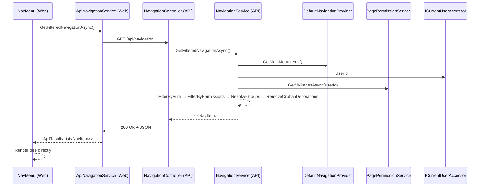
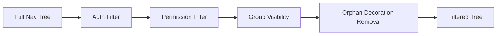

# Design Document: API Navigation Filtering

## Overview

This feature moves the navigation filtering pipeline from the Blazor Server frontend (`NavMenu.ComputeVisibleNavItems`) to the backend API (`NavigationService`). The API becomes the single source of truth for navigation visibility by combining the full nav structure (from `DefaultNavigationProvider`) with the user's authentication state and page permissions, then returning a pre-filtered, ready-to-render navigation tree.

The Web project's `NavMenu` component is simplified to a pure renderer — it fetches the filtered tree from a new `GET /api/navigation` endpoint via a typed HttpClient and renders it directly with no filtering logic.

### Design Rationale

- **Single source of truth**: Filtering logic lives in one place (API service layer), not duplicated between client and server.
- **Thin frontend**: Aligns with the project's "thin controller / full service layer" philosophy extended to the Blazor frontend.
- **Testability**: Pure filtering logic in a service class is easier to test with property-based testing than Blazor component code using reflection.
- **Consistency**: Any future client (mobile app, different frontend) gets the same filtered navigation from the API.

## Architecture



### Pipeline Stages (executed in order)



1. **Auth Filter** — Removes items based on `AuthorizedOnly`/`NotAuthorizedOnly` flags relative to the user's authentication state.
2. **Permission Filter** — Removes Link items whose normalized Href is not in the user's page permission set (system pages bypass).
3. **Group Visibility** — Removes groups with zero visible content children (evaluated bottom-up for nested groups).
4. **Orphan Decoration Removal** — Removes Headers without following content and Dividers without content on both sides. Applied at each tree level independently.

## Components and Interfaces

### New Components

| Component | Project | Path | Responsibility |
|-----------|---------|------|----------------|
| `INavigationService` | ApiService | `Abstractions/INavigationService.cs` | Service interface for filtered navigation |
| `NavigationService` | ApiService | `Services/NavigationService.cs` | Full filtering pipeline implementation |
| `NavigationController` | ApiService | `Controllers/NavigationController.cs` | Thin controller exposing `GET /api/navigation` |
| `ApiNavigationService` | Web | `Services/ApiClients/ApiNavigationService.cs` | Typed HttpClient for the navigation endpoint |

### Modified Components

| Component | Project | Change |
|-----------|---------|--------|
| `NavMenu.razor.cs` | Web | Remove `ComputeVisibleNavItems`, `FilterByAccessibility`, `RemoveOrphanedDecorations`, `IsPageAccessible`, `IsAuthVisible` and all helper methods. Replace with API call via `ApiNavigationService`. |
| `NavMenu.razor` | Web | Remove `PagePermissionContext.IsLoaded` check, add loading state driven by API call status. |
| `Program.cs` | ApiService | Register `INavigationService` / `NavigationService` as scoped. |
| `Program.cs` | Web | Register `ApiNavigationService` typed HttpClient. |

### INavigationService Interface

```csharp
namespace AspireWebAppTemplate.ApiService.Abstractions;

/// <summary>
/// Provides filtered navigation trees based on the current user's authentication
/// state and page permissions. Implements the full filtering pipeline: auth filter,
/// permission filter, group visibility resolution, and orphan decoration removal.
/// </summary>
public interface INavigationService
{
    /// <summary>
    /// Returns the navigation tree filtered for the current authenticated user.
    /// The returned list contains only items the user is permitted to see,
    /// with empty groups removed and orphan decorations cleaned up.
    /// </summary>
    Task<List<NavItem>> GetFilteredNavigationAsync();
}
```

### NavigationController

```csharp
[Route("api/navigation")]
[Authorize]
public class NavigationController : BaseController
{
    private readonly INavigationService _navigationService;

    public NavigationController(INavigationService navigationService)
    {
        _navigationService = navigationService;
    }

    /// <summary>
    /// Returns the pre-filtered navigation tree for the authenticated user.
    /// </summary>
    [HttpGet]
    [ProducesResponseType(typeof(List<NavItem>), StatusCodes.Status200OK)]
    [ProducesResponseType(StatusCodes.Status401Unauthorized)]
    public async Task<ActionResult<List<NavItem>>> GetNavigation()
    {
        var result = await _navigationService.GetFilteredNavigationAsync();
        return Ok(result);
    }
}
```

### NavigationService (core filtering logic)

```csharp
namespace AspireWebAppTemplate.ApiService.Services;

public class NavigationService : INavigationService
{
    private readonly INavigationProvider _navigationProvider;
    private readonly IPagePermissionService _pagePermissionService;
    private readonly ICurrentUserAccessor _currentUserAccessor;

    // Pipeline entry point
    public async Task<List<NavItem>> GetFilteredNavigationAsync()
    {
        var allItems = _navigationProvider.GetMainMenuItems();
        var userId = _currentUserAccessor.UserId;
        var isAuthenticated = userId is not null;
        var permittedPaths = isAuthenticated
            ? new HashSet<string>(await _pagePermissionService.GetMyPagesAsync(userId!), StringComparer.OrdinalIgnoreCase)
            : new HashSet<string>(StringComparer.OrdinalIgnoreCase);

        var accessible = FilterByAccessibility(allItems, isAuthenticated, permittedPaths);
        return RemoveOrphanedDecorations(accessible);
    }

    // Internal methods: FilterByAccessibility, RemoveOrphanedDecorations, 
    // NormalizePath, IsAuthVisible, IsPageAccessible
}
```

### ApiNavigationService (Web typed client)

```csharp
namespace AspireWebAppTemplate.Web.Services;

public class ApiNavigationService(HttpClient http)
{
    public async Task<ApiResult<List<NavItem>>> GetFilteredNavigationAsync()
    {
        var response = await http.GetAsync("/api/navigation");
        if (response.IsSuccessStatusCode)
            return ApiResult<List<NavItem>>.Success(
                await response.Content.ReadFromJsonAsync<List<NavItem>>() ?? []);
        return ApiResult<List<NavItem>>.Failure(await response.Content.ReadAsStringAsync());
    }
}
```

## Data Models

### Existing Models (no changes needed)

**NavItem** (`Core/Common/NavItem.cs`) — The sealed navigation item model with `Type`, `Text`, `Href`, `Title`, `Match`, `Icon`, `AuthorizedOnly`, `NotAuthorizedOnly`, `DividerClass`, `Children`, `Expanded` properties. Used as both the internal model and the API response DTO.

**NavItemType** enum — `Header`, `Link`, `Divider`, `Group`.

**NavMatch** enum — `Prefix`, `Exact`.

### API Response Format

The `GET /api/navigation` endpoint returns a JSON array of `NavItem` objects directly (no wrapper). This matches the existing pattern where list endpoints return the collection directly and the Web-side client wraps in `ApiResult<T>`.

```json
[
  { "type": 0, "text": "Activity", ... },
  { "type": 1, "text": "Home", "href": "", "icon": "...", ... },
  { "type": 3, "text": "Administration", "children": [...], ... }
]
```

### Path Normalization Rules

The `NavigationService` normalizes `NavItem.Href` values to match page permission path format:

| Href Value | Normalized Path | Rule |
|------------|----------------|------|
| `null` | *(skip comparison)* | Always visible |
| `""` | `/` | Empty → root |
| `"counter"` | `/counter` | Prepend `/` |
| `"/admin/audit-log"` | `/admin/audit-log` | Already has `/` |
| `"admin/audit-log/"` | `/admin/audit-log` | Prepend `/` + strip trailing `/` |

Comparison uses `StringComparer.OrdinalIgnoreCase`.

## Correctness Properties

*A property is a characteristic or behavior that should hold true across all valid executions of a system — essentially, a formal statement about what the system should do. Properties serve as the bridge between human-readable specifications and machine-verifiable correctness guarantees.*

### Property 1: Filtering Pipeline Equivalence

*For any* valid NavItem tree (up to 5 levels deep, up to 50 items per level), *for any* authentication state (authenticated or unauthenticated), and *for any* page permission set (including empty sets), the `NavigationService.GetFilteredNavigationAsync` output SHALL be structurally equal to the output of `NavMenu.ComputeVisibleNavItems` given the same inputs — where structural equality means identical item count at each tree level, identical property values on each corresponding item, identical ordering, and identical Children lists on Group items compared recursively.

**Validates: Requirements 7.1, 7.2, 7.3, 7.4**

### Property 2: Auth Filtering Truth Table

*For any* NavItem and *for any* authentication state, the authentication filtering outcome SHALL match the following truth table:
- `AuthorizedOnly=true, NotAuthorizedOnly=false` → visible only when authenticated
- `AuthorizedOnly=false, NotAuthorizedOnly=true` → visible only when unauthenticated
- `AuthorizedOnly=false, NotAuthorizedOnly=false` → always visible
- `AuthorizedOnly=true, NotAuthorizedOnly=true` → never visible

**Validates: Requirements 2.1, 2.2, 2.3, 2.4, 2.5, 2.6**

### Property 3: Permission Filtering Correctness

*For any* NavItem of type Link that has passed auth filtering, and *for any* page permission set, the permission filtering outcome SHALL be: include if Href is null; include if normalized path is a System_Page; include if normalized path is in the permission set; exclude otherwise.

**Validates: Requirements 3.1, 3.2, 3.3, 3.4, 3.5**

### Property 4: Group Visibility By Content Children

*For any* Group-type NavItem evaluated bottom-up, the group SHALL be included in the output if and only if at least one of its content children (Link or nested Group, evaluated recursively) passes the filtering pipeline. Empty nested groups SHALL NOT count as visible content children of their parent.

**Validates: Requirements 1.5, 4.1, 4.2, 4.3**

### Property 5: Orphan Decoration Removal

*For any* list of items at any level of the tree (after auth/permission/group filtering), a Header SHALL be included only if there exists a following Content_Item (Link or Group) before the next Header or end of the sibling list; a Divider SHALL be included only if there exists both a preceding Content_Item and a following Content_Item within the same sibling list.

**Validates: Requirements 4.4, 5.1, 5.2, 5.3, 5.4, 5.5**

### Property 6: Path Normalization Idempotence and Correctness

*For any* Href string, the normalization function SHALL: prepend `/` if no leading slash exists, strip trailing `/` if present, and the resulting path compared with `OrdinalIgnoreCase` SHALL match any permission path that differs only by leading/trailing slash or letter case.

**Validates: Requirements 8.1, 8.2, 8.4, 8.5**

## Error Handling

### API Service Layer (NavigationService)

| Scenario | Behavior |
|----------|----------|
| `ICurrentUserAccessor.UserId` is null | Treat as unauthenticated; apply auth-only filtering (no permission check). The `[Authorize]` attribute on the controller prevents this in production, but the service handles it defensively. |
| `IPagePermissionService.GetMyPagesAsync` throws | Let exception propagate — controller returns 500. Logged by middleware. |
| `INavigationProvider.GetMainMenuItems` returns empty list | Return empty list (valid scenario). |

### Controller (NavigationController)

| Scenario | HTTP Response |
|----------|--------------|
| Unauthenticated request | 401 Unauthorized (via `[Authorize]` attribute) |
| Service succeeds | 200 OK with JSON array |
| Service throws unhandled exception | 500 Internal Server Error (middleware) |

### Web Client (ApiNavigationService)

| Scenario | Behavior |
|----------|----------|
| HTTP 200 | Return `ApiResult<List<NavItem>>.Success(data)` |
| HTTP 401 | Return `ApiResult<List<NavItem>>.Failure(errorMessage)` |
| HTTP 5xx / network failure | Return `ApiResult<List<NavItem>>.Failure(errorMessage)` |
| Deserialization failure | Return `ApiResult<List<NavItem>>.Failure(errorMessage)` |

### NavMenu Component

| Scenario | UI Behavior |
|----------|-------------|
| API call in-flight | Show loading skeleton (5 `MudSkeleton` elements) |
| API success with items | Render the tree directly |
| API success with empty list | Render empty nav (no items) |
| API failure | Render empty nav (zero items) |

## Testing Strategy

### Property-Based Tests (FsCheck.Xunit)

Property-based testing is the primary verification strategy for this feature. The filtering pipeline is a pure function (nav tree + auth state + permissions → filtered tree) with a large input space, making it ideal for PBT.

**Library**: FsCheck.Xunit 3.3.3 (already in the project)
**Configuration**: `[Property(MaxTest = 100)]` minimum per property test
**Tag format**: `// Feature: api-nav-filtering, Property {N}: {title}`

Each correctness property (1–6) maps to one or more property-based tests:

| Property | Test Class | Strategy |
|----------|-----------|----------|
| 1: Pipeline Equivalence | `NavigationFilteringEquivalenceTests` | Generate random trees + auth + permissions; compare `NavigationService` output to `NavMenu.ComputeVisibleNavItems` output |
| 2: Auth Truth Table | `NavigationAuthFilterPropertyTests` | Generate items with all flag combinations × both auth states; verify truth table |
| 3: Permission Filtering | `NavigationPermissionFilterPropertyTests` | Generate link items with random hrefs + permission sets; verify include/exclude rules |
| 4: Group Visibility | `NavigationGroupVisibilityPropertyTests` | Generate nested group structures; verify bottom-up empty-group exclusion |
| 5: Orphan Decorations | `NavigationDecorationPropertyTests` | Generate item sequences with mixed types; verify header/divider inclusion rules |
| 6: Path Normalization | `NavigationPathNormalizationPropertyTests` | Generate hrefs with/without slashes, varying case; verify normalization |

### Generators

A shared `NavItemGenerators` class provides FsCheck generators:

- `GenNavItem(maxDepth)` — generates random NavItem (any type) with recursive children for Groups
- `GenNavTree(maxDepth, maxWidth)` — generates a list of NavItems forming a valid tree
- `GenPermissionSet()` — generates a random subset of known page paths
- `GenAuthState()` — generates authenticated/unauthenticated boolean
- `GenHref()` — generates hrefs with various normalization edge cases (null, empty, leading slash, trailing slash, mixed case)

### Unit Tests (xUnit + Moq)

- Controller returns 200 with service result
- Controller returns 401 when unauthenticated (integration)
- ApiNavigationService deserializes successful response
- ApiNavigationService returns failure on HTTP error
- NavMenu renders items without filtering
- NavMenu shows skeleton while loading
- NavMenu shows empty state on failure

### Test Location

```
AspireWebAppTemplate.Tests/
└── Navigation/
    ├── Properties/
    │   ├── NavigationFilteringEquivalenceTests.cs
    │   ├── NavigationAuthFilterPropertyTests.cs
    │   ├── NavigationPermissionFilterPropertyTests.cs
    │   ├── NavigationGroupVisibilityPropertyTests.cs
    │   ├── NavigationDecorationPropertyTests.cs
    │   └── NavigationPathNormalizationPropertyTests.cs
    ├── Generators/
    │   └── NavItemGenerators.cs
    └── NavigationServiceUnitTests.cs
```
