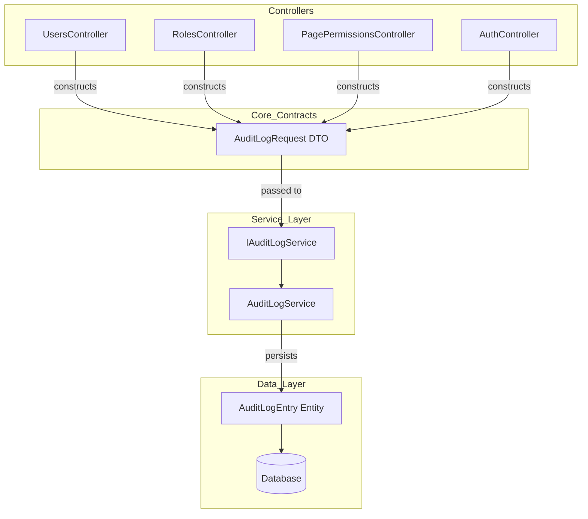

# Design Document: Audit Log Old/New Values

## Overview

This design enhances the existing audit log system in two complementary ways:

1. **API Refactoring**: Introduces an `AuditLogRequest` DTO contract class to replace the current long-parameter-list `LogAsync()` method signature. The old signature is removed entirely since all callers are migrated in the same change.

2. **Change Tracking**: Populates the existing `OldValues` and `NewValues` columns on `AuditLogEntry` for all update-type operations across `UsersController`, `RolesController`, `PagePermissionsController`, and `AuthController`. Only changed fields are included in the JSON payload, using camelCase property naming via `System.Text.Json`.

The approach is intentionally simple — change detection happens at the controller level by snapshotting relevant fields before the mutation and comparing after. No EF Core interceptors or shadow properties are used, keeping the solution explicit and easy to reason about.

## Architecture



**Data Flow for Update Operations:**

1. Controller loads entity from database (current state)
2. Controller snapshots the relevant fields into a dictionary/anonymous object
3. Controller applies the mutation (update the entity)
4. Controller snapshots the post-mutation fields
5. Controller computes the diff (only changed fields)
6. Controller serializes the diff as camelCase JSON for `OldValues` and `NewValues`
7. Controller constructs an `AuditLogRequest` and calls `LogAsync(AuditLogRequest)`
8. `AuditLogService` maps the DTO to an `AuditLogEntry` entity and persists it

**Design Decision — Controller-Level Change Detection:**
Change detection is performed in controllers rather than using EF Core interceptors because:
- Each controller knows which fields are audit-relevant (excluding sensitive fields like password hashes)
- Different entities have different field subsets worth tracking
- The logic is explicit, testable, and doesn't require EF Core plumbing knowledge
- It aligns with the existing pattern of controllers constructing audit descriptions

## Components and Interfaces

### 1. AuditLogRequest DTO

**Location:** `AspireWebAppTemplate.Core/Contracts/AuditLog/AuditLogRequest.cs`

```csharp
using AspireWebAppTemplate.Core.Domain.Enums;

namespace AspireWebAppTemplate.Core.Contracts.AuditLog;

/// <summary>
/// Encapsulates all parameters for recording a single audit log entry.
/// Replaces the long-parameter-list LogAsync method signature.
/// </summary>
public sealed class AuditLogRequest
{
    public string? UserId { get; set; }
    public AuditActionType ActionType { get; set; }
    public AuditEntityType EntityType { get; set; }
    public string EntityId { get; set; } = string.Empty;
    public string EntityName { get; set; } = string.Empty;
    public string Description { get; set; } = string.Empty;
    public string? OldValues { get; set; }
    public string? NewValues { get; set; }
    public string? IpAddress { get; set; }
}
```

### 2. IAuditLogService Interface Changes

**Location:** `AspireWebAppTemplate.ApiService/Abstractions/IAuditLogService.cs`

Replace the existing `LogAsync` method (with individual parameters) with:
```csharp
Task LogAsync(AuditLogRequest request);
```

The old method signature is removed entirely — no `[Obsolete]` attribute, no overload. All callers are migrated in the same change.

### 3. AuditLogService Implementation

**Location:** `AspireWebAppTemplate.ApiService/Services/AuditLogService.cs`

The `LogAsync(AuditLogRequest)` method contains the same persistence logic as before:
- Resolves `UserDisplayName` from `request.UserId` using `UserManager.FindByIdAsync`
- Creates an `AuditLogEntry` entity with all mapped fields
- Persists to database, swallowing `DbUpdateException` with error-level logging

### 4. AuditChangeHelper Utility

**Location:** `AspireWebAppTemplate.ApiService/Utilities/AuditChangeHelper.cs`

A static helper class providing reusable change-detection and serialization logic:

```csharp
using System.Text.Json;

namespace AspireWebAppTemplate.ApiService.Utilities;

/// <summary>
/// Provides helper methods for computing change sets and serializing
/// old/new values for audit log entries.
/// </summary>
public static class AuditChangeHelper
{
    private static readonly JsonSerializerOptions CamelCaseOptions = new()
    {
        PropertyNamingPolicy = JsonNamingPolicy.CamelCase,
        DefaultIgnoreCondition = System.Text.Json.Serialization.JsonIgnoreCondition.Never
    };

    /// <summary>
    /// Creates a snapshot dictionary from an entity using a predefined field list.
    /// Eliminates repetitive dictionary construction in controller actions.
    /// </summary>
    public static Dictionary<string, object?> Snapshot<T>(
        T entity,
        params (string Key, Func<T, object?> Getter)[] fields)
    {
        return fields.ToDictionary(f => f.Key, f => f.Getter(entity));
    }

    /// <summary>
    /// Computes the diff between two dictionaries and returns serialized JSON
    /// for the old and new values containing only the changed fields.
    /// Returns (null, null) if no fields changed.
    /// </summary>
    public static (string? OldValues, string? NewValues) ComputeChanges(
        Dictionary<string, object?> before,
        Dictionary<string, object?> after)
    {
        var oldDiff = new Dictionary<string, object?>();
        var newDiff = new Dictionary<string, object?>();

        foreach (var key in before.Keys)
        {
            var oldVal = before[key];
            var newVal = after.GetValueOrDefault(key);

            if (!Equals(oldVal, newVal))
            {
                oldDiff[key] = oldVal;
                newDiff[key] = newVal;
            }
        }

        if (oldDiff.Count == 0)
            return (null, null);

        return (
            JsonSerializer.Serialize(oldDiff, CamelCaseOptions),
            JsonSerializer.Serialize(newDiff, CamelCaseOptions)
        );
    }

    /// <summary>
    /// Serializes an object to camelCase JSON for use in OldValues/NewValues.
    /// Returns null if the value is null.
    /// </summary>
    public static string? Serialize(object? value)
    {
        if (value is null) return null;
        return JsonSerializer.Serialize(value, CamelCaseOptions);
    }
}
```

### 5. Controller Modifications

Each controller defines its auditable field list once as a static array, then uses `AuditChangeHelper.Snapshot` for concise before/after capture:

```csharp
// Define once per entity type (e.g., in UsersController)
private static readonly (string, Func<ApplicationUser, object?>)[] UserAuditFields =
[
    ("DisplayName", u => u.DisplayName),
    ("FirstName", u => u.FirstName),
    ("LastName", u => u.LastName),
    ("Email", u => u.Email),
    ("PhoneNumber", u => u.PhoneNumber),
    ("JobTitle", u => u.JobTitle),
    ("Department", u => u.Department),
    ("EmployeeNumber", u => u.EmployeeNumber),
];

// In the UpdateUser action:
var user = await _userManager.FindByIdAsync(id);

var before = AuditChangeHelper.Snapshot(user, UserAuditFields);

// Apply mutations
user.DisplayName = request.DisplayName;
// ...

var after = AuditChangeHelper.Snapshot(user, UserAuditFields);
var (oldValues, newValues) = AuditChangeHelper.ComputeChanges(before, after);

await _auditLogService.LogAsync(new AuditLogRequest
{
    UserId = CurrentUserId,
    ActionType = AuditActionType.UserUpdated,
    EntityType = AuditEntityType.User,
    EntityId = user.Id,
    EntityName = user.DisplayName ?? user.UserName ?? "",
    Description = $"User '{user.DisplayName ?? user.UserName}' was updated.",
    OldValues = oldValues,
    NewValues = newValues,
    IpAddress = ClientIpAddress
});
```

**Reusability:** The field array is defined once per entity type and shared across all update actions for that entity. For example, `RolesController` defines `RoleAuditFields`, `AuthController` reuses a subset of `UserAuditFields` for profile updates, etc. This avoids duplicating dictionary construction in every action.

## Data Models

### AuditLogRequest DTO (New)

| Property | Type | Required | Default | Notes |
|----------|------|----------|---------|-------|
| UserId | string? | No | null | Acting user; null for system events |
| ActionType | AuditActionType | Yes | — | Enum value for action category |
| EntityType | AuditEntityType | Yes | — | Enum value for entity category |
| EntityId | string | Yes | string.Empty | Affected entity identifier |
| EntityName | string | Yes | string.Empty | Human-readable entity name |
| Description | string | Yes | string.Empty | Human-readable action summary |
| OldValues | string? | No | null | JSON of changed fields (before) |
| NewValues | string? | No | null | JSON of changed fields (after) |
| IpAddress | string? | No | null | Client IP address |

### AuditLogEntry Entity (Unchanged)

No schema changes. The existing `OldValues` and `NewValues` `nvarchar(max)` columns are already present but unused. This feature populates them.

### JSON Serialization Format

All `OldValues`/`NewValues` JSON uses:
- `System.Text.Json` with `JsonNamingPolicy.CamelCase`
- Null values serialized as JSON `null` (not omitted)
- Only changed fields included

**Example — User Update:**
```json
// OldValues
{"displayName": "John Doe", "department": "IT"}
// NewValues  
{"displayName": "John Smith", "department": "Engineering"}
```

**Example — Activate User:**
```json
// OldValues
{"isActive": false}
// NewValues
{"isActive": true}
```

**Example — SetRoles:**
```json
// OldValues
{"roles": ["User", "Editor"]}
// NewValues
{"roles": ["User", "Admin"]}
```


## Correctness Properties

*A property is a characteristic or behavior that should hold true across all valid executions of a system — essentially, a formal statement about what the system should do. Properties serve as the bridge between human-readable specifications and machine-verifiable correctness guarantees.*

### Property 1: LogAsync Field Mapping Correctness

*For any* valid combination of audit parameters (userId, actionType, entityType, entityId, entityName, description, oldValues, newValues, ipAddress), calling `LogAsync(AuditLogRequest)` with those values packed into an `AuditLogRequest` SHALL produce an `AuditLogEntry` where each field on the entity matches the corresponding property on the request.

**Validates: Requirements 1.4, 2.5, 8.1**

### Property 2: ComputeChanges Includes Only and All Differing Fields

*For any* two dictionaries representing before-state and after-state field snapshots, `ComputeChanges` SHALL return JSON containing exactly the keys whose values differ between the two dictionaries — no more, no fewer. If both values are equal for a key, that key SHALL NOT appear in the output. If no keys differ, the output SHALL be `(null, null)`.

**Validates: Requirements 3.1, 3.2, 4.1, 4.2, 6.1, 6.2, 6.3, 7.2, 7.3**

### Property 3: Serialization Round-Trip Preserves Values

*For any* dictionary of string keys to nullable object values, serializing via `AuditChangeHelper.Serialize` and then deserializing the resulting JSON back into a dictionary SHALL produce a dictionary with equivalent key-value pairs (accounting for numeric type normalization in System.Text.Json).

**Validates: Requirements 3.5, 4.3, 4.4, 5.1, 7.1**

### Property 4: CamelCase Naming in Serialized Output

*For any* dictionary with PascalCase string keys (e.g., "DisplayName", "IsActive", "PagePaths"), serializing via `AuditChangeHelper.Serialize` SHALL produce JSON where every property name is the camelCase equivalent of the input key (first character lowercased).

**Validates: Requirements 7.1**

### Property 5: Null Values Preserved as JSON Null

*For any* dictionary containing entries where the value is `null`, serializing via `AuditChangeHelper.Serialize` SHALL produce JSON that includes those keys with the JSON literal `null` as their value, rather than omitting the key entirely.

**Validates: Requirements 7.5**

### Property 6: AuditLogRequest Default Property Values

*For any* newly constructed `AuditLogRequest` instance where `EntityId`, `EntityName`, and `Description` are not explicitly assigned, those properties SHALL equal `string.Empty`.

**Validates: Requirements 1.2**

## Error Handling

| Scenario | Behavior | Notes |
|----------|----------|-------|
| Database exception during `LogAsync(AuditLogRequest)` | Swallowed; logged at Error level | Same as existing behavior. Audit failures never disrupt primary operations. |
| `AuditLogRequest.UserId` is null | `UserDisplayName` resolved to empty string | Matches existing behavior for system events. |
| `AuditLogRequest.UserId` references non-existent user | `UserDisplayName` set to the userId string | Matches existing fallback logic in `ResolveDisplayNameAsync`. |
| No fields changed during an update | `OldValues` and `NewValues` set to null | Audit entry still recorded (action occurred) but with no change data. |
| Controller entity not found (404) | Audit not recorded; returns NotFound | Audit only fires after successful mutation. |
| Update operation fails (Identity error) | Audit not recorded; returns BadRequest | Only successful mutations are audited. |

## Testing Strategy

### Testing Framework

- **Unit Test Framework:** xUnit (existing)
- **Property-Based Testing:** FsCheck.Xunit 3.x (already in project)
- **Mocking:** Moq (already in project)
- **Database Testing:** Microsoft.EntityFrameworkCore.Sqlite in-memory (already in project)

### Property-Based Tests

Each correctness property is implemented as a single FsCheck property test with a minimum of 100 iterations. Tests are tagged with the design property they validate.

| Property | Test Class | Key Generators |
|----------|-----------|----------------|
| Property 1: Field Mapping Correctness | `AuditLogRequestFieldMappingTests` | Random strings, enum values, nullable strings |
| Property 2: ComputeChanges Diff | `ComputeChangesDiffPropertyTests` | Random dictionaries with string keys and nullable string/int/bool values |
| Property 3: Serialization Round-Trip | `SerializationRoundTripPropertyTests` | Random dictionaries of primitive values |
| Property 4: CamelCase Naming | `CamelCaseNamingPropertyTests` | Random PascalCase identifiers |
| Property 5: Null Preservation | `NullPreservationPropertyTests` | Dictionaries with randomly placed null values |
| Property 6: Default Values | `AuditLogRequestDefaultsPropertyTests` | Not needed — single construction test |

**Configuration:**
- Maximum 2 iterations per property (`MaxTest = 2`) to conserve CI/credit budget
- Tag format: `// Feature: audit-log-old-new-values, Property {N}: {title}`

### Unit Tests (Example-Based)

| Test | Validates |
|------|-----------|
| ActivateUser produces `{"isActive":false}` / `{"isActive":true}` | Req 3.3 |
| DeactivateUser produces `{"isActive":true}` / `{"isActive":false}` | Req 3.4 |
| ChangePassword produces `{"passwordChanged":true}` with null OldValues | Req 6.4 |
| Sensitive fields (PasswordHash, SecurityStamp) never appear in snapshots | Req 7.4 |
| Old LogAsync method with individual parameters no longer exists on interface | Req 1.3 |
| Database exception is swallowed and logged for LogAsync | Req 8.3 |
| PagePermissions audit uses ActionType.SettingsChanged, EntityType.Role | Req 5.2, 5.3 |

### Integration Tests

Controller-level integration tests verifying end-to-end audit entry creation are covered by existing integration test infrastructure. The new change-tracking logic is tested primarily through property tests on `AuditChangeHelper` and unit tests on individual controller actions using mocked `IAuditLogService`.
