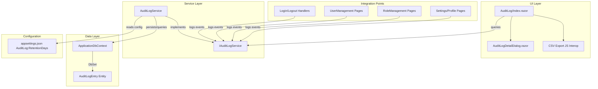

# Design Document: Audit Log

## Overview

The Audit Log feature introduces a comprehensive audit trail system into the BlazorWebAppTemplate application. It captures significant user and system actions (user CRUD, role changes, authentication events, settings modifications) and exposes them through a searchable, filterable, exportable admin page.

The system consists of:
- **Data layer**: A new `AuditLogEntry` EF Core entity with indexed columns for efficient querying
- **Service layer**: `AuditLogService` providing recording, retrieval (with server-side filtering/sorting/pagination), and data retention (purge)
- **UI layer**: A MudDataGrid-based page at `/audit-log` with toolbar filters, detail dialog, and CSV export
- **Integration hooks**: Calls to the audit service wired into existing user/role/auth operations

The design follows existing project patterns: `DataGridUtils<T>` for server-side grids, `IUserTimeZoneContext` for timezone-aware formatting, `DefaultNavigationProvider` for nav menu registration, and EF Core `HasConversion<string>()` for enum storage.

## Architecture



### Key Design Decisions

1. **Scoped service lifetime**: `AuditLogService` is registered as scoped to align with the per-request DbContext lifetime in Blazor Server circuits.

2. **Denormalized UserDisplayName**: Stored directly on each entry to avoid JOIN overhead during queries and to preserve the display name at the time of the event (even if the user is later renamed or deleted).

3. **Restrict delete on FK**: Audit entries reference the user via a FK with `OnDelete(DeleteBehavior.Restrict)` to prevent accidental cascade deletion of audit history.

4. **String-stored enums**: `AuditActionType` and `AuditEntityType` are stored as PascalCase strings for readability in raw SQL queries and to avoid breaking data if enum integer values shift.

5. **Fire-and-forget error handling**: The logging service swallows database exceptions (logging them at Error level) to ensure audit failures never disrupt the primary user operation.

6. **Database-level pagination via `QueryableDataGridUtils<T>`**: Unlike the UserManagement/RoleManagement pages which load all data into memory and use `DataGridUtils<T>` for in-memory filtering/sorting/pagination, the audit log uses a new generic utility `QueryableDataGridUtils<T>` that operates directly on `IQueryable<T>`. This translates MudDataGrid's `GridState<T>` into EF Core expressions (WHERE/ORDER BY/SKIP/TAKE), so only the matching page leaves the database. This is necessary because audit tables can grow to millions of rows. The utility is designed to be reusable for any future large-dataset page in the template.

7. **CSV export capped at 50,000 rows**: Prevents memory exhaustion and excessively large downloads while covering most practical audit review scenarios.

## Components and Interfaces

### QueryableDataGridUtils\<T\> (new reusable utility)

Located at `BlazorWebAppTemplate.UI/Utilities/QueryableDataGridUtils.cs`, this mirrors the API of `DataGridUtils<T>` but operates on `IQueryable<T>` for database-level execution.

```csharp
namespace BlazorWebAppTemplate.UI.Utilities;

/// <summary>
/// Generic database-level server-side filtering, sorting, and pagination utility for MudDataGrid.
/// Unlike <see cref="DataGridUtils{T}"/> which works on in-memory collections,
/// this utility translates GridState into EF Core IQueryable expressions (WHERE/ORDER BY/SKIP/TAKE)
/// so only the matching page leaves the database. Designed for large-dataset scenarios.
/// </summary>
public sealed class QueryableDataGridUtils<T> where T : class
{
    // Fluent property mapping (same pattern as DataGridUtils<T>)
    public QueryableDataGridUtils<T> MapString(string propertyName, Expression<Func<T, string?>> selector);
    public QueryableDataGridUtils<T> MapInt(string propertyName, Expression<Func<T, int?>> selector);
    public QueryableDataGridUtils<T> MapDateTime(string propertyName, Expression<Func<T, DateTime?>> selector);
    public QueryableDataGridUtils<T> MapBool(string propertyName, Expression<Func<T, bool?>> selector);
    // ... other type mappings as needed

    /// <summary>
    /// Full database-level pipeline: filter → global search → sort → count → paginate → line numbering → GridData.
    /// </summary>
    /// <param name="queryable">The base IQueryable (e.g., dbContext.AuditLogEntries.AsQueryable())</param>
    /// <param name="state">MudDataGrid GridState containing page, page size, filters, and sort definitions.</param>
    /// <param name="globalSearchTerm">Optional global search term applied across mapped string fields.</param>
    /// <param name="globalSearchFields">Which string property mappings to include in global search.</param>
    /// <param name="setLineNumber">Optional callback to set display line number (1-based, page-aware).</param>
    /// <param name="cancellationToken">Cancellation token for async database operations.</param>
    /// <returns>GridData containing paged items and total count.</returns>
    public async Task<GridData<T>> ServerReloadAsync(
        IQueryable<T> queryable,
        GridState<T> state,
        string? globalSearchTerm = null,
        IEnumerable<string>? globalSearchFields = null,
        Action<T, int>? setLineNumber = null,
        CancellationToken cancellationToken = default);

    /// <summary>
    /// Returns all matching entries (up to maxRows) for export scenarios.
    /// Applies filters and global search but no pagination.
    /// </summary>
    public async Task<List<T>> GetAllMatchingAsync(
        IQueryable<T> queryable,
        GridState<T> state,
        string? globalSearchTerm = null,
        IEnumerable<string>? globalSearchFields = null,
        int maxRows = 50000,
        CancellationToken cancellationToken = default);
}
```

**Key differences from `DataGridUtils<T>`:**
- Uses `Expression<Func<T, ...>>` instead of `Func<T, ...>` so EF Core can translate to SQL
- Calls `CountAsync` and `ToListAsync` instead of in-memory LINQ
- Includes `CancellationToken` support for async DB operations
- Provides `GetAllMatchingAsync` for export scenarios (applies filters without pagination)

**Usage in Audit Log page (Index.razor.cs):**
```csharp
private readonly QueryableDataGridUtils<AuditLogEntry> _queryableGridUtils = new QueryableDataGridUtils<AuditLogEntry>()
    .MapString(nameof(AuditLogEntry.UserDisplayName), x => x.UserDisplayName)
    .MapString(nameof(AuditLogEntry.EntityName), x => x.EntityName)
    .MapString(nameof(AuditLogEntry.Description), x => x.Description)
    .MapString(nameof(AuditLogEntry.ActionType), x => x.ActionType.ToString())
    .MapString(nameof(AuditLogEntry.EntityType), x => x.EntityType.ToString())
    .MapDateTime(nameof(AuditLogEntry.Timestamp), x => x.Timestamp);

private async Task<GridData<AuditLogViewModel>> ServerReload(GridState<AuditLogViewModel> state)
{
    var query = _dbContext.AuditLogEntries.AsQueryable();

    // Apply additional toolbar filters (action type, entity type, date range)
    if (_actionTypeFilter.HasValue)
        query = query.Where(x => x.ActionType == _actionTypeFilter.Value);
    if (_entityTypeFilter.HasValue)
        query = query.Where(x => x.EntityType == _entityTypeFilter.Value);
    if (_dateStart.HasValue)
        query = query.Where(x => x.Timestamp >= _dateStart.Value);
    if (_dateEnd.HasValue)
        query = query.Where(x => x.Timestamp <= _dateEnd.Value);

    // Delegate column filtering, global search, sorting, pagination to utility
    return await _queryableGridUtils.ServerReloadAsync(
        query, state, _searchString,
        globalSearchFields: [nameof(AuditLogEntry.UserDisplayName), nameof(AuditLogEntry.EntityName), nameof(AuditLogEntry.Description)],
        setLineNumber: (item, lineNo) => { /* map to view model */ });
}
```

### IAuditLogService

```csharp
namespace BlazorWebAppTemplate.Abstractions;

public interface IAuditLogService
{
    /// <summary>
    /// Records an audit log entry.
    /// </summary>
    Task LogAsync(
        string? userId,
        AuditActionType actionType,
        AuditEntityType entityType,
        string entityId,
        string entityName,
        string description,
        string? oldValues = null,
        string? newValues = null,
        string? ipAddress = null);

    /// <summary>
    /// Purges audit entries older than the configured retention period.
    /// </summary>
    Task<int> PurgeOldEntriesAsync();
}
```

### AuditLogEntry Entity

```csharp
namespace BlazorWebAppTemplate.Data.Entities;

public class AuditLogEntry
{
    public Guid Id { get; set; }
    public string UserId { get; set; } = string.Empty;       // max 450
    public string UserDisplayName { get; set; } = string.Empty; // max 256
    public AuditActionType ActionType { get; set; }
    public AuditEntityType EntityType { get; set; }
    public string EntityId { get; set; } = string.Empty;     // max 450
    public string EntityName { get; set; } = string.Empty;   // max 256
    public string Description { get; set; } = string.Empty;  // max 1024
    public string? OldValues { get; set; }                   // nullable JSON
    public string? NewValues { get; set; }                   // nullable JSON
    public string? IpAddress { get; set; }                   // max 45
    public DateTime Timestamp { get; set; }                  // UTC

    // Navigation property
    public ApplicationUser? User { get; set; }
}
```

### Enums

```csharp
// BlazorWebAppTemplate.Core/Domain/Enums/AuditActionType.cs
namespace BlazorWebAppTemplate.Core.Domain.Enums;

public enum AuditActionType
{
    UserCreated, UserUpdated, UserDeleted,
    UserActivated, UserDeactivated,
    RoleCreated, RoleUpdated, RoleDeleted,
    RoleAssigned, RoleUnassigned,
    LoginSuccess, LoginFailed, LogoutSuccess,
    SettingsChanged, PasswordChanged, ProfileUpdated
}

// BlazorWebAppTemplate.Core/Domain/Enums/AuditEntityType.cs
namespace BlazorWebAppTemplate.Core.Domain.Enums;

public enum AuditEntityType
{
    User, Role, Settings, System
}
```

### UI Components

**Index.razor.cs** (code-behind pattern matching UserManagement):
- Injects `IAuditLogService`, `IUserTimeZoneContext`, `IDialogService`, `IJSRuntime`
- Uses `MudDataGrid<AuditLogViewModel>` with `ServerData` callback
- Toolbar: search field (500ms debounce), AuditActionType dropdown, AuditEntityType dropdown, date range pickers, Export CSV button
- Row click → `AuditLogDetailDialog`

**AuditLogDetailDialog.razor**:
- Receives `AuditLogEntry` as dialog parameter
- Displays all fields; pretty-prints JSON with `JsonSerializer.Serialize(..., new JsonSerializerOptions { WriteIndented = true })`
- Shows "N/A" for null OldValues/NewValues/IpAddress

### Navigation Integration

Add to `DefaultNavigationProvider` Administration group children:
```csharp
new() { Type = NavItemType.Link, Text = "Audit Log", Href = "audit-log", Icon = "material-symbols-rounded/history" }
```

The existing `Roles = "Admin"` on the Administration group already gates visibility.

## Data Models

### Database Schema

```
Table: AuditLogEntries
├── Id              UNIQUEIDENTIFIER  PK
├── UserId          NVARCHAR(450)     FK → ApplicationUsers.Id (RESTRICT DELETE)
├── UserDisplayName NVARCHAR(256)     NOT NULL
├── ActionType      NVARCHAR(MAX)     NOT NULL (string conversion)
├── EntityType      NVARCHAR(MAX)     NOT NULL (string conversion)
├── EntityId        NVARCHAR(450)     NOT NULL
├── EntityName      NVARCHAR(256)     NOT NULL
├── Description     NVARCHAR(1024)    NOT NULL
├── OldValues       NVARCHAR(MAX)     NULL
├── NewValues       NVARCHAR(MAX)     NULL
├── IpAddress       NVARCHAR(45)      NULL
└── Timestamp       DATETIME2         NOT NULL  DEFAULT GETUTCDATE()

Indexes:
├── IX_AuditLogEntries_Timestamp  (Timestamp)
├── IX_AuditLogEntries_UserId     (UserId)
└── IX_AuditLogEntries_ActionType (ActionType)
```

### EF Core Configuration (in ApplicationDbContext.OnModelCreating)

```csharp
modelBuilder.Entity<AuditLogEntry>(entity =>
{
    entity.ToTable("AuditLogEntries");
    entity.HasKey(e => e.Id);

    entity.Property(e => e.UserId).HasMaxLength(450);
    entity.Property(e => e.UserDisplayName).HasMaxLength(256);
    entity.Property(e => e.ActionType).HasConversion<string>();
    entity.Property(e => e.EntityType).HasConversion<string>();
    entity.Property(e => e.EntityId).HasMaxLength(450);
    entity.Property(e => e.EntityName).HasMaxLength(256);
    entity.Property(e => e.Description).HasMaxLength(1024);
    entity.Property(e => e.IpAddress).HasMaxLength(45);
    entity.Property(e => e.Timestamp).HasDefaultValueSql("GETUTCDATE()");

    entity.HasIndex(e => e.Timestamp);
    entity.HasIndex(e => e.UserId);
    entity.HasIndex(e => e.ActionType);

    entity.HasOne(e => e.User)
          .WithMany()
          .HasForeignKey(e => e.UserId)
          .OnDelete(DeleteBehavior.Restrict);
});
```

### Configuration Model

```json
// appsettings.json addition
{
  "AuditLog": {
    "RetentionDays": 365
  }
}
```

### AuditLogViewModel (for MudDataGrid binding)

```csharp
public sealed class AuditLogViewModel
{
    public int LineNumber { get; set; }
    public Guid Id { get; set; }
    public DateTime Timestamp { get; set; }
    public string UserDisplayName { get; set; } = string.Empty;
    public AuditActionType ActionType { get; set; }
    public AuditEntityType EntityType { get; set; }
    public string EntityName { get; set; } = string.Empty;
    public string Description { get; set; } = string.Empty;
}
```

## Correctness Properties

*A property is a characteristic or behavior that should hold true across all valid executions of a system—essentially, a formal statement about what the system should do. Properties serve as the bridge between human-readable specifications and machine-verifiable correctness guarantees.*

### Property 1: Entity persistence round-trip

*For any* valid `AuditLogEntry` with randomly generated field values (including all `AuditActionType` and `AuditEntityType` enum values), persisting the entry to the database and retrieving it by Id SHALL produce an entry with all property values identical to the original, with enum values stored as their PascalCase string representation.

**Validates: Requirements 1.1, 1.6, 2.3**

### Property 2: User display name resolution

*For any* log request, the persisted `UserDisplayName` SHALL equal: the `ApplicationUser.DisplayName` when userId matches an existing user; the userId string itself when userId doesn't match any user; or an empty string when userId is null.

**Validates: Requirements 3.4, 3.5, 3.6**

### Property 3: Search text filtering correctness

*For any* set of audit log entries and any non-empty search string, the results returned by `QueryableDataGridUtils<T>.ServerReloadAsync` with that global search term across UserDisplayName, EntityName, and Description fields SHALL contain only entries where at least one of those fields contains the search text (case-insensitive), and no matching entries SHALL be excluded from the results.

**Validates: Requirements 4.9**

### Property 4: Single-field filter correctness

*For any* set of audit log entries and any filter value (ActionType, EntityType, or date range), the results returned when applying those filters to the `IQueryable` before passing to `QueryableDataGridUtils<T>` SHALL contain only entries matching the specified filter value, and no matching entries SHALL be excluded.

**Validates: Requirements 5.6, 5.7, 5.8**

### Property 5: Date range filter correctness

*For any* set of audit log entries and any date range (start only, end only, or both), the results returned when applying the date range filter to the `IQueryable` SHALL contain only entries with Timestamp within the specified range (inclusive), and no entries within the range SHALL be excluded.

**Validates: Requirements 5.8**

### Property 6: Default sort order

*For any* set of audit log entries, when `QueryableDataGridUtils<T>.ServerReloadAsync` is called with an empty `SortDefinitions` in GridState, the returned entries SHALL be ordered by Timestamp descending (newest first).

**Validates: Requirements 4.10**

### Property 7: Page overflow returns empty with correct total

*For any* non-empty set of audit log entries and a page number exceeding the total available pages, `QueryableDataGridUtils<T>.ServerReloadAsync` SHALL return an empty items list while preserving the correct total count of matching entries.

**Validates: Requirements 4.5**

### Property 8: CSV row format correctness

*For any* valid `AuditLogEntry`, the generated CSV row SHALL contain Timestamp (formatted as ISO 8601 `yyyy-MM-ddTHH:mm:ssZ` in UTC), UserDisplayName, ActionType, EntityType, EntityName, Description, and IpAddress in the correct column positions.

**Validates: Requirements 7.3, 7.8**

### Property 9: CSV export respects filters and row cap

*For any* set of audit log entries, filter criteria, and the 50,000 row cap, the exported entries SHALL be exactly those matching all active filters (limited to 50,000 rows), with no non-matching entries included.

**Validates: Requirements 7.2**

### Property 10: Retention configuration validation

*For any* configuration value for `AuditLog:RetentionDays`, if the value is a valid integer within 1–3650 the system SHALL use it; otherwise the system SHALL fall back to 365.

**Validates: Requirements 10.1, 10.2**

### Property 11: Purge correctness

*For any* set of audit log entries with varying Timestamps and any valid retention period, after invoking the purge method, no entries with a Timestamp older than (`UtcNow` minus retention days) SHALL remain, and all entries within the retention window SHALL be preserved.

**Validates: Requirements 10.4**

## Code Documentation Standards

All code produced for this feature SHALL include comprehensive documentation:

### XML Documentation Comments

- **Interfaces**: Full `<summary>` on the interface, plus `<summary>`, `<param>`, `<returns>`, `<exception>` on every method
- **Classes**: `<summary>` and `<remarks>` explaining responsibility and lifetime (e.g., scoped service)
- **Entity properties**: `<summary>` describing purpose, constraints, and format
- **Enum values**: `<summary>` on each value explaining when it's used
- **Private methods**: At minimum a `<summary>` explaining intent

### Inline Comments

- EF Core configuration: Explain rationale for each constraint (restrict delete, string conversion, index choices)
- Service logic: Annotate filtering pipeline steps, sort fallback logic, retention calculation, and error handling decisions
- UI code-behind: Describe lifecycle hooks, ServerData callbacks, and dialog interaction flow
- CSV generation: Document column ordering, date formatting, and row cap logic

### Example Pattern

```csharp
/// <summary>
/// Records a single audit log entry into the database.
/// Failures are logged but never propagated to the caller.
/// </summary>
/// <param name="userId">The ID of the acting user, or null for system events.</param>
/// <param name="actionType">The category of action being recorded.</param>
/// <param name="entityType">The type of entity affected.</param>
/// <param name="entityId">The unique identifier of the affected entity.</param>
/// <param name="entityName">Human-readable name of the affected entity.</param>
/// <param name="description">A brief description of what occurred.</param>
/// <param name="oldValues">JSON-serialized previous state, if applicable.</param>
/// <param name="newValues">JSON-serialized new state, if applicable.</param>
/// <param name="ipAddress">Source IP address of the request, if available.</param>
/// <returns>A task representing the asynchronous operation.</returns>
public async Task LogAsync(
    string? userId,
    AuditActionType actionType,
    AuditEntityType entityType,
    string entityId,
    string entityName,
    string description,
    string? oldValues = null,
    string? newValues = null,
    string? ipAddress = null)
{
    // Resolve user display name: existing user → display name, unknown → userId, null → empty
    var displayName = await ResolveDisplayNameAsync(userId);

    // ...
}
```

**Validates: Requirement 11**

## Error Handling

| Scenario | Behavior | Requirement |
|----------|----------|-------------|
| Database error during `LogAsync` | Log at Error level (actionType, entityType, entityId, exception), swallow exception, return normally | 3.7, 9.12 |
| Database error during `PurgeOldEntriesAsync` | Log at Error level with failure reason, propagate exception to caller | 10.5 |
| CSV export failure | Display error alert via Snackbar, re-enable Export button | 7.7 |
| Invalid `RetentionDays` config (missing, non-numeric, out of range) | Log warning with invalid value, fall back to 365 | 10.2 |
| User resolution failure (userId not found) | Use userId string as display name, persist entry normally | 3.6 |
| Page number exceeds available pages | Return empty list with accurate total count | 4.8 |

### Error Logging Strategy

The service uses structured logging via `ILogger<AuditLogService>`:
- **Error level**: Database failures during log/purge operations
- **Warning level**: Invalid configuration values
- **Information level**: Purge completion with count of deleted entries

## Testing Strategy

### Property-Based Tests (FsCheck.Xunit)

The project already uses **FsCheck.Xunit 3.1.0** for property-based testing. Each correctness property maps to one or more FsCheck `[Property(MaxTest = 100)]` test methods.

**Property test configuration:**
- Minimum 100 iterations per property (`MaxTest = 100`)
- Each test file references its design document property in class-level XML docs
- Tag format: `Feature: audit-log, Property {number}: {title}`

**Test structure:**
- `BlazorWebAppTemplate.Tests/AuditLog/EntityPersistenceRoundTripPropertyTests.cs` → Property 1
- `BlazorWebAppTemplate.Tests/AuditLog/UserDisplayNameResolutionPropertyTests.cs` → Property 2
- `BlazorWebAppTemplate.Tests/AuditLog/SearchFilteringPropertyTests.cs` → Property 3 (tests QueryableDataGridUtils)
- `BlazorWebAppTemplate.Tests/AuditLog/SingleFieldFilterPropertyTests.cs` → Property 4
- `BlazorWebAppTemplate.Tests/AuditLog/DateRangeFilterPropertyTests.cs` → Property 5
- `BlazorWebAppTemplate.Tests/AuditLog/DefaultSortOrderPropertyTests.cs` → Property 6 (tests QueryableDataGridUtils)
- `BlazorWebAppTemplate.Tests/AuditLog/PageOverflowPropertyTests.cs` → Property 7 (tests QueryableDataGridUtils)
- `BlazorWebAppTemplate.Tests/AuditLog/CsvRowFormatPropertyTests.cs` → Property 8
- `BlazorWebAppTemplate.Tests/AuditLog/CsvExportFilterPropertyTests.cs` → Property 9 (tests GetAllMatchingAsync)
- `BlazorWebAppTemplate.Tests/AuditLog/RetentionConfigPropertyTests.cs` → Property 10
- `BlazorWebAppTemplate.Tests/AuditLog/PurgeCorrectnessPropertyTests.cs` → Property 11

**Test dependencies:**
- EF Core InMemory provider for database tests (or SQLite in-memory)
- Moq for `UserManager<ApplicationUser>`, `ILogger<T>`, and `IConfiguration` mocking
- FsCheck generators for `AuditLogEntry`, `AuditActionType`, `AuditEntityType`, date ranges, and search strings

### Unit Tests (xUnit)

Unit tests cover specific examples and edge cases not suited for property-based testing:

- Enum values and order verification (Requirements 2.1, 2.2)
- `LogAsync` swallows exceptions on DB failure (Requirement 3.7)
- `PurgeOldEntriesAsync` propagates exceptions (Requirement 10.5)
- Successful purge logs count at Information level (Requirement 10.6)
- Detail dialog displays "N/A" for null fields (Requirements 6.3, 6.4)
- CSV filename format verification (Requirement 7.4)
- Navigation item configuration (Requirement 8.1)

### Integration Tests

- Verify FK restrict delete prevents user deletion when audit entries exist (Requirement 1.7)
- Verify audit events are triggered from UserManagement/RoleManagement pages (Requirement 9.1–9.11)
- Verify route authorization denies non-admin access (Requirement 5.2)

### Component Tests (bUnit)

- Grid renders correct columns (Requirement 5.4)
- Loading state and no-records content (Requirements 5.9, 5.10)
- Export button state management (Requirements 7.5, 7.6)
