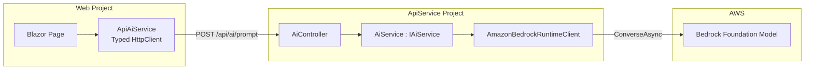

# Design Document: AWS AI Integration

## Overview

This feature adds a provider-agnostic AI text generation layer to the application. Internally it uses Amazon Bedrock with **Amazon Nova 2 Lite** (`amazon.nova-2-lite-v1:0`) as the default foundation model, but all public-facing types use generic "Ai" naming (`IAiService`, `AiService`, `AiPromptRequest`, `AiResponseDto`) to allow future provider swaps without breaking API contracts.

The integration follows the existing thin controller / full service layer architecture:
- **Core/Contracts/Ai/** — DTOs shared between ApiService and Web
- **ApiService/Abstractions/IAiService.cs** — service interface
- **ApiService/Services/AiService.cs** — implementation wrapping `AmazonBedrockRuntimeClient`
- **ApiService/Controllers/AiController.cs** — thin REST controller
- **Web/Services/ApiClients/ApiAiService.cs** — typed HttpClient for Blazor page consumption

Non-secret configuration (ModelId, Region) lives in the base `appsettings.json` following ASP.NET Core conventions. AWS credentials (AccessKeyId, SecretAccessKey, SessionToken) are supplied exclusively through Aspire parameters defined in the AppHost project, which passes them to the ApiService as environment variables. This separation ensures secrets never appear in source control while non-secret config provides sensible defaults without additional setup.

## Architecture



**Data Flow:**
1. Blazor page calls `ApiAiService.SendPromptAsync(prompt)`
2. `ApiAiService` validates prompt client-side, then POSTs to `/api/ai/prompt`
3. `UserIdentityDelegatingHandler` attaches auth headers
4. `AiController` receives `AiPromptRequest`, delegates to `IAiService.SendPromptAsync()`
5. `AiService` validates prompt, constructs Bedrock `ConverseRequest`, invokes the model
6. Response text is extracted and returned as `AiResponseDto`
7. Errors are mapped to typed exceptions; controller maps exceptions to HTTP status codes

## Components and Interfaces

### IAiService (ApiService/Abstractions/)

```csharp
public interface IAiService
{
    /// <summary>
    /// Sends a prompt to the configured AI model and returns the generated text.
    /// </summary>
    /// <param name="request">The prompt request containing the user's text.</param>
    /// <returns>The AI-generated response.</returns>
    /// <exception cref="ArgumentException">Prompt is empty, whitespace, or exceeds max length.</exception>
    /// <exception cref="InvalidOperationException">Model configuration missing, timeout, or Bedrock error.</exception>
    Task<AiResponseDto> SendPromptAsync(AiPromptRequest request);
}
```

### AiService (ApiService/Services/)

**Dependencies:**
- `AmazonBedrockRuntimeClient` — singleton, injected via DI
- `IConfiguration` — reads `Ai:ModelId` and `Ai:Region` from appsettings.json; reads `Ai:AccessKeyId`, `Ai:SecretAccessKey`, `Ai:SessionToken` from environment variables (injected by Aspire AppHost)
- `ILogger<AiService>` — error-level logging for unexpected exceptions

**Responsibilities:**
- Validate prompt text (non-empty, non-whitespace, within length limit)
- Read model ID and region from configuration (fail fast if missing)
- Three-tier credential resolution: `SessionAWSCredentials` when all three credential values (AccessKeyId, SecretAccessKey, SessionToken) are present; `BasicAWSCredentials` when only AccessKeyId and SecretAccessKey are present; default credential chain fallback when none are configured
- Construct `ConverseRequest` with the user's prompt as a `UserMessage`
- Invoke `ConverseAsync` on the Bedrock client with a 60-second `CancellationToken` timeout
- Extract the text content from the response
- Handle expired credential exceptions by throwing `InvalidOperationException` with descriptive message and original exception as inner exception
- Map known AWS exceptions (throttling, model-not-found, service-unavailable) to `InvalidOperationException` with descriptive messages
- Sanitize unexpected exceptions (log, wrap in `InvalidOperationException` without leaking details)

### AiController (ApiService/Controllers/)

```csharp
[Route("api/ai")]
[Authorize]
public class AiController : BaseController
{
    private readonly IAiService _aiService;

    [HttpPost("prompt")]
    public async Task<ActionResult<AiResponseDto>> SendPrompt([FromBody] AiPromptRequest request)
    {
        try
        {
            var result = await _aiService.SendPromptAsync(request);
            return Ok(result);
        }
        catch (ArgumentException ex)         { return BadRequest(ex.Message); }
        catch (InvalidOperationException ex) { return BadRequest(ex.Message); }
    }
}
```

### ApiAiService (Web/Services/ApiClients/)

**Pattern:** Same as `ApiAnnouncementService` — wraps HttpClient, returns `ApiResult<T>`.

```csharp
public class ApiAiService
{
    private const string PromptPath = "/api/ai/prompt";
    private readonly HttpClient _http;

    public async Task<ApiResult<AiResponseDto>> SendPromptAsync(string prompt)
    {
        if (string.IsNullOrWhiteSpace(prompt))
            return ApiResult<AiResponseDto>.Failure("Prompt is required.");

        var request = new AiPromptRequest { Prompt = prompt };
        var response = await _http.PostAsJsonAsync(PromptPath, request);

        if (response.IsSuccessStatusCode)
            return ApiResult<AiResponseDto>.Success(
                await response.Content.ReadFromJsonAsync<AiResponseDto>()!);

        return ApiResult<AiResponseDto>.Failure(await response.Content.ReadAsStringAsync());
    }
}
```

### DI Registration

**ApiService — `ApplicationServiceExtensions.AddApplicationServices()`:**
```csharp
// AI Service
services.AddSingleton<AmazonBedrockRuntimeClient>(sp =>
{
    var config = sp.GetRequiredService<IConfiguration>();
    var region = config["Ai:Region"]
        ?? throw new InvalidOperationException("Ai:Region configuration is required.");

    var accessKeyId = config["Ai:AccessKeyId"];
    var secretAccessKey = config["Ai:SecretAccessKey"];
    var sessionToken = config["Ai:SessionToken"];

    AWSCredentials credentials;
    if (!string.IsNullOrEmpty(accessKeyId) && !string.IsNullOrEmpty(secretAccessKey) && !string.IsNullOrEmpty(sessionToken))
    {
        credentials = new SessionAWSCredentials(accessKeyId, secretAccessKey, sessionToken);
    }
    else if (!string.IsNullOrEmpty(accessKeyId) && !string.IsNullOrEmpty(secretAccessKey))
    {
        credentials = new BasicAWSCredentials(accessKeyId, secretAccessKey);
    }
    else
    {
        credentials = FallbackCredentialsFactory.GetCredentials();
    }

    return new AmazonBedrockRuntimeClient(credentials, new AmazonBedrockRuntimeConfig
    {
        RegionEndpoint = RegionEndpoint.GetBySystemName(region)
    });
});
services.AddScoped<IAiService, AiService>();
```

**Web — `ApiClientServiceExtensions.AddApiClients()`:**
```csharp
services.AddHttpClient<ApiAiService>(client =>
    client.BaseAddress = new("https+http://apiservice"))
    .AddHttpMessageHandler<UserIdentityDelegatingHandler>();
```

## Data Models

### AiPromptRequest (Core/Contracts/Ai/)

```csharp
/// <summary>
/// Request DTO containing the user's natural language prompt for AI text generation.
/// </summary>
public sealed class AiPromptRequest
{
    /// <summary>
    /// The natural language prompt text to send to the AI model (required, max 4000 characters).
    /// </summary>
    [Required(ErrorMessage = "Prompt is required.")]
    [StringLength(4000, ErrorMessage = "Prompt must not exceed 4000 characters.")]
    public string Prompt { get; set; } = string.Empty;
}
```

### AiResponseDto (Core/Contracts/Ai/)

```csharp
/// <summary>
/// Response DTO containing the AI-generated text from the foundation model.
/// </summary>
public sealed class AiResponseDto
{
    /// <summary>
    /// The text generated by the AI model in response to the user's prompt.
    /// </summary>
    [StringLength(8000)]
    public string GeneratedText { get; set; } = string.Empty;
}
```

### Configuration

#### Part A: Non-Secret Configuration (`ApiService/appsettings.json`)

```json
{
  "Ai": {
    "ModelId": "amazon.nova-2-lite-v1:0",
    "Region": "us-east-1"
  }
}
```

These are stable application defaults. Environment-specific files (`appsettings.Production.json`) can override them when needed (e.g., different region in production).

#### Part B: Secret Credentials (AppHost `Program.cs`)

```csharp
// Define secret parameters — Aspire prompts for values on first run and stores in User Secrets
var aiAccessKeyId = builder.AddParameter("ai-access-key-id", secret: true);
var aiSecretAccessKey = builder.AddParameter("ai-secret-access-key", secret: true);
var aiSessionToken = builder.AddParameter("ai-session-token", secret: true);

var apiService = builder.AddProject<Projects.AspireWebAppTemplate_ApiService>("apiservice")
    .WithEnvironment("Ai__AccessKeyId", aiAccessKeyId)
    .WithEnvironment("Ai__SecretAccessKey", aiSecretAccessKey)
    .WithEnvironment("Ai__SessionToken", aiSessionToken);
```

#### Part C: Developer Onboarding

When a developer clones the project and runs the AppHost for the first time:
1. Aspire prompts for each secret parameter value
2. Developer pastes their AWS credentials from the AWS console (Option 3: "Use individual values in your AWS service client")
3. Values are stored encrypted in User Secrets — subsequent runs use cached values
4. When session token expires: `dotnet user-secrets set "Parameters:ai-session-token" "new-token-value"` in the AppHost directory

For production: leave credential environment variables unset. The three-tier resolution falls through to the default AWS credential chain (IAM Task Role on ECS, Instance Profile on EC2).

> **Configuration Hierarchy:** `appsettings.json` provides non-secret defaults (ModelId, Region) → environment-specific files can override → Aspire environment variables provide secrets at runtime. This follows the standard ASP.NET Core configuration precedence.

## Correctness Properties

*A property is a characteristic or behavior that should hold true across all valid executions of a system — essentially, a formal statement about what the system should do. Properties serve as the bridge between human-readable specifications and machine-verifiable correctness guarantees.*

### Property 1: Valid prompt produces mapped response

*For any* non-empty, non-whitespace string of 1–4000 characters used as a prompt, and any non-empty string returned by the mocked Bedrock client, the `AiService.SendPromptAsync` method SHALL return an `AiResponseDto` whose `GeneratedText` equals the mocked model output.

**Validates: Requirements 1.1**

### Property 2: Whitespace-only prompts are rejected

*For any* string composed entirely of whitespace characters (spaces, tabs, newlines, or combinations thereof), calling `AiService.SendPromptAsync` SHALL throw an `ArgumentException` and the prompt SHALL NOT be forwarded to the Bedrock client.

**Validates: Requirements 1.2**

### Property 3: Known AWS errors map to descriptive exceptions

*For any* known Bedrock error type in {ThrottlingException, ResourceNotFoundException, ServiceUnavailableException}, when the mocked Bedrock client throws that exception, `AiService.SendPromptAsync` SHALL throw an `InvalidOperationException` whose message contains a human-readable description of the error category and whose `InnerException` is the original AWS exception.

**Validates: Requirements 3.1, 3.2, 3.3**

### Property 4: Unexpected exceptions do not leak internal details

*For any* exception type not in the known set thrown by the mocked Bedrock client, `AiService.SendPromptAsync` SHALL throw an `InvalidOperationException` whose message does NOT contain the original exception's message or stack trace, and whose `InnerException` preserves the original exception.

**Validates: Requirements 3.4**

### Property 5: DTO validation enforces prompt constraints

*For any* string value assigned to `AiPromptRequest.Prompt`, validating the DTO via `Validator.TryValidateObject` SHALL succeed if and only if the string is non-null, non-empty, and at most 4000 characters in length.

**Validates: Requirements 5.1, 5.3**

### Property 6: HTTP error responses map to failed ApiResult

*For any* HTTP response with a non-success status code (4xx or 5xx) and any response body string, `ApiAiService.SendPromptAsync` SHALL return an `ApiResult<AiResponseDto>` where `Succeeded` is false and `Error` contains the response body text.

**Validates: Requirements 6.4**

### Property 7: Client-side prompt validation rejects invalid input

*For any* string that is null, empty, or composed entirely of whitespace, `ApiAiService.SendPromptAsync` SHALL return a failed `ApiResult<AiResponseDto>` without making an HTTP request.

**Validates: Requirements 6.5**

### Property 8: Expired credentials produce descriptive exception

*For any* `AmazonServiceException` with an error code indicating expired credentials thrown by the mocked Bedrock client, `AiService.SendPromptAsync` SHALL throw an `InvalidOperationException` whose message indicates credentials have expired, and whose `InnerException` is the original AWS exception.

**Validates: Requirements 2.8, 3.7**

## Error Handling

| Source | Exception | Controller Mapping | HTTP Status |
|--------|-----------|-------------------|-------------|
| AiService — empty/whitespace prompt | `ArgumentException` | `BadRequest(ex.Message)` | 400 |
| AiService — prompt exceeds max length | `ArgumentException` | `BadRequest(ex.Message)` | 400 |
| AiService — model ID not configured | `InvalidOperationException` | `BadRequest(ex.Message)` | 400 |
| AiService — region not configured | `InvalidOperationException` | `BadRequest(ex.Message)` | 400 |
| AiService — Bedrock throttling | `InvalidOperationException` | `BadRequest(ex.Message)` | 400 |
| AiService — model not found | `InvalidOperationException` | `BadRequest(ex.Message)` | 400 |
| AiService — service unavailable | `InvalidOperationException` | `BadRequest(ex.Message)` | 400 |
| AiService — timeout (60s) | `InvalidOperationException` | `BadRequest(ex.Message)` | 400 |
| AiService — empty model response | `InvalidOperationException` | `BadRequest(ex.Message)` | 400 |
| AiService — unexpected exception | `InvalidOperationException` (sanitized) | `BadRequest(ex.Message)` | 400 |
| AiService — expired credentials | `InvalidOperationException` | `BadRequest(ex.Message)` | 400 |
| ApiAiService — empty prompt | Returns `ApiResult.Failure` | N/A (client-side) | N/A |

**Design Rationale:** The controller catches `ArgumentException` and `InvalidOperationException` — matching the project's established exception-to-status mapping pattern. Expired credential exceptions are caught by `AiService` and wrapped in `InvalidOperationException` with a descriptive message, allowing the controller to return a 400 with a clear indication that credentials need refreshing.

## Testing Strategy

### Property-Based Tests (FsCheck.Xunit)

Each correctness property maps to a single property-based test with minimum 100 iterations. Tests use Moq to mock `AmazonBedrockRuntimeClient` and `IConfiguration`.

**Test file:** `AspireWebAppTemplate.Tests/AiIntegration/AiServicePropertyTests.cs`

| Test | Property | Tag |
|------|----------|-----|
| ValidPrompt_ReturnsMappedResponse | Property 1 | `// Feature: aws-ai-integration, Property 1: Valid prompt produces mapped response` |
| WhitespacePrompt_ThrowsArgumentException | Property 2 | `// Feature: aws-ai-integration, Property 2: Whitespace-only prompts are rejected` |
| KnownAwsError_MapsToDescriptiveException | Property 3 | `// Feature: aws-ai-integration, Property 3: Known AWS errors map to descriptive exceptions` |
| UnexpectedException_DoesNotLeakDetails | Property 4 | `// Feature: aws-ai-integration, Property 4: Unexpected exceptions do not leak internal details` |
| DtoValidation_EnforcesPromptConstraints | Property 5 | `// Feature: aws-ai-integration, Property 5: DTO validation enforces prompt constraints` |
| HttpError_MapsToFailedApiResult | Property 6 | `// Feature: aws-ai-integration, Property 6: HTTP error responses map to failed ApiResult` |
| ClientSideValidation_RejectsInvalidInput | Property 7 | `// Feature: aws-ai-integration, Property 7: Client-side prompt validation rejects invalid input` |
| ExpiredCredentials_ThrowsDescriptiveException | Property 8 | `// Feature: aws-ai-integration, Property 8: Expired credentials produce descriptive exception` |

**Configuration:** `[Property(MaxTest = 100)]` per test method.

### Unit Tests (xUnit + Moq)

**Test file:** `AspireWebAppTemplate.Tests/AiIntegration/AiServiceUnitTests.cs`

| Test | Validates |
|------|-----------|
| SendPrompt_MissingModelId_ThrowsInvalidOperation | Req 2.4 |
| SendPrompt_MissingRegion_ThrowsInvalidOperation | Req 2.6 |
| SendPrompt_Timeout_ThrowsInvalidOperation | Req 1.5 |
| SendPrompt_EmptyModelResponse_ThrowsInvalidOperation | Req 3.6 |
| Controller_InvalidOperation_Returns400 | Req 3.5 |
| Controller_Unauthorized_Returns401 | Req 1.4 |
| ThreeTierCredentialResolution_SessionCredentials | Req 2.1 |
| ThreeTierCredentialResolution_BasicCredentials | Req 2.2 |
| ThreeTierCredentialResolution_DefaultChainFallback | Req 2.3 |

### Test Dependencies

- **FsCheck.Xunit** — property-based testing framework (already in project)
- **Moq** — mocking `AmazonBedrockRuntimeClient`, `IConfiguration`, `ILogger`
- **xUnit** — test runner (already in project)
- No real AWS calls in unit/property tests — all Bedrock interactions are mocked
