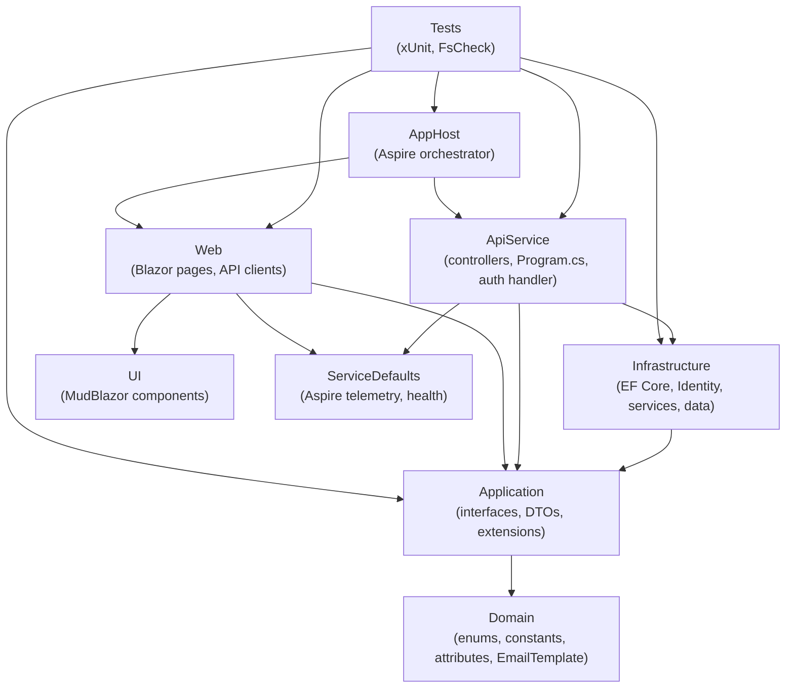
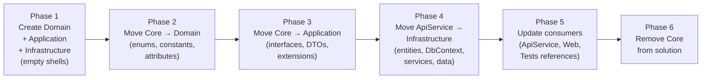
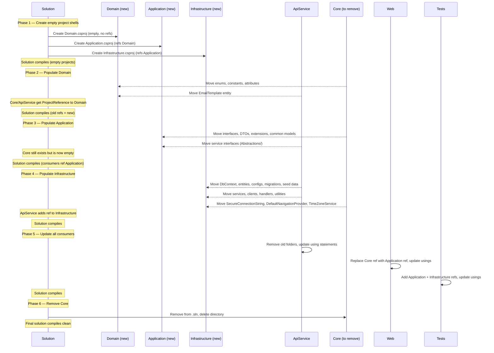

# Design Document: Clean Architecture Migration

## Overview

This migration reorganizes the AspireWebAppTemplate solution from 7 projects (AppHost, ServiceDefaults, Core, ApiService, Web, UI, Tests) to 9 projects (AppHost, ServiceDefaults, Domain, Application, Infrastructure, ApiService, Web, UI, Tests). The Core project is decomposed into Domain + Application. Most of ApiService's internals (services, data access, entities) move to Infrastructure. ApiService becomes a thin HTTP host.

The migration is purely structural — no business logic changes. Files move with namespace updates. The critical constraint is that the solution must compile after each major task group. The safest order is: create new projects with skeleton structure → move files in dependency order (innermost first) → update references across consuming projects → remove the old Core project last.

## Architecture

### Target Dependency Graph



### Migration Phases (Order of Operations)



## Components and Interfaces

### Domain Project (new)

**Purpose**: Innermost layer — framework-agnostic business vocabulary with zero dependencies.

**SDK**: `Microsoft.NET.Sdk`
**Target**: `net10.0`
**Project References**: None
**NuGet References**: None

**Folder Structure**:
```
AspireWebAppTemplate.Domain/
├── Entities/
│   └── EmailTemplate.cs
├── Enums/
│   ├── AnnouncementDisplayType.cs
│   ├── AnnouncementSeverity.cs
│   ├── AuditActionType.cs
│   ├── AuditEntityType.cs
│   ├── AuthSource.cs
│   ├── EmailTemplateCategory.cs
│   ├── EmailType.cs
│   ├── ExportScope.cs
│   ├── NotificationCategory.cs
│   └── ThemePreference.cs
├── ValueObjects/
├── Constants/
│   ├── SystemPageDefaults.cs
│   ├── DateTimeFormatDefaults.cs
│   └── ExportDefaults.cs
└── Attributes/
    ├── ExportColumnAttribute.cs
    └── OptionalPhoneAttribute.cs
```

**Source Mapping**:
| File | Source Location |
|------|----------------|
| `Entities/EmailTemplate.cs` | `ApiService/Data/Entities/EmailTemplate.cs` |
| `Enums/*` | `Core/Domain/Enums/*` |
| `Constants/*` | `Core/Common/Defaults/*` |
| `Attributes/*` | `Core/Utilities/Attributes/*` |

---

### Application Project (new)

**Purpose**: Use-case contracts shared between API backend and Web frontend.

**SDK**: `Microsoft.NET.Sdk`
**Target**: `net10.0`
**Project References**: `Domain`
**NuGet References**: None

**Folder Structure**:
```
AspireWebAppTemplate.Application/
├── Abstractions/
│   ├── IAiService.cs
│   ├── IAnnouncementService.cs
│   ├── IAuditLogService.cs
│   ├── IAuthService.cs
│   ├── ICurrentUserAccessor.cs
│   ├── IEmailService.cs
│   ├── IEmailTemplateService.cs
│   ├── IExcelExportService.cs
│   ├── ILdapAuthService.cs
│   ├── ILdapLoginService.cs
│   ├── ILoginService.cs
│   ├── INavigationProvider.cs
│   ├── INavigationService.cs
│   ├── INotificationService.cs
│   ├── IPagePermissionService.cs
│   ├── IRegisterService.cs
│   ├── IRoleService.cs
│   ├── ITimeZoneService.cs
│   └── IUserService.cs
├── Contracts/
│   ├── Ai/
│   ├── Announcements/
│   ├── AuditLog/
│   ├── Auth/
│   ├── Email/
│   ├── Notifications/
│   ├── PagePermissions/
│   ├── Roles/
│   └── Users/
├── Common/
│   ├── ApiResult.cs
│   ├── NavItem.cs
│   └── PagedResult.cs
└── Extensions/
    ├── NavigationProviderExtensions.cs
    └── QueryableExtensions.cs
```

**Source Mapping**:
| Folder | Source Location |
|--------|----------------|
| `Abstractions/` (service interfaces) | `ApiService/Abstractions/*` |
| `Abstractions/` (shared abstractions) | `Core/Application/Abstractions/*` |
| `Contracts/*` | `Core/Contracts/*` |
| `Common/ApiResult.cs` | `Core/Common/ApiResult.cs` |
| `Common/NavItem.cs` | `Core/Common/NavItem.cs` |
| `Common/PagedResult.cs` | `Core/Contracts/PagedResult.cs` |
| `Extensions/*` | `Core/Extensions/*` |

---

### Infrastructure Project (new)

**Purpose**: All framework integrations — EF Core, Identity, SMTP, LDAP, AWS, EPPlus.

**SDK**: `Microsoft.NET.Sdk`
**Target**: `net10.0`
**Project References**: `Application`
**Framework References**: `Microsoft.AspNetCore.App`
**NuGet References**: EF Core (SqlServer, Tools), Identity.EntityFrameworkCore, AWSSDK.BedrockRuntime, EPPlus, HtmlSanitizer, System.DirectoryServices, System.DirectoryServices.Protocols

**Folder Structure**:
```
AspireWebAppTemplate.Infrastructure/
├── Data/
│   ├── ApplicationDbContext.cs
│   ├── Entities/
│   │   ├── Announcement.cs
│   │   ├── AnnouncementDismissal.cs
│   │   ├── AuditLogEntry.cs
│   │   ├── Notification.cs
│   │   ├── NotificationPreference.cs
│   │   └── PagePermission.cs
│   ├── Configurations/
│   │   ├── AnnouncementConfiguration.cs
│   │   ├── AnnouncementDismissalConfiguration.cs
│   │   ├── AuditLogEntryConfiguration.cs
│   │   ├── EmailTemplateConfiguration.cs
│   │   ├── NotificationConfiguration.cs
│   │   ├── NotificationPreferenceConfiguration.cs
│   │   └── PagePermissionConfiguration.cs
│   ├── Migrations/
│   │   └── (all existing migration files)
│   └── SeedData/
│       ├── SeedData.cs
│       ├── SeedData.Announcements.cs
│       ├── SeedData.EmailTemplates.cs
│       ├── SeedData.PagePermissions.cs
│       ├── SeedData.Roles.cs
│       └── SeedData.Users.cs
├── Identity/
│   ├── ApplicationUser.cs
│   └── ApplicationRole.cs
├── Services/
│   ├── AiService.cs
│   ├── AnnouncementService.cs
│   ├── AuditLogService.cs
│   ├── AuthService.cs
│   ├── DefaultNavigationProvider.cs
│   ├── EmailService.cs
│   ├── EmailTemplateService.cs
│   ├── ExcelExportService.cs
│   ├── LdapAuthService.cs
│   ├── LdapLoginService.cs
│   ├── LoginService.cs
│   ├── NavigationService.cs
│   ├── NotificationService.cs
│   ├── PagePermissionService.cs
│   ├── RegisterService.cs
│   ├── RoleService.cs
│   ├── TimeZoneService.cs
│   └── UserService.cs
├── Clients/
│   └── WebCallbackClient.cs
├── Handlers/
│   └── InternalApiKeyDelegatingHandler.cs
├── Utilities/
│   ├── AuditChangeHelper.cs
│   ├── CurrentUserAccessor.cs
│   └── SecureConnectionString.cs
└── Extensions/
    └── InfrastructureServiceExtensions.cs
```

**Source Mapping**:
| Folder | Source Location |
|--------|----------------|
| `Data/ApplicationDbContext.cs` | `ApiService/Data/ApplicationDbContext.cs` |
| `Data/Entities/*` | `ApiService/Data/Entities/*` (minus EmailTemplate) |
| `Data/Configurations/*` | `ApiService/Data/Configurations/*` |
| `Data/Migrations/*` | `ApiService/Data/Migrations/*` |
| `Data/SeedData/*` | `ApiService/Data/SeedData/*` |
| `Identity/*` | `ApiService/Data/Entities/ApplicationUser.cs`, `ApplicationRole.cs` |
| `Services/*` | `ApiService/Services/*.cs` + `Core/Application/Services/*` |
| `Clients/*` | `ApiService/Services/Clients/*` |
| `Handlers/*` | `ApiService/Services/Handlers/*` |
| `Utilities/AuditChangeHelper.cs` | `ApiService/Utilities/AuditChangeHelper.cs` |
| `Utilities/CurrentUserAccessor.cs` | `ApiService/Services/Infrastructure/CurrentUserAccessor.cs` |
| `Utilities/SecureConnectionString.cs` | `Core/Utilities/SecureConnectionString.cs` |
| `Extensions/InfrastructureServiceExtensions.cs` | `ApiService/Extensions/ApplicationServiceExtensions.cs` (renamed) |

---

### ApiService Project (slimmed)

**Purpose**: Thin HTTP host — controllers + composition root only.

**SDK**: `Microsoft.NET.Sdk.Web`
**Target**: `net10.0`
**Project References**: `Application`, `Infrastructure`, `ServiceDefaults`
**NuGet References**: None beyond the Web SDK

**Remaining Contents**:
```
AspireWebAppTemplate.ApiService/
├── Controllers/
│   ├── AiController.cs
│   ├── AnnouncementController.cs
│   ├── AuditLogController.cs
│   ├── AuthController.cs
│   ├── BaseController.cs
│   ├── EmailTemplateController.cs
│   ├── NavigationController.cs
│   ├── NotificationController.cs
│   ├── PagePermissionsController.cs
│   ├── RolesController.cs
│   ├── UsersController.cs
│   └── WeatherController.cs
├── Authentication/
│   └── InternalAuthenticationHandler.cs
├── Program.cs
├── appsettings.json
└── appsettings.Development.json
```

---

## Data Models

### Namespace Mapping

All moved types receive new namespaces. The mapping is mechanical:

| Old Namespace | New Namespace |
|--------------|---------------|
| `AspireWebAppTemplate.Core.Domain.Enums` | `AspireWebAppTemplate.Domain.Enums` |
| `AspireWebAppTemplate.Core.Common.Defaults` | `AspireWebAppTemplate.Domain.Constants` |
| `AspireWebAppTemplate.Core.Utilities.Attributes` | `AspireWebAppTemplate.Domain.Attributes` |
| `AspireWebAppTemplate.Core.Common` | `AspireWebAppTemplate.Application.Common` |
| `AspireWebAppTemplate.Core.Contracts.*` | `AspireWebAppTemplate.Application.Contracts.*` |
| `AspireWebAppTemplate.Core.Application.Abstractions` | `AspireWebAppTemplate.Application.Abstractions` |
| `AspireWebAppTemplate.Core.Extensions` | `AspireWebAppTemplate.Application.Extensions` |
| `AspireWebAppTemplate.ApiService.Abstractions` | `AspireWebAppTemplate.Application.Abstractions` |
| `AspireWebAppTemplate.ApiService.Data` | `AspireWebAppTemplate.Infrastructure.Data` |
| `AspireWebAppTemplate.ApiService.Data.Entities` | `AspireWebAppTemplate.Infrastructure.Data.Entities` |
| `AspireWebAppTemplate.ApiService.Data.Entities` (Identity) | `AspireWebAppTemplate.Infrastructure.Identity` |
| `AspireWebAppTemplate.ApiService.Data.Entities` (EmailTemplate) | `AspireWebAppTemplate.Domain.Entities` |
| `AspireWebAppTemplate.ApiService.Data.Configurations` | `AspireWebAppTemplate.Infrastructure.Data.Configurations` |
| `AspireWebAppTemplate.ApiService.Data.SeedData` | `AspireWebAppTemplate.Infrastructure.Data.SeedData` |
| `AspireWebAppTemplate.ApiService.Services` | `AspireWebAppTemplate.Infrastructure.Services` |
| `AspireWebAppTemplate.ApiService.Services.Clients` | `AspireWebAppTemplate.Infrastructure.Clients` |
| `AspireWebAppTemplate.ApiService.Services.Handlers` | `AspireWebAppTemplate.Infrastructure.Handlers` |
| `AspireWebAppTemplate.ApiService.Services.Infrastructure` | `AspireWebAppTemplate.Infrastructure.Utilities` |
| `AspireWebAppTemplate.ApiService.Utilities` | `AspireWebAppTemplate.Infrastructure.Utilities` |
| `AspireWebAppTemplate.ApiService.Extensions` | `AspireWebAppTemplate.Infrastructure.Extensions` |
| `AspireWebAppTemplate.Core.Application.Services` | `AspireWebAppTemplate.Infrastructure.Services` |
| `AspireWebAppTemplate.Core.Utilities` | `AspireWebAppTemplate.Infrastructure.Utilities` |

---

## Key Configuration Changes

### EF Core Migration Assembly

When `ApplicationDbContext` moves from ApiService to Infrastructure, the migration assembly configuration must be updated in `Program.cs`:

```csharp
// Before (implicit — migrations in same assembly as DbContext host)
options.UseSqlServer(connectionString);

// After (explicit — migrations now in Infrastructure assembly)
options.UseSqlServer(connectionString, b =>
    b.MigrationsAssembly("AspireWebAppTemplate.Infrastructure"));
```

### Infrastructure.csproj FrameworkReference

Infrastructure uses ASP.NET Core types (`IHttpContextAccessor`, `ILogger<T>`, `HttpClient`, `DelegatingHandler`, `AuthenticationHandler`) but is not a web project. It needs:

```xml
<FrameworkReference Include="Microsoft.AspNetCore.App" />
```

### DI Registration Method Rename

`ApiService/Extensions/ApplicationServiceExtensions.cs` → `Infrastructure/Extensions/InfrastructureServiceExtensions.cs`

The method name changes from `AddApplicationServices()` to `AddInfrastructureServices()`. `Program.cs` in ApiService updates the call accordingly.

### ApiService.csproj Reference Changes

```xml
<!-- Before -->
<ProjectReference Include="..\AspireWebAppTemplate.Core\AspireWebAppTemplate.Core.csproj" />

<!-- After -->
<ProjectReference Include="..\AspireWebAppTemplate.Application\AspireWebAppTemplate.Application.csproj" />
<ProjectReference Include="..\AspireWebAppTemplate.Infrastructure\AspireWebAppTemplate.Infrastructure.csproj" />
```

EF Core, Identity, LDAP, AWS SDK, EPPlus, HtmlSanitizer NuGet packages are removed from ApiService.csproj (they move to Infrastructure.csproj).

### Web.csproj Reference Changes

```xml
<!-- Before -->
<ProjectReference Include="..\AspireWebAppTemplate.Core\AspireWebAppTemplate.Core.csproj" />

<!-- After -->
<ProjectReference Include="..\AspireWebAppTemplate.Application\AspireWebAppTemplate.Application.csproj" />
```

### Tests.csproj Reference Changes

```xml
<!-- Before -->
<ProjectReference Include="..\AspireWebAppTemplate.Core\AspireWebAppTemplate.Core.csproj" />

<!-- After -->
<ProjectReference Include="..\AspireWebAppTemplate.Application\AspireWebAppTemplate.Application.csproj" />
<ProjectReference Include="..\AspireWebAppTemplate.Infrastructure\AspireWebAppTemplate.Infrastructure.csproj" />
```

---

## Sequence of Operations (Compilability Strategy)

The key insight is that we can maintain compilability by using a **dual-reference bridge** during migration: new projects reference their targets, and old references remain until the old project is removed. The sequence below ensures the solution compiles after each group.



### Phase 2–3 Bridge Strategy

During Phases 2 and 3, files move from Core to Domain/Application. To maintain compilability:

1. Move file to new project with new namespace
2. In the new project, the types are available under their new namespace
3. Consumers (ApiService, Web, Tests) temporarily add a project reference to Domain/Application while still referencing Core
4. Update `using` statements in consumers to point to the new namespaces
5. Once Core is empty, remove it

Alternatively (simpler for bulk moves): move all files in a phase, then do a single bulk `using` update across all consumers before compiling. Since this is done per-phase, the window of non-compilability is minimized to within a single phase.

---

## Error Handling

### Migration Conflicts

**Condition**: Two files from different source projects have the same class name
**Response**: This won't happen — the architecture decisions document confirms no naming conflicts exist. Service interfaces from `ApiService/Abstractions/` and `Core/Application/Abstractions/` have distinct names.

### EF Core Migration History

**Condition**: Existing `__EFMigrationsHistory` table references the old assembly
**Response**: The `MigrationsAssembly` configuration only affects where _new_ migrations are generated. Existing migration history entries remain valid because EF Core matches by migration name, not assembly. No data migration needed.

### Circular References

**Condition**: A moved type depends on a type that hasn't moved yet
**Response**: The dependency order (Domain → Application → Infrastructure) ensures this cannot happen. Domain types have no dependencies. Application types depend only on Domain. Infrastructure types depend on Application (and transitively Domain). Moving innermost first prevents cycles.

---

## Testing Strategy

### Verification Approach

Since this is a structural reorganization with no logic changes, verification is straightforward:

1. **Compilation**: `dotnet build` at solution level — the primary verification
2. **Existing tests**: All tests in `AspireWebAppTemplate.Tests` must pass with only `using` statement changes
3. **Namespace audit**: Grep for `AspireWebAppTemplate.Core` — should return zero results after migration

### No New Tests Required

This migration doesn't introduce new behavior. The existing property-based tests and unit tests validate the same logic in its new location. The only changes to test files are `using` statement updates.

---

## Correctness Properties

*A property is a characteristic or behavior that should hold true across all valid executions of a system — essentially, a formal statement about what the system should do. Properties serve as the bridge between human-readable specifications and machine-verifiable correctness guarantees.*

This migration is purely structural — files move between projects with namespace changes but no logic changes. All acceptance criteria are either one-time structural checks (csproj contents, .sln entries, directory existence) or integration checks (build succeeds, tests pass). None exhibit input-varying behavior suitable for property-based testing.

**Verification strategy**: The existing property-based tests and unit tests in `AspireWebAppTemplate.Tests` serve as the correctness oracle. If the solution compiles and all existing tests pass with only `using` statement changes, the migration is correct. No new property-based tests are needed for this structural reorganization.

**Post-migration audits**:
- `dotnet build` at solution level: zero errors
- `dotnet test` in Tests project: all existing tests pass
- Grep for `AspireWebAppTemplate.Core`: zero results across all `.cs` and `.csproj` files
- Grep for old namespaces (`ApiService.Data`, `ApiService.Services`, `ApiService.Abstractions`) in non-Infrastructure projects: zero results

**Validates: Requirements 10.1, 10.2, 10.3, 11.4**

---

## Dependencies

### New NuGet Packages for Infrastructure.csproj

These move from ApiService.csproj to Infrastructure.csproj:
- `Microsoft.AspNetCore.Identity.EntityFrameworkCore`
- `Microsoft.EntityFrameworkCore.SqlServer`
- `Microsoft.EntityFrameworkCore.Tools`
- `AWSSDK.BedrockRuntime`
- `EPPlus`
- `HtmlSanitizer`
- `System.DirectoryServices`
- `System.DirectoryServices.Protocols`

### Removed from ApiService.csproj

All of the above packages are removed from ApiService. It retains only the Web SDK implicit packages and ServiceDefaults.
