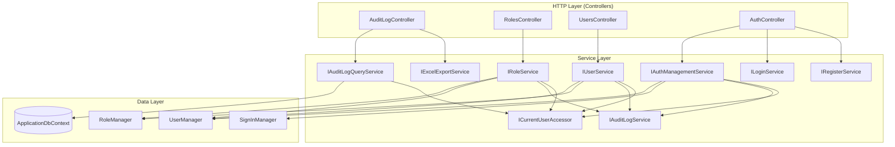
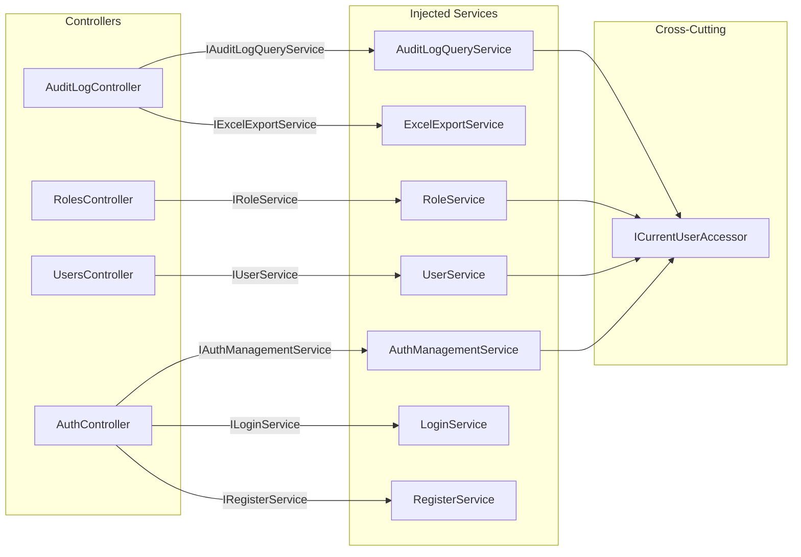

# Design Document: Controller-Service Refactor

## Overview

This design refactors four "fat" controllers (`AuditLogController`, `RolesController`, `UsersController`, `AuthController`) to follow the thin-controller / full-service-layer pattern already established by `NotificationController` and `PagePermissionsController`. The refactoring extracts all business logic, database access, audit logging, and entity mapping into dedicated service classes while preserving identical endpoint behavior.

A new cross-cutting `ICurrentUserAccessor` scoped service provides the authenticated user's identity to services, eliminating the need to pass `userId` and `ipAddress` through every method signature.

### Design Rationale

- **Consistency**: All controllers follow one pattern — no mixed approaches.
- **Testability**: Services are unit-testable with mocked dependencies; controllers become trivial pass-throughs.
- **Separation of concerns**: HTTP layer (routing, status codes, auth attributes) is decoupled from domain logic.
- **Maintainability**: Business rules live in one place; changes don't require touching controllers.

## Architecture

### High-Level Component Diagram



### Dependency Flow (After Refactoring)



### Exception-to-HTTP Mapping Strategy

All refactored controllers use a consistent try/catch pattern:

```csharp
try
{
    var result = await _service.MethodAsync(...);
    return Ok(result);
}
catch (KeyNotFoundException ex)      { return NotFound(ex.Message); }
catch (InvalidOperationException ex) { return BadRequest(ex.Message); }
catch (ArgumentException ex)         { return BadRequest(ex.Message); }
```

## Components and Interfaces

### 1. ICurrentUserAccessor / CurrentUserAccessor

**Purpose**: Provides authenticated user context to services without parameter passing.

**Location**: Interface in `ApiService/Abstractions/`, implementation in `ApiService/Services/`.

```csharp
namespace AspireWebAppTemplate.ApiService.Abstractions;

/// <summary>
/// Provides the authenticated user's identity information to service-layer components.
/// Backed by IHttpContextAccessor, returns null for all properties when no HTTP context
/// or authenticated user is available.
/// </summary>
public interface ICurrentUserAccessor
{
    /// <summary>The authenticated user's ID from ClaimTypes.NameIdentifier.</summary>
    string? UserId { get; }

    /// <summary>The authenticated user's display name from Identity.Name.</summary>
    string? UserName { get; }

    /// <summary>The client's IP address from HttpContext.Connection.RemoteIpAddress.</summary>
    string? IpAddress { get; }
}
```

```csharp
namespace AspireWebAppTemplate.ApiService.Services;

public class CurrentUserAccessor : ICurrentUserAccessor
{
    private readonly IHttpContextAccessor _httpContextAccessor;

    public CurrentUserAccessor(IHttpContextAccessor httpContextAccessor)
    {
        _httpContextAccessor = httpContextAccessor;
    }

    public string? UserId =>
        _httpContextAccessor.HttpContext?.User?.FindFirstValue(ClaimTypes.NameIdentifier);

    public string? UserName =>
        _httpContextAccessor.HttpContext?.User?.Identity?.Name;

    /// <summary>
    /// Reads the client's real IP address from the X-Client-Ip header forwarded by the
    /// Web project's UserIdentityDelegatingHandler. Falls back to Connection.RemoteIpAddress
    /// only if the header is absent (e.g., direct API access during testing).
    /// </summary>
    public string? IpAddress =>
        _httpContextAccessor.HttpContext?.Request?.Headers["X-Client-Ip"].FirstOrDefault()
        ?? _httpContextAccessor.HttpContext?.Connection?.RemoteIpAddress?.ToString();
}
```

**Registration**: `builder.Services.AddHttpContextAccessor()` (if not already) + `builder.Services.AddScoped<ICurrentUserAccessor, CurrentUserAccessor>()`.

**Client IP Propagation**: The `UserIdentityDelegatingHandler` in the Web project must be updated to forward an `X-Client-Ip` header containing the end-user's IP address (read from `HttpContext.Connection.RemoteIpAddress` or `CircuitUserContext` cached IP on the Web side). This ensures audit logs capture the actual client IP rather than the Web server's internal IP.

---

### 2. IAuditLogQueryService / AuditLogQueryService

**Purpose**: Encapsulates all audit log query, filter, and export data retrieval operations.

**Location**: Interface in `ApiService/Abstractions/`, implementation in `ApiService/Services/`.

```csharp
namespace AspireWebAppTemplate.ApiService.Abstractions;

public interface IAuditLogQueryService
{
    /// <summary>
    /// Returns a paged list of audit log entries with optional filtering.
    /// Entries are ordered by timestamp descending.
    /// </summary>
    Task<PagedResult<AuditLogEntryDto>> GetPagedAsync(AuditLogQueryParams queryParams);

    /// <summary>
    /// Returns a single audit log entry by its unique identifier.
    /// </summary>
    /// <exception cref="KeyNotFoundException">Thrown when no entry exists with the given ID.</exception>
    Task<AuditLogEntryDto> GetByIdAsync(Guid id);

    /// <summary>
    /// Returns filtered audit log entries for export, capped at ExportDefaults.MaxExportRows.
    /// Entries are ordered by timestamp descending.
    /// </summary>
    Task<List<AuditLogEntryDto>> GetForExportAsync(AuditLogQueryParams queryParams);
}
```

**Implementation details**:
- Injects `ApplicationDbContext` (read-only queries, `AsNoTracking`).
- Consolidates filter construction into a private `ApplyFilters(IQueryable, AuditLogQueryParams)` method.
- Uses `Select` projection to `AuditLogEntryDto` — no full entity materialization.

---

### 3. IRoleService / RoleService

**Purpose**: Full role lifecycle management — CRUD, activation, user-role assignment.

```csharp
namespace AspireWebAppTemplate.ApiService.Abstractions;

public interface IRoleService
{
    Task<List<RoleDto>> GetAllAsync();
    Task<RoleDto> GetByIdAsync(string id);
    Task<RoleDto> CreateAsync(CreateRoleRequest request);
    Task UpdateAsync(string id, CreateRoleRequest request);
    Task DeleteAsync(string id);
    Task ActivateAsync(string id);
    Task DeactivateAsync(string id);
    Task<object> AssignUsersAsync(string roleId, string[] userIds);
    Task RemoveUserAsync(string roleId, string userId);
    Task<List<UserDto>> GetUsersInRoleAsync(string roleId);
}
```

**Implementation dependencies**: `RoleManager<ApplicationRole>`, `UserManager<ApplicationUser>`, `IAuditLogService`, `ICurrentUserAccessor`.

**Business rules enforced**:
- System roles (`IsSystem = true`) cannot be modified, deleted, activated, or deactivated.
- Roles with assigned users cannot be deleted.
- Roles with `RequiresMinimumUser = true` cannot have their last user removed.
- Identity validation errors on create/update throw `InvalidOperationException`.
- Non-existent role IDs throw `KeyNotFoundException`.

**Audit logging**: Create, update, delete, assign, and unassign operations all produce audit entries with old/new value tracking on updates.

---

### 4. IUserService / UserService

**Purpose**: Full user lifecycle management — CRUD, search/pagination, activation, roles, LDAP.

```csharp
namespace AspireWebAppTemplate.ApiService.Abstractions;

public interface IUserService
{
    Task<PagedResult<UserDto>> SearchAsync(int? page, int? pageSize, string? searchTerm);
    Task<UserDto> GetByIdAsync(string id);
    Task<UserDto> CreateAsync(CreateUserRequest request);
    Task UpdateAsync(string id, UpdateUserRequest request);
    Task DeleteAsync(string id);
    Task ActivateAsync(string id);
    Task DeactivateAsync(string id);
    Task SetRolesAsync(string id, string[] roleNames);
    Task<List<RoleDto>> GetRolesMetadataAsync();

    // LDAP operations
    Task<LdapUserAttributes?> LdapLookupAsync(string identifier);
    Task<UserDto> CreateLdapUserAsync(LdapUserAttributes attributes);
    IAsyncEnumerable<LdapSyncProgressItem> SyncLdapUsersAsync();
}
```

**Implementation dependencies**: `UserManager<ApplicationUser>`, `RoleManager<ApplicationRole>`, `IAuditLogService`, `ICurrentUserAccessor`, `ILdapAuthService`.

**Business rules enforced**:
- Cannot delete or deactivate the currently authenticated user (self-protection).
- Cannot delete the last active admin (lockout prevention).
- Duplicate username/email on LDAP create throws `InvalidOperationException`.
- Non-existent user IDs throw `KeyNotFoundException`.

**LDAP sync**: Returns `IAsyncEnumerable<LdapSyncProgressItem>` for streaming-compatible output. The controller writes each item as NDJSON.

---

### 5. IAuthManagementService / AuthManagementService

**Purpose**: All account self-management operations — profile, preferences, password, email, 2FA, data, external logins, passkeys.

```csharp
namespace AspireWebAppTemplate.ApiService.Abstractions;

public interface IAuthManagementService
{
    // Profile
    Task<UserDto> GetProfileAsync();
    Task UpdateProfileAsync(UpdateProfileRequest request);
    Task UpdatePreferencesAsync(UpdatePreferencesRequest request);

    // Password
    Task ChangePasswordAsync(ChangePasswordRequest request);
    Task SetPasswordAsync(SetPasswordRequest request);

    // Email
    Task<EmailInfoDto> GetEmailAsync();
    Task ChangeEmailAsync(ChangeEmailRequest request);
    Task SendVerificationEmailAsync();

    // 2FA
    Task<TwoFactorStatusDto> Get2faStatusAsync();
    Task<AuthenticatorSetupDto> GetAuthenticatorSetupAsync();
    Task<VerifyAuthenticatorResult> VerifyAuthenticatorAsync(VerifyAuthenticatorRequest request);
    Task Disable2faAsync();
    Task<string[]> GenerateRecoveryCodesAsync();
    Task ResetAuthenticatorAsync();

    // Personal data & account
    Task<byte[]> DownloadPersonalDataAsync();
    Task DeleteAccountAsync(DeleteAccountRequest request);

    // External logins
    Task<ExternalLoginsDto> GetExternalLoginsAsync();
    Task RemoveExternalLoginAsync(RemoveExternalLoginRequest request);

    // Passkeys
    Task<List<PasskeyInfoDto>> GetPasskeysAsync();
    Task DeletePasskeyAsync(string credentialId);
    Task RenamePasskeyAsync(string credentialId, RenamePasskeyRequest request);
}
```

**Implementation dependencies**: `UserManager<ApplicationUser>`, `SignInManager<ApplicationUser>`, `IAuditLogService`, `ICurrentUserAccessor`.

**Key design decision**: All methods operate on the *currently authenticated user* (from `ICurrentUserAccessor.UserId`). No userId parameter is needed — the service reads identity from the accessor.

**Business rules enforced**:
- Incorrect current password on change → `InvalidOperationException`.
- Set-password when one already exists → `InvalidOperationException`.
- Disable 2FA / generate recovery codes when 2FA not enabled → `InvalidOperationException`.
- Incorrect password on account deletion → `InvalidOperationException`.

**Audit logging**: Password change, email change, 2FA enable/disable/reset, account deletion.

---

### Refactored Controller Signatures

#### AuditLogController (After)

```csharp
public class AuditLogController : BaseController
{
    private readonly IAuditLogQueryService _queryService;
    private readonly IExcelExportService _excelExportService;

    // 3 endpoints: GetAuditLog, GetAuditLogEntry, ExportAuditLog
    // All delegate to _queryService for data, _excelExportService for export formatting
}
```

#### RolesController (After)

```csharp
public class RolesController : BaseController
{
    private readonly IRoleService _roleService;

    // All endpoints delegate to _roleService with try/catch for exception mapping
}
```

#### UsersController (After)

```csharp
public class UsersController : BaseController
{
    private readonly IUserService _userService;

    // All endpoints delegate to _userService with try/catch for exception mapping
}
```

#### AuthController (After)

```csharp
public class AuthController : BaseController
{
    private readonly IAuthManagementService _authManagementService;
    private readonly ILoginService _loginService;
    private readonly IRegisterService _registerService;

    // Login/Register/Logout/2FA-login/recovery-login/validate-token → _loginService/_registerService
    // Profile/Preferences/Password/Email/2FA-setup/Data/ExternalLogins/Passkeys → _authManagementService
}
```

## Data Models

No new database entities or migrations are required. The refactoring moves existing data access patterns from controllers into services without changing the schema.

### Existing Entities Used

| Entity | Service Consumer |
|--------|-----------------|
| `AuditLogEntry` | `AuditLogQueryService` (read), `AuditLogService` (write) |
| `ApplicationRole` | `RoleService` |
| `ApplicationUser` | `UserService`, `AuthManagementService` |
| `PagePermission` | `PagePermissionService` (unchanged) |

### Existing DTOs Used (No Changes)

| DTO | Location |
|-----|----------|
| `AuditLogEntryDto`, `AuditLogQueryParams` | `Core/Contracts/AuditLog/` |
| `RoleDto`, `CreateRoleRequest` | `Core/Contracts/Roles/` |
| `UserDto`, `CreateUserRequest`, `UpdateUserRequest`, `UpdateProfileRequest`, `UpdatePreferencesRequest` | `Core/Contracts/Users/` |
| `LoginRequest`, `LoginResult`, `RegisterResult` | `Core/Contracts/Auth/` |
| `PagedResult<T>` | `Core/Contracts/` |

### New Result Types (if needed)

The `AssignUsersAsync` method returns a result object:

```csharp
public sealed class RoleAssignmentResult
{
    public int Success { get; set; }
    public int Failed { get; set; }
}
```

**Location**: `Core/Contracts/Roles/RoleAssignmentResult.cs`


## Correctness Properties

*A property is a characteristic or behavior that should hold true across all valid executions of a system — essentially, a formal statement about what the system should do. Properties serve as the bridge between human-readable specifications and machine-verifiable correctness guarantees.*

### Property 1: CurrentUserAccessor claim extraction round-trip

*For any* valid user ID string, username string, and IP address string set as claims/connection info on an HttpContext, the `CurrentUserAccessor` SHALL return those exact same values from its `UserId`, `UserName`, and `IpAddress` properties.

**Validates: Requirements 1.2**

### Property 2: Audit log pagination invariants

*For any* `AuditLogQueryParams` with page ≥ 0 and pageSize > 0, the `PagedResult<AuditLogEntryDto>` returned by `GetPagedAsync` SHALL satisfy: `Items.Count <= PageSize`, `Page == queryParams.Page`, and `TotalCount >= Items.Count`.

**Validates: Requirements 2.1**

### Property 3: Audit log search filter correctness

*For any* non-empty search term and any set of audit log entries in the database, every entry in the result set returned by `GetPagedAsync` SHALL contain the search term (case-insensitive partial match) in at least one of: `UserDisplayName`, `EntityName`, `Description`, or `EntityId`.

**Validates: Requirements 2.2**

### Property 4: Audit log lookup round-trip

*For any* audit log entry that exists in the database, calling `GetByIdAsync` with that entry's ID SHALL return a DTO with all fields matching the persisted entity.

**Validates: Requirements 2.3**

### Property 5: Audit log export row cap

*For any* `AuditLogQueryParams` and any number of matching entries in the database, `GetForExportAsync` SHALL return at most `ExportDefaults.MaxExportRows` entries.

**Validates: Requirements 2.5**

### Property 6: Role CRUD round-trip

*For any* valid `CreateRoleRequest` (non-empty name, unique), creating a role via `CreateAsync` and then reading it back via `GetByIdAsync` SHALL return a `RoleDto` with Name, DisplayName, Description, Position, and IsActive matching the original request values.

**Validates: Requirements 3.1**

### Property 7: Role activation state change

*For any* existing non-system role, calling `ActivateAsync` SHALL result in `GetByIdAsync` returning `IsActive = true`, and calling `DeactivateAsync` SHALL result in `GetByIdAsync` returning `IsActive = false`.

**Validates: Requirements 3.2**

### Property 8: Role user assignment count invariant

*For any* existing role and any array of user IDs (mix of valid and invalid), the result of `AssignUsersAsync` SHALL satisfy: `Success + Failed == userIds.Length`.

**Validates: Requirements 3.3**

### Property 9: System role protection

*For any* role where `IsSystem = true`, calling `UpdateAsync`, `DeleteAsync`, `ActivateAsync`, or `DeactivateAsync` SHALL throw `InvalidOperationException`.

**Validates: Requirements 3.7**

### Property 10: Non-existent entity throws KeyNotFoundException

*For any* string ID that does not correspond to an existing role or user, calling service methods that look up by ID (GetByIdAsync, UpdateAsync, DeleteAsync, ActivateAsync, DeactivateAsync) SHALL throw `KeyNotFoundException`.

**Validates: Requirements 3.10, 4.1**

### Property 11: User CRUD round-trip

*For any* valid `CreateUserRequest` (unique email, valid password), creating a user via `CreateAsync` and reading back via `GetByIdAsync` SHALL return a `UserDto` with Email, DisplayName, and IsActive matching the request values.

**Validates: Requirements 4.1**

### Property 12: User search filter correctness

*For any* non-empty search term, every `UserDto` in the result set returned by `SearchAsync` SHALL contain the search term (case-insensitive partial match) in at least one of: UserName, DisplayName, Email, FirstName, LastName, or Department.

**Validates: Requirements 4.2**

### Property 13: User role set replacement

*For any* existing user and any array of valid role names, calling `SetRolesAsync` and then reading the user's roles SHALL return a set exactly equal to the provided role names.

**Validates: Requirements 4.4**

### Property 14: Profile and preferences round-trip

*For any* authenticated user, updating profile fields via `UpdateProfileAsync` or preferences via `UpdatePreferencesAsync` and then calling `GetProfileAsync` SHALL return a `UserDto` with the updated fields matching the request values.

**Validates: Requirements 5.1, 5.2, 5.3**

### Property 15: Personal data download completeness

*For any* authenticated user with populated profile fields, `DownloadPersonalDataAsync` SHALL return a JSON byte array containing all properties decorated with `[PersonalData]` on `ApplicationUser`, plus Id, UserName, Email, EmailConfirmed, PhoneNumber, PhoneNumberConfirmed, and TwoFactorEnabled.

**Validates: Requirements 5.7**

### Property 16: Audit logging invariant

*For any* mutating service operation (create, update, delete, activate, deactivate, assign, unassign, password change, 2FA change, account deletion), the `IAuditLogService.LogAsync` method SHALL be called exactly once with `UserId` matching `ICurrentUserAccessor.UserId` and `IpAddress` matching `ICurrentUserAccessor.IpAddress`.

**Validates: Requirements 3.11, 4.11, 5.15**

### Property 17: Exception-to-HTTP-status mapping

*For any* controller action, when the delegated service throws `KeyNotFoundException` the action SHALL return HTTP 404, when it throws `InvalidOperationException` or `ArgumentException` the action SHALL return HTTP 400, and when it completes successfully the action SHALL return the documented success status code (200, 201, or 204).

**Validates: Requirements 7.1, 7.2, 7.3, 7.4**

## Error Handling

### Service Layer Error Strategy

| Condition | Exception Type | HTTP Status |
|-----------|---------------|-------------|
| Entity not found by ID | `KeyNotFoundException` | 404 |
| Business rule violation (system role, self-deletion, duplicate) | `InvalidOperationException` | 400 |
| Invalid argument (bad input format) | `ArgumentException` | 400 |
| Identity validation failure (password policy, duplicate email) | `InvalidOperationException` | 400 |
| Audit log write failure | Swallowed (logged at Error) | N/A |

### Controller Exception Mapping Pattern

Every controller action that delegates to a service uses:

```csharp
try
{
    var result = await _service.MethodAsync(...);
    return Ok(result); // or CreatedAtAction, NoContent
}
catch (KeyNotFoundException ex)      { return NotFound(ex.Message); }
catch (InvalidOperationException ex) { return BadRequest(ex.Message); }
catch (ArgumentException ex)         { return BadRequest(ex.Message); }
```

### Edge Cases

- **Unauthenticated requests**: `[Authorize]` attribute handles this at the framework level — controllers return 401 before hitting action methods.
- **Self-operations**: Services check `ICurrentUserAccessor.UserId` against the target entity and throw `InvalidOperationException` for self-delete or self-deactivate.
- **Last-admin protection**: `UserService.DeleteAsync` queries active admin count before proceeding.
- **Concurrent modifications**: EF Core's optimistic concurrency handles race conditions; exceptions propagate as 500.

## Testing Strategy

### Dual Testing Approach

The testing strategy combines **property-based tests** (universal correctness guarantees) and **example-based unit tests** (specific scenarios and edge cases).

### Property-Based Testing (FsCheck.Xunit)

**Library**: FsCheck.Xunit 3.3.3 (already in project)  
**Configuration**: Minimum 100 iterations per property (`MaxTest = 100`)  
**Tag format**: `// Feature: controller-service-refactor, Property {N}: {title}`

Each correctness property above maps to a single FsCheck property test:

| Property | Test Target | Generator Strategy |
|----------|-------------|-------------------|
| 1 | `CurrentUserAccessor` | Random strings for UserId, UserName, IP |
| 2-5 | `AuditLogQueryService` | Random `AuditLogQueryParams` + seeded `AuditLogEntry` collections |
| 6-9 | `RoleService` | Random `CreateRoleRequest` with varied IsSystem flags |
| 10 | All services | Random GUID/string IDs not in seeded data |
| 11-13 | `UserService` | Random `CreateUserRequest`, search terms, role name arrays |
| 14-15 | `AuthManagementService` | Random `UpdateProfileRequest`, `UpdatePreferencesRequest` |
| 16 | All mutating services | Verify mock `IAuditLogService.LogAsync` call count and args |
| 17 | Controller unit tests | Mock services throwing various exceptions |

### Example-Based Unit Tests (xUnit + Moq)

Focus on:
- Edge cases identified in prework (self-deletion, last-admin, RequiresMinimumUser boundary)
- Happy path specific scenarios (create user with role, LDAP create with defaults)
- Integration points (LDAP sync streaming format, export file generation)

### Test Infrastructure

- **Database**: SQLite in-memory via `Microsoft.EntityFrameworkCore.Sqlite` for service tests
- **Mocking**: Moq for `ICurrentUserAccessor`, `IAuditLogService`, `ILdapAuthService`
- **Controller tests**: Mock service interfaces, test only status code mapping logic
- **Service tests**: Real EF Core context (SQLite), mocked external dependencies

### Test Organization

```
AspireWebAppTemplate.Tests/
├── ControllerServiceRefactor/
│   ├── CurrentUserAccessorTests.cs       ← Property 1
│   ├── AuditLogQueryServiceTests.cs      ← Properties 2-5
│   ├── RoleServiceTests.cs              ← Properties 6-9
│   ├── UserServiceTests.cs             ← Properties 11-13
│   ├── AuthManagementServiceTests.cs    ← Properties 14-15
│   ├── AuditLoggingInvariantTests.cs    ← Property 16
│   ├── ExceptionMappingTests.cs         ← Properties 10, 17
│   └── EdgeCaseTests.cs                ← Edge cases from prework
```
