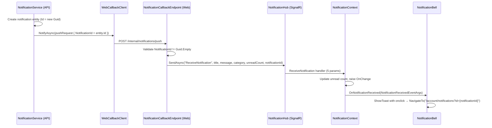
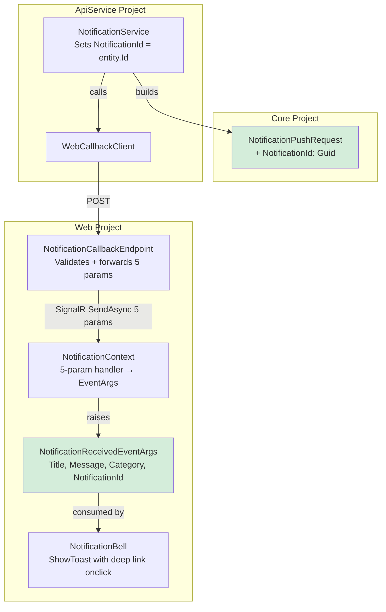

# Design Document: Notification Push Deep Link

## Overview

This design extends the real-time notification push pipeline to carry the notification ID (Guid) end-to-end—from API creation through SignalR delivery to the browser. The notification ID enables the snackbar toast's click handler to navigate the user directly to `/account/notifications?id={notificationId}` for inline expansion of the specific notification.

The change touches four layers: the `NotificationPushRequest` DTO, the `NotificationCallbackEndpoint` validation and SignalR invocation, the `NotificationContext` hub handler and event signature, and the `NotificationBell` snackbar click handler.

### Design Decisions

| Decision | Rationale |
|----------|-----------|
| Add `NotificationId` (Guid) to existing `NotificationPushRequest` | Minimal change. The DTO already carries all other push data. Adding one field avoids introducing a new contract. |
| Introduce `NotificationReceivedEventArgs` class | Replaces the `Action<string, string, string>` event with `Action<NotificationReceivedEventArgs>` for type safety and extensibility. Avoids further parameter-count explosions if more data is needed later. |
| Validate `NotificationId != Guid.Empty` at the endpoint | Consistent with existing field validation pattern in `NotificationCallbackEndpoint.HandlePush`. Catches misconfigured callers early. |
| Deep link format: `/account/notifications?id={guid}` | Matches the existing pattern used in `HandleNotificationClick` (the dropdown click handler already navigates to this URL). |
| Keep `NotificationReceivedEventArgs` in the Web project | The event args class is specific to the Web project's SignalR/UI pipeline. It doesn't need to be in Core since it's not shared with the API service. |

## Architecture

### Data Flow (End-to-End)



### Component Topology



## Components and Interfaces

### 1. NotificationPushRequest (Modified DTO)

**Location:** `AspireWebAppTemplate.Core/Contracts/Notifications/NotificationPushRequest.cs`

Add a single property to the existing DTO:

```csharp
/// <summary>
/// The unique identifier of the persisted notification entity.
/// Used by downstream components to construct deep-link URLs for direct navigation.
/// </summary>
public Guid NotificationId { get; set; }
```

### 2. NotificationService (Modified — API Project)

**Location:** `AspireWebAppTemplate.ApiService/Services/NotificationService.cs`

In the `CreateNotificationAsync` method, set `NotificationId` on the push request after persisting the entity:

```csharp
await _webCallbackClient.NotifyAsync(new NotificationPushRequest
{
    UserId = request.UserId,
    Title = request.Title,
    Message = request.Message,
    Category = request.Category.ToString(),
    UnreadCount = unreadCount,
    NotificationId = notification.Id  // NEW: carry the persisted entity's ID
});
```

### 3. NotificationCallbackEndpoint (Modified — Web Project)

**Location:** `AspireWebAppTemplate.Web/Endpoints/NotificationCallbackEndpoint.cs`

Two changes:
1. Add validation for `NotificationId`:
```csharp
if (request.NotificationId == Guid.Empty)
    return Results.BadRequest("NotificationId is required.");
```

2. Extend the SignalR invocation to include `notificationId` as a 5th parameter:
```csharp
await hubContext.Clients.Group(request.UserId)
    .SendAsync("ReceiveNotification", request.Title, request.Message, request.Category, request.UnreadCount, request.NotificationId);
```

### 4. NotificationReceivedEventArgs (New Class)

**Location:** `AspireWebAppTemplate.Web/Models/NotificationReceivedEventArgs.cs`

```csharp
namespace AspireWebAppTemplate.Web.Models;

/// <summary>
/// Event arguments raised when a new notification is received via the SignalR hub.
/// Bundles all notification event data for type-safe consumption by UI components.
/// </summary>
public sealed class NotificationReceivedEventArgs
{
    /// <summary>
    /// The notification title for display in UI components (snackbar, dropdown).
    /// </summary>
    public required string Title { get; init; }

    /// <summary>
    /// The notification message body for display in UI components.
    /// </summary>
    public required string Message { get; init; }

    /// <summary>
    /// The notification category as a string (e.g., "Account", "Activity", "System").
    /// Used for icon/color selection in UI components.
    /// </summary>
    public required string Category { get; init; }

    /// <summary>
    /// The unique identifier of the persisted notification entity.
    /// Used to construct deep-link URLs for direct navigation to the notification detail.
    /// </summary>
    public required Guid NotificationId { get; init; }
}
```

### 5. INotificationContext (Modified Interface)

**Location:** `AspireWebAppTemplate.Web/Abstractions/INotificationContext.cs`

Change the event signature from `Action<string, string, string>` to `Action<NotificationReceivedEventArgs>`:

```csharp
/// <summary>
/// Raised when a new notification arrives via the SignalR hub. Provides a strongly-typed
/// event args object containing title, message, category, and notification ID for UI-specific
/// reactions (snackbar toast, dropdown update, deep-link navigation).
/// </summary>
event Action<NotificationReceivedEventArgs>? OnNotificationReceived;
```

### 6. NotificationContext (Modified — Hub Handler)

**Location:** `AspireWebAppTemplate.Web/Services/Contexts/NotificationContext.cs`

Update the hub handler registration to accept 5 parameters and raise the event with `NotificationReceivedEventArgs`:

```csharp
_hubConnection.On<string, string, string, int, Guid>("ReceiveNotification", HandleReceiveNotification);
```

Update the handler method:

```csharp
/// <summary>
/// Handles the "ReceiveNotification" event from the SignalR hub.
/// Updates the cached unread count and raises events for UI components.
/// </summary>
private Task HandleReceiveNotification(string title, string message, string category, int unreadCount, Guid notificationId)
{
    _unreadCount = Math.Max(0, unreadCount);
    OnChange?.Invoke();
    OnNotificationReceived?.Invoke(new NotificationReceivedEventArgs
    {
        Title = title,
        Message = message,
        Category = category,
        NotificationId = notificationId
    });
    return Task.CompletedTask;
}
```

### 7. NotificationBell (Modified — Event Handler + ShowToast)

**Location:** `AspireWebAppTemplate.Web/Components/Layout/Topbar/NotificationBell.razor.cs`

Update the `HandleNotificationReceived` signature and `ShowToast` to use `NotificationReceivedEventArgs`:

```csharp
/// <summary>
/// Handles the <see cref="INotificationContext.OnNotificationReceived"/> event.
/// Prepends the new notification to the dropdown list and shows a snackbar toast
/// with a deep-link click handler.
/// </summary>
/// <param name="args">The notification event arguments containing title, message, category, and notification ID.</param>
private void HandleNotificationReceived(NotificationReceivedEventArgs args)
{
    InvokeAsync(() =>
    {
        // Prepend to dropdown if notifications are already loaded.
        if (_recentNotifications is not null)
        {
            var parsedCategory = Enum.TryParse<NotificationCategory>(args.Category, ignoreCase: true, out var cat)
                ? cat
                : NotificationCategory.System;

            _recentNotifications.Insert(0, new NotificationDto
            {
                Id = args.NotificationId,
                Title = args.Title,
                Message = args.Message,
                Category = parsedCategory,
                IsRead = false,
                CreatedAtUtc = DateTime.UtcNow
            });

            if (_recentNotifications.Count > 10)
                _recentNotifications.RemoveAt(_recentNotifications.Count - 1);
        }

        ShowToast(args.Title, args.Message, args.Category, args.NotificationId);
        StateHasChanged();
    });
}
```

Update `ShowToast` to accept the notification ID and build the deep link URL:

```csharp
/// <summary>
/// Displays a rich notification snackbar using the custom NotificationSnackbarContent component.
/// Configures per-snackbar positioning to top-right and require-interaction dismiss.
/// The snackbar's Onclick handler navigates to the deep-link URL for inline notification expansion.
/// Suppresses display when the user has disabled notification popups.
/// </summary>
/// <param name="title">The notification title.</param>
/// <param name="message">The notification message body.</param>
/// <param name="category">The notification category string.</param>
/// <param name="notificationId">The notification entity ID for deep-link URL construction.</param>
private void ShowToast(string title, string message, string category, Guid notificationId)
{
    if (!NotificationContext.NotificationPopupsEnabled)
        return;

    Snackbar.Add<NotificationSnackbarContent>(new Dictionary<string, object>
    {
        { nameof(NotificationSnackbarContent.Title), title },
        { nameof(NotificationSnackbarContent.Message), message },
        { nameof(NotificationSnackbarContent.Category), category }
    }, Severity.Normal, config =>
    {
        config.RequireInteraction = true;
        config.ShowCloseIcon = true;
        config.SnackbarVariant = Variant.Text;
        config.HideIcon = true;
        config.Onclick = _ =>
        {
            NavigationManager.NavigateTo($"/account/notifications?id={notificationId}");
            return Task.CompletedTask;
        };
    });
}
```

## Data Models

### Modified: NotificationPushRequest

| Property | Type | Change | Description |
|----------|------|--------|-------------|
| UserId | string | Existing | Target user identifier |
| Title | string | Existing | Notification title |
| Message | string | Existing | Notification message body |
| Category | string | Existing | NotificationCategory enum string |
| UnreadCount | int | Existing | Current unread count |
| **NotificationId** | **Guid** | **New** | Persisted notification entity ID |

### New: NotificationReceivedEventArgs

| Property | Type | Description |
|----------|------|-------------|
| Title | string | Notification title |
| Message | string | Notification message body |
| Category | string | NotificationCategory enum string |
| NotificationId | Guid | Persisted notification entity ID |

### Modified Event Signatures

| Component | Before | After |
|-----------|--------|-------|
| `INotificationContext.OnNotificationReceived` | `Action<string, string, string>?` | `Action<NotificationReceivedEventArgs>?` |
| `NotificationContext` hub handler | `On<string, string, string, int>` | `On<string, string, string, int, Guid>` |
| `NotificationBell.HandleNotificationReceived` | `(string title, string message, string category)` | `(NotificationReceivedEventArgs args)` |
| `NotificationBell.ShowToast` | `(string title, string message, string category)` | `(string title, string message, string category, Guid notificationId)` |

## Error Handling

### Endpoint Validation

| Scenario | Behavior |
|----------|----------|
| `NotificationId == Guid.Empty` | Return 400 "NotificationId is required." |
| All existing validations unchanged | UserId, Title, Category, UnreadCount validated as before |

### Pipeline Resilience (Unchanged)

| Layer | Failure Behavior |
|-------|-----------------|
| `WebCallbackClient.NotifyAsync` | Catches exceptions, logs Warning, never disrupts notification creation |
| `NotificationCallbackEndpoint` | Returns 200 even if user has no active connections (SendAsync is no-op) |
| `NotificationContext` hub connection failure | Falls back to navigation-based refresh |

### Edge Cases

| Scenario | Behavior |
|----------|----------|
| API sends old push request without NotificationId (rolling deploy) | `NotificationId` defaults to `Guid.Empty`, endpoint returns 400. Notification still persisted in DB — user sees it on next page load. |
| Browser receives notification but snackbar click fails | NavigationManager exception propagates to Blazor error boundary (standard). Extremely unlikely for internal navigation. |
| `NotificationReceivedEventArgs.NotificationId` used in URL | Guid.ToString() produces lowercase hyphenated format — valid URL query parameter. |

## Correctness Properties

*A property is a characteristic or behavior that should hold true across all valid executions of a system — essentially, a formal statement about what the system should do. Properties serve as the bridge between human-readable specifications and machine-verifiable correctness guarantees.*

### Property 1: Push request carries persisted entity ID

*For any* valid `CreateNotificationRequest` that passes all guards (user exists, InApp enabled), the `NotificationPushRequest` sent to `WebCallbackClient.NotifyAsync` SHALL have its `NotificationId` property equal to the `Id` of the newly persisted `Notification` entity.

**Validates: Requirements 1.2**

### Property 2: Endpoint forwards all parameters to SignalR

*For any* valid `NotificationPushRequest` (non-empty UserId, non-empty Title, valid Category, UnreadCount >= 0, NotificationId != Guid.Empty), the `NotificationCallbackEndpoint` SHALL invoke SignalR's `SendAsync("ReceiveNotification")` with five arguments whose values exactly match: `request.Title`, `request.Message`, `request.Category`, `request.UnreadCount`, and `request.NotificationId`.

**Validates: Requirements 2.1**

### Property 3: Hub event parameters faithfully populate event args

*For any* tuple of (title: string, message: string, category: string, unreadCount: int, notificationId: Guid) received by the `NotificationContext` hub handler, the raised `OnNotificationReceived` event args SHALL have `Title == title`, `Message == message`, `Category == category`, and `NotificationId == notificationId`.

**Validates: Requirements 3.3**

### Property 4: Deep link URL correctly encodes notification ID

*For any* `Guid` notificationId received in `NotificationReceivedEventArgs`, the snackbar's `Onclick` handler SHALL navigate to the URL `/account/notifications?id={notificationId}` where `{notificationId}` is the standard Guid string representation (lowercase, hyphenated).

**Validates: Requirements 4.1, 4.3**

## Testing Strategy

### Property-Based Tests (FsCheck.Xunit)

**Library:** FsCheck.Xunit 3.3.3
**Configuration:** `[Property(MaxTest = 2)]` per project convention

| Property | Test Class | What Varies |
|----------|-----------|-------------|
| 1: Push request carries entity ID | `NotificationPushIdPropertyTests` | Random CreateNotificationRequest (valid user, valid category, random title/message) |
| 2: Endpoint forwards all params | `EndpointForwardingPropertyTests` | Random valid NotificationPushRequest (random strings, random Guids, random positive ints) |
| 3: Hub event → event args population | `NotificationContextEventArgsPropertyTests` | Random (string, string, string, int, Guid) tuples |
| 4: Deep link URL construction | `DeepLinkUrlPropertyTests` | Random Guid values |

### Unit Tests (xUnit + Moq)

| Area | Test Cases |
|------|-----------|
| `NotificationCallbackEndpoint` validation | Guid.Empty → 400 with correct message |
| `NotificationReceivedEventArgs` structure | All 4 properties accessible with correct types |
| `NotificationBell.HandleNotificationReceived` | Accepts `NotificationReceivedEventArgs`, prepends with correct `Id` |
| `NotificationBell.ShowToast` | Onclick handler calls NavigateTo with correct deep link URL |
| `INotificationContext` event signature | Event type is `Action<NotificationReceivedEventArgs>` |

### Test File Locations

```
AspireWebAppTemplate.Tests/
├── Notifications/
│   ├── NotificationPushIdPropertyTests.cs              (new — Property 1)
│   ├── EndpointForwardingPropertyTests.cs              (new — Property 2)
│   ├── NotificationContextEventArgsPropertyTests.cs    (new — Property 3)
│   ├── DeepLinkUrlPropertyTests.cs                     (new — Property 4)
│   └── NotificationCallbackEndpointValidationTests.cs  (new — unit tests)
```
