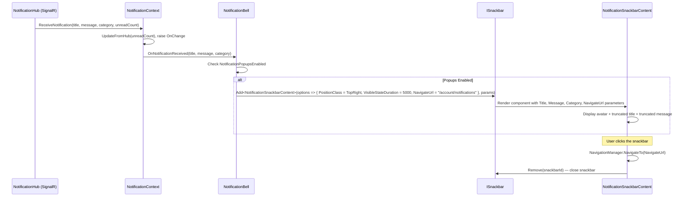

# Design Document: Notification Snackbar Popup

## Overview

This design replaces the current plain-text snackbar toast in `NotificationBell.ShowToast()` with a rich custom component rendered via MudBlazor's `ISnackbar.Add<TComponent>()` API. The custom component (`NotificationSnackbarContent`) displays a category-colored avatar icon, bold title, and caption message in a horizontal layout. The notification snackbar uses per-snackbar `PositionClass` configuration to appear in the top-right corner, leaving the global `MudSnackbarProvider` untouched so that existing action feedback snackbars continue to render at bottom-center.

### Design Decisions

| Decision | Rationale |
|----------|-----------|
| `ISnackbar.Add<TComponent>()` instead of custom HTML string | MudBlazor's generic component API provides type-safe parameter passing, component lifecycle, and access to MudBlazor's component library (MudAvatar, MudText, etc.) inside the snackbar. |
| Per-snackbar `PositionClass` via `SnackbarOptions` | Avoids modifying the global `MudSnackbarProvider` which would break all existing action feedback snackbars. MudBlazor supports per-snackbar position override through the options parameter. |
| `NotificationSnackbarContent` as a standalone Razor component | Clean separation of rendering logic. Lives in the UI project (Razor Class Library) for reuse. The component receives title, message, category, and navigation URL as parameters and handles its own layout, truncation display, and click-to-navigate behavior. |
| Truncation logic extracted to static helper methods | Enables property-based testing of truncation without needing to render Blazor components. Lives in `UI/Utilities/` alongside other shared utilities. Keeps the truncation rule independent of UI framework. |
| Navigate on click using `Snackbar.Remove()` + `NavigationManager` | The custom component injects `ISnackbar` and `NavigationManager` to handle click-to-navigate. The navigation URL is a component parameter (`NavigateUrl`) rather than a hardcoded path, keeping the component reusable. Removing the snackbar explicitly ensures it closes even if the navigation doesn't trigger a full page teardown. |

## Architecture

### Component Interaction Flow



### Component Topology

```mermaid
graph TD
    subgraph UI["UI Project (Razor Class Library)"]
        SC[NotificationSnackbarContent<br/>Components/Shared/]
        STH[SnackbarTextHelper<br/>Utilities/]
    end

    subgraph Web["Web Project"]
        NB[NotificationBell<br/>Components/Layout/Topbar/]
    end

    subgraph Existing["Existing (Unchanged)"]
        NC[NotificationContext]
        ML[MainLayout<br/>MudSnackbarProvider]
        ISB[ISnackbar<br/>Global injection via _Imports.razor]
    end

    NC -->|OnNotificationReceived| NB
    NB -->|Add&lt;NotificationSnackbarContent&gt;<br/>NavigateUrl="/account/notifications"| ISB
    ISB -->|Renders inside provider| SC
    SC -->|NavigateTo(NavigateUrl)| NAV[NavigationManager]
    SC -->|Remove| ISB
    SC -->|Uses| STH

    style ML fill:#e8e8e8,stroke:#999
    style NC fill:#e8e8e8,stroke:#999
```

## Components and Interfaces

### 1. NotificationSnackbarContent (New Component)

**Location:** `AspireWebAppTemplate.UI/Components/Shared/NotificationSnackbarContent.razor` + `.razor.cs`

A custom Blazor component rendered inside MudBlazor's snackbar system. Receives notification data as component parameters and renders the rich layout.

**Razor template:**
```razor
@using MudBlazor

<div @onclick="HandleClick" class="notification-snackbar-content" style="cursor: pointer;">
    <MudStack Row AlignItems="AlignItems.Center" Spacing="3">
        <MudAvatar Size="Size.Small" Color="@CategoryColor">
            <MudIcon Icon="@CategoryIcon" Style="font-size: 16px" />
        </MudAvatar>

        <MudStack Spacing="0" Class="overflow-hidden">
            <MudText Typo="Typo.body2" Class="fw-bold"
                     Style="white-space: nowrap; overflow: hidden; text-overflow: ellipsis;">
                @DisplayTitle
            </MudText>
            <MudText Typo="Typo.caption"
                     Style="white-space: nowrap; overflow: hidden; text-overflow: ellipsis;">
                @DisplayMessage
            </MudText>
        </MudStack>
    </MudStack>
</div>
```

**Code-behind:**
```csharp
public partial class NotificationSnackbarContent : ComponentBase
{
    #region Injected Services

    [Inject] private NavigationManager NavigationManager { get; set; } = default!;
    [Inject] private ISnackbar Snackbar { get; set; } = default!;

    #endregion

    #region Parameters

    /// <summary>
    /// The notification title to display. Truncated to 100 characters if exceeded.
    /// </summary>
    [Parameter] public string Title { get; set; } = "";

    /// <summary>
    /// The notification message body. Truncated to 200 characters if exceeded.
    /// </summary>
    [Parameter] public string Message { get; set; } = "";

    /// <summary>
    /// The notification category string (Account, Activity, System).
    /// Determines the avatar icon and color.
    /// </summary>
    [Parameter] public string Category { get; set; } = "";

    /// <summary>
    /// The URL to navigate to when the user clicks the snackbar.
    /// Passed by the caller (e.g., NotificationBell) so the component remains reusable.
    /// </summary>
    [Parameter] public string NavigateUrl { get; set; } = "";

    /// <summary>
    /// The MudBlazor snackbar element reference, used to close the snackbar on click.
    /// Provided by MudBlazor's snackbar system when rendering a custom component.
    /// </summary>
    [CascadingParameter] private MudSnackbarElement? SnackbarElement { get; set; }

    #endregion

    #region Computed Properties

    private string DisplayTitle => SnackbarTextHelper.TruncateTitle(Title);
    private string DisplayMessage => SnackbarTextHelper.TruncateMessage(Message);
    private string CategoryIcon => GetCategoryIcon();
    private Color CategoryColor => GetCategoryColor();

    #endregion

    #region Event Handlers

    private void HandleClick()
    {
        // Close the snackbar first, then navigate.
        if (SnackbarElement?.SnackbarMessage?.Key is not null)
        {
            Snackbar.Remove(SnackbarElement.SnackbarMessage.Key);
        }

        if (!string.IsNullOrEmpty(NavigateUrl))
        {
            NavigationManager.NavigateTo(NavigateUrl);
        }
    }

    #endregion

    #region Helpers

    private string GetCategoryIcon() => Category?.ToLowerInvariant() switch
    {
        "account" => Icons.Material.Outlined.Security,
        "activity" => Icons.Material.Outlined.People,
        "system" => Icons.Material.Outlined.Info,
        _ => Icons.Material.Outlined.Notifications
    };

    private Color GetCategoryColor() => Category?.ToLowerInvariant() switch
    {
        "account" => Color.Error,
        "activity" => Color.Primary,
        "system" => Color.Info,
        _ => Color.Default
    };

    #endregion
}
```

### 2. SnackbarTextHelper (New Static Helper)

**Location:** `AspireWebAppTemplate.UI/Utilities/SnackbarTextHelper.cs`

A static utility class containing the title and message truncation logic. Extracted from the component for testability.

```csharp
/// <summary>
/// Provides text truncation utilities for notification snackbar content.
/// Extracted as static methods for property-based testing without Blazor rendering.
/// </summary>
public static class SnackbarTextHelper
{
    /// <summary>
    /// Maximum allowed length for notification titles in snackbar display.
    /// </summary>
    public const int MaxTitleLength = 100;

    /// <summary>
    /// Maximum allowed length for notification messages in snackbar display.
    /// </summary>
    public const int MaxMessageLength = 200;

    /// <summary>
    /// Truncates a notification title to <see cref="MaxTitleLength"/> characters,
    /// appending an ellipsis ("…") if the original exceeds the limit.
    /// Returns the original string unchanged when within the limit.
    /// </summary>
    /// <param name="title">The notification title to truncate.</param>
    /// <returns>The original or truncated title.</returns>
    public static string TruncateTitle(string title)
    {
        if (string.IsNullOrEmpty(title)) return title ?? "";
        return title.Length > MaxTitleLength
            ? string.Concat(title.AsSpan(0, MaxTitleLength), "…")
            : title;
    }

    /// <summary>
    /// Truncates a notification message to <see cref="MaxMessageLength"/> characters,
    /// appending an ellipsis ("…") if the original exceeds the limit.
    /// Returns the original string unchanged when within the limit.
    /// </summary>
    /// <param name="message">The notification message to truncate.</param>
    /// <returns>The original or truncated message.</returns>
    public static string TruncateMessage(string message)
    {
        if (string.IsNullOrEmpty(message)) return message ?? "";
        return message.Length > MaxMessageLength
            ? string.Concat(message.AsSpan(0, MaxMessageLength), "…")
            : message;
    }
}
```

### 3. Modified NotificationBell.ShowToast() (Existing Component)

**Location:** `AspireWebAppTemplate.Web/Components/Layout/Topbar/NotificationBell.razor.cs`

The `ShowToast` method is updated to use `ISnackbar.Add<NotificationSnackbarContent>()` instead of `Snackbar.Add(displayTitle, Severity.Info, ...)`.

```csharp
/// <summary>
/// Displays a rich notification snackbar using the custom NotificationSnackbarContent component.
/// Configures per-snackbar positioning to top-right and 5-second auto-dismiss.
/// Passes the navigation URL so the UI project component knows where to navigate on click.
/// Suppresses display when the user has disabled notification popups.
/// </summary>
/// <param name="title">The notification title.</param>
/// <param name="message">The notification message body.</param>
/// <param name="category">The notification category string.</param>
private void ShowToast(string title, string message, string category)
{
    if (!NotificationContext.NotificationPopupsEnabled)
        return;

    Snackbar.Add<NotificationSnackbarContent>(parameters =>
    {
        parameters.Add(p => p.Title, title);
        parameters.Add(p => p.Message, message);
        parameters.Add(p => p.Category, category);
        parameters.Add(p => p.NavigateUrl, "/account/notifications");
    }, Severity.Normal, config =>
    {
        config.VisibleStateDuration = 5000;
        config.ShowCloseIcon = true;
        config.SnackbarVariant = Variant.Outlined;
        config.HideIcon = true;
        config.PositionClass = Defaults.Classes.Position.TopRight;
    });
}
```

The `HandleNotificationReceived` method signature already provides `title`, `message`, and `category` — no change needed there. The only modification is within `ShowToast` to pass all three parameters and use the generic `Add<T>` overload.

### 4. Removed: NotificationBell.TruncateTitle() (Existing Static Method)

The existing `TruncateTitle` static method on `NotificationBell` is superseded by `SnackbarTextHelper.TruncateTitle()` and `SnackbarTextHelper.TruncateMessage()` in the UI project. The old method can be removed since the `NotificationSnackbarContent` component now handles its own truncation internally via the helper.

## Data Models

### No New Data Models

This feature does not introduce new DTOs, entities, or contracts. It operates entirely on the existing data already provided by `INotificationContext.OnNotificationReceived`:

| Parameter | Type | Source |
|-----------|------|--------|
| `title` | `string` | From `NotificationPushRequest.Title` via SignalR hub |
| `message` | `string` | From `NotificationPushRequest.Message` via SignalR hub |
| `category` | `string` | From `NotificationPushRequest.Category` (NotificationCategory enum string) |

### Category Icon/Color Mapping (Static Configuration)

| Category String | Icon | Color |
|-----------------|------|-------|
| `"account"` | `Icons.Material.Outlined.Security` | `Color.Error` |
| `"activity"` | `Icons.Material.Outlined.People` | `Color.Primary` |
| `"system"` | `Icons.Material.Outlined.Info` | `Color.Info` |
| *(any other)* | `Icons.Material.Outlined.Notifications` | `Color.Default` |

## Correctness Properties

*A property is a characteristic or behavior that should hold true across all valid executions of a system — essentially, a formal statement about what the system should do. Properties serve as the bridge between human-readable specifications and machine-verifiable correctness guarantees.*

### Property 1: Title truncation preserves content within limit

*For any* string, `TruncateTitle` SHALL return the original string when its length is <= 100 characters, OR the first 100 characters followed by "…" (U+2026) when the original exceeds 100 characters. The output length SHALL never exceed 101 characters.

**Validates: Requirements 7.1, 7.2**

### Property 2: Message truncation preserves content within limit

*For any* string, `TruncateMessage` SHALL return the original string when its length is <= 200 characters, OR the first 200 characters followed by "…" (U+2026) when the original exceeds 200 characters. The output length SHALL never exceed 201 characters.

**Validates: Requirements 7.3, 7.4**

### Property 3: Popup suppression respects preference

*For any* notification (title, message, category), the notification snackbar SHALL be displayed if and only if `NotificationContext.NotificationPopupsEnabled` is `true` at the time the notification is received. When the preference is `false`, no snackbar SHALL be created regardless of the notification content.

**Validates: Requirements 6.1, 6.2, 6.3**

### Property 4: Unknown category fallback to default icon

*For any* category string that does not case-insensitively match "account", "activity", or "system", the `NotificationSnackbarContent` SHALL display the `Icons.Material.Outlined.Notifications` icon with `Color.Default`.

**Validates: Requirements 3.4**

## Error Handling

### Snackbar Display Failures

| Scenario | Behavior |
|----------|----------|
| `ISnackbar.Add<T>()` throws unexpectedly | Exception caught within `InvokeAsync` in `HandleNotificationReceived`. Logged at Warning level. Does not crash the circuit. |
| `SnackbarElement` cascading parameter is null | `HandleClick` gracefully skips the `Remove` call — navigation still occurs. Snackbar will auto-dismiss after duration. |
| `NavigationManager.NavigateTo()` fails | Exception propagates to Blazor error boundary (standard behavior). Extremely unlikely for internal navigation. |

### Component Parameter Edge Cases

| Scenario | Behavior |
|----------|----------|
| `Title` is null or empty | `TruncateTitle` returns empty string. Component renders empty title line. |
| `Message` is null or empty | `TruncateMessage` returns empty string. Component renders empty message line. |
| `Category` is null | `GetCategoryIcon` / `GetCategoryColor` match the `_` default pattern → Notifications icon with Default color. |
| `NavigateUrl` is null or empty | `HandleClick` skips navigation — snackbar is still removed on click. |

### No Impact on Existing Snackbars

The design ensures zero risk to existing action feedback snackbars:
- `MudSnackbarProvider` in `MainLayout.razor` is not modified
- The `ISnackbar` service is shared — only the per-snackbar `SnackbarOptions.PositionClass` is different
- Any code calling `Snackbar.Add(message, severity)` without explicit `PositionClass` uses MudBlazor's default (bottom-center)

## Testing Strategy

### Property-Based Tests (FsCheck.Xunit)

Property-based tests validate the 4 correctness properties. Each test runs with `[Property(MaxTest = 2)]` per project convention.

**Library:** FsCheck.Xunit 3.3.3 (already in project)
**Configuration:** `[Property(MaxTest = 2)]` per property test
**Tag format:** `// Feature: notification-snackbar-popup, Property {N}: {title}`

| Property | Test Class | What Varies |
|----------|-----------|-------------|
| 1: Title truncation | `SnackbarTitleTruncationPropertyTests` | Random strings of length 0-500, including Unicode, whitespace, special chars |
| 2: Message truncation | `SnackbarMessageTruncationPropertyTests` | Random strings of length 0-1000, including Unicode, whitespace, special chars |
| 3: Popup suppression | `SnackbarPopupSuppressionPropertyTests` | Random notification data (title/message/category) × boolean preference value |
| 4: Unknown category fallback | `SnackbarCategoryFallbackPropertyTests` | Random strings excluding "account", "activity", "system" (case-insensitive) |

### Unit Tests (xUnit + Moq)

| Area | Test Cases |
|------|-----------|
| `NotificationSnackbarContent` rendering | Verifies avatar, icon, title, message elements are present with correct MudBlazor attributes |
| `NotificationSnackbarContent.HandleClick` | Verifies NavigateTo(NavigateUrl) is called with the provided URL and snackbar is removed |
| `NotificationBell.ShowToast` (updated) | Verifies `Snackbar.Add<NotificationSnackbarContent>()` is called with correct parameters (title, message, category, NavigateUrl) and options |
| Category icon mapping | One test per known category (Account, Activity, System) verifying correct icon + color |
| Position configuration | Verifies `PositionClass` is set to `Defaults.Classes.Position.TopRight` |
| VisibleStateDuration | Verifies duration is 5000ms |

### Test File Locations

```
AspireWebAppTemplate.Tests/
├── Notifications/
│   ├── SnackbarTitleTruncationPropertyTests.cs          (new — Property 1)
│   ├── SnackbarMessageTruncationPropertyTests.cs        (new — Property 2)
│   ├── SnackbarPopupSuppressionPropertyTests.cs         (new — Property 3)
│   ├── SnackbarCategoryFallbackPropertyTests.cs         (new — Property 4)
│   └── NotificationSnackbarContentTests.cs              (new — unit tests)
```

### Relationship to Existing Tests

The existing `TitleTruncationPropertyTests.cs` tests the current `NotificationBell.TruncateTitle()` static method. Once that method is replaced by `SnackbarTextHelper.TruncateTitle()`, the existing test class should be updated to reference the new helper or be superseded by `SnackbarTitleTruncationPropertyTests`.
