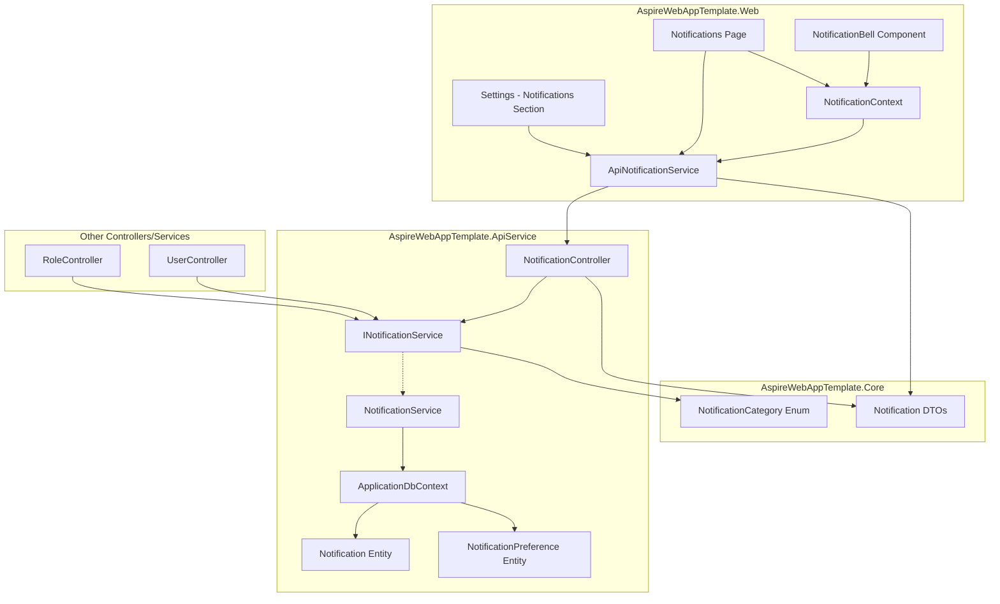
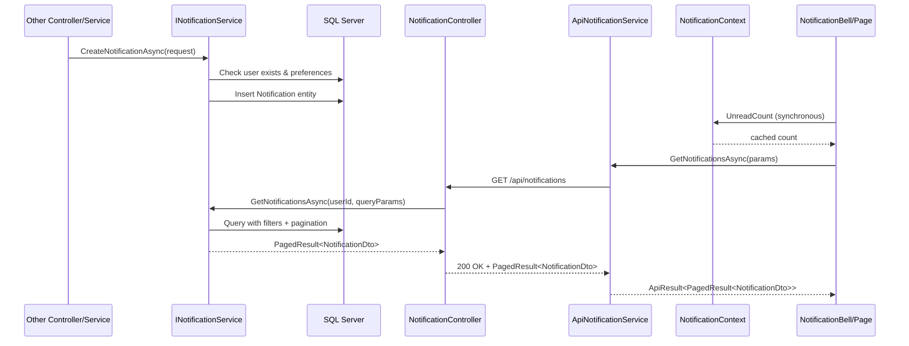

# Design Document: Notification System

## Overview

The notification system provides in-app notifications for the AspireWebAppTemplate enterprise application. It follows the **industry-standard service layer pattern** established by `IPagePermissionService` / `PagePermissionsController`:

- **Thin controllers**: `NotificationController` handles only HTTP concerns — receiving requests, extracting the authenticated user ID from `BaseController`, delegating to `INotificationService`, and mapping results/exceptions to HTTP status codes.
- **Full service layer**: `INotificationService` owns all business logic and database access (create, query, mark-as-read, bulk dismiss, preferences). The controller never touches `ApplicationDbContext` directly.
- A typed HttpClient `ApiNotificationService` in the Web project for frontend-to-API communication.
- A per-circuit `NotificationContext` for real-time unread count caching.
- MudBlazor-based UI components (bell with badge, notification page, settings integration).

### Design Rationale

**Industry-standard layered architecture — thin controllers, services own business logic:**

This design follows the same pattern as `PagePermissionsController` → `IPagePermissionService`, which is the established convention in this template. Controllers are responsible only for:
1. Receiving the HTTP request and extracting route/query/body parameters
2. Reading `CurrentUserId` from `BaseController`
3. Calling the appropriate `INotificationService` method
4. Mapping the service result (or exception) to an HTTP status code

All business logic, validation, EF Core queries, and database mutations live in the `NotificationService` implementation. This establishes the convention going forward for all new features in the template.

**Registration:** Services are registered as **scoped** — aligning with per-request `DbContext` lifetime, consistent with `IPagePermissionService` registration.

## Architecture

### High-Level Component Diagram



### Data Flow



## Components and Interfaces

### 1. INotificationService (ApiService/Abstractions/)

A full service interface owning all notification business logic and database access. The controller delegates every operation to this service, following the `IPagePermissionService` pattern.

```csharp
/// <summary>
/// Defines the contract for notification business logic including creation, retrieval,
/// status management, and preference management. All database access for notifications
/// is encapsulated here — controllers delegate to this service without touching DbContext.
/// </summary>
/// <remarks>
/// Implementations should be registered as scoped services to align with the per-request
/// <c>DbContext</c> lifetime. The <see cref="CreateNotificationAsync"/> method is also
/// called as a cross-cutting concern by other services (UserController, RoleController, etc.).
/// </remarks>
public interface INotificationService
{
    /// <summary>
    /// Creates a new notification for the specified user, respecting their delivery preferences.
    /// If the user does not exist or has InAppEnabled=false for the category, no entity is created.
    /// Failures are logged but never propagated to the caller, ensuring notification creation
    /// does not disrupt the primary user operation.
    /// </summary>
    Task CreateNotificationAsync(CreateNotificationRequest request);

    /// <summary>
    /// Retrieves a paginated list of notifications for the specified user,
    /// ordered by CreatedAtUtc descending, with optional category and read-status filters.
    /// </summary>
    Task<PagedResult<NotificationDto>> GetNotificationsAsync(string userId, NotificationQueryParams queryParams);

    /// <summary>
    /// Returns the count of unread notifications (IsRead=false) for the specified user.
    /// </summary>
    Task<int> GetUnreadCountAsync(string userId);

    /// <summary>
    /// Returns the most recent notifications for the bell dropdown preview.
    /// </summary>
    Task<List<NotificationDto>> GetRecentAsync(string userId, int count = 5);

    /// <summary>
    /// Marks a single notification as read. Sets IsRead=true and ReadAtUtc to current UTC time.
    /// Returns true if the notification was found and belongs to the user; false otherwise.
    /// Idempotent: if already read, completes successfully without modifying the record.
    /// </summary>
    Task<bool> MarkAsReadAsync(string userId, Guid notificationId);

    /// <summary>
    /// Marks all unread notifications for the specified user as read.
    /// Returns the count of notifications that were updated.
    /// </summary>
    Task<int> MarkAllAsReadAsync(string userId);

    /// <summary>
    /// Deletes the specified notifications that belong to the user.
    /// IDs that do not exist or do not belong to the user are silently ignored.
    /// Returns the count of notifications actually deleted.
    /// </summary>
    Task<int> BulkDismissAsync(string userId, List<Guid> notificationIds);

    /// <summary>
    /// Retrieves notification preferences for all categories for the specified user.
    /// Categories without an explicit preference record are returned with defaults
    /// (InAppEnabled=true, EmailEnabled=true).
    /// </summary>
    Task<List<NotificationPreferenceDto>> GetPreferencesAsync(string userId);

    /// <summary>
    /// Creates or updates the notification preference for the specified user-category pair.
    /// </summary>
    Task UpdatePreferenceAsync(string userId, UpdateNotificationPreferenceRequest request);
}
```

### 2. NotificationController (ApiService/Controllers/)

A thin controller that handles only HTTP concerns and delegates all business logic to `INotificationService`. Follows the exact same pattern as `PagePermissionsController` → `IPagePermissionService`.

```csharp
/// <summary>
/// Provides notification query, mutation, and preference management endpoints.
/// This controller is intentionally thin — it handles HTTP concerns only (request parsing,
/// user identity extraction, status code mapping) and delegates all business logic to
/// <see cref="INotificationService"/>.
/// </summary>
/// <remarks>
/// Exception-to-HTTP-status mapping:
/// <list type="bullet">
///   <item><see cref="KeyNotFoundException"/> → 404 Not Found</item>
///   <item><see cref="InvalidOperationException"/> → 400 Bad Request</item>
///   <item><see cref="ArgumentException"/> → 400 Bad Request</item>
/// </list>
/// </remarks>
[Route("api/notifications")]
[Authorize]
public class NotificationController : BaseController
{
    private readonly INotificationService _notificationService;

    public NotificationController(INotificationService notificationService)
    {
        _notificationService = notificationService;
    }

    // GET  /api/notifications              — paginated list with optional filters
    // GET  /api/notifications/unread-count  — integer unread count
    // GET  /api/notifications/recent        — 5 most recent for bell dropdown
    // PUT  /api/notifications/{id}/read     — mark single as read
    // PUT  /api/notifications/read-all      — mark all as read
    // POST /api/notifications/dismiss       — bulk dismiss max 100 IDs
    // GET  /api/notifications/preferences   — get user preferences
    // PUT  /api/notifications/preferences   — update single preference
}
```

**Thin Controller Example — MarkAsRead:**

```csharp
/// <summary>
/// Marks a single notification as read for the authenticated user.
/// Idempotent: succeeds even if already read.
/// </summary>
[HttpPut("{id:guid}/read")]
[ProducesResponseType(StatusCodes.Status200OK)]
[ProducesResponseType(StatusCodes.Status404NotFound)]
public async Task<IActionResult> MarkAsRead(Guid id)
{
    var found = await _notificationService.MarkAsReadAsync(CurrentUserId, id);

    if (!found)
        return NotFound();

    return Ok();
}
```

**Thin Controller Example — BulkDismiss:**

```csharp
/// <summary>
/// Dismisses (deletes) multiple notifications belonging to the authenticated user.
/// IDs not owned by the user or non-existent are silently ignored.
/// </summary>
[HttpPost("dismiss")]
[ProducesResponseType(typeof(int), StatusCodes.Status200OK)]
[ProducesResponseType(StatusCodes.Status400BadRequest)]
public async Task<IActionResult> BulkDismiss([FromBody] BulkDismissRequest request)
{
    if (request.NotificationIds.Count > 100)
        return BadRequest("A maximum of 100 notification IDs can be dismissed per request.");

    var deletedCount = await _notificationService.BulkDismissAsync(CurrentUserId, request.NotificationIds);
    return Ok(deletedCount);
}
```

### 3. ApiNotificationService (Web/Services/ApiClients/)

```csharp
/// <summary>
/// Typed HttpClient service for notification API operations.
/// Uses Aspire service discovery and UserIdentityDelegatingHandler for auth propagation.
/// </summary>
public class ApiNotificationService(HttpClient http)
{
    Task<ApiResult<PagedResult<NotificationDto>>> GetNotificationsAsync(NotificationQueryParams queryParams);
    Task<ApiResult<int>> GetUnreadCountAsync();
    Task<ApiResult<List<NotificationDto>>> GetRecentAsync();
    Task<ApiResult> MarkAsReadAsync(Guid notificationId);
    Task<ApiResult<int>> MarkAllAsReadAsync();
    Task<ApiResult<int>> BulkDismissAsync(BulkDismissRequest request);
    Task<ApiResult<List<NotificationPreferenceDto>>> GetPreferencesAsync();
    Task<ApiResult> UpdatePreferenceAsync(UpdateNotificationPreferenceRequest request);
}
```

### 4. INotificationContext (Web/Abstractions/)

```csharp
/// <summary>
/// Per-circuit scoped service caching the current user's unread notification count.
/// Provides synchronous O(1) access for layout components (NotificationBell).
/// </summary>
public interface INotificationContext
{
    /// <summary>
    /// Gets the cached unread notification count. Returns 0 before initialization.
    /// </summary>
    int UnreadCount { get; }

    /// <summary>
    /// Gets whether the context has been initialized (loaded from API).
    /// </summary>
    bool IsLoaded { get; }

    /// <summary>
    /// Raised when UnreadCount changes. Subscribers should call StateHasChanged.
    /// </summary>
    event Action? OnChange;

    /// <summary>
    /// Loads the unread count from the API. Called once per circuit during initialization.
    /// </summary>
    Task InitializeAsync();

    /// <summary>
    /// Decrements the cached unread count by the specified amount (e.g., after marking as read).
    /// Clamps to zero.
    /// </summary>
    void DecrementCount(int amount = 1);

    /// <summary>
    /// Sets the cached unread count to zero (e.g., after mark-all-as-read).
    /// </summary>
    void ClearCount();

    /// <summary>
    /// Reloads the unread count from the API (e.g., after bulk dismiss where exact delta is complex).
    /// </summary>
    Task RefreshAsync();
}
```

### 5. UI Components

| Component | Location | Description |
|-----------|----------|-------------|
| `NotificationBell` | Web/Components/Layout/Topbar/ | Bell icon + MudBadge + MudPopover dropdown |
| `Notifications` page | Web/Components/Pages/Account/Notifications/ | Full notification management page |
| Notification settings section | Web/Components/Pages/Account/Settings/ | Integrated into existing Settings page |

## Data Models

### Notification Entity (ApiService/Data/Entities/)

```csharp
/// <summary>
/// Represents a single in-app notification record for a user.
/// </summary>
public class Notification
{
    public Guid Id { get; set; }
    public string UserId { get; set; } = string.Empty;
    public NotificationCategory Category { get; set; }
    public string Title { get; set; } = string.Empty;
    public string Message { get; set; } = string.Empty;
    public bool IsRead { get; set; }
    public DateTime CreatedAtUtc { get; set; }
    public DateTime? ReadAtUtc { get; set; }

    // Navigation property
    public ApplicationUser? User { get; set; }
}
```

**EF Core Configuration:**
- Table: `Notifications`
- `UserId`: MaxLength 450, indexed
- `Category`: Stored as string via `HasConversion<string>()`
- `Title`: MaxLength 256
- `Message`: MaxLength 1024
- `IsRead`: Default false
- `CreatedAtUtc`: Default `GETUTCDATE()`
- Composite index on `(UserId, IsRead)` for efficient unread count queries
- Index on `(UserId, CreatedAtUtc)` for efficient paginated retrieval
- FK to `ApplicationUser` with `DeleteBehavior.Cascade` (when user deleted, notifications are deleted)

### NotificationPreference Entity (ApiService/Data/Entities/)

```csharp
/// <summary>
/// Represents a user's delivery preference for a specific notification category.
/// </summary>
public class NotificationPreference
{
    public Guid Id { get; set; }
    public string UserId { get; set; } = string.Empty;
    public NotificationCategory Category { get; set; }
    public bool InAppEnabled { get; set; } = true;
    public bool EmailEnabled { get; set; } = true;

    // Navigation property
    public ApplicationUser? User { get; set; }
}
```

**EF Core Configuration:**
- Table: `NotificationPreferences`
- `UserId`: MaxLength 450
- `Category`: Stored as string via `HasConversion<string>()`
- Unique composite index on `(UserId, Category)` to enforce one preference per user-category pair
- FK to `ApplicationUser` with `DeleteBehavior.Cascade`

### NotificationCategory Enum (Core/Domain/Enums/)

```csharp
/// <summary>
/// Classification of notification types for grouping and preference management.
/// </summary>
public enum NotificationCategory
{
    /// <summary>Security-related notifications (password reset, login alerts).</summary>
    Security,

    /// <summary>User management notifications (role changes, activation/deactivation).</summary>
    UserManagement,

    /// <summary>System-level notifications (maintenance, updates).</summary>
    System
}
```

### DTOs (Core/Contracts/Notifications/)

```csharp
/// <summary>
/// Response DTO representing a single notification.
/// </summary>
public sealed class NotificationDto
{
    public Guid Id { get; set; }
    public NotificationCategory Category { get; set; }
    public string Title { get; set; } = "";
    public string Message { get; set; } = "";
    public bool IsRead { get; set; }
    public DateTime CreatedAtUtc { get; set; }
    public DateTime? ReadAtUtc { get; set; }
}

/// <summary>
/// Request DTO for creating a notification (used internally by backend services).
/// </summary>
public sealed class CreateNotificationRequest
{
    public string UserId { get; set; } = "";
    public NotificationCategory Category { get; set; }
    public string Title { get; set; } = "";
    public string Message { get; set; } = "";
}

/// <summary>
/// Query parameters for paginated notification retrieval.
/// </summary>
public sealed class NotificationQueryParams
{
    public int Page { get; set; } = 1;
    public int PageSize { get; set; } = 20;
    public NotificationCategory? Category { get; set; }
    public bool? IsRead { get; set; }
}

/// <summary>
/// Request DTO for bulk dismiss operation.
/// </summary>
public sealed class BulkDismissRequest
{
    public List<Guid> NotificationIds { get; set; } = [];
}

/// <summary>
/// Response DTO representing a user's notification preference for a category.
/// </summary>
public sealed class NotificationPreferenceDto
{
    public NotificationCategory Category { get; set; }
    public bool InAppEnabled { get; set; }
    public bool EmailEnabled { get; set; }
}

/// <summary>
/// Request DTO for updating a single notification preference.
/// </summary>
public sealed class UpdateNotificationPreferenceRequest
{
    public NotificationCategory Category { get; set; }
    public bool InAppEnabled { get; set; }
    public bool EmailEnabled { get; set; }
}
```

### PagedResult (Core/Contracts/) — Existing

The existing `PagedResult<T>` class will be used for paginated responses:

```csharp
public class PagedResult<T>
{
    public List<T> Items { get; set; } = [];
    public int TotalCount { get; set; }
    public int Page { get; set; }
    public int PageSize { get; set; }
    public int TotalPages => (int)Math.Ceiling((double)TotalCount / PageSize);
    public bool HasNextPage => Page < TotalPages;
}
```

## Correctness Properties

*A property is a characteristic or behavior that should hold true across all valid executions of a system — essentially, a formal statement about what the system should do. Properties serve as the bridge between human-readable specifications and machine-verifiable correctness guarantees.*

### Property 1: Notification creation preserves all input fields

*For any* valid `CreateNotificationRequest` with a known-existing user and InAppEnabled=true, the resulting `Notification` entity SHALL have matching UserId, Category, Title, Message, IsRead=false, and a CreatedAtUtc timestamp set to a UTC value.

**Validates: Requirements 1.1**

### Property 2: Retrieval returns notifications ordered by CreatedAtUtc descending

*For any* set of notifications belonging to a user with varying CreatedAtUtc timestamps, retrieving them via the paginated query SHALL return them in strictly descending order of CreatedAtUtc.

**Validates: Requirements 2.1**

### Property 3: Filtering returns only notifications matching all specified criteria

*For any* set of notifications with mixed categories and IsRead states, when a category filter and/or read status filter is applied, all returned notifications SHALL match every specified filter criterion, and no notification matching the criteria SHALL be excluded.

**Validates: Requirements 2.2, 2.3**

### Property 4: Pagination returns at most pageSize items

*For any* positive pageSize value (1–100) and any total notification count, the returned page SHALL contain at most pageSize items, and the total count SHALL reflect the full filtered result set size.

**Validates: Requirements 2.4**

### Property 5: Unread count matches actual count of unread notifications

*For any* set of notifications belonging to a user with mixed IsRead states, the unread count query SHALL return a value equal to the count of notifications where IsRead is false.

**Validates: Requirements 3.1**

### Property 6: NotificationContext cache correctly reflects mark/dismiss operations

*For any* initial unread count and sequence of DecrementCount/ClearCount operations, the NotificationContext's UnreadCount SHALL equal max(0, initialCount - totalDecrements) after decrements, or 0 after ClearCount.

**Validates: Requirements 3.4**

### Property 7: Mark-as-read sets IsRead and ReadAtUtc correctly

*For any* unread notification (IsRead=false, ReadAtUtc=null), after marking it as read, the notification SHALL have IsRead=true and ReadAtUtc set to a non-null UTC DateTime.

**Validates: Requirements 4.1**

### Property 8: Mark-as-read is idempotent

*For any* notification that is already marked as read (IsRead=true, ReadAtUtc=T), marking it as read again SHALL not modify the ReadAtUtc value — it SHALL remain equal to T.

**Validates: Requirements 4.3**

### Property 9: Bulk dismiss deletes only owned-and-existing notifications

*For any* list of notification IDs (containing a mix of IDs belonging to the user, IDs belonging to other users, and non-existent IDs), bulk dismiss SHALL delete exactly those notifications that exist AND belong to the specified user, leaving all other notifications untouched.

**Validates: Requirements 5.1, 5.2**

### Property 10: Mark-all-as-read updates all unread and returns correct count

*For any* set of notifications belonging to a user with N unread items, mark-all-as-read SHALL set IsRead=true and ReadAtUtc on all N items, and return exactly N as the updated count.

**Validates: Requirements 6.1, 6.2**

### Property 11: Notification creation respects InAppEnabled preference

*For any* `CreateNotificationRequest` where the target user has InAppEnabled=false for that category, the service SHALL NOT create a Notification entity. Conversely, when InAppEnabled=true (or no preference record exists), the entity SHALL be created.

**Validates: Requirements 9.5**

### Property 12: Missing preferences default to both channels enabled

*For any* user-category pair with no `NotificationPreference` record in the database, retrieving preferences SHALL return InAppEnabled=true and EmailEnabled=true for that category.

**Validates: Requirements 9.4**

## Error Handling

| Scenario | Behavior |
|----------|----------|
| Create notification for non-existent user | Service discards silently, no exception |
| Mark-as-read for notification not owned by user | Service returns false → Controller returns 404 Not Found |
| Bulk dismiss with > 100 IDs | Controller returns 400 Bad Request with descriptive message (input validation at HTTP layer) |
| Bulk dismiss with unowned/nonexistent IDs | Service silently ignores, only valid owned IDs processed |
| API call failure in NotificationContext | Cache stays at 0, IsLoaded set to true, warning logged |
| API call failure in Settings preference save | Toggle reverts to previous state, Snackbar error shown |
| API call failure in NotificationBell/Page | Snackbar error, existing state preserved |
| Database exception in service operations | Propagated for standard error handling middleware |

### Controller Error Handling Pattern

The controller handles only HTTP-level concerns — input size validation and exception-to-status-code mapping:

```csharp
/// <summary>
/// Marks all unread notifications as read for the authenticated user.
/// </summary>
[HttpPut("read-all")]
[ProducesResponseType(typeof(int), StatusCodes.Status200OK)]
public async Task<ActionResult<int>> MarkAllAsRead()
{
    var updatedCount = await _notificationService.MarkAllAsReadAsync(CurrentUserId);
    return Ok(updatedCount);
}
```

## Testing Strategy

### Property-Based Tests (FsCheck.Xunit 3.x)

Each correctness property maps to a single FsCheck property test with `[Property(MaxTest = 2)]` (per project convention). Tests use SQLite in-memory database for testing **service layer logic** directly via `INotificationService` implementation.

**Test file organization:** `AspireWebAppTemplate.Tests/Notifications/`

| Test File | Properties Covered | Tests Against |
|-----------|-------------------|---------------|
| `NotificationCreationPropertyTests.cs` | Property 1, 11 | `NotificationService` (service layer) |
| `NotificationRetrievalPropertyTests.cs` | Property 2, 3, 4, 5 | `NotificationService` (service layer) |
| `NotificationMarkAsReadPropertyTests.cs` | Property 7, 8 | `NotificationService` (service layer) |
| `BulkDismissPropertyTests.cs` | Property 9 | `NotificationService` (service layer) |
| `MarkAllAsReadPropertyTests.cs` | Property 10 | `NotificationService` (service layer) |
| `NotificationPreferenceDefaultsPropertyTests.cs` | Property 12 | `NotificationService` (service layer) |
| `NotificationContextPropertyTests.cs` | Property 6 | `NotificationContext` in-memory |

**Tag format:** `// Feature: notification-system, Property {N}: {title}`

**Library:** FsCheck.Xunit 3.3.3 with `FsCheck.Fluent` API  
**Database:** Microsoft.EntityFrameworkCore.Sqlite in-memory for service tests  
**Mocking:** Moq for HttpClient/API dependencies in context tests

### Unit Tests (xUnit + Moq)

| Test File | Coverage |
|-----------|----------|
| `NotificationControllerTests.cs` | HTTP concerns only: status code mapping (200, 404, 400), input validation (>100 IDs → 400), correct delegation to service |
| `NotificationServiceTests.cs` | Business logic: preference checks, user validation, silent discard, edge cases |
| `ApiNotificationServiceTests.cs` | HTTP response mapping to ApiResult |
| `NotificationBellTests.cs` | Badge visibility based on count |

### Controller Tests Focus

Controller tests verify HTTP-layer behavior only — they mock `INotificationService` and assert:
- Correct HTTP status codes returned for service results (e.g., `MarkAsReadAsync` returns false → 404)
- Input validation enforced before service call (e.g., >100 IDs → 400 without calling service)
- `CurrentUserId` is passed correctly to service methods
- No business logic leaks into the controller

### Integration Tests

| Area | Approach |
|------|----------|
| EF Core entity configuration | Verify schema, indexes, cascade behavior using SQLite |
| Service + DbContext end-to-end | Verify service methods produce correct results with test data |

### Generator Strategy

Custom FsCheck generators for:
- `NotificationCategory` — uniform random selection from enum values
- `CreateNotificationRequest` — random valid titles (1–256 chars), messages (1–1024 chars), known user IDs, random categories
- `NotificationQueryParams` — random page (1–10), pageSize (1–100), optional category and IsRead filters
- `List<Notification>` — random sets of 0–50 notifications with mixed IsRead states, categories, and CreatedAtUtc timestamps
