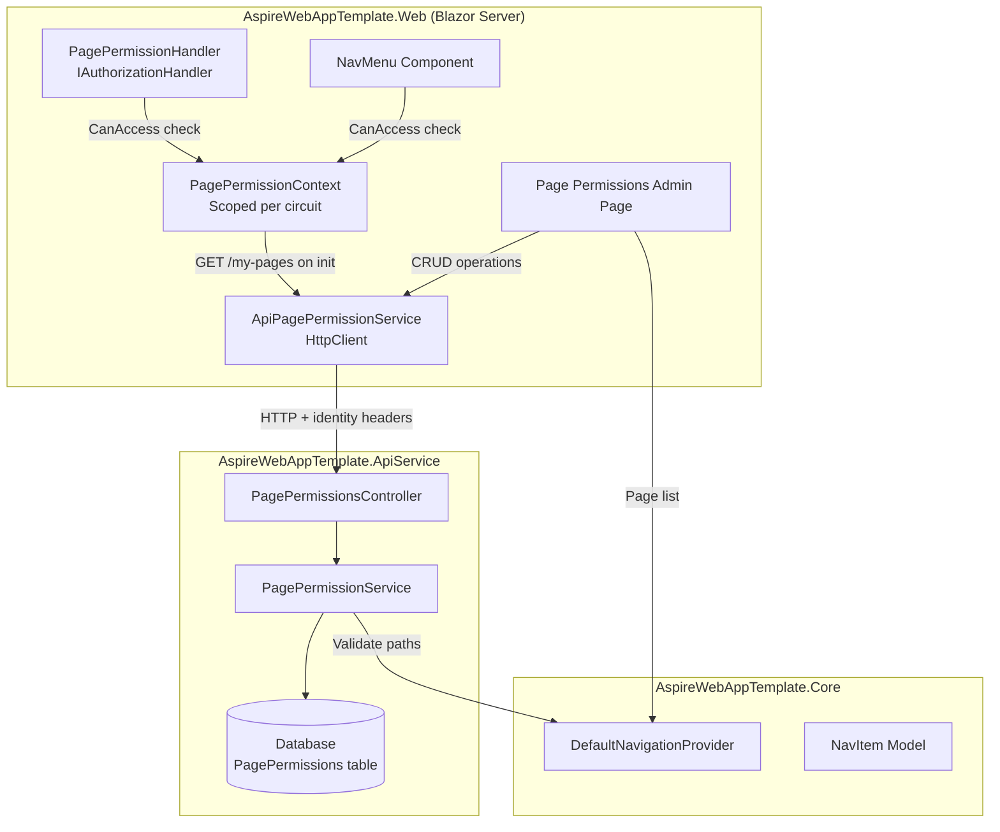
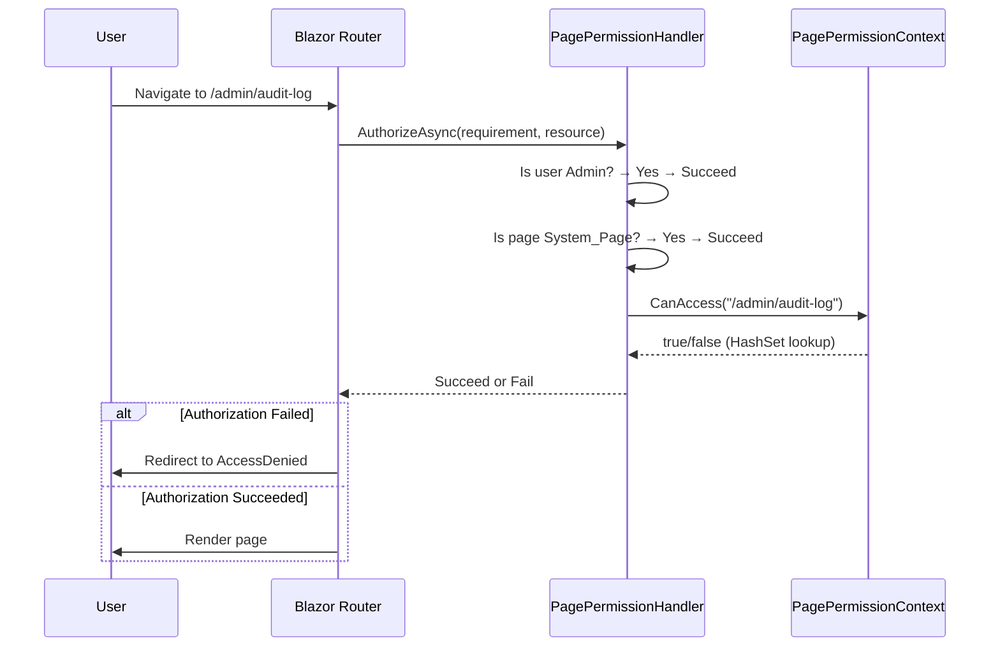
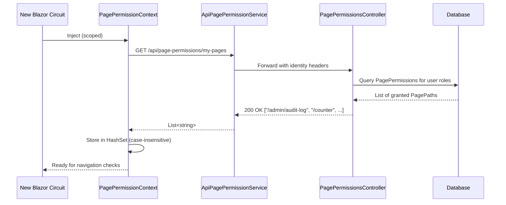

# Design Document: Page Access Permissions

## Overview

This feature replaces hardcoded `[Authorize(Roles = "...")]` attributes with a database-driven, role-based page authorization system. The design introduces a `PagePermission` entity in the API service, a permission context cache in the Blazor Server frontend, an `AuthorizationHandler` for enforcement, and an admin UI for managing the role × page permission matrix.

The system uses a **whitelist model**: a `PagePermission` record existing for a role-page combination grants access; absence denies it. The Admin role is treated as immutable with full access to all pages, and System_Pages (Login, Register, AccessDenied, etc.) are always accessible regardless of permissions.

### Key Design Decisions

1. **Per-circuit caching**: Permissions are loaded once per Blazor Server circuit (SignalR session) and stored in a `HashSet<string>` for O(1) synchronous lookups. This ensures zero-latency navigation checks after initial load.
2. **Full replacement on update**: The PUT endpoint replaces all permissions for a role atomically, simplifying concurrency handling and ensuring consistent state.
3. **API-driven architecture**: The Web project calls the ApiService for permission data, following the existing Aspire service discovery pattern with `UserIdentityDelegatingHandler` for identity propagation.
4. **DefaultNavigationProvider as source of truth for pages**: The list of configurable pages comes from `INavigationProvider.GetMainMenuItems()`, ensuring consistency between navigation and permissions.

## Architecture



### Request Flow — Navigation Authorization



### Request Flow — Circuit Initialization



## Components and Interfaces

### AspireWebAppTemplate.ApiService

#### PagePermission Entity

```csharp
// Data/Entities/PagePermission.cs
public class PagePermission
{
    public int Id { get; set; }
    public string RoleId { get; set; } = string.Empty;
    public string PagePath { get; set; } = string.Empty;
    public string PageDisplayName { get; set; } = string.Empty;

    // Navigation property
    public ApplicationRole Role { get; set; } = null!;
}
```

#### IPagePermissionService Interface

```csharp
// Abstractions/IPagePermissionService.cs
public interface IPagePermissionService
{
    Task<List<RolePermissionsDto>> GetAllPermissionsAsync();
    Task<List<string>> GetMyPagesAsync(string userId);
    Task UpdateRolePermissionsAsync(string roleId, List<string> pagePaths);
}
```

#### PagePermissionsController

```csharp
// Controllers/PagePermissionsController.cs
[Route("api/page-permissions")]
public class PagePermissionsController : BaseController
{
    // GET  /api/page-permissions          → Admin only, returns all grouped by role
    // PUT  /api/page-permissions/{roleId} → Admin only, replaces role permissions
    // GET  /api/page-permissions/my-pages → Authenticated, returns current user's pages
}
```

### AspireWebAppTemplate.Web

#### IPagePermissionContext Interface

```csharp
// Abstractions/IPagePermissionContext.cs
public interface IPagePermissionContext
{
    bool IsLoaded { get; }
    bool CanAccess(string pagePath);
    IReadOnlyList<string> GetAccessiblePages();
    Task InitializeAsync();
}
```

#### PagePermissionContext (Scoped Service)

```csharp
// Services/PagePermissionContext.cs
public class PagePermissionContext : IPagePermissionContext
{
    private HashSet<string>? _accessiblePages; // OrdinalIgnoreCase
    private bool _isLoaded;
    private static readonly HashSet<string> SystemPages = new(StringComparer.OrdinalIgnoreCase)
    {
        "/Account/Login", "/Account/Register", "/Account/AccessDenied",
        "/Error", "/Account/ForgotPassword", "/Account/ResetPassword",
        "/Account/PerformLogin"
    };

    public bool IsLoaded => _isLoaded;
    public bool CanAccess(string pagePath) { /* O(1) HashSet lookup */ }
    public IReadOnlyList<string> GetAccessiblePages() { /* return cached list */ }
    public Task InitializeAsync() { /* single API call, populate HashSet */ }
}
```

#### PagePermissionHandler

```csharp
// Authorization/PagePermissionHandler.cs
public class PagePermissionHandler : AuthorizationHandler<PagePermissionRequirement>
{
    // Evaluation order (synchronous):
    // 1. Admin role → succeed immediately
    // 2. System_Page → succeed immediately
    // 3. PagePermissionContext.CanAccess → succeed/fail
    // 4. Path undetermined → succeed (avoid blocking non-page resources)
}
```

#### ApiPagePermissionService (HttpClient Wrapper)

```csharp
// Services/ApiPagePermissionService.cs
public class ApiPagePermissionService
{
    // Wraps HTTP calls to /api/page-permissions endpoints
    // Registered with Aspire service discovery: "https+http://apiservice"
    // Uses UserIdentityDelegatingHandler for auth propagation
}
```

### AspireWebAppTemplate.Core (Shared)

#### DTOs (in Contracts or Common)

```csharp
public record RolePermissionsDto(string RoleId, string RoleName, List<PagePermissionDto> Pages);
public record PagePermissionDto(string PagePath, string PageDisplayName);
public record UpdateRolePermissionsRequest(List<string> PagePaths);
```

## Data Models

### PagePermissions Table

| Column          | Type           | Constraints                          |
|-----------------|----------------|--------------------------------------|
| Id              | int            | PK, auto-increment                   |
| RoleId          | nvarchar(450)  | FK → ApplicationRoles.Id, NOT NULL   |
| PagePath        | nvarchar(256)  | NOT NULL, starts with "/"            |
| PageDisplayName | nvarchar(256)  | NOT NULL                             |

**Indexes:**
- Unique composite index on `(RoleId, PagePath)` — prevents duplicate grants
- FK index on `RoleId` with cascade delete

### EF Core Configuration

```csharp
modelBuilder.Entity<PagePermission>(entity =>
{
    entity.ToTable("PagePermissions");
    entity.HasKey(e => e.Id);

    entity.Property(e => e.RoleId).IsRequired().HasMaxLength(450);
    entity.Property(e => e.PagePath).IsRequired().HasMaxLength(256);
    entity.Property(e => e.PageDisplayName).IsRequired().HasMaxLength(256);

    // Unique composite index prevents duplicate role-page grants
    entity.HasIndex(e => new { e.RoleId, e.PagePath }).IsUnique();

    // Cascade delete: removing a role removes its permissions
    entity.HasOne(e => e.Role)
          .WithMany()
          .HasForeignKey(e => e.RoleId)
          .OnDelete(DeleteBehavior.Cascade);
});
```

### Seed Data Strategy

The `SeedData.InitializeAsync` method is extended to seed `PagePermission` records:
1. Query `DefaultNavigationProvider.GetMainMenuItems()` to extract all Link NavItems
2. For pages with `Roles = "Admin"`: insert grants for the Admin role
3. For pages with `AuthorizedOnly = true` but no `Roles`: insert grants for all existing roles
4. Use upsert logic (check existence before insert) to maintain idempotency

## Correctness Properties

*A property is a characteristic or behavior that should hold true across all valid executions of a system — essentially, a formal statement about what the system should do. Properties serve as the bridge between human-readable specifications and machine-verifiable correctness guarantees.*

### Property 1: Whitelist Model — Access If and Only If Record Exists

*For any* role (non-Admin) and any page path (non-System_Page), the permission service SHALL grant access if and only if a `PagePermission` record exists with a matching RoleId and PagePath (case-insensitive ordinal comparison).

**Validates: Requirements 1.5, 1.6**

### Property 2: Validation Rejects Invalid PagePaths

*For any* string that does not start with "/" or exceeds 256 characters, or any PageDisplayName exceeding 256 characters, the system SHALL reject the creation of a PagePermission record with a validation error indicating the violated constraint.

**Validates: Requirements 1.7**

### Property 3: Admin Immutable Full Access

*For any* page path and any database state, if the user holds the "Admin" role, the PagePermissionHandler SHALL succeed the authorization requirement without consulting the permission cache.

**Validates: Requirements 4.1, 4.3, 6.3**

### Property 4: System Pages Always Accessible

*For any* System_Page path and any cache state (empty, partial, or full), both `PagePermissionContext.CanAccess` and `PagePermissionHandler` SHALL return/succeed authorization without consulting database records.

**Validates: Requirements 5.6, 6.4**

### Property 5: Case-Insensitive Permission Lookup

*For any* page path stored in the permission cache and any case variation of that path, `PagePermissionContext.CanAccess` SHALL return true, and conversely for any path NOT in the cache (and not a System_Page), CanAccess SHALL return false regardless of casing.

**Validates: Requirements 5.3, 6.6, 12.1**

### Property 6: Permission Union Across Roles

*For any* user with multiple roles, the set of accessible pages returned by `GET /api/page-permissions/my-pages` SHALL equal the union of all `PagePermission` records across all roles assigned to that user.

**Validates: Requirements 3.3**

### Property 7: PUT Idempotent Full Replacement

*For any* valid role and any list of valid page paths, after calling `PUT /api/page-permissions/{roleId}` with that list, querying the permissions for that role SHALL return exactly that list (no more, no less), and repeating the same PUT call SHALL produce an identical result.

**Validates: Requirements 3.2**

### Property 8: PUT Rejects Unregistered Paths

*For any* page path string that does not match any Link NavItem's Href in `DefaultNavigationProvider`, a PUT request containing that path SHALL return 400 Bad Request identifying the invalid paths.

**Validates: Requirements 3.8**

### Property 9: NavMenu Filters Inaccessible Items

*For any* set of NavItems of type Link and any permission cache state, the NavMenu SHALL render only those Link items whose Href causes `PagePermissionContext.CanAccess` to return true (plus System_Page items which are always rendered).

**Validates: Requirements 7.1**

### Property 10: Empty Groups Hidden

*For any* NavItem of type Group, if all of its children (after both auth-based filtering and permission-based filtering) are hidden, the Group itself SHALL not be rendered.

**Validates: Requirements 7.2**

### Property 11: System Pages Excluded From Admin Matrix

*For any* page path that matches a System_Page, the admin permission matrix SHALL NOT include that path as a row.

**Validates: Requirements 8.10**

## Error Handling

| Scenario | Component | Behavior |
|----------|-----------|----------|
| API call to `/my-pages` fails (network/non-200) | PagePermissionContext | Cache treated as empty; CanAccess returns false for all non-System_Pages; error notification displayed |
| PUT with non-existent roleId | PagePermissionsController | Returns 404 Not Found |
| PUT with system role (IsSystem=true) | PagePermissionsController | Returns 400 Bad Request with message |
| PUT with invalid PagePath (not in provider) | PagePermissionsController | Returns 400 Bad Request listing invalid paths |
| PUT with Admin role | PagePermissionsController | Returns 400 Bad Request ("Admin role permissions cannot be modified") |
| GET/PUT without Admin role | PagePermissionsController | Returns 403 Forbidden |
| GET /my-pages without authentication | PagePermissionsController | Returns 401 Unauthorized |
| Permission save fails (UI) | Page_Permissions_Admin_Page | Toggle reverts to previous state; error snackbar auto-dismisses after 5 seconds |
| Page path cannot be determined from auth resource | PagePermissionHandler | Succeeds authorization (avoids blocking non-page resources) |
| Permissions not yet loaded during navigation | PagePermissionHandler | Denies access to non-System_Pages until cache populated |
| Database constraint violation (duplicate RoleId+PagePath) | PagePermissionService | Caught by unique index; returns appropriate error |

## Testing Strategy

### Testing Framework

- **xUnit** for test execution
- **FsCheck.Xunit** (already installed, v3.3.3) for property-based testing
- **Moq** for mocking dependencies
- **Microsoft.EntityFrameworkCore.Sqlite** for in-memory database testing

### Property-Based Tests (FsCheck)

Each correctness property maps to a single property-based test with minimum 100 iterations:

| Property | Test Class | What Varies |
|----------|-----------|-------------|
| 1: Whitelist Model | `PagePermissionServicePropertyTests` | Random role-page combinations, random DB states |
| 2: Validation | `PagePermissionValidationPropertyTests` | Random strings (invalid paths, long strings, whitespace) |
| 3: Admin Full Access | `PagePermissionHandlerPropertyTests` | Random page paths, random cache states |
| 4: System Pages | `PagePermissionContextPropertyTests` | Random cache states, all System_Page paths |
| 5: Case-Insensitive Lookup | `PagePermissionContextPropertyTests` | Random paths with random case mutations |
| 6: Union Across Roles | `PagePermissionServicePropertyTests` | Random users with random role sets and permissions |
| 7: PUT Idempotent Replacement | `PagePermissionServicePropertyTests` | Random valid path lists, repeated PUT calls |
| 8: PUT Rejects Invalid Paths | `PagePermissionsControllerPropertyTests` | Random strings not matching registered pages |
| 9: NavMenu Filters | `NavMenuPermissionPropertyTests` | Random NavItem sets, random permission states |
| 10: Empty Groups Hidden | `NavMenuPermissionPropertyTests` | Random group structures, various child visibility |
| 11: System Pages Excluded | `AdminPagePropertyTests` | All System_Page paths verified absent from matrix |

**Tag format**: `// Feature: page-access-permissions, Property {N}: {property_text}`

**Configuration**: Each property test runs minimum 2 iterations via FsCheck configuration (kept low to conserve credits; increase for thorough validation later).

### Unit Tests (Example-Based)

- Seed data correctness (verifies expected records created)
- Controller endpoint authorization (403/401 scenarios)
- Error response formats (404, 400 with messages)
- Admin page UI state (loading indicator, toggle revert on failure)
- NavMenu loading skeleton display

### Integration Tests

- Full circuit initialization flow (Web → API → DB → cache)
- Permission change persistence and new-circuit reload
- End-to-end navigation authorization with real HTTP pipeline

### Test Project Structure

```
AspireWebAppTemplate.Tests/
├── PagePermissions/
│   ├── Properties/
│   │   ├── PagePermissionServicePropertyTests.cs
│   │   ├── PagePermissionContextPropertyTests.cs
│   │   ├── PagePermissionHandlerPropertyTests.cs
│   │   ├── PagePermissionValidationPropertyTests.cs
│   │   ├── NavMenuPermissionPropertyTests.cs
│   │   └── AdminPagePropertyTests.cs
│   ├── Unit/
│   │   ├── PagePermissionServiceTests.cs
│   │   ├── PagePermissionContextTests.cs
│   │   ├── PagePermissionHandlerTests.cs
│   │   ├── PagePermissionsControllerTests.cs
│   │   └── SeedDataTests.cs
│   ├── Integration/
│   │   └── PagePermissionIntegrationTests.cs
│   └── Generators/
│       ├── PagePathGenerator.cs
│       ├── RolePermissionGenerator.cs
│       └── NavItemGenerator.cs
```

### FsCheck Generators

Custom generators needed:
- **PagePathGenerator**: Generates valid page paths (starts with "/", ≤256 chars, alphanumeric segments)
- **InvalidPagePathGenerator**: Generates invalid paths (missing "/", >256 chars, query strings, fragments)
- **RolePermissionGenerator**: Generates random role-page permission combinations
- **NavItemGenerator**: Generates random NavItem trees with varying types and properties
- **CaseVariantGenerator**: Takes a string and produces random case variations
