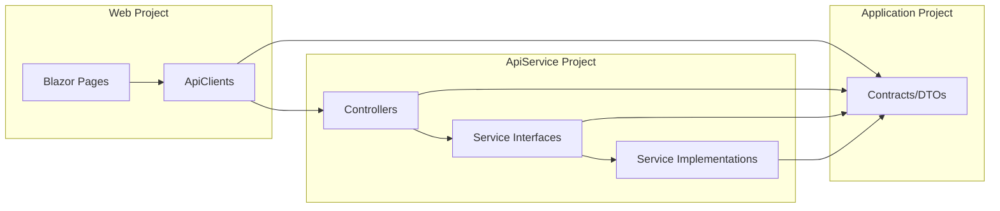

# Design Document: Parameter List DTO Refactoring

## Overview

This design describes the refactoring of 8 service and API client methods that currently accept long parameter lists into methods that accept a single DTO parameter. The refactoring follows the established `Application/Contracts/{Feature}/` DTO pattern already used throughout the solution (e.g., `LoginRequest`, `ChangePasswordRequest`, `AuditLogQueryParams`).

The refactoring is purely structural — no business logic changes. Each method preserves its existing behavior exactly; only the parameter passing mechanism changes from positional arguments to a single strongly-typed object.

**Key design decisions:**
- **Reuse over creation**: Where a suitable DTO already exists (`LoginRequest`, `ResetPasswordRequest`, `ConfirmEmailRequest`), reuse it rather than creating a duplicate.
- **New DTOs for new concepts**: Where no DTO exists (`TrySendEmailRequest`, `SendEmailRequest`, `RegisterRequest`, `UserQueryParams`), create one following established conventions.
- **Sealed classes**: All new DTOs are `sealed class` with XML documentation, matching the project's existing pattern.
- **No breaking HTTP contracts**: Controller endpoint signatures that bind from `[FromBody]` or `[FromQuery]` remain unchanged from the client's perspective.

## Architecture

The refactoring touches three layers but does not alter the overall architecture:



**Change scope per layer:**
1. **Application/Contracts/** — Add 4 new DTO classes (`TrySendEmailRequest`, `SendEmailRequest`, `RegisterRequest`, `UserQueryParams`)
2. **Application/Abstractions/** — Update 5 interface method signatures to accept DTOs
3. **Infrastructure/Services/** — Update implementations to extract properties from DTOs
4. **ApiService/Controllers/** — Update callers to pass DTOs instead of individual args
5. **Web/Services/ApiClients/** — Update `ApiAuthService` and `ApiUserService` method signatures

No changes to HTTP wire format, database schema, or routing.

## Components and Interfaces

### New DTOs (4 classes)

| DTO | Namespace | Purpose |
|-----|-----------|---------|
| `TrySendEmailRequest` | `Application.Contracts.Email` | Encapsulates the 5 params of `IEmailService.TrySendEmailAsync` |
| `SendEmailRequest` | `Application.Contracts.Email` | Encapsulates the 3 params of `IEmailService.SendEmailAsync` |
| `RegisterRequest` | `Application.Contracts.Auth` | Encapsulates the 4 params of `IRegisterService.RegisterUserAsync` |
| `UserQueryParams` | `Application.Contracts.Users` | Encapsulates the 3 params of `IUserService.SearchAsync` |

### Reused DTOs (3 existing classes)

| DTO | Namespace | Reused By |
|-----|-----------|-----------|
| `LoginRequest` | `Application.Contracts.Auth` | `ILoginService.ValidateAndGenerateTokenAsync`, `ILdapLoginService.ValidateAndGenerateTokenAsync` |
| `ResetPasswordRequest` | `Application.Contracts.Auth` | `ApiAuthService.ResetPasswordAsync` |
| `ConfirmEmailRequest` | `Application.Contracts.Auth` | `ApiAuthService.ConfirmEmailAsync` |

### Interface Changes

**IEmailService:**
```csharp
// Before
Task SendEmailAsync(EmailType emailType, string recipientEmail, Dictionary<string, string> variables);
Task TrySendEmailAsync(string userId, string? recipientEmail, NotificationCategory category, EmailType emailType, Dictionary<string, string> variables);

// After
Task SendEmailAsync(SendEmailRequest request);
Task TrySendEmailAsync(TrySendEmailRequest request);
```

**ILoginService:**
```csharp
// Before
Task<LoginResult> ValidateAndGenerateTokenAsync(string email, string password, bool rememberMe, string returnUrl);

// After
Task<LoginResult> ValidateAndGenerateTokenAsync(LoginRequest request);
```

**ILdapLoginService:**
```csharp
// Before
Task<LoginResult> ValidateAndGenerateTokenAsync(string identifier, string password, bool rememberMe, string returnUrl);

// After
Task<LoginResult> ValidateAndGenerateTokenAsync(LoginRequest request);
```

**IRegisterService:**
```csharp
// Before
Task<RegisterResult> RegisterUserAsync(string email, string password, string confirmEmailBaseUri, string? returnUrl);

// After
Task<RegisterResult> RegisterUserAsync(RegisterRequest request);
```

**IUserService:**
```csharp
// Before
Task<PagedResult<UserDto>> SearchAsync(int? page, int? pageSize, string? searchTerm);

// After
Task<PagedResult<UserDto>> SearchAsync(UserQueryParams queryParams);
```

### API Client Changes

**ApiAuthService (Web project):**
```csharp
// Before
Task<ApiResult> ResetPasswordAsync(string email, string code, string newPassword);
Task<ApiResult> ConfirmEmailAsync(string userId, string code);

// After
Task<ApiResult> ResetPasswordAsync(ResetPasswordRequest request);
Task<ApiResult> ConfirmEmailAsync(ConfirmEmailRequest request);
```

**ApiUserService (Web project):**
```csharp
// Before
Task<ApiResult<PagedResult<UserDto>>> GetUsersAsync(int page, int pageSize, string? searchTerm = null);

// After
Task<ApiResult<PagedResult<UserDto>>> GetUsersAsync(UserQueryParams queryParams);
```

## Data Models

### TrySendEmailRequest

```csharp
namespace AspireWebAppTemplate.Application.Contracts.Email;

/// <summary>
/// Request payload for attempting to send an email notification to a user,
/// respecting their per-category email preferences. Used by best-effort
/// email delivery that never throws on failure.
/// </summary>
public sealed class TrySendEmailRequest
{
    /// <summary>
    /// The target user's ID for preference lookup.
    /// </summary>
    public string UserId { get; set; } = "";

    /// <summary>
    /// The recipient's email address. Skipped if null or empty.
    /// </summary>
    public string? RecipientEmail { get; set; }

    /// <summary>
    /// The notification category used to check the user's EmailEnabled preference.
    /// </summary>
    public NotificationCategory Category { get; set; }

    /// <summary>
    /// The email type that determines which template is resolved from the database.
    /// </summary>
    public EmailType EmailType { get; set; }

    /// <summary>
    /// Dictionary of placeholder names to values for template rendering.
    /// </summary>
    public Dictionary<string, string> Variables { get; set; } = [];
}
```

### SendEmailRequest

```csharp
namespace AspireWebAppTemplate.Application.Contracts.Email;

/// <summary>
/// Request payload for sending an email of a specific type to a recipient.
/// The template is resolved from the database by EmailType and rendered
/// with the provided variables.
/// </summary>
public sealed class SendEmailRequest
{
    /// <summary>
    /// The email type that determines which template is resolved from the database.
    /// </summary>
    public EmailType EmailType { get; set; }

    /// <summary>
    /// The recipient's email address.
    /// </summary>
    public string RecipientEmail { get; set; } = "";

    /// <summary>
    /// Dictionary of placeholder names to values for template rendering.
    /// </summary>
    public Dictionary<string, string> Variables { get; set; } = [];
}
```

### RegisterRequest

```csharp
namespace AspireWebAppTemplate.Application.Contracts.Auth;

/// <summary>
/// Request payload for registering a new user account. Contains all parameters
/// needed for user creation, role assignment, and email confirmation setup.
/// </summary>
public sealed class RegisterRequest
{
    /// <summary>
    /// The user's email address (also used as the username).
    /// </summary>
    public string Email { get; set; } = "";

    /// <summary>
    /// The user's chosen password.
    /// </summary>
    public string Password { get; set; } = "";

    /// <summary>
    /// The absolute URI to the confirm-email page, used to construct
    /// the confirmation callback URL.
    /// </summary>
    public string ConfirmEmailBaseUri { get; set; } = "";

    /// <summary>
    /// Optional return URL passed through to the confirmation link.
    /// </summary>
    public string? ReturnUrl { get; set; }
}
```

### UserQueryParams

```csharp
namespace AspireWebAppTemplate.Application.Contracts.Users;

/// <summary>
/// Query parameters for paginated user search. Supports filtering by
/// a search term matched against username, display name, email,
/// first name, last name, and department fields.
/// </summary>
public sealed class UserQueryParams
{
    /// <summary>
    /// The zero-based page index to retrieve. Defaults to 0.
    /// </summary>
    public int Page { get; set; } = 0;

    /// <summary>
    /// The maximum number of users per page. Defaults to 10.
    /// </summary>
    public int PageSize { get; set; } = 10;

    /// <summary>
    /// Optional search term for case-insensitive partial matching against user fields.
    /// When null or empty, all users are returned (paginated).
    /// </summary>
    public string? SearchTerm { get; set; }
}
```

## Correctness Properties

*A property is a characteristic or behavior that should hold true across all valid executions of a system — essentially, a formal statement about what the system should do. Properties serve as the bridge between human-readable specifications and machine-verifiable correctness guarantees.*

### Property 1: DTO Serialization Round-Trip

*For any* valid instance of `TrySendEmailRequest`, `SendEmailRequest`, `RegisterRequest`, or `UserQueryParams`, serializing to JSON and deserializing back SHALL produce an object with all property values identical to the original.

**Validates: Requirements 1.1, 4.1, 5.1, 8.1**

### Property 2: TrySendEmailAsync Never Throws

*For any* `TrySendEmailRequest` (including requests that would trigger internal failures such as invalid user IDs, null recipient emails, or missing templates), calling `TrySendEmailAsync` SHALL complete without throwing an exception.

**Validates: Requirements 1.3**

### Property 3: LoginService Behavior Preservation

*For any* `LoginRequest` with arbitrary Email, Password, RememberMe, and ReturnUrl values, the refactored `ValidateAndGenerateTokenAsync(LoginRequest)` SHALL invoke the same credential validation, lockout tracking, and token generation logic as the original 4-parameter method would have when called with the individual property values.

**Validates: Requirements 2.2, 2.3**

### Property 4: LdapLoginService Behavior Preservation

*For any* `LoginRequest`, the refactored `ILdapLoginService.ValidateAndGenerateTokenAsync(LoginRequest)` SHALL use `request.Email` as the LDAP identifier and invoke the same LDAP bind, auto-provisioning, attribute syncing, and token generation logic as the original 4-parameter method.

**Validates: Requirements 3.2, 3.3**

### Property 5: RegisterService Behavior Preservation

*For any* valid `RegisterRequest` (non-empty Email, Password, and ConfirmEmailBaseUri), calling `RegisterUserAsync(RegisterRequest)` SHALL perform user creation, default role assignment, email confirmation token generation, and welcome email sending, returning the same `RegisterResult` as the original method would have with the equivalent individual parameters.

**Validates: Requirements 4.3**

### Property 6: RegisterService Rejects Invalid Input

*For any* `RegisterRequest` where Email is null or empty OR Password is null or empty, calling `RegisterUserAsync` SHALL return a failed `RegisterResult` without creating a user account in the database.

**Validates: Requirements 4.5**

### Property 7: UserService Search Behavior Preservation

*For any* `UserQueryParams` with arbitrary Page, PageSize, and SearchTerm values, calling `SearchAsync(UserQueryParams)` SHALL return the same paginated, filtered, and display-name-ordered results as the original 3-parameter method called with the equivalent individual values.

**Validates: Requirements 5.3**

### Property 8: ApiUserService Query String Generation

*For any* `UserQueryParams`, the `GetUsersAsync(UserQueryParams)` method SHALL generate an HTTP GET request URL containing `page`, `pageSize`, and (when non-null) `searchTerm` query parameters with values matching the DTO properties.

**Validates: Requirements 5.5**

### Property 9: API Client Error Handling Preservation

*For any* non-success HTTP response returned by the API when calling `ResetPasswordAsync` or `ConfirmEmailAsync`, the API client SHALL return an `ApiResult.Failure` whose error message equals the response body text.

**Validates: Requirements 6.3, 7.3**

### Property 10: SendEmailAsync Behavior Preservation

*For any* `SendEmailRequest`, the refactored `SendEmailAsync(SendEmailRequest)` SHALL resolve templates via `IEmailTemplateService.RenderAsync` using `request.EmailType`, send via SMTP to `request.RecipientEmail` with rendered content, and throw the same exceptions (`InvalidOperationException` on SMTP failure, `KeyNotFoundException` on missing template) as the original 3-parameter method.

**Validates: Requirements 8.3**

## Error Handling

This refactoring does not introduce new error handling logic. All existing error behavior is preserved:

| Method | Error Behavior (unchanged) |
|--------|---------------------------|
| `TrySendEmailAsync` | Swallows all exceptions, logs at Error level. Never propagates to caller. |
| `SendEmailAsync` | Throws `InvalidOperationException` on SMTP failure, `KeyNotFoundException` on missing template. |
| `ValidateAndGenerateTokenAsync` (Login) | Returns `LoginResult` with `Succeeded = false` and appropriate error message. Never throws. |
| `ValidateAndGenerateTokenAsync` (LDAP) | Returns `LoginResult` with `Succeeded = false`. Never throws. |
| `RegisterUserAsync` | Returns `RegisterResult` with `Succeeded = false` for validation failures. Throws `InvalidOperationException` for unexpected Identity errors. |
| `SearchAsync` | No error cases — returns empty paged result for no matches. |
| `ApiAuthService.ResetPasswordAsync` | Returns `ApiResult.Failure` with response body on non-success status. Never throws. |
| `ApiAuthService.ConfirmEmailAsync` | Returns `ApiResult.Failure` with response body on non-success status. Never throws. |

**Null handling preserved:**
- `TrySendEmailRequest.RecipientEmail = null` → email is skipped (no send attempted)
- `LoginRequest.ReturnUrl = null` → treated as default redirect path (`"/"`)
- `UserQueryParams.SearchTerm = null` → no filter applied, all users returned

## Testing Strategy

### Property-Based Tests (FsCheck.Xunit)

Property-based testing IS applicable to this feature because:
- The DTOs are pure data carriers with clear serialization behavior
- Service behavior preservation can be verified across arbitrary inputs
- Input validation (RegisterRequest) varies meaningfully with input

**Configuration:** Each property test runs with `[Property(MaxTest = 2)]` per project convention.

**Library:** FsCheck.Xunit 3.3.3 (already in use)

**Tests to implement:**

| Property | Test Description |
|----------|-----------------|
| 1 | Generate random DTO instances, JSON round-trip, assert equality |
| 2 | Generate random TrySendEmailRequest, mock dependencies to throw, assert no exception escapes |
| 3 | Generate random LoginRequest, mock UserManager/SignInManager, verify correct field extraction |
| 4 | Generate random LoginRequest, mock LDAP service, verify Email used as identifier |
| 5 | Generate random valid RegisterRequest, mock Identity, verify same operation sequence |
| 6 | Generate RegisterRequest with empty/null Email or Password, verify failed result |
| 7 | Generate random UserQueryParams, seed test data, verify filtering/pagination/ordering |
| 8 | Generate random UserQueryParams, verify URL query string contains correct parameters |
| 9 | Generate random error response strings, verify ApiResult.Failure contains them |
| 10 | Generate random SendEmailRequest, mock template service, verify same calls |

### Unit Tests (xUnit + Moq)

Unit tests cover specific examples and edge cases not suited for property-based testing:

- **Default values:** `new UserQueryParams()` has `Page=0`, `PageSize=10`, `SearchTerm=null`
- **Sealed class verification:** All new DTOs are sealed (reflection check)
- **Namespace verification:** DTOs are in correct namespaces
- **Controller integration:** `UsersController.GetUsers` binds `[FromQuery]` to `UserQueryParams`
- **Null ReturnUrl handling:** LoginService and LdapLoginService treat null ReturnUrl as `"/"`

### Integration Tests

- Solution compiles without errors after all refactoring is complete
- No remaining references to old method signatures (verified by compilation)
- Existing test suite passes without modification (after test code is updated)

