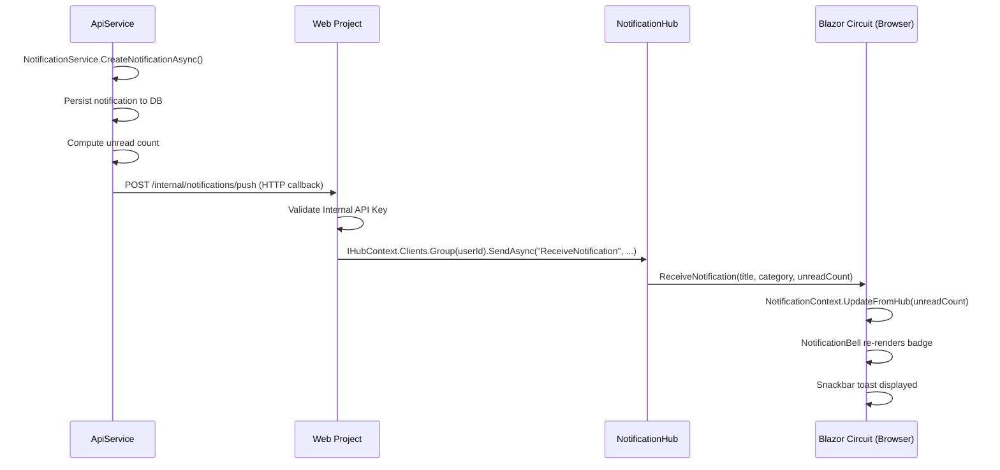
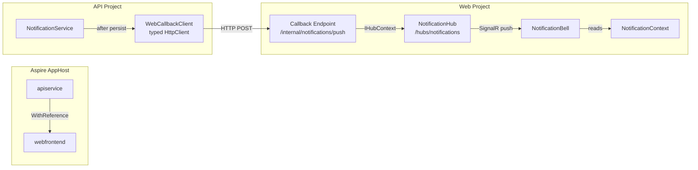

# Design Document: Real-Time Notifications

## Overview

This design adds a real-time push notification pipeline to the Blazor Server application using SignalR. The current implementation requires users to navigate or interact with the bell dropdown to see new notifications. This feature makes the notification badge update instantly when any service in the API project creates a notification.

The architecture introduces three new components:
1. **NotificationHub** — A SignalR hub in the Web project that delivers events to connected Blazor circuits
2. **Notification callback endpoint** — An internal HTTP POST endpoint on the Web project that the API project invokes after persisting a notification
3. **Real-time client integration** — NotificationBell subscribes to hub events for live badge updates and snackbar toasts

The design leverages the existing Blazor Server SignalR circuit (every connected user already has a persistent WebSocket), Aspire service discovery for API→Web communication, and the established per-circuit `NotificationContext` caching pattern.

### Design Decisions

| Decision | Rationale |
|----------|-----------|
| Hub in Web project (not API) | The Blazor Server circuits live in the Web project. The hub must be colocated with the circuits to push directly to connected clients via `IHubContext<T>`. |
| HTTP callback (not shared message bus) | The template targets simplicity. An HTTP callback avoids introducing RabbitMQ/Redis Pub/Sub infrastructure. Aspire service discovery makes the URL resolution trivial. |
| API key auth for callback | A shared secret via environment variable is the simplest internal auth that prevents external abuse. The API service is already not publicly accessible, but defense-in-depth is good practice. |
| Server-authoritative unread count | The hub transmits the authoritative unread count (computed server-side after insert). The client replaces its cached value, eliminating drift from concurrent tabs or stale state. |
| Exponential backoff reconnection | Prevents thundering herd on transient network issues while recovering automatically from short blips. |

## Architecture

### High-Level Data Flow



### Component Topology



### Aspire Orchestration Changes

The AppHost must add a reverse reference so the API service can discover the Web project:

```csharp
var webfrontend = builder.AddProject<Projects.AspireWebAppTemplate_Web>("webfrontend")
    .WithExternalHttpEndpoints()
    .WithHttpHealthCheck("/health")
    .WithReference(apiService)
    .WaitFor(apiService);

var apiService = builder.AddProject<Projects.AspireWebAppTemplate_ApiService>("apiservice")
    .WithHttpHealthCheck("/health")
    .WithReference(webfrontend);  // NEW: enables API→Web service discovery
```

A shared parameter for the internal API key:

```csharp
var internalApiKey = builder.AddParameter("InternalApiKey", secret: true);

// Pass to both projects as environment variable
apiService.WithEnvironment("INTERNAL_API_KEY", internalApiKey);
webfrontend.WithEnvironment("INTERNAL_API_KEY", internalApiKey);
```

## Components and Interfaces

### 1. NotificationHub (Web Project)

**Location:** `AspireWebAppTemplate.Web/Hubs/NotificationHub.cs`

```csharp
/// <summary>
/// SignalR hub for real-time notification delivery to connected Blazor Server circuits.
/// Connections are grouped by authenticated user ID for targeted message delivery.
/// </summary>
[Authorize]
public class NotificationHub : Hub
{
    public override async Task OnConnectedAsync()
    {
        var userId = Context.User?.FindFirstValue(ClaimTypes.NameIdentifier);
        if (string.IsNullOrEmpty(userId))
        {
            Context.Abort();
            return;
        }
        await Groups.AddToGroupAsync(Context.ConnectionId, userId);
        await base.OnConnectedAsync();
    }

    public override async Task OnDisconnectedAsync(Exception? exception)
    {
        var userId = Context.User?.FindFirstValue(ClaimTypes.NameIdentifier);
        if (!string.IsNullOrEmpty(userId))
        {
            await Groups.RemoveFromGroupAsync(Context.ConnectionId, userId);
        }
        await base.OnDisconnectedAsync(exception);
    }
}
```

**Key design points:**
- `[Authorize]` attribute rejects unauthenticated connections at the transport level
- Uses SignalR Groups keyed by `NameIdentifier` claim for user isolation
- No client-callable methods exposed (server-to-client only) — prevents client from subscribing to other users
- Authentication state comes from the existing Blazor Server cookie auth (shared circuit auth)

### 2. Notification Callback Endpoint (Web Project)

**Location:** `AspireWebAppTemplate.Web/Endpoints/NotificationCallbackEndpoint.cs`

Uses minimal API endpoint for internal-only route:

```csharp
/// <summary>
/// Internal HTTP endpoint that receives notification-created events from the API service
/// and forwards them to the target user's SignalR group via NotificationHub.
/// </summary>
public static class NotificationCallbackEndpoint
{
    public static void MapNotificationCallback(this IEndpointRouteBuilder endpoints)
    {
        endpoints.MapPost("/internal/notifications/push", HandlePush)
            .RequireAuthorization("InternalApiPolicy");
    }

    private static async Task<IResult> HandlePush(
        NotificationPushRequest request,
        IHubContext<NotificationHub> hubContext,
        IValidator<NotificationPushRequest> validator)
    {
        // Validate request
        var validation = validator.Validate(request);
        if (!validation.IsValid)
            return Results.BadRequest(validation.Errors);

        // Deliver to user's SignalR group (no-op if user has no active connections)
        await hubContext.Clients.Group(request.UserId)
            .SendAsync("ReceiveNotification", request.Title, request.Category, request.UnreadCount);

        return Results.Ok();
    }
}
```

### 3. Internal API Key Authentication (Web Project)

**Location:** `AspireWebAppTemplate.Web/Authentication/InternalApiKeyAuthenticationHandler.cs`

```csharp
/// <summary>
/// Authentication handler that validates the X-Internal-Api-Key header
/// for service-to-service callbacks from the API project.
/// </summary>
public class InternalApiKeyAuthenticationHandler : AuthenticationHandler<AuthenticationSchemeOptions>
{
    private readonly string _expectedApiKey;

    // Reads expected key from IConfiguration["INTERNAL_API_KEY"]
    // Validates X-Internal-Api-Key header matches
    // Returns AuthenticateResult.Fail() on mismatch
}
```

An authorization policy `"InternalApiPolicy"` requires the `InternalApiKey` authentication scheme.

### 4. WebCallbackClient (API Project)

**Location:** `AspireWebAppTemplate.ApiService/Services/WebCallbackClient.cs`

A typed HttpClient that calls the Web project's internal callback endpoint:

```csharp
/// <summary>
/// Typed HttpClient for calling the Web project's notification callback endpoint.
/// Registered with Aspire service discovery using the "webfrontend" base address.
/// </summary>
public class WebCallbackClient(HttpClient httpClient, ILogger<WebCallbackClient> logger)
{
    /// <summary>
    /// Notifies the Web project that a notification was created so it can push
    /// the event to the target user's connected circuits via SignalR.
    /// </summary>
    /// <remarks>
    /// Fire-and-forget semantics: failures are logged at Warning level but never
    /// propagate to the caller. The notification is already persisted in the database.
    /// </remarks>
    public async Task NotifyAsync(string userId, string title, string category, int unreadCount)
    {
        try
        {
            var response = await httpClient.PostAsJsonAsync(
                "/internal/notifications/push",
                new { userId, title, category, unreadCount });

            if (!response.IsSuccessStatusCode)
            {
                logger.LogWarning(
                    "Notification callback to Web failed with status {Status} for user '{UserId}'.",
                    response.StatusCode, userId);
            }
        }
        catch (TaskCanceledException)
        {
            logger.LogWarning("Notification callback timed out for user '{UserId}'.", userId);
        }
        catch (HttpRequestException ex)
        {
            logger.LogWarning(ex, "Notification callback network error for user '{UserId}'.", userId);
        }
    }
}
```

**Registration:**

```csharp
builder.Services.AddHttpClient<WebCallbackClient>(client =>
{
    client.BaseAddress = new Uri("https+http://webfrontend");
    client.Timeout = TimeSpan.FromSeconds(5);
})
.AddHttpMessageHandler<InternalApiKeyDelegatingHandler>();
```

### 5. InternalApiKeyDelegatingHandler (API Project)

**Location:** `AspireWebAppTemplate.ApiService/Services/Handlers/InternalApiKeyDelegatingHandler.cs`

```csharp
/// <summary>
/// Delegating handler that attaches the X-Internal-Api-Key header to all outbound
/// requests from the API service to the Web project's internal endpoints.
/// </summary>
public class InternalApiKeyDelegatingHandler(IConfiguration configuration) : DelegatingHandler
{
    protected override Task<HttpResponseMessage> SendAsync(
        HttpRequestMessage request, CancellationToken cancellationToken)
    {
        var apiKey = configuration["INTERNAL_API_KEY"];
        if (!string.IsNullOrEmpty(apiKey))
        {
            request.Headers.TryAddWithoutValidation("X-Internal-Api-Key", apiKey);
        }
        return base.SendAsync(request, cancellationToken);
    }
}
```

### 6. Enhanced NotificationContext (Web Project)

The existing `INotificationContext` interface gains a new method for hub-driven updates:

```csharp
/// <summary>
/// Replaces the cached unread count with the server-authoritative value received
/// from the NotificationHub. Raises OnChange to trigger UI re-renders.
/// </summary>
/// <param name="unreadCount">The authoritative unread count from the server.</param>
void UpdateFromHub(int unreadCount);
```

Implementation in `NotificationContext`:

```csharp
public void UpdateFromHub(int unreadCount)
{
    _unreadCount = Math.Max(0, unreadCount);
    OnChange?.Invoke();
}
```

### 7. Enhanced NotificationBell (Web Project)

The component gains SignalR hub connection management:

```csharp
// In OnInitializedAsync:
_hubConnection = new HubConnectionBuilder()
    .WithUrl(NavigationManager.ToAbsoluteUri("/hubs/notifications"), options =>
    {
        // Cookie auth flows automatically for same-origin requests
    })
    .WithAutomaticReconnect(new ExponentialBackoffRetryPolicy())
    .Build();

_hubConnection.On<string, string, int>("ReceiveNotification", HandleReceiveNotification);
_hubConnection.Reconnected += HandleReconnected;
_hubConnection.Closed += HandleClosed;

await _hubConnection.StartAsync();
```

### 8. ExponentialBackoffRetryPolicy

**Location:** `AspireWebAppTemplate.Web/Services/ExponentialBackoffRetryPolicy.cs`

```csharp
/// <summary>
/// SignalR reconnection policy using exponential backoff:
/// 1s, 2s, 4s, 8s, 16s (capped at 30s), up to 5 attempts.
/// </summary>
public class ExponentialBackoffRetryPolicy : IRetryPolicy
{
    private const int MaxAttempts = 5;
    private static readonly TimeSpan MaxDelay = TimeSpan.FromSeconds(30);

    public TimeSpan? NextRetryDelay(RetryContext retryContext)
    {
        if (retryContext.PreviousRetryCount >= MaxAttempts)
            return null; // Stop reconnecting

        var delay = TimeSpan.FromSeconds(Math.Pow(2, retryContext.PreviousRetryCount));
        return delay > MaxDelay ? MaxDelay : delay;
    }
}
```

## Data Models

### NotificationPushRequest (Core Project)

**Location:** `AspireWebAppTemplate.Core/Contracts/Notifications/NotificationPushRequest.cs`

```csharp
/// <summary>
/// Request DTO for the internal notification callback from API service to Web project.
/// Contains the minimal data needed to deliver a real-time notification event via SignalR.
/// </summary>
public sealed class NotificationPushRequest
{
    /// <summary>
    /// The unique identifier of the target user (non-empty string).
    /// </summary>
    public string UserId { get; set; } = "";

    /// <summary>
    /// The notification title (non-empty, max 200 characters).
    /// </summary>
    public string Title { get; set; } = "";

    /// <summary>
    /// The notification category as a NotificationCategory string value.
    /// </summary>
    public string Category { get; set; } = "";

    /// <summary>
    /// The user's current total unread notification count (>= 0).
    /// </summary>
    public int UnreadCount { get; set; }
}
```

### Existing Models (No Changes)

The following existing models are used as-is:
- `Notification` entity — already contains all fields needed
- `NotificationPreference` entity — `InAppEnabled` controls toast suppression
- `NotificationDto` — used for prepending to the dropdown list
- `NotificationCategory` enum — transmitted as string in hub events
- `CreateNotificationRequest` — existing creation DTO

### SignalR Event Payload

The `ReceiveNotification` hub method transmits three parameters (not a complex object) for simplicity and minimal payload size:

| Parameter | Type | Description |
|-----------|------|-------------|
| `title` | `string` | Notification title (for snackbar display) |
| `category` | `string` | NotificationCategory string value (for icon/toast styling) |
| `unreadCount` | `int` | Server-authoritative updated unread count |


## Correctness Properties

*A property is a characteristic or behavior that should hold true across all valid executions of a system — essentially, a formal statement about what the system should do. Properties serve as the bridge between human-readable specifications and machine-verifiable correctness guarantees.*

### Property 1: Valid callback requests are accepted

*For any* `NotificationPushRequest` with a non-empty `UserId`, a non-empty `Title` of at most 200 characters, a valid `NotificationCategory` string value, and an `UnreadCount` >= 0, the callback endpoint SHALL return 200 OK.

**Validates: Requirements 2.2, 2.3**

### Property 2: Invalid callback requests are rejected

*For any* `NotificationPushRequest` where `UserId` is empty/null, OR `Title` is empty/null or exceeds 200 characters, OR `Category` is not a valid `NotificationCategory` string, OR `UnreadCount` is negative, the callback endpoint SHALL return 400 Bad Request.

**Validates: Requirements 2.8**

### Property 3: Callback failure does not disrupt notification creation

*For any* notification creation request and any callback failure mode (HTTP 500, HTTP 503, timeout, network exception), the `NotificationService.CreateNotificationAsync` method SHALL still successfully persist the notification to the database and complete without throwing.

**Validates: Requirements 2.7**

### Property 4: UpdateFromHub replaces cached unread count

*For any* initial unread count N (loaded via InitializeAsync) and any incoming hub unread count M (>= 0), calling `UpdateFromHub(M)` SHALL set `UnreadCount` to M regardless of N, and SHALL raise the `OnChange` event.

**Validates: Requirements 3.2**

### Property 5: Toast suppression respects InAppEnabled preference

*For any* notification with category C and any user preference configuration, the snackbar toast SHALL be displayed if and only if the user's `InAppEnabled` preference for category C is true (defaulting to true when no explicit preference exists).

**Validates: Requirements 4.5**

### Property 6: Title truncation preserves content within limit

*For any* notification title string, the displayed snackbar title SHALL be the original string when its length is <= 100 characters, OR the first 100 characters followed by "…" when the original exceeds 100 characters.

**Validates: Requirements 4.7**

### Property 7: Exponential backoff retry delays

*For any* retry attempt number N in [0, 4], the `ExponentialBackoffRetryPolicy.NextRetryDelay` SHALL return a delay of min(2^N seconds, 30 seconds). *For any* retry attempt number N >= 5, it SHALL return null (stop reconnecting).

**Validates: Requirements 6.1**

### Property 8: API key authentication validates correctly

*For any* configured expected API key K and any request header value V, the `InternalApiKeyAuthenticationHandler` SHALL authenticate successfully if and only if V equals K. Requests without the header or with a non-matching value SHALL fail authentication.

**Validates: Requirements 5.4, 5.5**

## Error Handling

### Callback Pipeline Failures

| Failure Point | Behavior | Recovery |
|---------------|----------|----------|
| API→Web HTTP timeout (>5s) | `TaskCanceledException` caught by `WebCallbackClient` | Log at Warning level, notification already persisted |
| API→Web network error | `HttpRequestException` caught by `WebCallbackClient` | Log at Warning level, user sees notification on next page load |
| API→Web returns 4xx/5xx | Non-success status code logged by `WebCallbackClient` | Log at Warning level, no retry |
| Web callback → Hub delivery fails | Internal server error | Return 500 to caller (API logs warning) |

### Hub Connection Failures

| Failure Point | Behavior | Recovery |
|---------------|----------|----------|
| Initial hub connection fails | `StartAsync` throws | Catch exception, log warning, fall back to navigation-based refresh |
| Connection drops mid-session | `Closed` event fires | Automatic reconnect with exponential backoff (1s, 2s, 4s, 8s, 16s) |
| All reconnection attempts fail | `Closed` event with null exception | Abandon hub, fall back to navigation-based refresh |
| Reconnection succeeds | `Reconnected` event fires | Call `NotificationContext.RefreshAsync()` to reconcile missed notifications |

### Component Error Isolation

- Hub connection errors never propagate to the Blazor error boundary
- All hub operations wrapped in try/catch within the component
- `IDisposable.Dispose()` handles cleanup even if hub is in a faulted state
- Snackbar display errors are swallowed (non-critical UI feedback)

### Authentication Failures

| Scenario | Response |
|----------|----------|
| No `X-Internal-Api-Key` header on callback | 401 Unauthorized |
| Invalid API key value | 401 Unauthorized |
| Unauthenticated SignalR connection | Connection rejected (hub never adds to group) |
| Expired session on active circuit | Hub connection terminated, circuit falls back to navigation refresh |

## Testing Strategy

### Property-Based Tests (FsCheck.Xunit)

Property-based tests validate the 8 correctness properties defined above. Each test runs a minimum of 100 iterations with randomly generated inputs.

**Library:** FsCheck.Xunit 3.3.3 (already in project)
**Configuration:** `[Property(MaxTest = 100)]` per property test
**Tag format:** `// Feature: realtime-notifications, Property {N}: {title}`

| Property | Test Class | What Varies |
|----------|-----------|-------------|
| 1: Valid callback accepted | `CallbackValidationPropertyTests` | UserId strings, title strings (1-200 chars), category enum values, non-negative counts |
| 2: Invalid callback rejected | `CallbackValidationPropertyTests` | Empty/null userIds, oversized titles, invalid category strings, negative counts |
| 3: Callback failure resilience | `NotificationCreationResilienceTests` | Failure modes (timeout, 500, 503, network exception), valid notification requests |
| 4: UpdateFromHub replaces count | `NotificationContextHubUpdateTests` | Initial counts (0-1000), incoming hub counts (0-1000) |
| 5: Toast suppression | `ToastSuppressionPropertyTests` | Preference configurations per category, incoming notification categories |
| 6: Title truncation | `TitleTruncationPropertyTests` | Random strings of length 0-500 |
| 7: Exponential backoff | `RetryPolicyPropertyTests` | Retry attempt numbers (0-10) |
| 8: API key auth | `InternalApiKeyAuthPropertyTests` | Random API key strings, matching/non-matching header values |

### Unit Tests (xUnit + Moq)

| Area | Test Cases |
|------|-----------|
| NotificationHub.OnConnectedAsync | Rejects unauthenticated, adds to correct group |
| NotificationHub.OnDisconnectedAsync | Removes from group |
| NotificationCallbackEndpoint | Returns 200 for valid requests, 400 for invalid, 401 without auth |
| WebCallbackClient | Calls correct URL, handles timeout, handles network errors |
| InternalApiKeyDelegatingHandler | Attaches header, handles missing config |
| NotificationBell lifecycle | Connects hub on init, disposes on teardown |
| Snackbar display | Shows toast on event, navigates on click |
| ExponentialBackoffRetryPolicy | Specific delay values at each attempt |

### Integration Tests (Aspire.Hosting.Testing)

| Scenario | Validates |
|----------|-----------|
| End-to-end notification delivery | Create notification → callback → hub → client receives event |
| Multi-tab delivery | Two connections for same user both receive event |
| User isolation | Notification for user A not received by user B |
| Auth rejection | Callback without API key returns 401 |
| Reconnection reconciliation | Disconnect → reconnect → count refreshed |

### Test File Locations

```
AspireWebAppTemplate.Tests/
├── Notifications/
│   ├── NotificationContextPropertyTests.cs          (existing — augment with Property 4)
│   ├── CallbackValidationPropertyTests.cs           (new — Properties 1, 2)
│   ├── NotificationCreationResilienceTests.cs       (new — Property 3)
│   ├── ToastSuppressionPropertyTests.cs             (new — Property 5)
│   ├── TitleTruncationPropertyTests.cs              (new — Property 6)
│   ├── RetryPolicyPropertyTests.cs                  (new — Property 7)
│   ├── InternalApiKeyAuthPropertyTests.cs           (new — Property 8)
│   └── NotificationHubIntegrationTests.cs           (new — integration tests)
```
