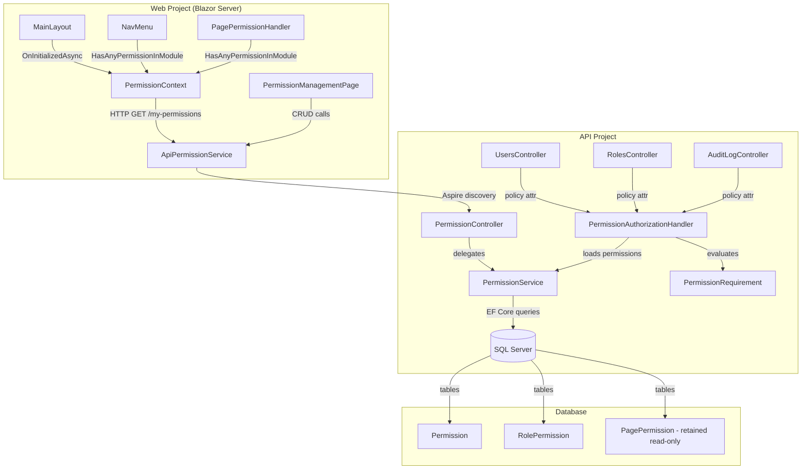

# Design Document: Resource-Based Authorization

## Overview

This feature evolves the authorization system from its current transitional state (`[Authorize]` on admin controllers with page-permission-based access control) to a resource-based permission model. Previously, controllers used hardcoded `[Authorize(Roles = "Admin")]`, which conflicted with the page permission whitelist. That was removed as a transitional step — all admin controllers now use `[Authorize]` (authentication-only). This design completes the evolution by adding granular **permission-based** API authorization.

**Key design decisions:**

1. **Permissions as first-class entities** — stored in the database with a structured `Module.Action` key format, enabling fine-grained access control.
2. **Roles become permission containers** — a role grants a set of permissions; users inherit the union of permissions from all their roles.
3. **Admin super-role bypass** — the Admin role implicitly holds all permissions via a role-name check at evaluation time, requiring no database records.
4. **Policy-based authorization** — ASP.NET Core's `IAuthorizationHandler` evaluates permission requirements, replacing the current `[Authorize]` with `[Authorize(Policy = "Users.Read")]`.
5. **Page visibility derived from module membership** — if a role has any permission in a module, the corresponding admin page is visible.
6. **Per-request caching (API)** — permission sets resolved once per HTTP request via scoped lifetime.
7. **Per-circuit caching (Web)** — permission state loaded once per Blazor circuit for synchronous UI checks.

## Architecture



**Request flow (API authorization):**
1. HTTP request arrives with user identity (role claims forwarded by `UserIdentityDelegatingHandler`)
2. ASP.NET Core policy evaluation triggers `PermissionAuthorizationHandler`
3. Handler checks if user holds Admin role → immediate success
4. Handler extracts role IDs from claims, calls `PermissionService.GetPermissionsForRolesAsync(roleIds)`
5. Service queries `RolePermission` + `Permission` tables in a single JOIN, returns distinct permission keys
6. Handler caches result in scoped lifetime, checks if required key is in the set
7. Success → 200, Failure → 403

**Request flow (page navigation):**
1. Blazor circuit initializes → `PermissionContext.InitializeAsync()` calls `GET /api/permissions/my-permissions`
2. API resolves user's roles from claims, loads permission keys, returns them
3. `PermissionContext` caches the set in a `HashSet<string>` for O(1) lookups
4. `NavMenu` calls `HasAnyPermissionInModule("Users")` to determine sidebar visibility
5. `PagePermissionHandler` calls `HasAnyPermissionInModule(module)` during Blazor route authorization

## Components and Interfaces

### Data Layer (Infrastructure)

| Component | Location | Responsibility |
|-----------|----------|----------------|
| `Permission` (entity) | `Infrastructure/Data/Entities/Permission.cs` | EF Core entity for permission definitions |
| `RolePermission` (entity) | `Infrastructure/Data/Entities/RolePermission.cs` | EF Core join entity linking roles to permissions |
| `ApplicationDbContext` (update) | `Infrastructure/Data/ApplicationDbContext.cs` | Add `DbSet<Permission>`, `DbSet<RolePermission>`, configure entity |
| `SeedData` (update) | `Infrastructure/Data/SeedData/SeedData.cs` | Seed 15 permissions + Admin role assignments + migrate PagePermission records |

### Service Layer (Infrastructure)

| Component | Location | Responsibility |
|-----------|----------|----------------|
| `IPermissionService` | `Application/Abstractions/IPermissionService.cs` | Interface for permission CRUD, role-permission assignment, permission evaluation |
| `PermissionService` | `Infrastructure/Services/PermissionService.cs` | Implementation: queries, validation, audit logging |

### Authorization Infrastructure (ApiService)

| Component | Location | Responsibility |
|-----------|----------|----------------|
| `PermissionRequirement` | `Authorization/PermissionRequirement.cs` | `IAuthorizationRequirement` carrying the required permission key |
| `PermissionAuthorizationHandler` | `Authorization/PermissionAuthorizationHandler.cs` | Evaluates permission requirement against user's effective permissions |
| `PermissionPolicyProvider` | `Authorization/PermissionPolicyProvider.cs` | Dynamic policy provider that creates policies for any permission key string |

### Controller Layer (ApiService)

| Component | Location | Responsibility |
|-----------|----------|----------------|
| `PermissionController` | `Controllers/PermissionController.cs` | REST endpoints for permission management (evolves from `PagePermissionsController`) |
| `UsersController` (update) | `Controllers/UsersController.cs` | Replace `[Authorize]` with permission policies |
| `RolesController` (update) | `Controllers/RolesController.cs` | Replace `[Authorize]` with permission policies |
| `AuditLogController` (update) | `Controllers/AuditLogController.cs` | Replace `[Authorize]` with permission policies |

### Web Project Services

| Component | Location | Responsibility |
|-----------|----------|----------------|
| `ApiPermissionService` | `Services/ApiClients/ApiPermissionService.cs` | Typed HttpClient for permission API communication |
| `PermissionContext` | `Services/Contexts/PermissionContext.cs` | Per-circuit permission cache (replaces `PagePermissionContext`) |
| `IPermissionContext` | `Abstractions/IPermissionContext.cs` | Interface for permission context |

### Web Project Authorization

| Component | Location | Responsibility |
|-----------|----------|----------------|
| `PagePermissionHandler` (update) | `Authorization/PagePermissionHandler.cs` | Use `IPermissionContext.HasAnyPermissionInModule()` instead of path-based whitelist |

### Web Project Pages

| Component | Location | Responsibility |
|-----------|----------|----------------|
| `PermissionManagement.razor` | `Components/Pages/Admin/PermissionManagement.razor` | Matrix UI for permission-role assignments |

### Application Project DTOs

| Component | Location | Responsibility |
|-----------|----------|----------------|
| `PermissionDto` | `Application/Contracts/Permissions/PermissionDto.cs` | Permission definition DTO |
| `PermissionGroupDto` | `Application/Contracts/Permissions/PermissionGroupDto.cs` | Permissions grouped by module |
| `UpdateRolePermissionsRequest` | `Application/Contracts/Permissions/UpdateRolePermissionsRequest.cs` | PUT request body with permission keys |
| `PageModuleMappingDto` | `Application/Contracts/Permissions/PageModuleMappingDto.cs` | Page path → module mapping entry |

### Key Interfaces

```csharp
public interface IPermissionService
{
    // Query
    Task<List<PermissionGroupDto>> GetAllPermissionsGroupedAsync();
    Task<List<string>> GetRolePermissionKeysAsync(string roleId);
    Task<List<string>> GetPermissionsForRolesAsync(IEnumerable<string> roleIds);
    Task<List<string>> GetMyPermissionsAsync(string userId);
    Task<List<PageModuleMappingDto>> GetPageModuleMappingsAsync();

    // Write
    Task UpdateRolePermissionsAsync(string roleId, List<string> permissionKeys);
}

public interface IPermissionContext
{
    bool IsLoaded { get; }
    bool IsAdmin { get; }
    bool HasPermission(string permissionKey);
    bool HasAnyPermissionInModule(string module);
    Task InitializeAsync();
}
```

## Data Models

### Permission Entity

```csharp
public class Permission
{
    public int Id { get; set; }
    public string Key { get; set; } = string.Empty;       // "Users.Read" — unique
    public string DisplayName { get; set; } = string.Empty; // "View Users"
    public string Module { get; set; } = string.Empty;      // "Users"
    public string? Description { get; set; }                 // Optional description
}
```

**EF Core configuration:**
- Table: `Permissions`
- `Key`: max 100, unique index, required
- `DisplayName`: max 200, required
- `Module`: max 50, required
- `Description`: max 500, nullable

### RolePermission Entity

```csharp
public class RolePermission
{
    public string RoleId { get; set; } = string.Empty;
    public int PermissionId { get; set; }
    public ApplicationRole Role { get; set; } = null!;
    public Permission Permission { get; set; } = null!;
}
```

**EF Core configuration:**
- Table: `RolePermissions`
- Composite primary key: `(RoleId, PermissionId)`
- Unique index on `(RoleId, PermissionId)` (via composite PK)
- `RoleId`: max 450, FK to `ApplicationRoles` with cascade delete
- `PermissionId`: FK to `Permissions` with cascade delete

### Seed Data (15 Permissions)

| Key | DisplayName | Module |
|-----|-------------|--------|
| Users.Read | View Users | Users |
| Users.Create | Create Users | Users |
| Users.Update | Update Users | Users |
| Users.Delete | Delete Users | Users |
| Users.Activate | Activate/Deactivate Users | Users |
| Roles.Read | View Roles | Roles |
| Roles.Manage | Manage Roles | Roles |
| AuditLog.Read | View Audit Log | AuditLog |
| AuditLog.Export | Export Audit Log | AuditLog |
| Permissions.Manage | Manage Permissions | Permissions |
| Announcements.Read | View Announcements | Announcements |
| Announcements.Create | Create Announcements | Announcements |
| Announcements.Update | Update Announcements | Announcements |
| Announcements.Delete | Delete Announcements | Announcements |
| Announcements.Publish | Publish Announcements | Announcements |

### Page-to-Module Mapping (Static Configuration)

| Page Path | Module |
|-----------|--------|
| /admin/user-management | Users |
| /admin/role-management | Roles |
| /admin/audit-log | AuditLog |
| /admin/permission-management | Permissions |
| /admin/announcements | Announcements |

### DTO Structures

```csharp
public sealed class PermissionDto
{
    public int Id { get; set; }
    public string Key { get; set; } = "";
    public string DisplayName { get; set; } = "";
    public string? Description { get; set; }
}

public sealed class PermissionGroupDto
{
    public string Module { get; set; } = "";
    public List<PermissionDto> Permissions { get; set; } = [];
}

public sealed class UpdateRolePermissionsRequest
{
    public List<string> PermissionKeys { get; set; } = [];
}

public sealed class PageModuleMappingDto
{
    public string PagePath { get; set; } = "";
    public string Module { get; set; } = "";
}
```

### Database Migration Strategy

The migration adds:
1. `Permissions` table with the schema above
2. `RolePermissions` table with composite PK and foreign keys
3. Retains the existing `PagePermissions` table unchanged (coexistence)

The seed process:
1. Inserts the 15 permission definitions (idempotent by key)
2. Assigns all permissions to the Admin role
3. Maps existing `PagePermission` records to equivalent permission grants for non-Admin roles


## Correctness Properties

*A property is a characteristic or behavior that should hold true across all valid executions of a system—essentially, a formal statement about what the system should do. Properties serve as the bridge between human-readable specifications and machine-verifiable correctness guarantees.*

### Property 1: Admin role bypasses all permission checks

*For any* permission key string (including keys that don't exist in the database), if the user holds the Admin role, then `HasPermission(key)` SHALL return true, `HasAnyPermissionInModule(module)` SHALL return true, and the `PermissionAuthorizationHandler` SHALL satisfy the requirement — without querying role-permission assignments.

**Validates: Requirements 3.1, 3.2, 3.5, 4.2, 6.4, 13.3**

### Property 2: Permission key format validation

*For any* string, the permission key validator SHALL accept the string if and only if it matches the pattern `^[A-Z][a-zA-Z0-9]{0,49}\.[A-Z][a-zA-Z0-9]{0,49}$` (exactly one dot separating two PascalCase segments, each 1–50 characters). All other strings SHALL be rejected with a validation error.

**Validates: Requirements 1.5, 1.6**

### Property 3: Effective permissions equal the union of role grants

*For any* set of role IDs assigned to a user, the effective permission set returned by `PermissionService.GetPermissionsForRolesAsync(roleIds)` SHALL equal the distinct union of all Permission_Key values from Role_Permission_Entity records matching those role IDs. If the resulting set does not contain the required key, the authorization handler SHALL deny access.

**Validates: Requirements 4.1, 4.7, 5.1**

### Property 4: Module membership determines page visibility

*For any* admin page path in the page-to-module mapping and any permission set, `HasAnyPermissionInModule(module)` SHALL return true if and only if the permission set contains at least one key with a prefix matching that module (i.e., starting with `module + "."`), OR the user is Admin.

**Validates: Requirements 6.2, 6.6, 7.3**

### Property 5: HasPermission correctness

*For any* permission key and any cached permission set (loaded state), `HasPermission(key)` SHALL return true if the cached set contains the key (case-insensitive) OR if the user is Admin, and SHALL return false otherwise. While IsLoaded is false, `HasPermission` SHALL return false for non-Admin users regardless of key.

**Validates: Requirements 7.2, 7.6**

### Property 6: Seed process is idempotent and non-destructive

*For any* initial database state containing existing non-Admin role-permission assignments, running the seed process N times (N ≥ 1) SHALL result in: exactly 15 Permission_Entity records (no duplicates), the Admin role assigned to all 15 permissions, and all pre-existing non-Admin role-permission assignments unchanged.

**Validates: Requirements 2.2, 2.4, 2.5**

### Property 7: Unmapped pages bypass module permission checks

*For any* page path that is NOT present in the admin page-to-module mapping (e.g., "/announcements", "/account/settings", "/counter"), the `PagePermissionHandler` SHALL grant access without requiring module permissions — only authentication is needed.

**Validates: Requirements 6.8**

### Property 8: Full replacement strategy for role permissions

*For any* valid set of Permission_Key strings (all matching existing Permission_Entity keys) and any non-Admin role, after a successful PUT to update that role's permissions with the set, a subsequent GET of that role's permissions SHALL return exactly that set — no more, no less. An empty set removes all permissions.

**Validates: Requirements 8.4**

### Property 9: PagePermission migration mapping correctness

*For any* existing PagePermission record with a page path that has a defined correspondence in the migration mapping, the seed process SHALL create a Role_Permission_Entity granting the mapped permission to that role. The mapping is: "/admin/user-management" → "Users.Read", "/admin/role-management" → "Roles.Read", "/admin/audit-log" → "AuditLog.Read", "/admin/page-permissions" → "Permissions.Manage".

**Validates: Requirements 10.2**

### Property 10: Audit entry accurately reflects permission changes

*For any* successful permission update for a role, the resulting audit log entry SHALL contain OldValues with the JSON-serialized previous list of Permission_Keys and NewValues with the JSON-serialized new list of Permission_Keys, with EntityId set to the role ID and EntityName set to the role's DisplayName.

**Validates: Requirements 11.1, 11.2**

## Error Handling

### API Service Layer (`PermissionService`)

| Scenario | Behavior |
|----------|----------|
| Role not found | Throw `KeyNotFoundException` → Controller returns 404 |
| Admin role modification attempt | Throw `InvalidOperationException` → Controller returns 400 |
| Invalid permission key format | Throw `ArgumentException` → Controller returns 400 |
| Permission keys not found in DB | Throw `ArgumentException` with invalid keys → Controller returns 400 |
| Duplicate role-permission assignment | Throw `InvalidOperationException` → Controller returns 400 |
| Database query failure during auth | Log Error, deny access (fail closed) |
| Audit log creation failure | Log Error, continue (audit failure never blocks primary operation) |

### Authorization Handler (`PermissionAuthorizationHandler`)

| Scenario | Behavior |
|----------|----------|
| User not authenticated | Fail requirement → 401 (handled by ASP.NET Core auth middleware) |
| User has no role claims | Fail requirement → 403 |
| Database error loading permissions | Fail requirement (fail closed), log Error |
| Admin role detected | Succeed immediately, skip DB query |

### Web Project (`PermissionContext`)

| Scenario | Behavior |
|----------|----------|
| API call fails during initialization | Log Warning, set empty cache, set IsLoaded = true |
| User not authenticated | Skip API call, empty cache, IsLoaded = true |
| IsLoaded = false (pre-init) | HasPermission returns false for non-Admin, true for Admin |

### Web Project (`ApiPermissionService`)

| Scenario | Behavior |
|----------|----------|
| HTTP error from API | Return `ApiResult` with Succeeded = false and Error message |
| Network timeout | Catch exception, return `ApiResult` with error |
| Deserialization failure | Catch exception, return `ApiResult` with error |

### UI (`PermissionManagementPage`)

| Scenario | Behavior |
|----------|----------|
| Save operation fails | Revert checkbox state, show error Snackbar |
| Initial data load fails | Show error message, do not render matrix |
| Concurrent modification attempt | Disable all role checkboxes during save-in-progress |

## Testing Strategy

### Property-Based Tests (FsCheck.Xunit)

Property-based testing IS applicable to this feature. The core authorization logic involves pure functions with clear input/output behavior:
- Permission key validation (string → bool)
- Permission set resolution (role IDs → permission keys)
- Module membership evaluation (permission set × module → bool)
- Admin bypass logic (roles × key → bool)

**Library:** FsCheck.Xunit 3.3.3 (already in project)
**Configuration:** `[Property(MaxTest = 100)]` minimum per property test
**Tag format:** `// Feature: resource-based-authorization, Property {N}: {title}`

| Property | Test Focus | Key Generator |
|----------|-----------|---------------|
| 1: Admin bypass | PermissionAuthorizationHandler + PermissionContext | Random permission key strings |
| 2: Key validation | Permission key format validator | Random strings (valid + invalid) |
| 3: Union resolution | PermissionService.GetPermissionsForRolesAsync | Random role-permission mappings |
| 4: Module membership | HasAnyPermissionInModule | Random permission sets + module names |
| 5: HasPermission | PermissionContext.HasPermission | Random keys + permission sets |
| 6: Seed idempotence | SeedData permission seeding | Multiple seed executions |
| 7: Unmapped pages | PagePermissionHandler | Random non-admin page paths |
| 8: Full replacement | PermissionService.UpdateRolePermissionsAsync | Random valid permission subsets |
| 9: Migration mapping | Seed migration logic | Random PagePermission records |
| 10: Audit accuracy | PermissionService audit logging | Random before/after permission sets |

### Unit Tests (xUnit + Moq)

- **PermissionAuthorizationHandler**: Verify 403 for missing permission, 401 for unauthenticated, Admin bypass
- **PermissionService**: Duplicate assignment rejection, Admin role immutability, invalid key rejection
- **PermissionContext**: IsLoaded lifecycle, API failure graceful degradation, unauthenticated skip
- **PermissionController**: Endpoint response codes (200, 400, 403, 404) for various scenarios
- **Seed logic**: All 15 permissions created, Admin assigned, missing Admin role handling

### Integration Tests (SQLite in-memory)

- EF Core entity configuration validation (unique constraints, cascade deletes, field lengths)
- Full permission resolution query (JOIN behavior)
- Seed process end-to-end with real DbContext
- Migration from PagePermission records to Permission grants

### Test File Location

```
AspireWebAppTemplate.Tests/
├── ResourceBasedAuthorization/
│   ├── PermissionKeyValidationTests.cs       ← Property 2
│   ├── AdminBypassTests.cs                   ← Property 1
│   ├── PermissionUnionTests.cs               ← Property 3
│   ├── ModuleMembershipTests.cs              ← Property 4
│   ├── HasPermissionTests.cs                 ← Property 5
│   ├── SeedIdempotenceTests.cs               ← Property 6
│   ├── UnmappedPageTests.cs                  ← Property 7
│   ├── FullReplacementTests.cs               ← Property 8
│   ├── MigrationMappingTests.cs              ← Property 9
│   ├── AuditAccuracyTests.cs                 ← Property 10
│   ├── PermissionServiceUnitTests.cs         ← Unit tests
│   ├── PermissionHandlerUnitTests.cs         ← Unit tests
│   └── PermissionContextUnitTests.cs         ← Unit tests
```
