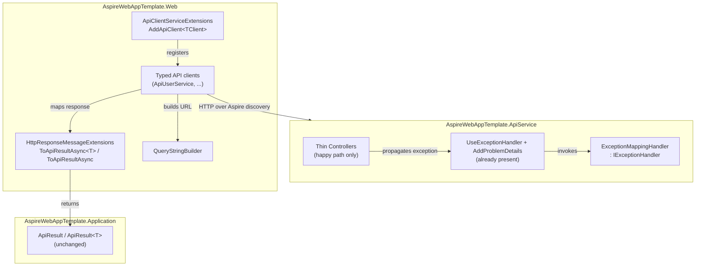

# Design Document — Reusable API Infrastructure

## Overview

This is a behavior-preserving reusability refactor of the `AspireWebAppTemplate` solution. It extracts three high-value "reuse now" seams identified by the codebase audit so that new controllers and API clients start from the happy path instead of copy-pasting error/mapping/registration ceremony:

1. **Centralized API exception-to-HTTP-status mapping** — an `IExceptionHandler` in `AspireWebAppTemplate.ApiService` that applies the current Exception_Mapping_Triad (`KeyNotFoundException` → 404, `InvalidOperationException` → 400, `ArgumentException` and subtypes → 400) plus three additive, forward-looking mappings (`UnauthorizedAccessException` → 403, `NotImplementedException` → 501, `TimeoutException` → 504), so controller actions no longer repeat the try/catch triad.
2. **API-client HTTP-result mapping helper** — `HttpResponseMessage` extension methods in `AspireWebAppTemplate.Web` (`ToApiResultAsync<T>()` / `ToApiResultAsync()`) that collapse the repeated success/failure branch into a single mapping expression.
3. **Query-string helper + typed-client registration helper** — small in-project Web helpers that eliminate hand-built query strings and the repeated `AddHttpClient<TClient>(...).AddHttpMessageHandler<...>()` block.

### Goals

- **Behavior preservation first.** HTTP status codes, response-body error text, and Web-side `ApiResult` / `ApiResult<T>` semantics remain equivalent to today. This is the primary success criterion; ergonomics is secondary.
- **Template ergonomics.** Adding a new controller action becomes "call the service and return the result"; adding a new API-client method becomes "call the endpoint, pipe through `ToApiResultAsync`"; registering a new typed client becomes a one-liner.
- **No premature abstraction.** Small, in-project seams only. No new projects, no new layers, no repository/mediator machinery.
- **Respect the template guardrails.** Nothing existing is removed, disabled, or restructured beyond replacing redundant boilerplate with an equivalent central mechanism. `ApiResult`, `SyncLdapUsersStreamAsync`, `[ProducesResponseType]` attributes, and the `#region Template` / `#region Business` seams are all preserved.

### Non-Goals (restated up front; see Requirement 5)

- No new **Shared** or **Common** project.
- No changes to `Application/Common/ApiResult.cs` (public members and types of `ApiResult` / `ApiResult<T>` are frozen).
- No changes to `ApiUserService.SyncLdapUsersStreamAsync` (NDJSON streaming stays byte-for-byte as-is).
- No DTO/route/endpoint/HTTP-method changes.
- No touching the "Consider later" audit items (per-circuit context base class, bulk-action UI flow).
- The new artifacts do **not** land in Domain, Application, or Infrastructure.

## Architecture

### Where each artifact lives

| Artifact | Project | File (new/changed) | Kind |
|---|---|---|---|
| `ExceptionMappingHandler` (`IExceptionHandler`) | `AspireWebAppTemplate.ApiService` | `Exceptions/ExceptionMappingHandler.cs` (new) | Central_Exception_Handler |
| Handler registration | `AspireWebAppTemplate.ApiService` | `Program.cs` (one added line) | wiring |
| Controller try/catch removal | `AspireWebAppTemplate.ApiService` | existing `Controllers/*.cs` (edited) | cleanup |
| `HttpResponseMessageExtensions` (`ToApiResultAsync`) | `AspireWebAppTemplate.Web` | `Extensions/HttpResponseMessageExtensions.cs` (new) | Api_Client_Mapping_Helper |
| `QueryStringBuilder` | `AspireWebAppTemplate.Web` | `Utilities/QueryStringBuilder.cs` (new) | Query_String_Helper |
| `AddApiClient<TClient>` local helper | `AspireWebAppTemplate.Web` | `Extensions/ApiClientServiceExtensions.cs` (edited) | Client_Registration_Helper |

### Clean Architecture layering confirmation

The 4-layer dependency flow (Domain → Application → Infrastructure → host) is unchanged:

- **Domain** — no change.
- **Application** — no change. `ApiResult` / `ApiResult<T>` in `Application/Common` are consumed but not modified.
- **Infrastructure** — no change.
- **ApiService (host)** — gains one class (`ExceptionMappingHandler`) and one registration line. The handler depends only on ASP.NET Core abstractions (`IExceptionHandler`, `IProblemDetailsService`, `HttpContext`) and BCL exception types — no new cross-layer dependency.
- **Web** — gains two static helper classes and edits the DI extension. All new Web code depends only on `System.Net.Http`, `System.Text.Json`, and `Application.Common.ApiResult` (already referenced).

No new project is created; no Domain/Application/Infrastructure file is added or altered.

### Component diagram



## Components and Interfaces

### Item 1 — Central_Exception_Handler (`ApiService`)

`Program.cs` **already** calls `builder.Services.AddProblemDetails()` and `app.UseExceptionHandler()`. Enabling central mapping therefore requires only:

- adding one `IExceptionHandler` implementation, and
- registering it with `builder.Services.AddExceptionHandler<ExceptionMappingHandler>()`.

We must **not** duplicate `AddProblemDetails` / `UseExceptionHandler`.

`IExceptionHandler` is the preferred .NET 10 / ASP.NET Core mechanism. `UseExceptionHandler()` (no lambda) runs registered `IExceptionHandler` instances in order; if the handler returns `true`, the pipeline treats the exception as handled and writes the response the handler produced. If it returns `false`, ASP.NET Core falls back to the default problem-details behavior (a 500 with no exception message), which is exactly the desired behavior for unmapped exceptions.

```csharp
namespace AspireWebAppTemplate.ApiService.Exceptions;

/// <summary>
/// Maps service-layer exceptions that propagate past a controller action to HTTP status codes,
/// applying the mapping: <see cref="KeyNotFoundException"/> to 404, <see cref="InvalidOperationException"/>
/// to 400, <see cref="ArgumentException"/> (including its subtypes) to 400,
/// <see cref="UnauthorizedAccessException"/> to 403, <see cref="NotImplementedException"/> to 501, and
/// <see cref="TimeoutException"/> to 504. For a mapped exception the exception message is written as the
/// response body text; unmapped exceptions are left to the default handler, which produces a 500 with no
/// exception detail. The mapping is defined in a single switch that application authors extend to add
/// their own exception-to-status mappings.
/// </summary>
public sealed class ExceptionMappingHandler : IExceptionHandler
{
    #region Constructor

    /// <summary>
    /// Writes RFC 7807 problem-details responses using the ASP.NET Core problem-details service.
    /// </summary>
    private readonly IProblemDetailsService _problemDetailsService;

    /// <summary>
    /// Initializes a new instance of the <see cref="ExceptionMappingHandler"/> class.
    /// </summary>
    /// <param name="problemDetailsService">The problem-details service used to write the response.</param>
    public ExceptionMappingHandler(IProblemDetailsService problemDetailsService)
    {
        _problemDetailsService = problemDetailsService;
    }

    #endregion

    #region Exception Handling

    /// <summary>
    /// Attempts to map <paramref name="exception"/> to a 404, 400, 403, 501, or 504 response. Returns
    /// <c>true</c> when the exception is one of the mapped types and a response was written; returns
    /// <c>false</c> for any other exception so that the default handler produces a 500 with no detail.
    /// </summary>
    /// <param name="httpContext">The current HTTP context.</param>
    /// <param name="exception">The exception that propagated past the action.</param>
    /// <param name="cancellationToken">A token to observe cancellation.</param>
    /// <returns><c>true</c> if the exception was mapped and handled; otherwise <c>false</c>.</returns>
    public async ValueTask<bool> TryHandleAsync(
        HttpContext httpContext, Exception exception, CancellationToken cancellationToken)
    {
        var statusCode = exception switch
        {
            KeyNotFoundException => StatusCodes.Status404NotFound,
            InvalidOperationException => StatusCodes.Status400BadRequest,
            ArgumentException => StatusCodes.Status400BadRequest, // includes ArgumentNullException, ArgumentOutOfRangeException
            UnauthorizedAccessException => StatusCodes.Status403Forbidden,
            NotImplementedException => StatusCodes.Status501NotImplemented,
            TimeoutException => StatusCodes.Status504GatewayTimeout,
            _ => (int?)null
        };

        if (statusCode is null)
            return false; // unmapped -> default 500, no message detail

        httpContext.Response.StatusCode = statusCode.Value;

        return await _problemDetailsService.TryWriteAsync(new ProblemDetailsContext
        {
            HttpContext = httpContext,
            ProblemDetails =
            {
                Status = statusCode.Value,
                Detail = exception.Message // preserves the current ex.Message text
            }
        });
    }

    #endregion
}
```

#### Mapping set — the triad plus three additive, forward-looking mappings

The handler maps **seven** exception types, defined in a single switch that application authors extend to add their own mappings:

| Exception type | HTTP status | Constant | Origin |
|---|---|---|---|
| `KeyNotFoundException` | 404 Not Found | `StatusCodes.Status404NotFound` | current triad |
| `InvalidOperationException` | 400 Bad Request | `StatusCodes.Status400BadRequest` | current triad |
| `ArgumentException` (incl. `ArgumentNullException`, `ArgumentOutOfRangeException`) | 400 Bad Request | `StatusCodes.Status400BadRequest` | current triad |
| `UnauthorizedAccessException` | 403 Forbidden | `StatusCodes.Status403Forbidden` | additive (forward-looking) |
| `NotImplementedException` | 501 Not Implemented | `StatusCodes.Status501NotImplemented` | additive (forward-looking) |
| `TimeoutException` | 504 Gateway Timeout | `StatusCodes.Status504GatewayTimeout` | additive (forward-looking) |

The three additive types (`UnauthorizedAccessException`, `NotImplementedException`, `TimeoutException`) are **not thrown anywhere in the current codebase**. They are forward-looking defaults for future business features, so adding them **does not change any existing controller behavior**: no current code path produces these exceptions, so no current response changes. Behavior preservation holds for all current code; the mappings are purely additive for future code. As with the triad, a mapped exception writes its `Message` into `ProblemDetails.Detail`.

**Switch ordering.** None of the seven types overlap by inheritance except that `ArgumentException` subtypes are covered by the `ArgumentException` arm. The three new types are unrelated to the others (and to each other) by inheritance, so their order among themselves and relative to the triad is not significant. If an author later adds a type that is a **base** of an already-mapped type, the more-derived arm MUST precede the base arm in the switch, since C# pattern matching selects the first matching arm.

Registration in `Program.cs` (single added line, near the existing `AddProblemDetails()`):

```csharp
builder.Services.AddProblemDetails();               // already present
builder.Services.AddExceptionHandler<ExceptionMappingHandler>(); // added
// ...
app.UseExceptionHandler();                            // already present
```

Controller cleanup — representative before/after for `RolesController.UpdateRole`:

```csharp
// BEFORE
public async Task<IActionResult> UpdateRole(string id, [FromBody] CreateRoleRequest request)
{
    try
    {
        await _roleService.UpdateAsync(id, request);
        return Ok();
    }
    catch (KeyNotFoundException ex) { return NotFound(ex.Message); }
    catch (InvalidOperationException ex) { return BadRequest(ex.Message); }
    catch (ArgumentException ex) { return BadRequest(ex.Message); }
}

// AFTER
public async Task<IActionResult> UpdateRole(string id, [FromBody] CreateRoleRequest request)
{
    await _roleService.UpdateAsync(id, request);
    return Ok();
}
```

The `[ProducesResponseType]` attributes on the action stay exactly as-is (Requirement 1.8). The `<response code="...">` XML doc lines also stay — they describe the current advertised contract, which is unchanged.

**Opt-out actions.** `PagePermissionsController.UpdateRolePermissions` does more than the triad inside its `try` (it looks up the role, captures previous paths, writes an audit entry, and returns a *custom* 404 message `$"Role with ID '{roleId}' was not found."` before any service call). After centralization, the *bare* triad catches whose only job is to translate the three exception types into `NotFound(ex.Message)` / `BadRequest(ex.Message)` can be removed, because the central handler produces the identical status + message. But an action that needs **different** behavior for an exception keeps its own try/catch and is an Opt_Out_Action: the central handler only ever sees exceptions that propagate *past* the action, so a handled exception is never overridden (Requirement 1.7).

For `UpdateRolePermissions` specifically: its three `catch` clauses currently just do `return NotFound/BadRequest(ex.Message)`, which the central handler reproduces — so those three catches are removable. Its non-exception behavior (the explicit `if (role is null) return NotFound(...)` and the audit write) is unaffected and stays. This is called out as a per-action decision to confirm during implementation, not a blanket rewrite.

### Item 2 — Api_Client_Mapping_Helper (`Web`)

Implemented as **`HttpResponseMessage` extension methods** (not a base class). Rationale: the existing clients are plain classes with a single `HttpClient _http` field and a traditional constructor; extension methods let each method keep its exact call shape (`_http.GetAsync(...)`, `_http.PostAsJsonAsync(...)`) and simply pipe the response, with zero change to construction, DI, or the `#region Constructor` convention. A base class would force every client to change its base type and would not compose with the streaming method.

```csharp
namespace AspireWebAppTemplate.Web.Extensions;

/// <summary>
/// Extension methods that convert an <see cref="HttpResponseMessage"/> into an
/// <see cref="ApiResult"/> or <see cref="ApiResult{T}"/>, applying the standard mapping:
/// a success status (200-299) yields a success result (deserializing the body for the generic
/// overload); a non-success status yields a failure result carrying the entire response body as text.
/// </summary>
public static class HttpResponseMessageExtensions
{
    /// <summary>
    /// Maps a response to an <see cref="ApiResult{T}"/>. On success the body is deserialized to
    /// <typeparamref name="T"/>; when the deserialized value is null the supplied
    /// <paramref name="defaultValue"/> is used as <see cref="ApiResult{T}.Data"/>. On failure the
    /// entire response body is read as text and returned as the error.
    /// </summary>
    /// <typeparam name="T">The payload type to deserialize on success.</typeparam>
    /// <param name="response">The HTTP response to map.</param>
    /// <param name="defaultValue">Fallback used when the deserialized payload is null (for example an empty list).</param>
    /// <param name="options">Optional serializer options; when null the default web options are used.</param>
    public static async Task<ApiResult<T>> ToApiResultAsync<T>(
        this HttpResponseMessage response,
        T? defaultValue = default,
        JsonSerializerOptions? options = null)
    {
        if (response.IsSuccessStatusCode)
        {
            var data = await response.Content.ReadFromJsonAsync<T>(options);
            return ApiResult<T>.Success(data ?? defaultValue!);
        }

        return ApiResult<T>.Failure(await response.Content.ReadAsStringAsync());
    }

    /// <summary>
    /// Maps a response to a non-generic <see cref="ApiResult"/>: success when the status is 200-299,
    /// otherwise failure carrying the entire response body as text.
    /// </summary>
    /// <param name="response">The HTTP response to map.</param>
    public static async Task<ApiResult> ToApiResultAsync(this HttpResponseMessage response)
    {
        if (response.IsSuccessStatusCode)
            return ApiResult.Success();

        return ApiResult.Failure(await response.Content.ReadAsStringAsync());
    }
}
```

**Null-default mechanism — decision.** The requirement allows either a `defaultValue` parameter or a `?? []` at the call site (Requirement 2.5). We recommend the **`defaultValue` parameter on `ToApiResultAsync<T>`** because it keeps the entire success/failure mapping in one place and lets the call site stay a single expression. Where a method today writes `?? []` or `?? new()`, it passes that same fallback as `defaultValue`. Where a method today uses the `!` non-null assertion (e.g., `GetUserAsync`), it omits `defaultValue` (default `null`), preserving today's "assume non-null on success" behavior — if the body deserializes to null, `Data` becomes null exactly as `!` would have yielded. This reproduces each method's current null-handling exactly, per Requirement 2.8.

#### How each representative call maps onto the helper

**A. Querystring + `PagedResult` (`ApiUserService.GetUsersAsync`)** — uses the Query_String_Helper (Item 2b) for the URL and the `!` behavior (no `defaultValue`):

```csharp
// AFTER
public async Task<ApiResult<PagedResult<UserDto>>> GetUsersAsync(UserQueryParams queryParams)
{
    var url = QueryStringBuilder.Build("/api/users", qs =>
    {
        qs.AddIfHasValue("page", queryParams.Page);
        qs.AddIfHasValue("pageSize", queryParams.PageSize);
        qs.AddIfNotWhiteSpace("searchTerm", queryParams.SearchTerm);
    });

    var response = await _http.GetAsync(url);
    return await response.ToApiResultAsync<PagedResult<UserDto>>();
}
```

**B. Simple GET returning `?? []`** — passes the fallback as `defaultValue`. Note `GetActiveForUserAsync` returns `ApiResult<List<AnnouncementDto>>`, while `GetAllUsersAsync` returns a bare `List<UserDto>` (not an `ApiResult`) and keeps its own shape but can still use the helper internally:

```csharp
// AFTER (ApiAnnouncementService.GetActiveForUserAsync — ApiResult<List<...>>)
public async Task<ApiResult<List<AnnouncementDto>>> GetActiveForUserAsync()
{
    var response = await _http.GetAsync("/api/announcements/active");
    return await response.ToApiResultAsync<List<AnnouncementDto>>(defaultValue: []);
}
```

For `GetForListPageAsync`, which today uses `?? new()`, pass `defaultValue: new()`:

```csharp
return await response.ToApiResultAsync<PagedResult<AnnouncementDto>>(defaultValue: new());
```

**C. POST returning `ApiResult.Success()`** — the non-generic overload:

```csharp
// AFTER (ApiUserService.CreateUserAsync)
public async Task<ApiResult> CreateUserAsync(CreateUserRequest request)
{
    var response = await _http.PostAsJsonAsync("/api/users", request);
    return await response.ToApiResultAsync();
}
```

**D. Value-type payload (`ApiNotificationService.GetUnreadCountAsync` → `ApiResult<int>`)** — the generic overload works for value types; `int` deserializes on success, and no `defaultValue` is needed because `int` cannot be null (Requirement 2.6):

```csharp
// AFTER
public async Task<ApiResult<int>> GetUnreadCountAsync()
{
    var response = await _http.GetAsync("/api/notifications/unread-count");
    return await response.ToApiResultAsync<int>();
}
```

**Streaming method is untouched.** `ApiUserService.SyncLdapUsersStreamAsync` (NDJSON, `IAsyncEnumerable`, `HttpCompletionOption.ResponseHeadersRead`, per-line deserialization) does not fit the request/response mapping shape and is left **unchanged** (Requirement 2.7).

### Item 2b — Query_String_Helper (`Web`)

Used by `ApiUserService` and `ApiNotificationService` (and available to `ApiAnnouncementService`). It must produce **byte-for-byte identical** query strings to today's hand-built ones. The exact current formats observed in the code:

- **Users** (`GetUsersAsync`): each optional param appended only when present; `searchTerm` value escaped via `Uri.EscapeDataString`; parts joined with `&`; `?` prefix only when ≥1 part exists; otherwise the bare path `/api/users`.
  - `page={value}`, `pageSize={value}`, `searchTerm={Uri.EscapeDataString(value)}`, omitted when null / whitespace.
- **Users** (`GetAllUsersAsync`): `/api/users` with an optional single `?searchTerm=<escaped>` when non-whitespace.
- **Notifications** (`GetNotificationsAsync`): `page` and `pageSize` are **always** present (`?page={Page}&pageSize={PageSize}`), then optional `&category={value}` and `&isRead={value}` appended when the nullable has a value.
- **Announcements** (`GetForListPageAsync`): `?page={Page}&pageSize={PageSize}`, then optional `&severity={value}`.

Because two distinct shapes exist — (i) "all parts optional, `?` only if any present" and (ii) "some params always present, others appended" — the helper models the general case (i) and lets shape (ii) be expressed as required parts added unconditionally. Enum/`int`/`bool` values are formatted with their default `ToString()` (matching today's interpolation), and only string values are escaped (matching today, where only `searchTerm` is escaped).

```csharp
namespace AspireWebAppTemplate.Web.Utilities;

/// <summary>
/// Builds a query string from a base path and an ordered set of parameters, matching the
/// escaping and omission rules the typed API clients apply by hand: string values are escaped
/// with <see cref="Uri.EscapeDataString(string)"/>, non-string values use their default string
/// form, optional parameters whose value is unset are omitted, parts are joined with '&amp;', and
/// the '?' separator is emitted only when at least one parameter is present.
/// </summary>
public sealed class QueryStringBuilder
{
    #region Fields

    /// <summary>
    /// The ordered query-string parts already added, each in "key=value" form.
    /// </summary>
    private readonly List<string> _parts = new();

    #endregion

    #region Building

    /// <summary>
    /// Builds a full URL for <paramref name="path"/> by applying <paramref name="configure"/> to a
    /// new builder and appending the resulting query string.
    /// </summary>
    /// <param name="path">The base path (for example "/api/users").</param>
    /// <param name="configure">A callback that adds the parameters in order.</param>
    /// <returns>The path with a query string, or the bare path when no parameters were added.</returns>
    public static string Build(string path, Action<QueryStringBuilder> configure)
    {
        var builder = new QueryStringBuilder();
        configure(builder);
        return builder._parts.Count > 0 ? $"{path}?{string.Join("&", builder._parts)}" : path;
    }

    /// <summary>
    /// Adds a required parameter whose value is always emitted (used for parameters the current
    /// code always includes, such as page and pageSize on the notifications and announcements lists).
    /// </summary>
    /// <param name="key">The parameter name.</param>
    /// <param name="value">The parameter value; formatted with its default string form.</param>
    public QueryStringBuilder Add(string key, object value)
    {
        _parts.Add($"{key}={value}");
        return this;
    }

    /// <summary>
    /// Adds a parameter only when <paramref name="value"/> has a value (nullable value types).
    /// </summary>
    /// <typeparam name="T">The underlying value type.</typeparam>
    /// <param name="key">The parameter name.</param>
    /// <param name="value">The optional value; omitted when null.</param>
    public QueryStringBuilder AddIfHasValue<T>(string key, T? value) where T : struct
    {
        if (value.HasValue)
            _parts.Add($"{key}={value.Value}");
        return this;
    }

    /// <summary>
    /// Adds a string parameter only when it is not null, empty, or whitespace, escaping the value
    /// with <see cref="Uri.EscapeDataString(string)"/> to match the current hand-built escaping.
    /// </summary>
    /// <param name="key">The parameter name.</param>
    /// <param name="value">The optional string value; omitted when null/empty/whitespace.</param>
    public QueryStringBuilder AddIfNotWhiteSpace(string key, string? value)
    {
        if (!string.IsNullOrWhiteSpace(value))
            _parts.Add($"{key}={Uri.EscapeDataString(value)}");
        return this;
    }

    #endregion
}
```

`GetNotificationsAsync` after refactor (shape ii — `page`/`pageSize` always present):

```csharp
var url = QueryStringBuilder.Build("/api/notifications", qs =>
{
    qs.Add("page", queryParams.Page);
    qs.Add("pageSize", queryParams.PageSize);
    qs.AddIfHasValue("category", queryParams.Category);
    qs.AddIfHasValue("isRead", queryParams.IsRead);
});
```

This yields `/api/notifications?page=..&pageSize=..[&category=..][&isRead=..]`, identical to the current interpolated string.

### Item 3 — Client_Registration_Helper (`Web`)

A **local private** generic method inside `ApiClientServiceExtensions.cs`. It preserves the `ApiServiceBaseAddress` const and both `#region Template` and `#region Business` seams.

```csharp
/// <summary>
/// Registers <typeparamref name="TClient"/> as a typed <see cref="HttpClient"/> whose base address
/// is the ApiService service-discovery address and whose pipeline includes
/// <see cref="UserIdentityDelegatingHandler"/> for identity propagation.
/// </summary>
/// <typeparam name="TClient">The typed API client to register.</typeparam>
/// <param name="services">The service collection to add the client to.</param>
/// <returns>The same service collection for chaining.</returns>
private static IServiceCollection AddApiClient<TClient>(this IServiceCollection services)
    where TClient : class
{
    services.AddHttpClient<TClient>(client => client.BaseAddress = new(ApiServiceBaseAddress))
        .AddHttpMessageHandler<UserIdentityDelegatingHandler>();
    return services;
}
```

Before/after of the `#region Template` block:

```csharp
// BEFORE (repeated ~10 times)
services.AddHttpClient<ApiWeatherService>(client =>
    client.BaseAddress = new(ApiServiceBaseAddress))
    .AddHttpMessageHandler<UserIdentityDelegatingHandler>();
services.AddHttpClient<ApiAuthService>(client =>
    client.BaseAddress = new(ApiServiceBaseAddress))
    .AddHttpMessageHandler<UserIdentityDelegatingHandler>();
// ... 8 more blocks ...

// AFTER
#region Template

services.AddApiClient<ApiWeatherService>();
services.AddApiClient<ApiAuthService>();
services.AddApiClient<ApiUserService>();
services.AddApiClient<ApiRoleService>();
services.AddApiClient<ApiAuditLogService>();
services.AddApiClient<ApiPagePermissionService>();
services.AddApiClient<ApiNotificationService>();
services.AddApiClient<ApiNavigationService>();
services.AddApiClient<ApiAnnouncementService>();
services.AddApiClient<ApiEmailTemplateService>();

#endregion
```

The `#region Business` seam keeps its example comment, now showing the one-line form:

```csharp
#region Business
// Register your application-specific API client services below this line.
// Example:
// services.AddApiClient<ApiOrderService>();
#endregion
```

All ten template clients are registered exactly once; no other typed client is registered (Requirement 3.3). Since `AddApiClient<TClient>` produces the same `AddHttpClient<TClient>(...).AddHttpMessageHandler<UserIdentityDelegatingHandler>()` call as before, each client still resolves as a typed `HttpClient` with `BaseAddress == ApiServiceBaseAddress` and the delegating handler attached.

## Data Models

No new data models. The refactor consumes existing types only:

- `AspireWebAppTemplate.Application.Common.ApiResult` / `ApiResult<T>` — unchanged; consumed by `ToApiResultAsync`.
- `PagedResult<T>` and feature DTOs — unchanged; used as the `T` in `ToApiResultAsync<T>`.
- ASP.NET Core `ProblemDetails` / `ProblemDetailsContext` — framework types; produced by the handler.
- Query-param DTOs (`UserQueryParams`, `NotificationQueryParams`, `AnnouncementQueryParams`) — unchanged; read by the Query_String_Helper.

### The ProblemDetails-vs-bare-string body decision

**The tension.** Today `NotFound(ex.Message)` and `BadRequest(ex.Message)` return an `ObjectResult` whose body is the raw message. With MVC's default output formatting, a bare string body serializes as a JSON string (`"Role not found."`) with content type `application/json` (or `text/plain` depending on negotiation). Routing mapped exceptions through `IProblemDetailsService` instead produces an RFC 7807 `ProblemDetails` object (`application/problem+json`) whose `detail` field carries the message. So the **message text is preserved**, but the body **shape** changes from a bare string to a problem-details object, and the content type changes to `application/problem+json`.

Requirements 1.5 / 4.2 ask for "character-for-character / byte-for-byte equivalent" body text. Strictly read, a shape change is not byte-equivalent to a bare string.

**Recommended approach: ProblemDetails with the message in `ProblemDetails.Detail`.**

Rationale:
- It is the idiomatic .NET 10 outcome of `IExceptionHandler` + `AddProblemDetails()` (both already wired), and it gives every future controller a consistent, documented error contract for free.
- The **message text is preserved verbatim** in `detail`, satisfying the spirit of 1.5/4.2 (the human-readable error the client surfaces is identical).
- On the Web side, `ApiResult.Failure(await response.Content.ReadAsStringAsync())` reads the **entire body as a string** regardless of shape. So the Web-side `ApiResult.Error` will now contain the problem-details JSON rather than the bare message. Where the UI displays `Error` directly, this is the one visible behavior delta to confirm.

Because this **relaxes strict byte-equivalence of the raw HTTP body** in favor of a cleaner, standardized ProblemDetails body, **this is a point to confirm with the team.** If the UI surfaces `ApiResult.Error` verbatim to end users, we either (a) accept the ProblemDetails body and, if needed, have clients extract `detail`, or (b) choose the strict alternative below.

**Strict alternative (only if byte-equivalence of the body is mandatory).** Implement the handler to write the raw message with the same content type MVC used, bypassing ProblemDetails for mapped exceptions:

```csharp
// Strict byte-equivalent variant
httpContext.Response.StatusCode = statusCode.Value;
httpContext.Response.ContentType = "text/plain"; // match the negotiated bare-string content type
await httpContext.Response.WriteAsync(exception.Message, cancellationToken);
return true;
```

Trade-off: this forgoes the standardized problem-details body and the OpenAPI/tooling benefits, and must exactly reproduce MVC's original content-type negotiation to be truly byte-identical (non-trivial). Given the template's goal of clean, reusable ergonomics, the recommendation is the ProblemDetails approach with `detail` carrying the message, with the body-shape delta flagged for team sign-off.

**Unmapped exceptions.** For any exception outside the mapped set — now **seven** types (the triad plus `UnauthorizedAccessException`, `NotImplementedException`, `TimeoutException`) — `TryHandleAsync` returns `false`, and ASP.NET Core's default handler produces a **500 with no message detail**, preserving current behavior (Requirements 1.6 / 4.6). Only exceptions outside all seven mapped types produce a 500. This is unaffected by the recommended-vs-strict choice above.

## Correctness Properties

*A property is a characteristic or behavior that should hold true across all valid executions of a system — essentially, a formal statement about what the system should do. Properties serve as the bridge between human-readable specifications and machine-verifiable correctness guarantees.*

The refactor's testable behavior reduces to four universally-quantified properties. The mapping-triad criteria (1.2–1.5, 4.1, 4.2, 4.5) collapse into a single mapping property; the unmapped-exception behavior (1.6, 4.6) is a distinct negative property; the client-mapping criteria (2.2–2.6, 2.8, 4.7) collapse into a single response-mapping property; and the query-string equivalence (2.9) is a standalone pure-function property. Structural/wiring criteria (1.7, 1.8, 1.9, 2.7, 3.x, 4.3, 4.4, 5.x) are covered by example, integration, and smoke tests in the Testing Strategy, not by properties.

### Property 1: Mapped exceptions produce the correct status and preserve the message

*For any* exception that is one of the seven mapped types — `KeyNotFoundException`, `InvalidOperationException`, `ArgumentException` (including `ArgumentNullException` and `ArgumentOutOfRangeException`), `UnauthorizedAccessException`, `NotImplementedException`, or `TimeoutException` — and *for any* message string it carries, the Central_Exception_Handler SHALL set the HTTP status to 404 for `KeyNotFoundException`, 400 for `InvalidOperationException` / `ArgumentException`, 403 for `UnauthorizedAccessException`, 501 for `NotImplementedException`, and 504 for `TimeoutException`, and SHALL place the exception's `Message` unmodified in the chosen response-body field (`ProblemDetails.Detail` under the recommended approach).

**Validates: Requirements 1.2, 1.3, 1.4, 1.5, 4.1, 4.2, 4.5**

### Property 2: Unmapped exceptions are left to the default handler

*For any* exception whose type is not one of the seven mapped types (`KeyNotFoundException`, `InvalidOperationException`, `ArgumentException` or a subtype of `ArgumentException`, `UnauthorizedAccessException`, `NotImplementedException`, `TimeoutException`), the Central_Exception_Handler SHALL report the exception as not handled (`TryHandleAsync` returns `false`) so that the default handler produces a 500 response whose body contains no exception message.

**Validates: Requirements 1.6, 4.6**

### Property 3: Response mapping matches the current inline branch

*For any* HTTP response, `ToApiResultAsync<T>` / `ToApiResultAsync()` SHALL produce an `ApiResult` / `ApiResult<T>` whose `Succeeded`, `Error`, and `Data` values are identical to those the current per-method success/failure branch produces for the same response: on a success status (200–299) `Succeeded` is true, `Error` is null, and (generic overload) `Data` equals the deserialized payload or the supplied default when the payload is null; on a non-success status `Succeeded` is false and `Error` equals the entire response body read as a string.

**Validates: Requirements 2.2, 2.3, 2.4, 2.5, 2.6, 2.8, 4.7**

### Property 4: Query-string builder output equals the current hand-built string

*For any* combination of query-parameter values — including present/absent optionals and values requiring URL escaping — the Query_String_Helper SHALL produce a query string byte-for-byte identical to the current hand-built string in `ApiUserService` and `ApiNotificationService`, applying the same `Uri.EscapeDataString` escaping to string values, omitting unset optionals, joining parts with `&`, and emitting the `?` separator only when at least one parameter is present.

**Validates: Requirements 2.9**

## Error Handling

### Edge Cases

- **Empty response body on success (generic).** `ReadFromJsonAsync<T>` returns `null` (or `default(T)`) for an empty/`null` JSON body. `ToApiResultAsync<T>` then substitutes `defaultValue` when provided (e.g., `[]`, `new()`), reproducing today's `?? []` / `?? new()`. When no `defaultValue` is supplied (methods that used `!`), `Data` becomes `null`, matching the current `!` behavior.
- **Value-type payload.** For `T = int` (e.g., `GetUnreadCountAsync`, `MarkAllAsReadAsync`, `BulkDismissAsync`), `ReadFromJsonAsync<int>` yields the value; no `defaultValue` is needed and none is supplied.
- **Non-success body read.** The failure branch always reads the **entire** body via `ReadAsStringAsync`, exactly once, matching current code — no extra requests, retries, or reads (Requirement 2.8).
- **Opt-out actions.** Actions that need behavior other than the plain triad keep their own try/catch. The central handler only sees exceptions that propagate past the action, so a handled exception is never overridden (Requirement 1.7). `PagePermissionsController.UpdateRolePermissions` retains its explicit `if (role is null) return NotFound(...)` and its audit write; only its three bare triad catches (which merely re-emit `NotFound/BadRequest(ex.Message)`) are removable because the central handler reproduces them.
- **Unmapped exceptions.** Any exception outside the seven mapped types (the triad plus `UnauthorizedAccessException` → 403, `NotImplementedException` → 501, `TimeoutException` → 504) yields 500 with no message detail via the default handler (Property 2).
- **Streaming method.** `SyncLdapUsersStreamAsync` never flows through `ToApiResultAsync`; its `IAsyncEnumerable` NDJSON behavior is preserved unchanged.
- **`GetAllUsersAsync` bare-list return.** This method returns `List<UserDto>` (not an `ApiResult`) and falls back to `[]` on failure. It may keep its own shape; if refactored, it uses `ToApiResultAsync<PagedResult<UserDto>>(defaultValue: new())` internally and projects `.Items ?? []`, preserving the current `[]`-on-failure behavior.

## Testing Strategy

The refactor uses the project's existing dual approach and must leave the existing suite green.

### Unit and example tests (xUnit + Moq)

- **Opt-out action (1.7):** assert an action that handles an exception itself returns its own response and the handler does not alter it.
- **`[ProducesResponseType]` preservation (1.8):** reflection/example test asserting each action's attribute set (status codes and count) is unchanged.
- **Client registration (3.1–3.6):** resolve each of the ten template clients from the built provider and assert each is a typed `HttpClient` with `BaseAddress == ApiServiceBaseAddress` and the `UserIdentityDelegatingHandler` in its pipeline; assert no unexpected client is registered.
- **Single-read structure (2.8):** example test confirming the helper performs exactly one body read per branch.

### Property-based tests (FsCheck.Xunit 3.3.3)

Follow the existing convention in `Tests/ControllerServiceRefactor/`: `[Property(MaxTest = 2)]`, `Gen`/`Arb` generators, and a tag comment. Each property below is implemented as a **single** property-based test.

- **Property 1 — exception mapping.** Generate the seven mapped exception types — `KeyNotFoundException`, `InvalidOperationException`, `ArgumentException` (including `ArgumentNullException` / `ArgumentOutOfRangeException`), `UnauthorizedAccessException`, `NotImplementedException`, `TimeoutException` — and arbitrary messages; drive `ExceptionMappingHandler.TryHandleAsync` with a test `HttpContext` and assert the status code (404/400/403/501/504) and that the written body's message field equals the input message. Placed in `Tests/ControllerServiceRefactor/` alongside the existing `ExceptionMappingTests.cs` (which can be extended or complemented — the existing controller-level tests remain valid because the handler reproduces their outcomes).
- **Property 2 — unmapped not handled.** Generate arbitrary exception types outside the seven mapped types; assert `TryHandleAsync` returns `false` and writes no message.
- **Property 3 — response mapping.** Generate success/failure statuses and reference/value/null payloads plus arbitrary failure bodies; build an `HttpResponseMessage` and assert `(Succeeded, Error, Data)` from `ToApiResultAsync` equals a reference implementation mirroring the current inline branch.
- **Property 4 — query-string equivalence.** Generate `UserQueryParams` / `NotificationQueryParams` / `AnnouncementQueryParams` combinations (present/absent optionals, escape-worthy search terms); assert `QueryStringBuilder` output equals a reference builder that reproduces today's hand-built interpolation exactly (model-based test).

Tag format (matches the repo): `// Feature: reusable-api-infrastructure, Property {N}: {property text}`.
Each property test runs a minimum of 100 iterations (FsCheck default); the repo's `[Property(MaxTest = 2)]` convention is used for the sample-count knob consistent with existing tests, with generators covering the meaningful input partitions.

### Integration tests for the exception handler

Use `Aspire.Hosting.Testing` (as in `WebTests.cs`) or a focused `WebApplicationFactory<Program>` against the ApiService to assert end-to-end that a service throwing each mapped exception yields the expected status and body over real HTTP. Coverage centers on the triad (the exception types current code actually throws); the three additive types (`UnauthorizedAccessException` → 403, `NotImplementedException` → 501, `TimeoutException` → 504) can be exercised at the unit level via `TryHandleAsync` since no current endpoint throws them. Also assert that an unmapped exception yields 500 with no detail. This validates the wiring (`AddExceptionHandler` + `UseExceptionHandler` + `AddProblemDetails`) in addition to the unit-level handler logic. If the strict byte-equivalent variant is chosen, these tests also assert the exact content type and body bytes.

### Regression gate

The full existing suite (Announcements, AuditLog, ControllerServiceRefactor, Email, Navigation, Notifications, PagePermissions, StatusAlert, Scheduler, WebTests) MUST complete with **zero failed and zero skipped** tests attributable to the refactor (Requirement 4.4). Because behavior is preserved, existing controller-level exception tests continue to pass; the new central-handler tests are additive.

## Non-Goals (explicit)

- No new **Shared** project (Requirement 5.7).
- No new **Common** project (Requirement 5.8).
- No change to any DTO field, endpoint, route, HTTP method, or to the public members/types of `ApiResult` / `ApiResult<T>` (Requirements 5.9, 4.3).
- No change to `ApiUserService.SyncLdapUsersStreamAsync` (Requirement 2.7).
- The Central_Exception_Handler lives only in ApiService; the mapping/query-string/registration helpers live only in Web — none are added to Domain, Application, or Infrastructure (Requirements 5.4, 5.5, 5.6).
- No removal, replacement, disabling, or restructuring of any existing template capability (Requirement 5.10).
- No modification of the "Consider later" audit items — the per-circuit context base class and the bulk-action UI flow (Requirement 5.11).

## Migration / Rollout

The change is staged so each step is independently safe and the suite stays green throughout:

1. **Add the central handler (additive, coexists).** Introduce `ExceptionMappingHandler` and register it with `AddExceptionHandler<ExceptionMappingHandler>()`. With the existing inline try/catch still in place, controllers still handle their own exceptions, so the handler observes nothing yet — behavior is unchanged. Add the handler unit/integration tests.
2. **Add the Web helpers (additive).** Introduce `HttpResponseMessageExtensions` and `QueryStringBuilder`; add their property tests. No client is changed yet.
3. **Introduce `AddApiClient<TClient>`** and convert the `#region Template` registrations to the one-line form; resolve-each-client test guards it.
4. **Remove redundant controller try/catch, controller-by-controller.** For each controller, delete the bare triad catches so the mapped exceptions propagate to the central handler; keep any action needing different behavior as an Opt_Out_Action. Run the suite after each controller.
5. **Migrate client methods to `ToApiResultAsync` / `QueryStringBuilder`,** method-by-method, leaving `SyncLdapUsersStreamAsync` untouched. Run the suite after each client.

Steps 4 and 5 are the only behavior-touching edits; doing them incrementally keeps the blast radius per commit to a single controller or client and makes regressions easy to localize.
