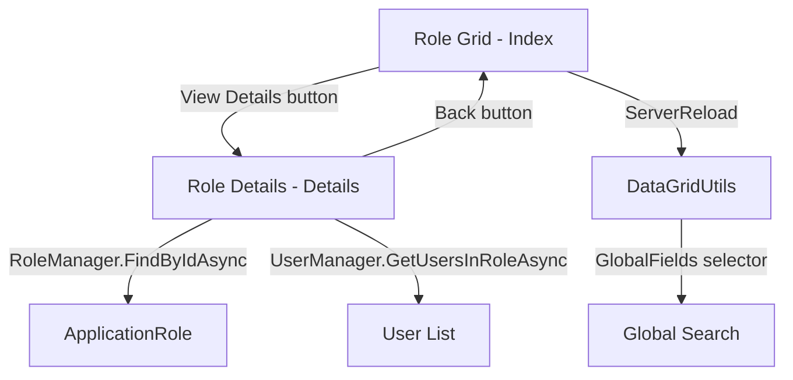

# Design Document: Role Grid Improvements

## Overview

This design covers four related changes to the Role Management area:

1. **Remove the Created Date column** from the grid to reduce clutter.
2. **Add Status Text to global search** so administrators can filter by "Active"/"Inactive".
3. **Keep the Description column visible and hideable** via MudDataGrid column options.
4. **Add a Role Details page** at `/role-management/{RoleId}` that shows full role metadata and assigned users.

All changes follow existing patterns: the code-behind pattern (`.razor` + `.razor.cs`), MudBlazor components, `DataGridUtils<T>` for server-side grid operations, and the User Management Details page as the reference for the new details page.

## Architecture

The changes are localized to the Role Management feature area:

```
Components/Pages/RoleManagement/
├── Index.razor          ← Grid column & search changes (Requirements 1, 2, 3, 5)
├── Index.razor.cs       ← DataGridUtils mapping & GlobalFields changes
├── Details.razor        ← NEW: Role Details page UI
└── Details.razor.cs     ← NEW: Role Details page logic
```

No new services, middleware, or database changes are required. The existing `RoleManager<ApplicationRole>` and `UserManager<ApplicationUser>` provide all necessary data access.



## Components and Interfaces

### 1. Modified: `Index.razor` (Grid Columns)

**Changes:**
- Remove the `<PropertyColumn Property="r => r.CreatedUtc" Title="Created Date" />` column.
- Add `Hideable="true"` to the Description column.
- Add a "View Details" icon button to the Actions `<TemplateColumn>`.

**Final column order:** SelectColumn, Line, Role Name, Display Name, Description, Status, User Count, Actions.

### 2. Modified: `Index.razor.cs` (DataGridUtils & GlobalFields)

**Changes:**
- Remove `.MapDateTime(nameof(RoleViewModel.CreatedUtc), x => x.CreatedUtc)` from the `_dataGridUtils` builder.
- Update the `GlobalFields` lambda to replace the `CreatedUtc` formatted string with a status text field:

```csharp
IEnumerable<string> GlobalFields(RoleViewModel r) => new[]
{
    r.Name,
    r.DisplayName,
    r.Description ?? "",
    r.UserCount.ToString(),
    r.IsActive ? "Active" : "Inactive"
};
```

### 3. New: `Details.razor` (Role Details Page)

A new page following the User Management Details pattern:
- Route: `/role-management/{RoleId}`
- Authorized for Admin role only.
- Back button navigating to `/role-management`.
- Summary header with role name, display name, and status chip.
- Information table showing: Description, Created Date (formatted `dd/MM/yyyy hh:mm:ss tt`), Last Updated Date (same format or "Never").
- Users tab/section listing all users assigned to the role.

### 4. New: `Details.razor.cs` (Role Details Code-Behind)

```csharp
public partial class Details : ComponentBase
{
    [Inject] private RoleManager<ApplicationRole> RoleManager { get; set; } = default!;
    [Inject] private UserManager<ApplicationUser> UserManager { get; set; } = default!;
    [Inject] private NavigationManager NavigationManager { get; set; } = default!;

    [Parameter] public string RoleId { get; set; } = "";

    protected ApplicationRole? Role { get; private set; }
    protected List<ApplicationUser> UsersInRole { get; private set; } = [];
    protected bool IsLoading { get; private set; } = true;

    protected override async Task OnInitializedAsync()
    {
        try
        {
            Role = await RoleManager.FindByIdAsync(RoleId);
            if (Role is not null)
            {
                var users = await UserManager.GetUsersInRoleAsync(Role.Name!);
                UsersInRole = users.ToList();
            }
        }
        finally
        {
            IsLoading = false;
        }
    }
}
```

## Data Models

No new data models are introduced. The existing models are sufficient:

### `ApplicationRole` (existing, unchanged)

| Property | Type | Notes |
|----------|------|-------|
| Id | string | Identity primary key |
| Name | string? | Technical role name |
| DisplayName | string? | Human-readable label |
| Description | string? | Role purpose description |
| IsActive | bool | Active/deactivated flag |
| CreatedUtc | DateTime | Creation timestamp |
| UpdatedUtc | DateTime? | Last modification timestamp |

### `RoleViewModel` (existing, unchanged)

The view model is used exclusively by the grid (Index page) for server-side filtering, sorting, selection tracking, and line numbering. The Details page does NOT use `RoleViewModel` — it uses `ApplicationRole` directly, consistent with how User Management's Details page uses `ApplicationUser`.

### 5. Modified: `Index.razor` (Bulk Activate/Deactivate + Icon Consistency)

**Changes:**
- Add bulk Activate and Deactivate icon buttons to the toolbar (same pattern as UserManagement — shown when selection exists).
- Replace `material-symbols-rounded/toggle_on` / `toggle_off` with `material-symbols-rounded/person_check` / `person_cancel` in the single-row Actions column.

### 6. Modified: `Index.razor.cs` (Bulk Activate/Deactivate Methods)

**New methods:**
- `BulkActivateAsync()` — iterates selected roles, sets `IsActive = true`, stamps `UpdatedUtc`, shows confirmation dialog.
- `BulkDeactivateAsync()` — same pattern with `IsActive = false`.

### 7. Modified: `Details.razor` (Users Data Grid + Assign/Deassign)

**Changes to the users section:**
- Replace simple table/list with a `MudDataGrid<UserViewModel>` (reusing UserManagement's `UserViewModel`) using `ServerData` pattern with `DataGridUtils<UserViewModel>`.
- Uses `UserViewModel` because it has `Equals`/`GetHashCode` by `Id` needed for multi-selection, and the displayed columns (UserName, DisplayName, Email) already exist on it.
- Columns: Line Number, Username, Display Name, Email, Remove action button.
- Multi-selection via `SelectColumn` for bulk deassign.
- **Layout:** Back button at the top of the page (above page title, same as User Management Details). "Assign Users" button in a separate Action Buttons Row above the grid. Grid toolbar only contains search + bulk actions on selection.
- Server-side filtering, sorting, and pagination via `DataGridUtils` to handle large user counts per role.
- Remove action per row with confirmation dialog.
- **No pre-loading in `OnInitializedAsync`** — the `ServerData` callback calls `LoadUsersInRoleAsync()` which fetches fresh data from `UserManager.GetUsersInRoleAsync`, maps to `UserViewModel`, on every reload.
- After assign/deassign, call `usersDataGrid.ReloadServerData()`.
- Line numbers via `setLineNumber` callback (page-aware).

### 8. New: `AssignUsersToRoleDialog.razor` + `.razor.cs`

A dialog for searching and selecting **multiple** users to assign to the role:
- Searchable `MudDataGrid` or `MudTable` with multi-selection showing available users.
- Filters by username/display name.
- Excludes users already assigned to the role.
- On confirm, iterates selected users and calls `UserManager.AddToRoleAsync` for each.
- Returns success/failed counts.
- Closes with success result to trigger grid reload.
- Note: The old single-user `AssignUserToRoleDialog` is removed — this replaces it.

### 9. Modified: `Index.razor.cs` — Role Deactivation Warning

**Changes to `ToggleActivationAsync`:**
- Remove any user-count guard that blocks deactivation.
- When deactivating a role with `UserCount > 0`, the confirmation dialog content includes a warning about assigned users.
- Activation is always allowed regardless of user count.
- **Exception:** System roles (`IsSystem = true`) cannot be deactivated — show error snackbar.

### 10. New: `ApplicationRole.IsSystem` and `RequiresMinimumUser` Properties

**Changes to `ApplicationRole`:**
- Add `public bool IsSystem { get; set; } = false;` — protects role from deletion/deactivation/rename.
- Add `public bool RequiresMinimumUser { get; set; } = false;` — prevents removing the last assigned user.
- Both require EF Core migration to add the columns.
- Neither flag is exposed in the Add/Edit Role UI — they are developer/seed-level only.

### 11. System Role Guards

**Guards applied across multiple files:**
- `Index.razor` (RoleManagement): Disable Delete and Deactivate buttons when `IsSystem = true`.
- `Index.razor.cs` (RoleManagement): `DeleteRoleAsync` and `BulkDeleteAsync` skip system roles.
- `EditRoleDialog.razor.cs`: Disable Name field when editing a system role.
- `Details.razor.cs` (RoleManagement): `RemoveUserFromRoleAsync` and `BulkRemoveUsersAsync` check `RequiresMinimumUser` — block if removing the last user.
- `Index.razor.cs` (UserManagement): `ToggleActivationAsync`, `DeleteUserAsync`, `BulkActivateAsync`, `BulkDeactivateAsync`, `BulkDeleteAsync` check if the user is the last one in any role with `RequiresMinimumUser = true` before proceeding.

### 12. Database Seed — System Roles

**In `SeedData.cs`:**
- Add `IsSystem` and `RequiresMinimumUser` properties to the `SeedRole` record.
- "Admin" role: `IsSystem = true`, `RequiresMinimumUser = true`.
- "User" role: `IsSystem = true`, `RequiresMinimumUser = false`.
- In `SeedRolesAsync`, set both flags when creating the `ApplicationRole`.
- Production projects can add more roles with these flags in their own seed data.

## Error Handling

| Scenario | Handling |
|----------|----------|
| Role not found (Details page) | Display `MudAlert` with "Role not found." message, same pattern as User Details. |
| `RoleId` route parameter empty/invalid | `FindByIdAsync` returns null → shows "not found" alert. |
| `GetUsersInRoleAsync` fails | Let exception propagate to Blazor error boundary (consistent with existing pages). |
| Navigation to deleted role | Same as "not found" — graceful alert display. |

## Testing Strategy

### Why Property-Based Testing Does Not Apply

This feature consists of:
- Declarative UI column configuration changes (adding/removing MudDataGrid columns)
- A new Blazor page that renders role data (UI rendering)
- A simple string array change in the global search selector

There are no pure functions with complex input/output behavior, no parsers, serializers, or algorithms. The logic is straightforward data retrieval and display. PBT is not appropriate here.

### Recommended Testing Approach

**Unit Tests (example-based):**
- Verify the `GlobalFields` lambda returns the correct set of fields including status text.
- Verify `GlobalFields` returns "Active" for active roles and "Inactive" for inactive roles.
- Verify the `DataGridUtils` instance does NOT have a `CreatedUtc` mapping.

**Integration / Component Tests:**
- Render the Role Details page with a known role and verify all fields display correctly.
- Render the Role Details page with a null `UpdatedUtc` and verify "Never" is displayed.
- Render the Role Details page with an invalid `RoleId` and verify the "not found" alert appears.
- Verify the grid renders without a "Created Date" column header.
- Verify the "View Details" button navigates to the correct route.

**Manual Verification:**
- Confirm the Description column is hideable via the MudDataGrid column chooser.
- Confirm global search matches "Active" and "Inactive" text.
- Confirm the Details page displays the user list for a role with assigned users.

### 13. New: `ApplicationRole.IsDefault` and `Position` Properties

**Changes to `ApplicationRole`:**
- Add `public bool IsDefault { get; set; } = false;` — marks the role auto-assigned to new users.
- Add `public int Position { get; set; } = 0;` — determines authority hierarchy (higher = more authority).
- Both added in the same EF Core migration as `IsSystem` and `RequiresMinimumUser`.

### 14. Default Role Usage

**Changes to registration/provisioning services:**
- `RegisterService`, `LdapLoginService`, `AddLdapUserDialog`, `AddUserDialog`: replace hardcoded `"User"` with a query for the role where `IsDefault = true`.
- Helper method or extension: `RoleManager.Roles.FirstOrDefault(r => r.IsDefault)?.Name ?? "User"` (fallback to "User" if none marked).

### 15. Position-Based Authority Guards

**Guard logic (reusable helper method):**
```csharp
int GetHighestPosition(IEnumerable<string> roleNames) =>
    roleNames.Max(name => allRoles.FirstOrDefault(r => r.Name == name)?.Position ?? 0);
```

**Applied in:**
- `UserManagement/Index.razor.cs`: `OpenEditUserDialog`, `OpenManageRolesDialog`, `ToggleActivationAsync`, `DeleteUserAsync` — check actor position >= target position.
- `UserManagement/ManageRolesDialog`: filter available roles to only those with position <= actor's position.
- `UserManagement/BulkAssignRoleDialog`: same filter.
- `RoleManagement/Details.razor.cs`: `OpenAssignUsersDialog` — cannot assign a role with position higher than actor's highest role.

### 16. UI Display

**Role Management Grid (`Index.razor`):**
- Add `Position` as a sortable `PropertyColumn`.

**Role Details Page (`Details.razor`):**
- Show `IsDefault` as a read-only chip/badge (e.g., "Default Role") when true.
- Show `Position` value in the role info section.

**Edit Role Dialog:**
- Add `Position` as an editable number field.
- `IsDefault` is NOT shown (seed-level only).
