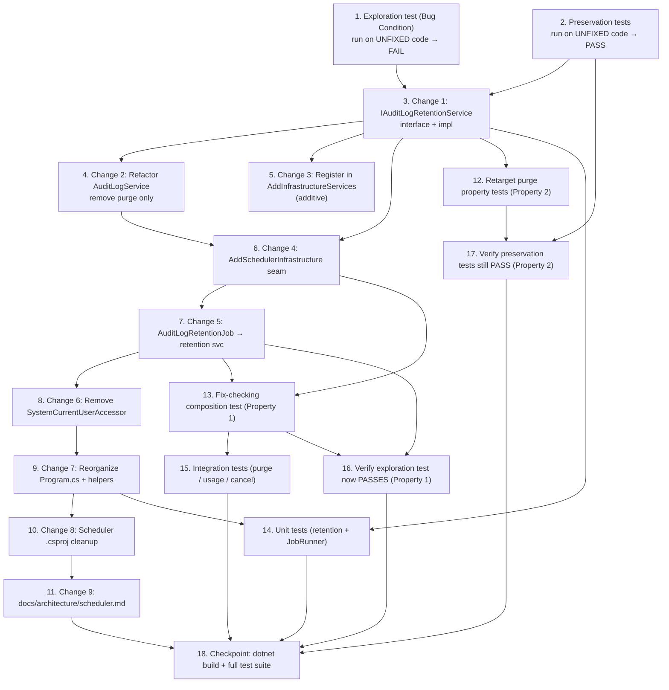

# Implementation Plan

## Overview

This plan fixes the Scheduler over-inheritance defect by extracting the audit-log purge/retention
responsibility into a feature-owned `IAuditLogRetentionService` (deps: `ApplicationDbContext` +
`IConfiguration` only) and giving the Scheduler a focused Infrastructure-owned registration seam
(`AddSchedulerInfrastructure`) so it never constructs `AuditLogService` and never pulls in Identity,
Data Protection, Bedrock, the Web callback client, or the sanitizer.

**Bug condition (C):** the Scheduler's registered service set is a strict superset of what its jobs
transitively consume. **Property 1 (Fix Checking):** after the fix the registered set equals exactly
what the jobs consume and the purge job runs to success. **Property 2 (Preservation):** the API/Web
audit-write display-name path and the `AddInfrastructureServices()` effective graph are unchanged, and
purge behavior is identical (now behind `IAuditLogRetentionService`).

## Task Dependency Graph



Execution waves (parallel-safe task groupings derived from the dependency edges above):

```json
{
  "waves": [
    { "wave": 1, "tasks": ["1", "2"] },
    { "wave": 2, "tasks": ["3.1"] },
    { "wave": 3, "tasks": ["3.2", "3.3"] },
    { "wave": 4, "tasks": ["3.4"] },
    { "wave": 5, "tasks": ["3.5"] },
    { "wave": 6, "tasks": ["3.6"] },
    { "wave": 7, "tasks": ["3.7"] },
    { "wave": 8, "tasks": ["3.8"] },
    { "wave": 9, "tasks": ["3.9"] },
    { "wave": 10, "tasks": ["4", "5", "6", "7"] },
    { "wave": 11, "tasks": ["8", "9"] },
    { "wave": 12, "tasks": ["10"] }
  ]
}
```

---

## Tasks

- [x] 1. Write bug condition exploration test
  - **Property 1: Bug Condition** - Scheduler registers exactly what its jobs consume
  - **CRITICAL**: This test MUST FAIL on unfixed code - failure confirms the bug exists (over-inheritance)
  - **DO NOT attempt to fix the test or the code when it fails**
  - **NOTE**: This test encodes the expected post-fix behavior - it will validate the fix when it passes after implementation
  - **GOAL**: Surface counterexamples that demonstrate the Scheduler over-inheritance root cause
  - Add a test file under `Tests/AuditLog/` (e.g., `SchedulerCompositionPropertyTests.cs`) with tag `// Bugfix: scheduler-dependency-cleanup, Property 1: Scheduler registers exactly what its jobs consume`
  - Build the Scheduler's *current* (pre-fix) service graph reasoning and assert that `AuditLogService` CANNOT be constructed with only `ApplicationDbContext` + `IConfiguration` (constructor requires `UserManager<ApplicationUser>`) - demonstrates the concrete Identity coupling (design: Exploratory Test Case 1)
  - Assert the pre-fix full graph pulls in the excluded types (`AmazonBedrockRuntimeClient`, `WebCallbackClient`, `HtmlSanitizer`, Identity, Data Protection) - design: Exploratory Test Cases 2-4
  - Run test on UNFIXED code
  - **EXPECTED OUTCOME**: Test FAILS / demonstrates over-inheritance (this is correct - it proves the bug exists)
  - Document counterexamples found (Identity coupling in `AuditLogService`; catch-all `AddInfrastructureServices()` reuse)
  - Mark task complete when test is written, run, and the counterexamples are documented
  - _Requirements: 1.1, 1.2, 2.1, 2.2, 2.3, 2.4, 2.5, 2.6, 2.7, 2.8_

- [x] 2. Write preservation property tests (BEFORE implementing fix)
  - **Property 2: Preservation** - API/Web audit-write and infrastructure graph unchanged
  - **IMPORTANT**: Follow observation-first methodology - run UNFIXED code, record outputs, assert them
  - Confirm the EXISTING `AuditLogService.LogAsync` / display-name tests pass on unfixed code and capture the baseline: null `userId` → empty string; known user → `DisplayName` (empty if null); unknown user → `userId` string (design: Preservation Test Case 1, regression 3.1)
  - Observe on UNFIXED code and record: `AuditLogService.PurgeOldEntriesAsync()` deletes entries older than the `AuditLog:RetentionDays` cutoff and returns the purged count for given seed data (design: Preservation Test Case 2, regression 3.3)
  - Observe that `AddInfrastructureServices()` registers the full feature graph (users, roles, email, notifications, AI, LDAP, announcements, page permissions, navigation, sanitizer, Web callback client, HTTP-backed `CurrentUserAccessor`) (design: Preservation Test Case 3, regression 3.2)
  - Property-based (FsCheck.Xunit 3.x, `[Property(MaxTest = 2)]`): generate `userId` inputs (null / known / unknown) and assert display-name resolution is unchanged
  - Run tests on UNFIXED code
  - **EXPECTED OUTCOME**: Tests PASS (this confirms the baseline behavior to preserve)
  - Mark task complete when tests are written, run, and passing on unfixed code
  - _Requirements: 3.1, 3.2, 3.3, 3.4, 3.5, 3.6, 3.7, 3.8_

- [x] 3. Fix for Scheduler over-inheritance (extract retention responsibility)

  - [x] 3.1 Change 1 — Create `IAuditLogRetentionService` interface + implementation
    - Add interface `AspireWebAppTemplate.Application/Features/AuditLog/IAuditLogRetentionService.cs` (namespace `AspireWebAppTemplate.Application.Features.AuditLog`, alongside `IAuditLogService`)
    - Single method `Task<int> PurgeOldEntriesAsync()`; XML docs MUST state the contract: reads `AuditLog:RetentionDays` (validated 1..3650, default 365), deletes entries older than the cutoff, returns the purged count, and **propagates** exceptions so a background caller can retry
    - Add impl `AspireWebAppTemplate.Infrastructure/Services/AuditLog/AuditLogRetentionService.cs` implementing `IAuditLogRetentionService`
    - Dependencies **ONLY**: `ApplicationDbContext`, `IConfiguration`, `ILogger<AuditLogRetentionService>` - **no** `UserManager`, Identity, or resolver
    - Move `PurgeOldEntriesAsync()` **verbatim** from `AuditLogService` (cutoff from validated retention days, `ExecuteDeleteAsync` on `Timestamp < cutoff`, returns deleted count, propagates exceptions)
    - Move `GetValidatedRetentionDays` (reads `AuditLog:RetentionDays`, validates 1..3650, default 365) into this service as a private helper
    - Traditional constructor with explicit field assignment; regions `#region Constructor` → `#region Retention` → `#region Private Helpers`; XML docs on class, ctor, fields, methods
    - _Guardrail: Clean Architecture — interface in Application, implementation in Infrastructure_
    - _Bug_Condition: isBugCondition(X) — registered set ⊋ services consumed by jobs (design)_
    - _Expected_Behavior: focused retention service depends only on DbContext + IConfiguration (design Property 1)_
    - _Requirements: 2.1, 2.2, 2.3, 2.8_

  - [x] 3.2 Change 2 — Refactor `AuditLogService` (remove purge only)
    - In `AspireWebAppTemplate.Infrastructure/Services/AuditLog/AuditLogService.cs`, remove `PurgeOldEntriesAsync` and its `GetValidatedRetentionDays` helper (moved to `AuditLogRetentionService`) — this is the ONLY change to the class
    - Leave `UserManager<ApplicationUser> _userManager`, the private `ResolveDisplayNameAsync` helper, and `LogAsync` **UNCHANGED**; `LogAsync` still calls `ResolveDisplayNameAsync`. No resolver abstraction, no `Features.Users` using
    - Leave `SearchAsync`, `GetByIdAsync`, `GetForExportAsync`, `ApplyFilters` unchanged
    - In `AspireWebAppTemplate.Application/Features/AuditLog/IAuditLogService.cs`, remove `PurgeOldEntriesAsync`; keep `LogAsync` (Write) and `SearchAsync`/`GetByIdAsync`/`GetForExportAsync` (Query); update the region grouping so `#region Write Operations` contains only `LogAsync`
    - _Guardrail: AuditLogService audit-write behavior UNCHANGED (regression 3.1)_
    - _Preservation: Preservation Requirements from design (3.1)_
    - _Requirements: 3.1_

  - [x] 3.3 Change 3 — Register retention service in `AddInfrastructureServices` (additive)
    - In `AspireWebAppTemplate.Infrastructure/Extensions/InfrastructureServiceExtensions.cs`, add `services.AddScoped<IAuditLogRetentionService, AuditLogRetentionService>();` inside the existing `#region Template`, alongside the existing `IAuditLogService` registration
    - This is an **in-place extension** of the AuditLog capability — NOT a fork; API/Web effective graph stays equivalent
    - _Guardrail: AddInfrastructureServices only additive (regression 3.2)_
    - _Preservation: infrastructure service graph unchanged (design Property 2)_
    - _Requirements: 3.2_

  - [x] 3.4 Change 4 — Add `AddSchedulerInfrastructure` seam
    - Add `AspireWebAppTemplate.Infrastructure/Extensions/SchedulerInfrastructureServiceExtensions.cs` (new)
    - Signature: `public static IServiceCollection AddSchedulerInfrastructure(this IServiceCollection services, IConfiguration configuration)`
    - Register **ONLY**: `ApplicationDbContext` via `AddDbContext` → `UseSqlServer(configuration.GetConnectionString("DefaultConnection"), b => b.MigrationsAssembly("AspireWebAppTemplate.Infrastructure"))`; and `IAuditLogRetentionService → AuditLogRetentionService` (scoped)
    - MUST NOT register `IAuditLogService`, Identity, Data Protection, AI/Bedrock, `WebCallbackClient`, `HtmlSanitizer`, `ICurrentUserAccessor`, or any other feature service
    - Throw `InvalidOperationException` if `DefaultConnection` is missing (identical to current Scheduler `Program.cs`)
    - XML docs + traditional style per coding standards
    - _Guardrail: Infrastructure owns DI composition; separate file leaves AddInfrastructureServices untouched_
    - _Bug_Condition: isBugCondition(X) from design_
    - _Expected_Behavior: registered set = services consumed by jobs; excluded types NOT registered (design Property 1)_
    - _Requirements: 2.1, 2.2, 2.3, 2.4, 2.5, 2.6, 2.7, 2.8_

  - [x] 3.5 Change 5 — Update `AuditLogRetentionJob` to depend on `IAuditLogRetentionService`
    - In `AspireWebAppTemplate.Scheduler/Jobs/AuditLogRetentionJob.cs`, replace the injected `IAuditLogService` field/ctor parameter with `IAuditLogRetentionService` (from `AspireWebAppTemplate.Application.Features.AuditLog`)
    - `RunAsync` calls `IAuditLogRetentionService.PurgeOldEntriesAsync()`; `Name`/`Description`, logging, and returned purged count unchanged
    - _Preservation: purge behavior + exit-code mapping preserved (regression 3.3)_
    - _Requirements: 2.1, 3.3_

  - [x] 3.6 Change 6 — Remove `SystemCurrentUserAccessor`
    - Delete `AspireWebAppTemplate.Scheduler/Infrastructure/SystemCurrentUserAccessor.cs` and its `AddScoped<ICurrentUserAccessor, SystemCurrentUserAccessor>()` registration
    - _Expected_Behavior: purge job never reads ICurrentUserAccessor (design Property 1)_
    - _Requirements: 2.6_

  - [x] 3.7 Change 7 — Reorganize `Program.cs` around an explicit `Main`
    - `Program.cs` → explicit `static async Task<int> Main(string[] args)` (build/configure host → resolve job → execute → return exit code); keep top-of-file explanatory comment
    - Add `SchedulerHostBuilder.cs` (new) — `public static IHost Build(string[] args)`: `Host.CreateApplicationBuilder(new HostApplicationBuilderSettings { Args = args, ContentRootPath = AppContext.BaseDirectory })`, `builder.AddServiceDefaults()`, explicit `Configuration.SetBasePath(...).AddJsonFile(appsettings...).AddJsonFile(env...).AddEnvironmentVariables()`, `builder.Services.AddSchedulerInfrastructure(builder.Configuration)`, `builder.Services.AddScoped<IScheduledJob, AuditLogRetentionJob>()`, return `builder.Build()`
    - Add `JobRunner.cs` (new) — CTS + `Console.CancelKeyPress` wiring, resolve requested job name from args, `CreateScope()`, `GetServices<IScheduledJob>()`, dispatch, and exit-code mapping via `ExitCodes` (Success/JobFailed/InvalidUsage/Cancelled)
    - Add `JobConsole.cs` (new) — Spectre `PrintJobTable` helper (available-jobs listing)
    - Job registrations remain in `SchedulerHostBuilder`, not in Infrastructure
    - _Preservation: job selection, cancellation, exit-code semantics, and listing unchanged (regressions 3.4, 3.5)_
    - _Requirements: 3.4, 3.5_

  - [x] 3.8 Change 8 — Scheduler `.csproj` cleanup
    - In `AspireWebAppTemplate.Scheduler/AspireWebAppTemplate.Scheduler.csproj`, remove the `Microsoft.AspNetCore.DataProtection` `PackageReference`
    - Keep `Microsoft.Extensions.Hosting` and `Spectre.Console`
    - Keep ProjectReferences to Application, Infrastructure, ServiceDefaults only — never Web
    - _Guardrail: Scheduler references only Application/Infrastructure/ServiceDefaults, never Web (regression 3.7)_
    - _Requirements: 3.7, 3.8_

  - [x] 3.9 Change 9 — Documentation update
    - Update `docs/architecture/scheduler.md` to describe the focused `AddSchedulerInfrastructure` seam, the removal of `SystemCurrentUserAccessor`, and the guidance to reintroduce a system `ICurrentUserAccessor` (plus needed audit-write deps) only when a FUTURE job performs an auditable write
    - _Requirements: 2.6_

- [x] 4. Retarget purge property tests to `AuditLogRetentionService` (Property 2)
  - **Property 2: Preservation** - purge/retention behavior identical after service move
  - Retarget `Tests/AuditLog/PurgeCorrectnessPropertyTests.cs` and `Tests/AuditLog/RetentionConfigPropertyTests.cs` from `AuditLogService` to `AuditLogRetentionService`
  - `CreateService` helper now builds the retention service with only `ApplicationDbContext` + `IConfiguration` (no `UserManager` to fake); asserted purge/retention behavior identical
  - FsCheck.Xunit 3.x, `[Property(MaxTest = 2)]`; tag `// Bugfix: scheduler-dependency-cleanup, Property 2: purge/retention preserved`
  - _Preservation: Preservation Requirements from design (regression 3.3, 3.6)_
  - _Requirements: 3.3, 3.6_

- [x] 5. Add fix-checking composition test (Property 1)
  - **Property 1: Fix Checking** - Scheduler registers exactly what its jobs consume
  - Build a `ServiceCollection`, call `AddSchedulerInfrastructure(configuration)` + `AddScoped<IScheduledJob, AuditLogRetentionJob>()`, build provider
  - Assert `IAuditLogRetentionService` resolves and `PurgeOldEntriesAsync()` runs against a SQLite in-memory `ApplicationDbContext` (returns success/purged count)
  - Assert NOT registered: `IAuditLogService`, `UserManager`/Identity marker, Data Protection marker, `AmazonBedrockRuntimeClient`, `WebCallbackClient`, `HtmlSanitizer`, `ICurrentUserAccessor`
  - Property-based (FsCheck.Xunit 3.x, `[Property(MaxTest = 2)]`): generated Scheduler compositions never contain the excluded types while `IAuditLogRetentionService` always resolves
  - Tag `// Bugfix: scheduler-dependency-cleanup, Property 1: Scheduler registers exactly what its jobs consume`
  - _Expected_Behavior: expectedBehavior(result) from design (Property 1)_
  - _Requirements: 2.1, 2.2, 2.3, 2.4, 2.5, 2.6, 2.7, 2.8_

- [x] 6. Add unit tests (retention service + JobRunner)
  - `AuditLogRetentionService.PurgeOldEntriesAsync`: cutoff behavior; propagates exceptions; constructable with only `ApplicationDbContext` + `IConfiguration` (no Identity/resolver)
  - `JobRunner` exit-code mapping: unknown/empty job → `InvalidUsage`; cancellation → `Cancelled`; thrown exception → `JobFailed`; success passthrough
  - xUnit + Moq; tags per format
  - _Requirements: 2.3, 3.4, 3.5_

- [x] 7. Add integration tests (purge / usage / cancellation)
  - Full `purge-audit-logs` run against SQLite in-memory `ApplicationDbContext` seeded with old + recent entries → old deleted, recent retained, exit `Success`
  - No job name and unknown job name → available-jobs listing printed and `InvalidUsage` returned
  - Cancellation path → `Cancelled`
  - _Requirements: 3.3, 3.4, 3.5_

- [x] 8. Verify bug condition exploration test now passes
  - **Property 1: Expected Behavior** - Scheduler registers exactly what its jobs consume
  - **IMPORTANT**: Re-run the SAME test from Task 1 and the composition test from Task 5 - do NOT write new tests here
  - **EXPECTED OUTCOME**: Test PASSES (confirms the over-inheritance is resolved and purge runs)
  - _Requirements: 2.1, 2.2, 2.3, 2.4, 2.5, 2.6, 2.7, 2.8_

- [x] 9. Verify preservation tests still pass
  - **Property 2: Preservation** - API/Web audit-write and infrastructure graph unchanged
  - **IMPORTANT**: Re-run the SAME tests from Task 2 and Task 4 - do NOT write new tests here
  - **EXPECTED OUTCOME**: Tests PASS (confirms no regressions in display-name resolution, purge behavior, or the full graph)
  - _Requirements: 3.1, 3.2, 3.3, 3.6_

- [x] 10. Checkpoint - build and run the full test suite
  - Run `dotnet build` on the solution - MUST report 0 errors
  - Run `dotnet test` on the Tests project (WebTests filter) - all 239 tests MUST pass (green)
  - Confirm Scheduler references only Application/Infrastructure/ServiceDefaults (never Web) and that `AddInfrastructureServices` change is additive only
  - Ensure all tests pass; ask the user if questions arise
  - _Requirements: 3.6, 3.7, 3.8_

## Notes

- **Test-first reminder:** Write the exploration test (Task 1) and the preservation tests (Task 2)
  **BEFORE** implementing any fix. Run them on the **UNFIXED** code first — Task 1 MUST fail (this
  confirms the bug exists), Task 2 MUST pass (this captures the baseline behavior to preserve).
  Do NOT try to make Task 1 pass until the fix is implemented.
- **Test tag format** for all new/retargeted tests: `// Bugfix: scheduler-dependency-cleanup, Property N: title`.
- **Property-based tests:** FsCheck.Xunit 3.x with `[Property(MaxTest = 2)]`; unit tests use xUnit + Moq; database tests use Microsoft.EntityFrameworkCore.Sqlite in-memory.
- **Verification commands:** run `dotnet build` on the solution (expect 0 errors) and `dotnet test` on the Tests project before marking the checkpoint (Task 10) complete.
