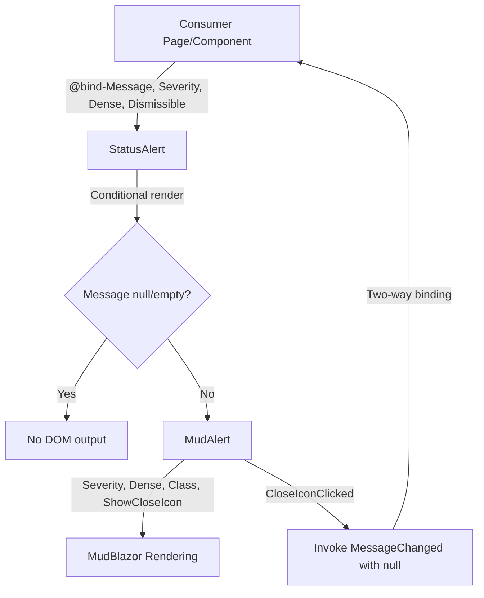

# Design Document: StatusAlert Component

## Overview

The StatusAlert component is a reusable Blazor wrapper around MudBlazor's `MudAlert` that encapsulates the conditional-rendering, styling, and dismiss-callback boilerplate repeated across 30+ usage sites in the Web project. It lives in the shared UI library (`AspireWebAppTemplate.UI`) and exposes a minimal parameter surface that covers all existing alert variations: dismissible error/success/info/warning alerts with consistent `border-1` and spacing classes, dense alerts for dialogs, and rich-content alerts with nested markup.

The component's key differentiator is **self-hiding behavior**: when `Message` is null or empty, no DOM output is produced, eliminating the `@if (!string.IsNullOrEmpty(...))` wrapper that currently precedes every `MudAlert` call site.

### Design Decisions

1. **Self-hiding via `Message` gate** — The component renders nothing when `Message` is null/empty, removing the need for `@if` blocks at every call site. This is the primary boilerplate reduction.
2. **`@bind-Message` support** — By exposing `Message` + `MessageChanged` as an `EventCallback<string?>`, consumers use standard Blazor two-way binding syntax. Dismissing sets the bound variable to null, which automatically hides the alert.
3. **Severity defaults to Error** — Analysis of existing usage shows ~70% of alerts are error alerts. Defaulting to `Severity.Error` reduces parameter noise at the majority of call sites.
4. **Dismissible defaults to true** — Most non-dialog alerts use `ShowCloseIcon`. Defaulting to dismissible reduces parameter noise while dialog alerts (dense mode) can explicitly set `Dismissible="false"`.
5. **Class composition** — The component always applies `border-1`, conditionally applies `mb-4` (when not dense), and appends any consumer-provided `Class` value. This matches the patterns observed across all existing usage sites.

## Architecture

The StatusAlert component is a thin presentation-layer wrapper with no service dependencies or state management. It follows the same partial-class pattern as existing UI shared components (`PageContent`, `LoadingOverlay`, `PageHeader`).



### Component Hierarchy

```
StatusAlert (.razor + .razor.cs)
└── MudAlert (MudBlazor)
    ├── ChildContent (RenderFragment) — rich markup when provided
    └── @Message — plain text fallback
```

## Components and Interfaces

### StatusAlert Component

**Files:**
- `AspireWebAppTemplate.UI/Components/Shared/StatusAlert.razor` — template
- `AspireWebAppTemplate.UI/Components/Shared/StatusAlert.razor.cs` — code-behind

**Parameters:**

| Parameter | Type | Default | Description |
|-----------|------|---------|-------------|
| `Message` | `string?` | `null` | The alert text. When null/empty, nothing renders. |
| `MessageChanged` | `EventCallback<string?>` | — | Callback for two-way binding; invoked with `null` on dismiss. |
| `Severity` | `Severity` | `Severity.Error` | MudBlazor severity enum controlling color/icon. |
| `Dismissible` | `bool` | `true` | Whether the close icon is shown. |
| `Dense` | `bool` | `false` | Enables compact mode (no bottom margin, dense MudAlert). |
| `Class` | `string?` | `null` | Additional CSS classes appended to the computed class string. |
| `ChildContent` | `RenderFragment?` | `null` | Rich markup rendered inside the alert body. |

**Computed CSS Logic:**
```
base = "border-1"
if (!Dense) append "mb-4"
if (Class != null) append Class
```

**Rendering Logic:**
```
if (string.IsNullOrEmpty(Message)) → render nothing
else → render MudAlert with computed parameters
  if (ChildContent != null) → render ChildContent inside MudAlert
  else → render Message as text inside MudAlert
```

### Public API Surface

```csharp
namespace AspireWebAppTemplate.UI.Components.Shared;

/// <summary>
/// A reusable alert component that wraps MudBlazor's MudAlert with self-hiding behavior,
/// consistent styling defaults, and two-way binding support for the message text.
/// </summary>
public partial class StatusAlert : ComponentBase
{
    [Parameter] public string? Message { get; set; }
    [Parameter] public EventCallback<string?> MessageChanged { get; set; }
    [Parameter] public Severity Severity { get; set; } = Severity.Error;
    [Parameter] public bool Dismissible { get; set; } = true;
    [Parameter] public bool Dense { get; set; } = false;
    [Parameter] public string? Class { get; set; }
    [Parameter] public RenderFragment? ChildContent { get; set; }
}
```

## Data Models

This component is a pure UI component with no data persistence or DTOs. The "data" it operates on is:

- **Input:** `string? Message` — the alert text to display (or hide).
- **Output:** `EventCallback<string?>` — invoked with `null` when dismissed, which clears the bound variable in the consumer.

There are no entities, database interactions, or API contracts involved.

### Parameter Validation Rules

| Rule | Behavior |
|------|----------|
| `Message` is `null` | No render |
| `Message` is `""` | No render |
| `Message` is whitespace-only (e.g., `"   "`) | Renders (whitespace is considered non-empty content) |
| `ChildContent` provided + `Message` is null/empty | No render (Message gates visibility) |
| `ChildContent` provided + `Message` is non-empty | Renders ChildContent (takes precedence over Message text) |

## Correctness Properties

*A property is a characteristic or behavior that should hold true across all valid executions of a system — essentially, a formal statement about what the system should do. Properties serve as the bridge between human-readable specifications and machine-verifiable correctness guarantees.*

### Property 1: Self-Hiding Invariant

*For any* combination of Severity, Dismissible, Dense, Class, and ChildContent values, when Message is null or empty string, the StatusAlert component SHALL produce no rendered markup (the `ShouldRender` logic returns false / the template emits nothing).

**Validates: Requirements 1.1, 1.2, 1.5**

### Property 2: Parameter Pass-Through

*For any* non-empty Message string and any valid combination of Severity (Error, Success, Info, Warning), Dismissible (true/false), and Dense (true/false), the rendered MudAlert SHALL receive exactly those values: `Severity` equals the provided Severity, `Dense` equals the provided Dense, and `ShowCloseIcon` equals the provided Dismissible.

**Validates: Requirements 2.3, 3.1, 3.3, 5.1, 5.2**

### Property 3: CSS Class Composition

*For any* non-empty Message string, any Dense value, and any consumer-provided Class string (including null), the computed CSS class string SHALL: (a) always contain `border-1`, (b) contain `mb-4` if and only if Dense is false, and (c) contain the consumer Class value when it is non-null.

**Validates: Requirements 4.1, 4.2, 4.3, 4.4**

### Property 4: Message Content Rendering

*For any* non-empty Message string, when ChildContent is not provided, the rendered alert body SHALL contain the exact Message text.

**Validates: Requirements 1.3, 6.2**

## Error Handling

This component is a pure presentation wrapper with no async operations, no I/O, and no exception-throwing paths. Error handling is minimal:

| Scenario | Behavior |
|----------|----------|
| `Message` is null | No render — no error. |
| `MessageChanged` not bound | `EventCallback` is a struct; invoking an unbound callback is a no-op in Blazor. No exception. |
| `Severity` receives invalid enum value | MudBlazor handles gracefully (renders with default styling). No guard needed. |
| `Class` contains invalid CSS | Passed through to DOM; browser ignores invalid classes. No component-level validation. |
| `ChildContent` throws during render | Blazor error boundary at layout level catches the exception. StatusAlert does not add its own try/catch. |

No custom error handling logic is required in the component implementation.

## Testing Strategy

### Dual Testing Approach

**Property-based tests (FsCheck.Xunit):**
- Validate the 4 correctness properties across randomized input combinations.
- Use FsCheck generators to produce random Severity values, boolean Dense/Dismissible flags, and arbitrary non-empty/null strings.
- Each property test runs with `[Property(MaxTest = 2)]` per project convention.
- Tag format: `// Feature: status-alert, Property N: Title`

**Unit tests (xUnit):**
- Verify specific examples and interaction behavior not covered by properties:
  - Default parameter values (Severity=Error, Dismissible=true, Dense=false)
  - ChildContent takes precedence over Message text (requirement 6.3)
  - Close icon click invokes `MessageChanged` with null (requirement 3.2)
  - Message changing from non-empty to null removes the alert (requirement 1.4)

### Test Project Location

All tests reside in `AspireWebAppTemplate.Tests/StatusAlert/` following existing feature-based organization.

### Testing Approach

Since StatusAlert is a Blazor component, the property tests will validate the **component logic** (CSS composition, render-gate decision, parameter mapping) by testing the code-behind methods or computed values directly — not by rendering full Blazor component trees. This keeps property tests fast, deterministic, and focused on correctness logic.

Unit/integration tests that verify actual rendered markup can use bUnit if added, or validate at the logic level.

### Property-Based Testing Configuration

- **Library:** FsCheck.Xunit 3.3.3 (already in test project)
- **Iterations:** `[Property(MaxTest = 2)]` per project convention
- **Generators:**
  - `Severity` — `Gen.Elements(Severity.Error, Severity.Success, Severity.Info, Severity.Warning)`
  - `bool` (Dense, Dismissible) — built-in `Arb.From<bool>()`
  - `string? Message` — null, empty string, and `Gen.Elements(...)` of sample non-empty strings
  - `string? Class` — null and `Gen.Elements(...)` of sample CSS class strings

