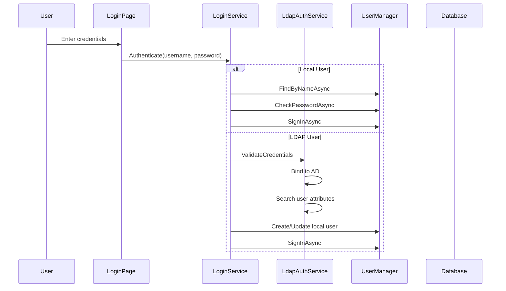

# Authentication Architecture

## Overview

The application supports two authentication sources:
- **Local Identity**: Username/password via ASP.NET Core Identity with SQL Server storage
- **LDAP**: Active Directory authentication via System.DirectoryServices

## Authentication Flow

## Key Components

| Component | Location | Purpose |
|-----------|----------|---------|
| `ILoginService` | `Application/Features/Template/Authentication/` | Login orchestration interface |
| `LoginService` | `Infrastructure/Services/Template/Authentication/` | Coordinates local vs LDAP auth |
| `ILdapAuthService` | `Application/Features/Template/Authentication/` | LDAP authentication interface |
| `LdapAuthService` | `Infrastructure/Services/Template/Authentication/` | Active Directory binding and attribute fetching |
| `IdentityRevalidatingAuthenticationStateProvider` | `Web/Components/Account/` | Revalidates auth state in SignalR circuits |

## ApplicationUser Entity

Extends `IdentityUser` with:
- `DisplayName`, `FirstName`, `LastName` — Profile fields
- `AuthSource` — "Local" or "LDAP"
- `TimeZoneId`, `Locale`, `DateTimeFormat` — User preferences
- `Theme` — ThemePreference enum (Light/Dark/System)
- `JobTitle`, `Department`, `EmployeeNumber` — Organization fields (LDAP-synced)
- `IsActive` — Soft delete / deactivation flag

## LDAP Attributes Synced

| LDAP Attribute | ApplicationUser Property |
|---------------|------------------------|
| `displayName` | DisplayName |
| `givenName` | FirstName |
| `sn` | LastName |
| `mail` | Email |
| `title` | JobTitle |
| `department` | Department |
| `employeeNumber` | EmployeeNumber |
| `samaccountname` | UserName |

## Role-Based Access Control

- Roles: Admin, User (seeded), custom roles via Role Management
- Admin role: `IsSystem=true`, `RequiresMinimumUser=true`, `Position=100`
- User role: `IsSystem=true`, `IsDefault=true`, `Position=10`
- Position-based authority hierarchy for role management operations
