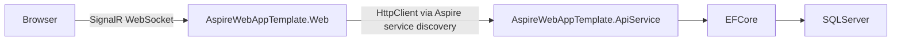

# Architecture Overview

## Solution Structure

The AspireWebAppTemplate solution follows a multi-tier architecture orchestrated by .NET Aspire, with seven projects:

```
AspireWebAppTemplate.slnx
├── AspireWebAppTemplate.AppHost/        (Aspire orchestrator)
├── AspireWebAppTemplate.ServiceDefaults/ (Shared Aspire config)
├── AspireWebAppTemplate.ApiService/     (Backend API)
├── AspireWebAppTemplate.Web/            (Frontend - Blazor Server)
├── AspireWebAppTemplate.Core/           (Shared domain & contracts)
├── AspireWebAppTemplate.UI/             (Shared UI components)
└── AspireWebAppTemplate.Tests/          (Test project)
```

### AspireWebAppTemplate.AppHost (Aspire Orchestrator)

Defines and orchestrates all services, databases, and their references using .NET Aspire.

### AspireWebAppTemplate.ServiceDefaults (Shared Aspire Configuration)

Shared configuration for health checks, telemetry (OpenTelemetry), resilience, and service discovery.

### AspireWebAppTemplate.ApiService (Backend API)

ASP.NET Core Web API with business logic, data access, and Identity.

| Folder | Purpose |
|--------|---------|
| `Controllers/` | API endpoints (Auth, Users, Roles, AuditLog) |
| `Data/` | ApplicationDbContext, entities, migrations, seed data |
| `Services/` | Business logic (LoginService, AuditLogService, LdapAuthService, ExcelExportService, etc.) |
| `Abstractions/` | Service interfaces (IAuditLogService, ILoginService, etc.) |
| `Options/` | Configuration option classes (LdapSettings) |
| `Authentication/` | InternalAuthenticationHandler for service-to-service auth |

### AspireWebAppTemplate.Web (Frontend)

Blazor Server frontend (Global InteractiveServer mode) — no database or Identity dependencies.

| Folder | Purpose |
|--------|---------|
| `Components/Pages/` | Feature pages organized by domain (Profile, Settings, UserManagement, RoleManagement, AuditLog) |
| `Components/Layout/` | MainLayout, DropdownProfile, navigation components |
| `Components/Account/` | Login, Register, Manage pages (calls API via HTTP) |
| `Services/` | HTTP client services (ApiAuthService, ApiUserService, ApiRoleService, ApiAuditLogService, etc.) |
| `Abstractions/` | Frontend service interfaces |
| `wwwroot/` | Static assets, JS interop modules (timezone.js, theme.js) |

### AspireWebAppTemplate.Core (Shared Layer)

Platform-independent business logic, domain models, contracts, and utilities shared between frontend and backend.

| Folder | Purpose |
|--------|---------|
| `Domain/Enums/` | Business enumerations (ThemePreference, AuditActionType, AuditEntityType) |
| `Contracts/` | DTOs shared between API and frontend (Auth, Users, Roles, AuditLog) |
| `Common/` | ApiResult<T>, Navigation models, constants |
| `Application/Services/` | Shared services (TimeZoneService, DefaultNavigationProvider) |
| `Application/Abstractions/` | Shared service interfaces (ITimeZoneService) |
| `Utilities/` | Helper classes (OptionalPhoneAttribute, ExportColumnAttribute, SecureConnectionString) |

### AspireWebAppTemplate.UI (UI Components)

Reusable Blazor components and theming shared across the application.

| Folder | Purpose |
|--------|---------|
| `Components/DataGrid/` | BoolFilterSelect and other grid components |
| `Components/Shared/` | PillToggle, PillToggleItem, and other generic components |
| `Theme/` | ApplicationTheme (MudTheme with dual palettes) |
| `Utilities/` | DataGridUtils<T> (in-memory filtering/sorting/pagination) |

### AspireWebAppTemplate.Tests (Test Project)

xUnit test project with FsCheck property-based testing.

| Folder | Purpose |
|--------|---------|
| `Profile/` | Profile page property tests |
| `Preferences/` | Settings page property tests |
| `Theme/` | ThemeStateService unit tests |
| `AuditLog/` | Audit log property tests |

## Request Pipeline



## Key Patterns

- **Feature-per-folder**: Each feature lives in its own folder under `Components/Pages/`
- **Code-behind**: All pages use `Index.razor` + `Index.razor.cs` separation
- **HTTP client services**: Frontend pages call API via typed HTTP client services (no direct DB access)
- **ApiResult<T>**: Typed result wrapper for all API operations
- **BaseController**: Shared controller base with `CurrentUserId`, `ClientIpAddress`
- **In-memory data grids**: `DataGridUtils<T>` for MudDataGrid client-side filtering, sorting, pagination
- **Scoped state services**: ThemeStateService (theme), UserTimeZoneContext (timezone/format) — one per SignalR circuit
- **Instant-save**: Settings page saves on value change (no Save button)
- **View/Edit mode**: Profile page uses unified layout toggle
- **MudPaper containers**: Flat cards (Elevation="0") for section grouping
