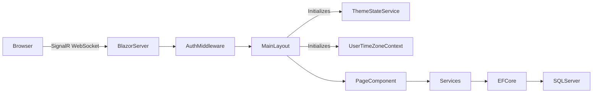

# Architecture Overview

## Solution Structure

The BlazorWebAppTemplate solution follows a clean layered architecture with four projects:

```
BlazorWebAppTemplate.slnx
├── BlazorWebAppTemplate/           (Main web application)
├── BlazorWebAppTemplate.Core/      (Business logic & domain)
├── BlazorWebAppTemplate.UI/        (Shared UI components)
└── BlazorWebAppTemplate.Tests/     (Test project)
```

### BlazorWebAppTemplate (Main Project)

The primary Blazor Server web application containing pages, services, data access, and authentication.

| Folder | Purpose |
|--------|---------|
| `Components/Pages/` | Feature pages organized by domain (Profile, Settings, UserManagement, RoleManagement, AuditLog) |
| `Components/Layout/` | MainLayout, DropdownProfile, navigation components |
| `Components/Account/` | ASP.NET Core Identity scaffolded pages (Login, Register, Manage, etc.) |
| `Data/` | ApplicationDbContext, entities, migrations, seed data |
| `Services/` | Application services (AuditLogService, ThemeStateService, UserTimeZoneContext, etc.) |
| `Abstractions/` | Service interfaces (IAuditLogService, IThemeStateService, IUserTimeZoneContext, etc.) |
| `Options/` | Configuration option classes (LdapSettings) |
| `wwwroot/` | Static assets, JS interop modules (timezone.js, theme.js) |

### BlazorWebAppTemplate.Core (Shared Layer)

Platform-independent business logic, domain models, and utilities.

| Folder | Purpose |
|--------|---------|
| `Domain/Enums/` | Business enumerations (ThemePreference, AuditActionType, AuditEntityType) |
| `Domain/Models/` | Domain value objects and DTOs |
| `Application/Services/` | Shared services (TimeZoneService, DefaultNavigationProvider) |
| `Application/Abstractions/` | Shared service interfaces (ITimeZoneService) |
| `Common/` | Navigation models, constants |
| `Utilities/` | Helper classes (OptionalPhoneAttribute, ExportableAttribute, SecureConnectionString) |

### BlazorWebAppTemplate.UI (UI Components)

Reusable Blazor components and theming shared across the application.

| Folder | Purpose |
|--------|---------|
| `Components/DataGrid/` | BoolFilterSelect and other grid components |
| `Components/Shared/` | PillToggle, PillToggleItem, and other generic components |
| `Theme/` | ApplicationTheme (MudTheme with dual palettes) |
| `Utilities/` | DataGridUtils, DisplayHelper |

### BlazorWebAppTemplate.Tests (Test Project)

xUnit test project with FsCheck property-based testing.

| Folder | Purpose |
|--------|---------|
| `Profile/` | Profile page property tests |
| `Preferences/` | Settings page property tests |
| `Theme/` | ThemeStateService unit tests |
| `AuditLog/` | Audit log property tests (planned) |

## Request Pipeline



## Key Patterns

- **Feature-per-folder**: Each feature lives in its own folder under `Components/Pages/`
- **Code-behind**: All pages use `Index.razor` + `Index.razor.cs` separation
- **Server-side data grids**: `DataGridUtils<T>` for MudDataGrid with filtering, sorting, pagination
- **Scoped state services**: ThemeStateService (theme), UserTimeZoneContext (timezone/format) — one per SignalR circuit
- **Instant-save**: Settings page saves on value change (no Save button)
- **View/Edit mode**: Profile page uses unified layout toggle
- **MudPaper containers**: Flat cards (Elevation="0") for section grouping
