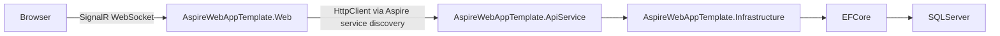

# Architecture Overview

## Solution Structure

The AspireWebAppTemplate solution follows a Clean Architecture pattern with four layers (Domain → Application → Infrastructure → Host), orchestrated by .NET Aspire. The solution contains nine projects:

```
AspireWebAppTemplate.slnx
├── AspireWebAppTemplate.AppHost/         (Aspire orchestrator)
├── AspireWebAppTemplate.ServiceDefaults/ (Shared Aspire config)
├── AspireWebAppTemplate.Domain/          (Domain layer — enums, constants, attributes, pure entities)
├── AspireWebAppTemplate.Application/     (Application layer — interfaces, DTOs, contracts, extensions)
├── AspireWebAppTemplate.Infrastructure/  (Infrastructure layer — EF Core, Identity, services, data access)
├── AspireWebAppTemplate.ApiService/      (API host — thin controllers, authentication, composition root)
├── AspireWebAppTemplate.Web/             (Frontend — Blazor Server)
├── AspireWebAppTemplate.UI/             (Shared UI components)
└── AspireWebAppTemplate.Tests/          (Test project)
```

## Dependency Flow

```
Domain (zero dependencies)
  ↑
Application (depends on Domain)
  ↑
Infrastructure (depends on Application)
  ↑
ApiService (depends on Application + Infrastructure + ServiceDefaults)
Web (depends on Application + UI + ServiceDefaults)
```

### AspireWebAppTemplate.AppHost (Aspire Orchestrator)

Defines and orchestrates all services, databases, and their references using .NET Aspire.

### AspireWebAppTemplate.ServiceDefaults (Shared Aspire Configuration)

Shared configuration for health checks, telemetry (OpenTelemetry), resilience, and service discovery.

### AspireWebAppTemplate.Domain (Domain Layer)

Pure domain primitives with zero external dependencies.

| Folder | Purpose |
|--------|---------|
| `Enums/` | Business enumerations (AuditActionType, AuditEntityType, ThemePreference, NotificationCategory, AnnouncementDisplayType, AnnouncementSeverity, EmailType, EmailTemplateCategory, AuthSource, ExportScope) |
| `Constants/` | Shared constants (SystemPageDefaults, DateTimeFormatDefaults, ExportDefaults) |
| `Attributes/` | Custom validation/metadata attributes (ExportColumnAttribute, OptionalPhoneAttribute) |
| `Entities/` | Pure domain entities without Identity dependencies (EmailTemplate) |
| `ValueObjects/` | Value objects (reserved for future use) |

### AspireWebAppTemplate.Application (Application Layer)

Service contracts, DTOs, shared logic, and pure-logic utilities. Depends only on Domain.

| Folder | Purpose |
|--------|---------|
| `Features/Template/{Feature}/` | Feature-owned service interface(s) **and** their DTOs, co-located per feature under one namespace (`...Application.Features.Template.{Feature}`). Template features: AuditLog, Users, Roles, Notifications, Announcements, Email, Authentication, PagePermissions, Ai, Navigation. Business features go under `Features/{BusinessModule}/`. |
| `Abstractions/` | ONLY layer-wide cross-cutting contracts (ICurrentUserAccessor, IExcelExportService, ITimeZoneHelper). |
| `Common/` | Cross-cutting shape types with no behavior (ApiResult, NavItem, PagedResult). |
| `Extensions/` | Extension methods (NavigationProviderExtensions, QueryableExtensions) |
| `Utilities/` | Pure-logic implementations with no external dependencies (DefaultNavigationProvider, TimeZoneHelper) |

> **Feature-first:** see [Feature Organization & Template/Business Separation](feature-organization.md).

### AspireWebAppTemplate.Infrastructure (Infrastructure Layer)

Implements Application interfaces. Contains all data access, Identity, and external service integrations.

| Folder | Purpose |
|--------|---------|
| `Data/` | ApplicationDbContext, entity configurations, migrations, seed data |
| `Data/Entities/Template/` | EF Core entities under a Template ownership marker (Announcement, AuditLogEntry, Notification, PagePermission, etc.). Responsibility-first (queried by kind for migrations/schema review; NOT feature-nested). Business entities go under `Data/Entities/{BusinessModule}/`. |
| `Data/SeedData/` | Partial class seed data files (roles, users, page permissions, email templates, announcements) |
| `Identity/` | ASP.NET Core Identity entities (ApplicationUser, ApplicationRole) |
| `Services/Template/{Feature}/` | Business service implementations, organized **feature-first** under a Template ownership marker (e.g., `Services/Template/AuditLog/AuditLogService.cs`, namespace `...Infrastructure.Services.Template.{Feature}`). Business services go under `Services/{BusinessModule}/`. |
| `Services/` (root) | Only cross-cutting service implementations that belong to no single feature (CurrentUserAccessor, ExcelExportService). |
| `Clients/` | Typed HttpClients (WebCallbackClient) |
| `Handlers/` | Delegating handlers (InternalApiKeyDelegatingHandler) |
| `Extensions/` | DI registration (InfrastructureServiceExtensions → AddInfrastructureServices()) |
| `Options/` | Configuration option classes (LdapSettings) |
| `Utilities/` | Helper classes (AuditChangeHelper, CurrentUserAccessor, SecureConnectionString) |

### AspireWebAppTemplate.ApiService (API Host)

Thin HTTP host layer. Controllers delegate all work to Infrastructure services.

| Folder | Purpose |
|--------|---------|
| `Controllers/Template/` | Thin REST API controllers, template-owned, kept flat (one controller = one API resource; no per-feature folder). E.g. `UsersController.cs`, `AuditLogController.cs`. Business controllers go under `Controllers/Business/`. `BaseController` and `WeatherController` stay at `Controllers/` root. |
| `Authentication/` | InternalAuthenticationHandler for service-to-service auth |
| `Program.cs` | Composition root (DI, middleware, Identity, EF Core configuration) |

### AspireWebAppTemplate.Web (Frontend)

Blazor Server frontend (Global InteractiveServer mode) — no database, Identity, or Infrastructure dependencies.

| Folder | Purpose |
|--------|---------|
| `Components/Pages/` | Feature pages organized by domain (Profile, Settings, UserManagement, RoleManagement, AuditLog, Notifications, Announcements, EmailTemplates) |
| `Components/Layout/` | Region-based layout (MainLayout, Topbar, Sidebar, Footer) |
| `Common/Defaults/` | Centralized constants (AssetDefaults — logo/background paths) |
| `Extensions/` | DI registration extensions (ApiClientServiceExtensions, ApplicationServiceExtensions) |
| `Services/ApiClients/` | Typed HttpClient services (ApiUserService, ApiNotificationService, ApiAnnouncementService, etc.) |
| `Services/Contexts/` | Per-circuit scoped state (NotificationContext, AnnouncementContext, CircuitUserContext) |
| `Services/Handlers/` | Delegating handlers (UserIdentityDelegatingHandler) |
| `Endpoints/` | Minimal API endpoints (NotificationCallbackEndpoint) |
| `Hubs/` | SignalR hubs (NotificationHub) |
| `Authorization/` | PagePermissionHandler, requirements |
| `Authentication/` | InternalApiKeyAuthenticationHandler (service-to-service) |
| `wwwroot/` | Static assets, JS interop modules (timezone.js, theme.js) |

### AspireWebAppTemplate.UI (UI Components)

Reusable Blazor components and theming shared across the application.

| Folder | Purpose |
|--------|---------|
| `Components/DataGrid/` | BoolFilterSelect, EnumFilterSelect, StringFilterSelect |
| `Components/Shared/` | PageContent, LoadingOverlay, PageHeader, StatusAlert, PillToggle, ModalDialog, etc. |
| `Theme/` | DefaultTheme (neutral blue), JabilTheme (corporate brand) — dual palette themes |
| `Utilities/` | DataGridHelper<T>, QueryableDataGridHelper<T> |

### AspireWebAppTemplate.Tests (Test Project)

xUnit test project with FsCheck property-based testing.

| Folder | Purpose |
|--------|---------|
| `Announcements/` | Announcement feature property + unit tests |
| `ControllerServiceRefactor/` | Service layer property + unit tests |
| `AuditLog/` | Audit log property + unit tests |
| `Email/` | Email template/service property + unit tests |
| `Notifications/` | Notification feature property + unit tests |
| `PagePermissions/` | Page permissions property + unit tests |
| `Services/` | Service-level unit tests |
| `Layout/` | Layout/component tests |

## Request Pipeline



## Key Patterns

- **Clean Architecture**: Domain → Application → Infrastructure → Host layers with strict inward dependency flow
- **Feature-per-folder**: Each feature lives in its own folder under `Components/Pages/`
- **Code-behind**: All pages use `Index.razor` + `Index.razor.cs` separation
- **HTTP client services**: Frontend pages call API via typed HTTP client services (no direct DB access)
- **ApiResult<T>**: Typed result wrapper for all API operations
- **BaseController**: Shared controller base with `CurrentUserId`, `ClientIpAddress`
- **In-memory data grids**: `DataGridHelper<T>` for MudDataGrid client-side filtering, sorting, pagination
- **Queryable data grids**: `QueryableDataGridHelper<T>` for true server-side filtering/sorting/pagination (audit log)
- **Scoped state services**: ThemeStateService (theme), UserTimeZoneContext (timezone/format) — one per SignalR circuit
- **Instant-save**: Settings page saves on value change (no Save button)
- **View/Edit mode**: Profile page uses unified layout toggle
- **MudPaper containers**: Flat cards (Elevation="0") for section grouping
- **Real-time notifications**: API → Web callback → SignalR hub → browser
