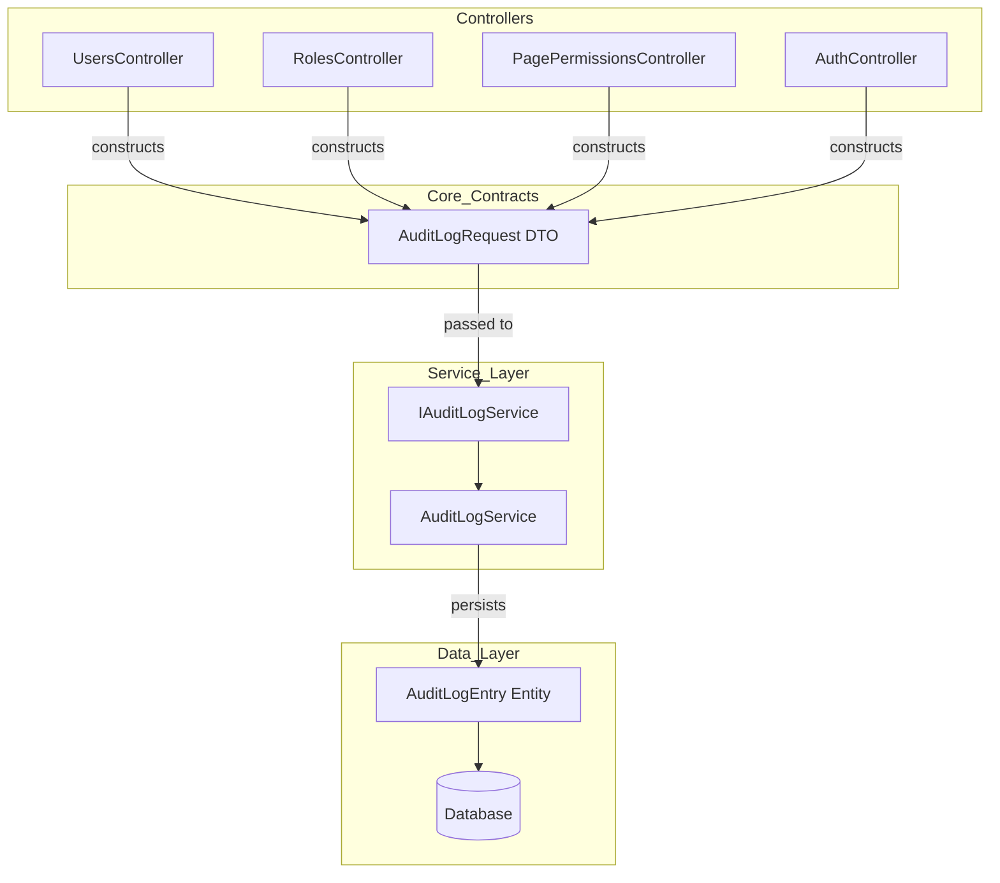

# Design Document: Audit Log Old/New Values

## Overview

This design enhances the existing audit log system in two complementary ways:

1. **API Refactoring**: Introduces an `AuditLogRequest` DTO contract class to replace the current long-parameter-list `LogAsync()` method signature. The old signature is removed entirely since all callers are migrated in the same change.

2. **Change Tracking**: Populates the existing `OldValues` and `NewValues` columns on `AuditLogEntry` for all update-type operations across `UsersController`, `RolesController`, `PagePermissionsController`, and `AuthController`. Only changed fields are included in the JSON payload, using camelCase property naming via `System.Text.Json`.

The approach is intentionally simple — change detection happens at the controller level by snapshotting relevant fields before the mutation and comparing after. No EF Core interceptors or shadow properties are used, keeping the solution explicit and easy to reason about.

## Architecture



**Data Flow for Update Operations:**

1. Controller loads entity from database (current state)
2. Controller snapshots the relevant fields into a dictionary/anonymous object
3. Controller applies the mutation (update the entity)
4. Controller snapshots the post-mutation fields
5. Controller computes the diff (only changed fields)
6. Controller serializes the diff as camelCase JSON for `OldValues` and `NewValues`
7. Controller constructs an `AuditLogRequest` and calls `LogAsync(AuditLogRequest)`
8. `AuditLogService` maps the DTO to an `AuditLogEntry` entity and persists it

**Design Decision — Controller-Level Change Detection:**
Change detection is performed in controllers rather than using EF Core interceptors because:
- Each controller knows which fields are audit-relevant (excluding sensitive fields like password hashes)
- Different entities have different field subsets worth tracking
- The logic is explicit, testable, and doesn't require EF Core plumbing knowledge
- It aligns with the existing pattern of controllers constructing audit descriptions

## Components and Interfaces

### 1. AuditLogRequest DTO

**Location:** `AspireWebAppTemplate.Core/Contracts/AuditLog/AuditLogRequest.cs`

```csharp
using AspireWebAppTemplate.Core.Domain.Enums;

namespace AspireWebAppTemplate.Core.Contracts.AuditLog;

public sealed class AuditLogRequest
{
    public string? UserId { get; set; }
    public AuditActionType ActionType { get; set; }
    public AuditEntityType EntityType { get; set; }
    public string EntityId { get; set; } = string.Empty;
    public string EntityName { get; set; } = string.Empty;
    public string Description { get; set; } = string.Empty;
    public string? OldValues { get; set; }
    public string? NewValues { get; set; }
    public string? IpAddress { get; set; }
}
```

### 2. IAuditLogService Interface Changes

**Location:** `AspireWebAppTemplate.ApiService/Abstractions/IAuditLogService.cs`

Replace the existing `LogAsync` method (with individual parameters) with:
```csharp
Task LogAsync(AuditLogRequest request);
```

### 3. AuditChangeHelper Utility

**Location:** `AspireWebAppTemplate.ApiService/Utilities/AuditChangeHelper.cs`

A static helper class providing reusable change-detection and serialization logic:

```csharp
public static class AuditChangeHelper
{
    private static readonly JsonSerializerOptions CamelCaseOptions = new()
    {
        PropertyNamingPolicy = JsonNamingPolicy.CamelCase,
        DefaultIgnoreCondition = JsonIgnoreCondition.Never
    };

    public static Dictionary<string, object?> Snapshot<T>(
        T entity, params (string Key, Func<T, object?> Getter)[] fields);

    public static (string? OldValues, string? NewValues) ComputeChanges(
        Dictionary<string, object?> before, Dictionary<string, object?> after);

    public static string? Serialize(object? value);
}
```

### 4. Controller Modifications

Each controller defines its auditable field list once as a static array, then uses `AuditChangeHelper.Snapshot` for before/after capture:

```csharp
private static readonly (string, Func<ApplicationUser, object?>)[] UserAuditFields =
[
    ("DisplayName", u => u.DisplayName),
    ("FirstName", u => u.FirstName),
    ("LastName", u => u.LastName),
    ("Email", u => u.Email),
    ("PhoneNumber", u => u.PhoneNumber),
    ("JobTitle", u => u.JobTitle),
    ("Department", u => u.Department),
    ("EmployeeNumber", u => u.EmployeeNumber),
];
```

## Data Models

### AuditLogRequest DTO (New)

| Property | Type | Required | Default | Notes |
|----------|------|----------|---------|-------|
| UserId | string? | No | null | Acting user; null for system events |
| ActionType | AuditActionType | Yes | — | Enum value for action category |
| EntityType | AuditEntityType | Yes | — | Enum value for entity category |
| EntityId | string | Yes | string.Empty | Affected entity identifier |
| EntityName | string | Yes | string.Empty | Human-readable entity name |
| Description | string | Yes | string.Empty | Human-readable action summary |
| OldValues | string? | No | null | JSON of changed fields (before) |
| NewValues | string? | No | null | JSON of changed fields (after) |
| IpAddress | string? | No | null | Client IP address |

### JSON Serialization Format

All `OldValues`/`NewValues` JSON uses:
- `System.Text.Json` with `JsonNamingPolicy.CamelCase`
- Null values serialized as JSON `null` (not omitted)
- Only changed fields included

**Example — User Update:**
```json
// OldValues
{"displayName": "John Doe", "department": "IT"}
// NewValues  
{"displayName": "John Smith", "department": "Engineering"}
```

**Example — Activate User:**
```json
// OldValues
{"isActive": false}
// NewValues
{"isActive": true}
```

## Correctness Properties

### Property 1: LogAsync Field Mapping Correctness

*For any* valid combination of audit parameters, calling `LogAsync(AuditLogRequest)` SHALL produce an `AuditLogEntry` where each field matches the corresponding property on the request.

**Validates: Requirements 1.4, 2.5, 8.1**

### Property 2: ComputeChanges Includes Only and All Differing Fields

*For any* two dictionaries representing before/after states, `ComputeChanges` SHALL return JSON containing exactly the keys whose values differ — no more, no fewer.

**Validates: Requirements 3.1, 3.2, 4.1, 4.2, 6.1, 6.2, 6.3, 7.2, 7.3**

### Property 3: Serialization Round-Trip Preserves Values

*For any* dictionary of string keys to nullable object values, serializing and deserializing SHALL produce equivalent key-value pairs.

**Validates: Requirements 3.5, 4.3, 4.4, 5.1, 7.1**

### Property 4: CamelCase Naming in Serialized Output

*For any* typed object with PascalCase properties, serializing via `AuditChangeHelper.Serialize` SHALL produce camelCase property names.

**Validates: Requirements 7.1**

### Property 5: Null Values Preserved as JSON Null

*For any* dictionary containing null values, serializing SHALL produce JSON with those keys present as JSON `null`.

**Validates: Requirements 7.5**

### Property 6: AuditLogRequest Default Property Values

*For any* newly constructed `AuditLogRequest`, EntityId, EntityName, and Description SHALL equal `string.Empty`.

**Validates: Requirements 1.2**

## Error Handling

| Scenario | Behavior |
|----------|----------|
| Database exception during `LogAsync(AuditLogRequest)` | Swallowed; logged at Error level |
| `AuditLogRequest.UserId` is null | `UserDisplayName` resolved to empty string |
| No fields changed during an update | `OldValues` and `NewValues` set to null |
| Controller entity not found (404) | Audit not recorded; returns NotFound |
| Update operation fails | Audit not recorded; returns BadRequest |

## Testing Strategy

### Property-Based Tests (FsCheck.Xunit 3.x)

| Property | Test Class |
|----------|-----------|
| Property 1: Field Mapping | `AuditLogRequestFieldMappingTests` |
| Property 2: ComputeChanges Diff | `ComputeChangesDiffPropertyTests` |
| Property 3: Serialization Round-Trip | `SerializationRoundTripPropertyTests` |
| Property 4: CamelCase Naming | `CamelCaseNamingPropertyTests` |
| Property 5: Null Preservation | `NullPreservationPropertyTests` |
| Property 6: Default Values | `AuditLogRequestDefaultsPropertyTests` |

### Unit Tests (Example-Based)

| Test | Validates |
|------|-----------|
| ActivateUser produces `{"isActive":false}` / `{"isActive":true}` | Req 3.3 |
| DeactivateUser produces `{"isActive":true}` / `{"isActive":false}` | Req 3.4 |
| ChangePassword produces `{"passwordChanged":true}` with null OldValues | Req 6.4 |
| Sensitive fields never appear in snapshots | Req 7.4 |
| PagePermissions audit uses SettingsChanged, Role | Req 5.2, 5.3 |
