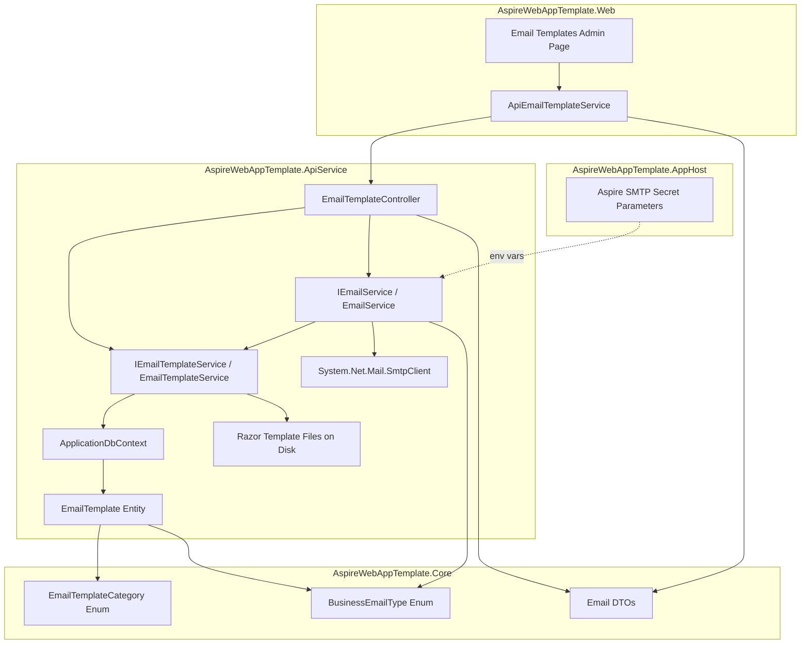
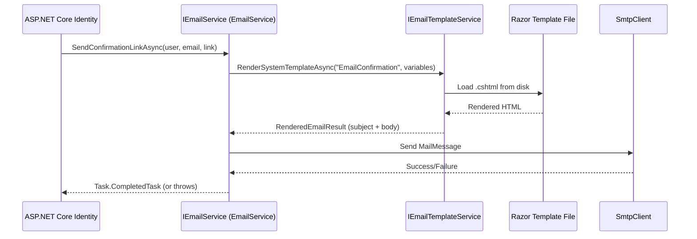
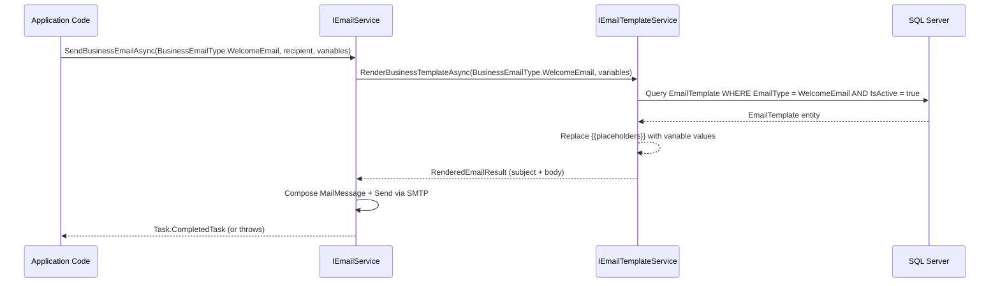

# Design Document: Email SMTP Integration

## Overview

The email SMTP integration replaces the existing `NoOpEmailSender` with a production-ready email sending service that uses a two-tier template architecture with an **edit-only model** for business notifications. The design follows the **thin controller / full service layer** pattern established by `NotificationController` → `INotificationService`:

- **Thin controller**: `EmailTemplateController` handles only HTTP concerns — receiving requests, extracting user identity, delegating to services, and mapping exceptions to status codes.
- **Full service layer**: `IEmailService` owns SMTP sending logic; `IEmailTemplateService` owns template resolution, rendering, and editing. Controllers never touch `ApplicationDbContext`.
- A typed HttpClient `ApiEmailTemplateService` in the Web project for admin UI communication.
- MudBlazor-based admin page for business template editing.

### Design Rationale

**Two-tier template architecture:**

System security templates (password reset, email confirmation, 2FA, lockout, email changed, password changed) are stored as Razor `.cshtml` files on disk. These cannot be modified at runtime — changes require code deployment. This protects critical security flows from accidental admin errors.

Business notification templates (welcome email, account deactivated, custom notification) are stored in the database and editable at runtime via an admin page. This gives administrators flexibility to customize messaging without developer involvement.

**Edit-only business template model with BusinessEmailType enum:**

Instead of allowing administrators to create or delete templates, the system uses a fixed set determined by a `BusinessEmailType` enum. One template per enum value is seeded into the database on first deployment. Administrators can only **edit** the content (subject, body, placeholder hints, active toggle) — they cannot create new template types or delete existing ones. This provides:

- **Type safety** — application code references an enum, not magic strings
- **Simplicity** — no variant management, no default resolution logic, no create/delete safety constraints
- **Predictability** — the template set is always known at compile time
- **Safety** — cannot accidentally delete a template needed by application code
- **Clear seeding** — one template per BusinessEmailType on first deployment

**Template resolution by BusinessEmailType:**

The `IEmailTemplateService` resolves business templates by `BusinessEmailType` → finds the single active template for that type. System templates remain resolved by string name from Razor files on disk.

**SMTP configuration via Aspire pattern:**

Following the existing AI credentials pattern (`builder.AddParameter("ai-access-key-id", secret: true)`), SMTP secrets (username/password) are Aspire parameters while non-secrets (host, port, from address) live in `appsettings.json`.


## Architecture

### High-Level Component Diagram



### Data Flow — Sending a System Security Email



### Data Flow — Sending a Business Notification Email




## Components and Interfaces

### 1. IEmailService (ApiService/Abstractions/)

The primary email sending service. Implements both the custom `IEmailService` interface and ASP.NET Core Identity's `IEmailSender<ApplicationUser>` to replace `NoOpEmailSender`.

```csharp
/// <summary>
/// Defines the contract for sending emails via SMTP. Handles both system security emails
/// (triggered by ASP.NET Core Identity) and business notification emails (triggered by
/// application code). All SMTP connection, authentication, and message composition logic
/// is encapsulated here.
/// </summary>
/// <remarks>
/// <para>
/// The implementation also satisfies <c>IEmailSender&lt;ApplicationUser&gt;</c> for Identity
/// integration. When SMTP configuration is missing or incomplete, the service falls back to
/// no-op behavior (logging email details without sending).
/// </para>
/// <para>
/// Registered as a scoped service to align with per-request DbContext lifetime.
/// </para>
/// </remarks>
public interface IEmailService
{
    #region System Email Operations

    /// <summary>
    /// Sends a system security email using the specified template name and placeholder values.
    /// Resolves the template from Razor files on disk via <see cref="IEmailTemplateService"/>.
    /// </summary>
    /// <param name="templateName">The system template identifier (e.g., "PasswordReset", "EmailConfirmation").</param>
    /// <param name="recipientEmail">The recipient's email address.</param>
    /// <param name="variables">Dictionary of placeholder names to values for template rendering.</param>
    /// <returns>A task representing the asynchronous send operation.</returns>
    /// <exception cref="InvalidOperationException">
    /// Thrown when the SMTP client fails to connect, authenticate, or deliver the message.
    /// </exception>
    /// <exception cref="KeyNotFoundException">
    /// Thrown when the specified template file does not exist on disk.
    /// </exception>
    Task SendSystemEmailAsync(string templateName, string recipientEmail, Dictionary<string, string> variables);

    #endregion

    #region Business Email Operations

    /// <summary>
    /// Sends a business notification email for the specified <see cref="BusinessEmailType"/>.
    /// Resolves the template from the database via <see cref="IEmailTemplateService"/>.
    /// </summary>
    /// <param name="emailType">The business email type to send.</param>
    /// <param name="recipientEmail">The recipient's email address.</param>
    /// <param name="variables">Dictionary of placeholder names to values for template rendering.</param>
    /// <returns>A task representing the asynchronous send operation.</returns>
    /// <exception cref="InvalidOperationException">
    /// Thrown when the SMTP client fails to connect, authenticate, or deliver the message.
    /// </exception>
    /// <exception cref="KeyNotFoundException">
    /// Thrown when no active template exists for the specified BusinessEmailType.
    /// </exception>
    Task SendBusinessEmailAsync(BusinessEmailType emailType, string recipientEmail, Dictionary<string, string> variables);

    #endregion

    #region Test Operations

    /// <summary>
    /// Sends a test email to verify SMTP configuration is working correctly.
    /// Uses a hardcoded simple template with application name and timestamp.
    /// </summary>
    /// <param name="recipientEmail">The recipient's email address for the test.</param>
    /// <returns>A task representing the asynchronous send operation.</returns>
    /// <exception cref="InvalidOperationException">
    /// Thrown when the SMTP connection fails, authentication fails, or delivery is rejected.
    /// </exception>
    Task SendTestEmailAsync(string recipientEmail);

    #endregion
}
```

### 2. IEmailTemplateService (ApiService/Abstractions/)

Owns template resolution, rendering, and edit operations for business templates. No create or delete operations.

```csharp
/// <summary>
/// Defines the contract for email template resolution, rendering, and management.
/// Determines the template source (disk vs database) based on <see cref="EmailTemplateCategory"/>
/// and provides edit operations for business notification templates.
/// </summary>
/// <remarks>
/// <para>
/// System security templates are read-only Razor files on disk. Business notification templates
/// use an edit-only model: each <see cref="BusinessEmailType"/> has exactly one template in the
/// database (seeded on first deployment). Administrators can edit content but cannot create new
/// templates or delete existing ones.
/// </para>
/// <para>
/// Registered as a scoped service to align with per-request DbContext lifetime.
/// </para>
/// </remarks>
public interface IEmailTemplateService
{
    #region Template Rendering

    /// <summary>
    /// Renders a system security template from a Razor file on disk with the provided variables.
    /// </summary>
    /// <param name="templateName">The system template identifier (e.g., "PasswordReset").</param>
    /// <param name="variables">Dictionary of placeholder names to values.</param>
    /// <returns>A <see cref="RenderedEmailResult"/> containing the rendered subject and HTML body.</returns>
    /// <exception cref="KeyNotFoundException">Thrown when the Razor template file is not found on disk.</exception>
    Task<RenderedEmailResult> RenderSystemTemplateAsync(string templateName, Dictionary<string, string> variables);

    /// <summary>
    /// Renders the active template for the specified <see cref="BusinessEmailType"/>
    /// from the database with the provided variables. Uses simple <c>{{placeholder}}</c>
    /// string replacement on both subject and body.
    /// </summary>
    /// <param name="emailType">The business email type to resolve.</param>
    /// <param name="variables">Dictionary of placeholder names to values.</param>
    /// <returns>A <see cref="RenderedEmailResult"/> containing the rendered subject and HTML body.</returns>
    /// <exception cref="KeyNotFoundException">Thrown when no active template exists for the type.</exception>
    Task<RenderedEmailResult> RenderBusinessTemplateAsync(BusinessEmailType emailType, Dictionary<string, string> variables);

    /// <summary>
    /// Renders any template (system or business) with sample data for admin preview purposes.
    /// </summary>
    /// <param name="templateId">The unique identifier of the template to preview.</param>
    /// <param name="sampleData">Dictionary of sample placeholder values.</param>
    /// <returns>A <see cref="RenderedEmailResult"/> containing the preview-rendered subject and HTML body.</returns>
    /// <exception cref="KeyNotFoundException">Thrown when the template does not exist.</exception>
    Task<RenderedEmailResult> RenderPreviewAsync(Guid templateId, Dictionary<string, string> sampleData);

    #endregion

    #region Query Operations

    /// <summary>
    /// Retrieves all email templates (both system metadata entries and business templates).
    /// System templates are returned with metadata only (category, display name, placeholder hints).
    /// </summary>
    /// <returns>A list of all <see cref="EmailTemplateDto"/> records.</returns>
    Task<List<EmailTemplateDto>> GetAllAsync();

    /// <summary>
    /// Retrieves a single email template by its unique identifier.
    /// </summary>
    /// <param name="id">The template's unique identifier.</param>
    /// <returns>The <see cref="EmailTemplateDto"/> for the specified template.</returns>
    /// <exception cref="KeyNotFoundException">Thrown when no template exists with the specified ID.</exception>
    Task<EmailTemplateDto> GetByIdAsync(Guid id);

    #endregion

    #region Edit Operations

    /// <summary>
    /// Updates an existing business notification template. Rejects updates to system templates.
    /// This is the only mutation operation — no create or delete is supported.
    /// </summary>
    /// <param name="id">The template's unique identifier.</param>
    /// <param name="request">The <see cref="UpdateEmailTemplateRequest"/> with updated fields.</param>
    /// <returns>The updated <see cref="EmailTemplateDto"/>.</returns>
    /// <exception cref="KeyNotFoundException">Thrown when no template exists with the specified ID.</exception>
    /// <exception cref="InvalidOperationException">Thrown when attempting to update a system template.</exception>
    Task<EmailTemplateDto> UpdateAsync(Guid id, UpdateEmailTemplateRequest request);

    #endregion
}
```

### 3. EmailTemplateController (ApiService/Controllers/)

A thin controller handling HTTP concerns only. Delegates all business logic to `IEmailTemplateService` and `IEmailService`. No POST create or DELETE endpoints — the template set is fixed by seed data.

```csharp
/// <summary>
/// Provides email template query, edit, preview, and test email endpoints.
/// This controller is intentionally thin — it handles HTTP concerns only (request parsing,
/// user identity extraction, status code mapping) and delegates all business logic to
/// <see cref="IEmailTemplateService"/> and <see cref="IEmailService"/>.
/// </summary>
/// <remarks>
/// <para>
/// The template set is fixed by the <see cref="BusinessEmailType"/> enum and seed data.
/// This controller does NOT expose POST (create) or DELETE endpoints — administrators
/// can only edit existing business templates.
/// </para>
/// <para>
/// Exception-to-HTTP-status mapping:
/// <list type="bullet">
///   <item><see cref="KeyNotFoundException"/> → 404 Not Found</item>
///   <item><see cref="InvalidOperationException"/> → 400 Bad Request</item>
///   <item><see cref="ArgumentException"/> → 400 Bad Request</item>
/// </list>
/// </para>
/// </remarks>
[Route("api/email-templates")]
[Authorize]
public class EmailTemplateController : BaseController
{
    private readonly IEmailTemplateService _templateService;
    private readonly IEmailService _emailService;

    public EmailTemplateController(
        IEmailTemplateService templateService,
        IEmailService emailService)
    {
        _templateService = templateService;
        _emailService = emailService;
    }

    // GET    /api/email-templates           — list all templates
    // GET    /api/email-templates/{id}      — get single template
    // PUT    /api/email-templates/{id}      — update business template (edit-only)
    // POST   /api/email-templates/{id}/preview — render template with sample data
    // POST   /api/email-templates/test      — send test email
}
```

**Thin Controller Example — Get All:**

```csharp
/// <summary>
/// Retrieves all email templates (system metadata and business templates).
/// </summary>
[HttpGet]
[ProducesResponseType(typeof(List<EmailTemplateDto>), StatusCodes.Status200OK)]
public async Task<IActionResult> GetAll()
{
    var result = await _templateService.GetAllAsync();
    return Ok(result);
}
```

**Thin Controller Example — Update (Edit-Only):**

```csharp
/// <summary>
/// Updates an existing business notification template.
/// Rejects updates to system templates.
/// </summary>
[HttpPut("{id:guid}")]
[ProducesResponseType(typeof(EmailTemplateDto), StatusCodes.Status200OK)]
[ProducesResponseType(StatusCodes.Status400BadRequest)]
[ProducesResponseType(StatusCodes.Status404NotFound)]
public async Task<IActionResult> Update(Guid id, [FromBody] UpdateEmailTemplateRequest request)
{
    try
    {
        var result = await _templateService.UpdateAsync(id, request);
        return Ok(result);
    }
    catch (KeyNotFoundException ex) { return NotFound(ex.Message); }
    catch (InvalidOperationException ex) { return BadRequest(ex.Message); }
}
```

**Thin Controller Example — Send Test Email:**

```csharp
/// <summary>
/// Sends a test email to verify SMTP configuration.
/// </summary>
[HttpPost("test")]
[ProducesResponseType(StatusCodes.Status200OK)]
[ProducesResponseType(StatusCodes.Status400BadRequest)]
public async Task<IActionResult> SendTestEmail([FromBody] SendTestEmailRequest request)
{
    try
    {
        await _emailService.SendTestEmailAsync(request.RecipientEmail);
        return Ok();
    }
    catch (InvalidOperationException ex) { return BadRequest(ex.Message); }
}
```

**Thin Controller Example — Preview:**

```csharp
/// <summary>
/// Renders a template with sample data for admin preview.
/// </summary>
[HttpPost("{id:guid}/preview")]
[ProducesResponseType(typeof(RenderedEmailResult), StatusCodes.Status200OK)]
[ProducesResponseType(StatusCodes.Status404NotFound)]
public async Task<IActionResult> Preview(Guid id, [FromBody] PreviewTemplateRequest request)
{
    try
    {
        var result = await _templateService.RenderPreviewAsync(id, request.SampleData);
        return Ok(result);
    }
    catch (KeyNotFoundException ex) { return NotFound(ex.Message); }
}
```

### 4. ApiEmailTemplateService (Web/Services/ApiClients/)

Typed HttpClient service for the Web project to communicate with the email template API endpoints. No create or delete methods.

```csharp
/// <summary>
/// Typed HttpClient service for email template management API operations.
/// Uses Aspire service discovery and UserIdentityDelegatingHandler for auth propagation.
/// Supports only read and edit operations — template creation and deletion are not available.
/// </summary>
public class ApiEmailTemplateService
{
    private readonly HttpClient _http;

    public ApiEmailTemplateService(HttpClient http)
    {
        _http = http;
    }

    Task<ApiResult<List<EmailTemplateDto>>> GetAllAsync();
    Task<ApiResult<EmailTemplateDto>> GetByIdAsync(Guid id);
    Task<ApiResult<EmailTemplateDto>> UpdateAsync(Guid id, UpdateEmailTemplateRequest request);
    Task<ApiResult<RenderedEmailResult>> PreviewAsync(Guid id, PreviewTemplateRequest request);
    Task<ApiResult> SendTestEmailAsync(SendTestEmailRequest request);
}
```

### 5. RenderedEmailResult (Internal Model)

```csharp
/// <summary>
/// Represents the output of rendering an email template — the resolved subject line
/// and fully-rendered HTML body ready for sending.
/// </summary>
public sealed class RenderedEmailResult
{
    /// <summary>
    /// The rendered subject line with all placeholders replaced.
    /// </summary>
    public string Subject { get; set; } = string.Empty;

    /// <summary>
    /// The rendered HTML body with all placeholders replaced.
    /// </summary>
    public string HtmlBody { get; set; } = string.Empty;
}
```

### 6. UI Components

| Component | Location | Description |
|-----------|----------|-------------|
| `EmailTemplates` page | Web/Components/Pages/Admin/EmailTemplates/ | Admin page for editing business notification templates and viewing system template metadata |

The admin page uses `MudDataGrid<EmailTemplateDto>` with in-memory `Items` binding (small dataset), displays business templates with edit actions and system templates as read-only rows with a lock icon. No create or delete actions are available. The page provides edit dialogs for business templates and preview dialogs for all templates.

## Data Models

### EmailTemplate Entity (ApiService/Data/Entities/)

```csharp
/// <summary>
/// Represents an email template record stored in the database. Business notification
/// templates belong to a predefined <see cref="BusinessEmailType"/> with exactly one
/// template per type (edit-only model). System security templates are represented as
/// metadata-only rows (their actual content lives in Razor files on disk).
/// </summary>
public class EmailTemplate
{
    /// <summary>
    /// Gets or sets the unique identifier for this email template.
    /// </summary>
    public Guid Id { get; set; }

    /// <summary>
    /// Gets or sets the business email type this template represents.
    /// Each BusinessEmailType has exactly one template in the database.
    /// </summary>
    public BusinessEmailType EmailType { get; set; }

    /// <summary>
    /// Gets or sets the human-readable display name shown in the admin UI.
    /// </summary>
    public string DisplayName { get; set; } = string.Empty;

    /// <summary>
    /// Gets or sets the email subject line template. Supports {{placeholder}} syntax for business templates.
    /// </summary>
    public string Subject { get; set; } = string.Empty;

    /// <summary>
    /// Gets or sets the HTML body template content. For business templates, supports {{placeholder}} syntax.
    /// For system templates stored in database as metadata, this field is empty (content on disk).
    /// </summary>
    public string HtmlBody { get; set; } = string.Empty;

    /// <summary>
    /// Gets or sets the template category determining the resolution source (disk vs database).
    /// </summary>
    public EmailTemplateCategory Category { get; set; }

    /// <summary>
    /// Gets or sets whether this template is active and available for use.
    /// Inactive templates cannot be used for sending emails.
    /// </summary>
    public bool IsActive { get; set; }

    /// <summary>
    /// Gets or sets a comma-separated list of available placeholder variable names for this template.
    /// Displayed in the admin UI as guidance for editors.
    /// </summary>
    public string PlaceholderHints { get; set; } = string.Empty;

    /// <summary>
    /// Gets or sets the UTC timestamp when the template was created.
    /// </summary>
    public DateTime CreatedAtUtc { get; set; }

    /// <summary>
    /// Gets or sets the UTC timestamp when the template was last updated. Null if never updated.
    /// </summary>
    public DateTime? UpdatedAtUtc { get; set; }
}
```

### EF Core Configuration (ApiService/Data/Configurations/)

```csharp
/// <summary>
/// EF Core configuration for the <see cref="EmailTemplate"/> entity.
/// Defines table mapping, column constraints, indexes, and unique constraints.
/// </summary>
public class EmailTemplateConfiguration : IEntityTypeConfiguration<EmailTemplate>
{
    public void Configure(EntityTypeBuilder<EmailTemplate> builder)
    {
        builder.ToTable("EmailTemplates");
        builder.HasKey(e => e.Id);

        builder.Property(e => e.DisplayName).IsRequired().HasMaxLength(200);
        builder.Property(e => e.Subject).IsRequired().HasMaxLength(500);
        builder.Property(e => e.HtmlBody).IsRequired();
        builder.Property(e => e.PlaceholderHints).HasMaxLength(1000);

        // Store enums as PascalCase strings for readability in raw SQL queries
        // and to prevent data corruption if enum integer values are reordered.
        builder.Property(e => e.Category).HasConversion<string>();
        builder.Property(e => e.EmailType).HasConversion<string>();

        // Unique constraint on EmailType ensures exactly one template per
        // BusinessEmailType. This is the core invariant of the edit-only model.
        builder.HasIndex(e => e.EmailType)
              .IsUnique()
              .HasDatabaseName("IX_EmailTemplates_EmailType");

        // Index on Category supports efficient filtering in the admin list
        // (e.g., showing only business templates for editing).
        builder.HasIndex(e => e.Category)
              .HasDatabaseName("IX_EmailTemplates_Category");
    }
}
```

### EmailTemplateCategory Enum (Core/Domain/Enums/)

```csharp
/// <summary>
/// Classification of email templates determining their storage and editability.
/// Used by the template resolution service to route to the correct source.
/// </summary>
public enum EmailTemplateCategory
{
    /// <summary>
    /// System security templates stored as Razor files on disk.
    /// Not editable at runtime — changes require code deployment.
    /// Used for: password reset, email confirmation, 2FA code, account lockout, email changed, password changed.
    /// </summary>
    System,

    /// <summary>
    /// Business notification templates stored in the database.
    /// Editable by administrators at runtime via the admin UI.
    /// One template per BusinessEmailType — edit-only, no create or delete.
    /// Used for: welcome email, account deactivated, custom notifications.
    /// </summary>
    Business
}
```

### BusinessEmailType Enum (Core/Domain/Enums/)

```csharp
/// <summary>
/// Predefined types of business notification emails. Each type has exactly one template
/// in the database (seeded on first deployment). Application code references this enum to
/// send business emails — the system resolves the active template for that type.
/// </summary>
/// <remarks>
/// This enum is code-defined and not runtime-creatable. Adding new business email types
/// requires a code change, redeployment, and a new seed entry. Administrators can only
/// edit the content of existing templates, not create new types or delete existing ones.
/// </remarks>
public enum BusinessEmailType
{
    /// <summary>
    /// Welcome email sent to new users upon account creation or first login.
    /// Typical placeholders: {{UserName}}.
    /// </summary>
    WelcomeEmail,

    /// <summary>
    /// Notification sent when a user's account is deactivated by an administrator.
    /// Typical placeholders: {{UserName}}, {{DeactivationReason}}.
    /// </summary>
    AccountDeactivated,

    /// <summary>
    /// Generic custom notification template for ad-hoc business communications.
    /// Typical placeholders: {{UserName}}, {{Subject}}, {{Body}}.
    /// </summary>
    CustomNotification
}
```

### DTOs (Core/Contracts/Email/)

```csharp
/// <summary>
/// Response DTO representing an email template.
/// Returned by template query and detail endpoints.
/// </summary>
public sealed class EmailTemplateDto
{
    /// <summary>
    /// The unique identifier of the email template.
    /// </summary>
    public Guid Id { get; set; }

    /// <summary>
    /// The business email type this template represents.
    /// </summary>
    public BusinessEmailType EmailType { get; set; }

    /// <summary>
    /// The human-readable display name shown in the admin UI.
    /// </summary>
    public string DisplayName { get; set; } = string.Empty;

    /// <summary>
    /// The email subject line template with optional {{placeholder}} syntax.
    /// </summary>
    public string Subject { get; set; } = string.Empty;

    /// <summary>
    /// The HTML body template content.
    /// </summary>
    public string HtmlBody { get; set; } = string.Empty;

    /// <summary>
    /// The template category (System or Business).
    /// </summary>
    public EmailTemplateCategory Category { get; set; }

    /// <summary>
    /// Whether the template is currently active and available for sending.
    /// </summary>
    public bool IsActive { get; set; }

    /// <summary>
    /// Comma-separated list of available placeholder variable names for this template.
    /// </summary>
    public string PlaceholderHints { get; set; } = string.Empty;

    /// <summary>
    /// The UTC timestamp when the template was created.
    /// </summary>
    public DateTime CreatedAtUtc { get; set; }

    /// <summary>
    /// The UTC timestamp when the template was last updated. Null if never updated.
    /// </summary>
    public DateTime? UpdatedAtUtc { get; set; }
}

/// <summary>
/// Request DTO for updating an existing business notification email template.
/// This is the only mutation DTO — no create or delete request DTOs exist.
/// </summary>
public sealed class UpdateEmailTemplateRequest
{
    /// <summary>
    /// The updated human-readable display name.
    /// </summary>
    [Required]
    [MaxLength(200)]
    public string DisplayName { get; set; } = string.Empty;

    /// <summary>
    /// The updated email subject line template.
    /// </summary>
    [Required]
    [MaxLength(500)]
    public string Subject { get; set; } = string.Empty;

    /// <summary>
    /// The updated HTML body template content.
    /// </summary>
    [Required]
    public string HtmlBody { get; set; } = string.Empty;

    /// <summary>
    /// Optional updated comma-separated placeholder hints.
    /// </summary>
    [MaxLength(1000)]
    public string PlaceholderHints { get; set; } = string.Empty;

    /// <summary>
    /// Whether the template should be active.
    /// </summary>
    public bool IsActive { get; set; }
}

/// <summary>
/// Request DTO for sending a test email to verify SMTP configuration.
/// </summary>
public sealed class SendTestEmailRequest
{
    /// <summary>
    /// The recipient email address for the test email.
    /// </summary>
    [Required]
    [EmailAddress]
    public string RecipientEmail { get; set; } = string.Empty;
}

/// <summary>
/// Request DTO for previewing a template with sample placeholder data.
/// </summary>
public sealed class PreviewTemplateRequest
{
    /// <summary>
    /// Dictionary of placeholder names to sample values for preview rendering.
    /// </summary>
    public Dictionary<string, string> SampleData { get; set; } = new();
}
```

### SMTP Configuration Section (appsettings.json)

```json
{
  "Smtp": {
    "Host": "localhost",
    "Port": 587,
    "EnableSsl": true,
    "FromAddress": "noreply@example.com",
    "FromName": "AspireWebApp"
  }
}
```

Secrets (`Smtp:Username` and `Smtp:Password`) are injected via Aspire environment variables and are NOT present in `appsettings.json`.

### AppHost Aspire Parameters

```csharp
// SMTP credentials — Aspire prompts for values on first run and stores in User Secrets.
var smtpUsername = builder.AddParameter("smtp-username", secret: true);
var smtpPassword = builder.AddParameter("smtp-password", secret: true);

// Pass to ApiService as environment variables (double-underscore = config section separator).
apiService
    .WithEnvironment("Smtp__Username", smtpUsername)
    .WithEnvironment("Smtp__Password", smtpPassword);
```

### System Template File Structure

```
AspireWebAppTemplate.ApiService/
└── Templates/
    └── Email/
        ├── PasswordReset.cshtml
        ├── EmailConfirmation.cshtml
        ├── TwoFactorCode.cshtml
        ├── AccountLockout.cshtml
        ├── EmailChanged.cshtml
        └── PasswordChanged.cshtml
```

Each Razor template receives a `Dictionary<string, string>` model containing the placeholder values. Templates use `@Model["PlaceholderName"]` syntax to access values.


## Correctness Properties

*A property is a characteristic or behavior that should hold true across all valid executions of a system — essentially, a formal statement about what the system should do. Properties serve as the bridge between human-readable specifications and machine-verifiable correctness guarantees.*

### Property 1: Email message composition includes all required fields from configuration

*For any* valid template rendering result (non-empty subject and body), configured FromAddress, configured FromName, and any valid recipient email address, the composed `MailMessage` SHALL have: `From.Address` equal to the configured FromAddress, `From.DisplayName` equal to the configured FromName, `To` containing the recipient address, `Subject` matching the rendered subject, `Body` matching the rendered HTML body, and `IsBodyHtml` set to `true`.

**Validates: Requirements 1.5, 1.6, 1.9, 8.3**

### Property 2: SMTP credentials are applied if and only if both username and password are present

*For any* SMTP configuration, credentials SHALL be applied to the SmtpClient when both `Smtp:Username` and `Smtp:Password` are non-null and non-empty. Conversely, *for any* configuration where either `Smtp:Username` or `Smtp:Password` is null or empty, the SmtpClient SHALL connect without credentials (UseDefaultCredentials pattern or null NetworkCredential).

**Validates: Requirements 2.4, 2.5**

### Property 3: Business template placeholder replacement produces correct output

*For any* `BusinessEmailType` with an active template in the database, calling `RenderBusinessTemplateAsync(emailType, variables)` SHALL resolve that template. The rendered output SHALL have every `{{Key}}` occurrence in both subject and body replaced with the corresponding value from the variables dictionary.

**Validates: Requirements 4.2, 4.3, 4.4, 8.2**

### Property 4: Inactive or missing BusinessEmailType template is rejected

*For any* `BusinessEmailType` that either has no template in the database, OR has a template with `IsActive = false`, calling `RenderBusinessTemplateAsync` SHALL throw a `KeyNotFoundException`.

**Validates: Requirements 4.6**

### Property 5: Template resolution routes by category

*For any* template with `EmailTemplateCategory.System` category, the template service SHALL resolve content from Razor files on disk. *For any* template with `EmailTemplateCategory.Business` category, the template service SHALL resolve content from the database by BusinessEmailType.

**Validates: Requirements 3.6, 8.1, 8.2**

### Property 6: System templates cannot be updated

*For any* template with `EmailTemplateCategory.System` category, calling `UpdateAsync` SHALL throw an `InvalidOperationException` with a message indicating system templates cannot be modified. The template record SHALL remain unchanged.

**Validates: Requirements 5.3, 5.6**

### Property 7: Email recipient address is masked in log entries

*For any* recipient email address of the form `local@domain`, the Information-level log entry SHALL contain the masked form showing only the first 3 characters of the local part followed by `***@domain` (e.g., `joh***@example.com`). If the local part is fewer than 3 characters, all available characters are shown followed by `***@domain`.

**Validates: Requirements 8.4**

### Property 8: Database seeding preserves existing templates (upsert by BusinessEmailType)

*For any* pre-existing `EmailTemplate` record in the database with a `BusinessEmailType` matching a seed template, executing the seed logic SHALL NOT modify the existing record's Subject, HtmlBody, IsActive, or any other field. Only templates whose `BusinessEmailType` does not yet exist in the database SHALL be inserted.

**Validates: Requirements 10.4**


## Error Handling

| Scenario | Behavior |
|----------|----------|
| SMTP host configuration missing or empty | Service logs warning at startup, falls back to no-op (logs email details at Information level without sending) |
| SMTP connection failure (network, timeout) | Service logs error, throws `InvalidOperationException` with "SMTP connection failed" message |
| SMTP authentication failure | Service logs error, throws `InvalidOperationException` with "SMTP connection failed" message |
| SMTP delivery failure (rejected recipient, relay denied) | Service logs error, throws `InvalidOperationException` with "Email delivery failed" message |
| System template Razor file missing from disk | Template service logs error, throws `KeyNotFoundException` with file-not-found message |
| Business template — no active template for BusinessEmailType | Template service throws `KeyNotFoundException` with "template not found or disabled" message |
| Attempt to update System template | Template service throws `InvalidOperationException` with "system templates cannot be modified" message |
| Test email send failure | Controller returns 400 with exception message; admin UI shows Snackbar error |
| API call failure in admin UI | Snackbar error notification, existing state preserved |

### Controller Error Handling Pattern

```csharp
/// <summary>
/// Updates an existing business notification email template.
/// Rejects updates to system templates.
/// </summary>
[HttpPut("{id:guid}")]
[ProducesResponseType(typeof(EmailTemplateDto), StatusCodes.Status200OK)]
[ProducesResponseType(StatusCodes.Status400BadRequest)]
[ProducesResponseType(StatusCodes.Status404NotFound)]
public async Task<IActionResult> Update(Guid id, [FromBody] UpdateEmailTemplateRequest request)
{
    try
    {
        var result = await _templateService.UpdateAsync(id, request);
        return Ok(result);
    }
    catch (KeyNotFoundException ex) { return NotFound(ex.Message); }
    catch (InvalidOperationException ex) { return BadRequest(ex.Message); }
}
```


## Testing Strategy

### Property-Based Tests (FsCheck.Xunit 3.x)

Each correctness property maps to a single FsCheck property test with `[Property(MaxTest = 2)]` (per project convention). Tests use SQLite in-memory database for testing **service layer logic** directly via service implementations.

**Test file organization:** `AspireWebAppTemplate.Tests/Email/`

| Test File | Properties Covered | Tests Against |
|-----------|-------------------|---------------|
| `EmailCompositionPropertyTests.cs` | Property 1 | `EmailService` message composition (mocked SmtpClient) |
| `SmtpCredentialPropertyTests.cs` | Property 2 | `EmailService` credential logic (mocked SmtpClient) |
| `TemplatePlaceholderPropertyTests.cs` | Property 3 | `EmailTemplateService` business template rendering by BusinessEmailType |
| `TemplateResolutionPropertyTests.cs` | Property 4, 5 | `EmailTemplateService` resolution routing + inactive/missing rejection |
| `SystemTemplateProtectionPropertyTests.cs` | Property 6 | `EmailTemplateService` UpdateAsync rejects system category |
| `EmailLoggingPropertyTests.cs` | Property 7 | `EmailService` log output masking |
| `TemplateSeedingPropertyTests.cs` | Property 8 | `SeedData` upsert logic with BusinessEmailType key |

**Tag format:** `// Feature: email-smtp-integration, Property {N}: {title}`

**Library:** FsCheck.Xunit 3.3.3 with `FsCheck.Fluent` API
**Database:** Microsoft.EntityFrameworkCore.Sqlite in-memory for service tests
**Mocking:** Moq for SmtpClient, IConfiguration, ILogger dependencies

### Unit Tests (xUnit + Moq)

| Test File | Coverage |
|-----------|----------|
| `EmailTemplateControllerTests.cs` | HTTP concerns only: status code mapping (200, 400, 404), correct delegation to services, no create/delete endpoints |
| `EmailServiceTests.cs` | No-op fallback when config missing, connection/delivery error handling, test email content |
| `EmailTemplateServiceTests.cs` | Specific template rendering examples, update rejection for system templates, inactive template handling |
| `ApiEmailTemplateServiceTests.cs` | HTTP response mapping to ApiResult |

### Controller Tests Focus

Controller tests verify HTTP-layer behavior only — they mock `IEmailTemplateService` and `IEmailService` and assert:
- Correct HTTP status codes returned for service results (e.g., `KeyNotFoundException` → 404)
- Exception-to-status mapping for `InvalidOperationException` → 400
- No business logic leaks into the controller
- No create or delete endpoints exist

### Integration Tests

| Area | Approach |
|------|----------|
| EF Core entity configuration | Verify schema, unique index on EmailType, Category index using SQLite |
| Seed data | Verify one template per BusinessEmailType seeded with correct IsActive values |
| Razor template loading | Verify all 6 system template files load and render without error |

### Generator Strategy

Custom FsCheck generators for:
- `BusinessEmailType` — uniform random selection from enum values
- `EmailTemplateCategory` — uniform random selection from enum values
- `UpdateEmailTemplateRequest` — random valid DisplayName (1–200 chars), Subject (1–500 chars), HtmlBody (1–5000 chars with optional `{{placeholder}}` tokens), PlaceholderHints (comma-separated identifiers), random IsActive boolean
- `Dictionary<string, string>` (template variables) — random sets of 1–10 key-value pairs where keys are valid identifiers (PascalCase, 1–50 chars) and values are non-empty strings (1–200 chars)
- `SmtpConfiguration` — random host strings, port numbers (1–65535), boolean EnableSsl, valid email FromAddress, display name FromName, optional username/password (null, empty, or non-empty)
- `EmailTemplate` (entity) — random templates with mixed categories, BusinessEmailTypes, and IsActive states (no variants)
- `RenderedEmailResult` — random non-empty subject (1–500 chars) and body (1–5000 chars) for composition tests
