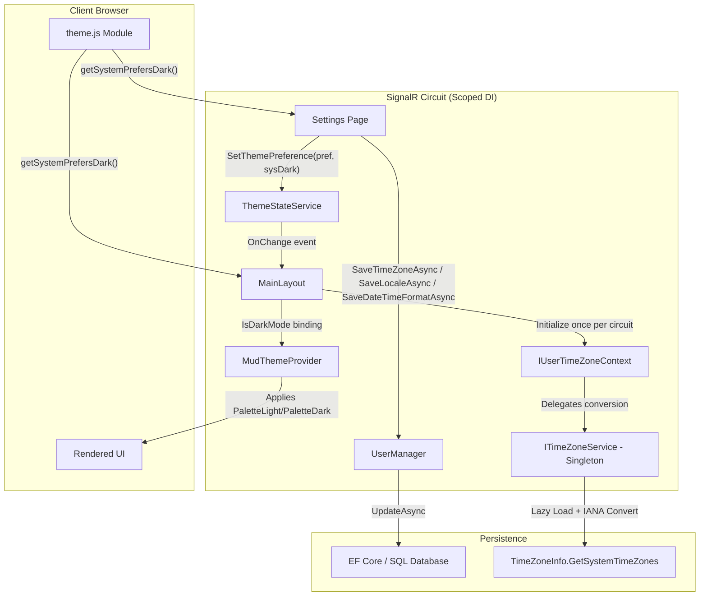

# Design Document: Settings Page

## Overview

The Settings page at `/settings` provides authenticated users with instant-save preference management for Time Zone, Locale, Date/Time Format, and Appearance (theme). The architecture combines:

- **Instant-save pattern** — All fields save immediately on value change with optimistic UI and revert-on-failure. No Save button, no EditForm.
- **ThemeStateService pub/sub** — A scoped service shared within a SignalR circuit propagates theme changes from the Settings page to the MainLayout without page reloads.
- **ITimeZoneService singleton** — Provides the canonical IANA time zone list with Windows-to-IANA conversion.
- **IUserTimeZoneContext scoped service** — Holds the user's time zone ID and preferred date/time format per circuit for user-aware datetime formatting across all pages.
- **PillToggle\<T\> component** — A generic reusable pill-shaped toggle wrapping MudToggleGroup\<T\> for theme selection.
- **ApplicationTheme dual palettes** — MudTheme subclass defining PaletteLight and PaletteDark for real-time theme switching via MudThemeProvider.
- **JS interop** — `theme.js` module for OS color scheme preference detection.

## Architecture



### Service Architecture

| Service | Lifetime | Responsibility |
|---------|----------|----------------|
| `ITimeZoneService` | Singleton | Canonical IANA zone list, stateless UTC→local conversion |
| `IUserTimeZoneContext` | Scoped | Holds user's TimeZoneId and DateTimeFormat per circuit, provides `FormatDateTime` overloads |
| `IThemeStateService` | Scoped | Holds current `IsDarkMode` boolean per circuit, fires `OnChange` event on state transitions |

### Key Design Decisions

1. **Remove View/Edit mode entirely** — The page always renders editable form controls. This eliminates the `IsEditing` state flag, `EnterEditMode()`, and `CancelEdit()` methods. (Supersedes original Phase 1 design.)
2. **Instant save for ALL fields** — No Save button, no EditForm with OnValidSubmit. Each preference field saves immediately on value change using individual async save methods that follow the optimistic-UI-with-revert pattern.
3. **Single card with dividers** — Preferences and Appearance are rendered within a single `MudPaper` container (with `Class="pa-4"` and `Elevation="0"`), separated by a `MudDivider Class="my-6"`.
4. **Singleton + Scoped separation** — `ITimeZoneService` is stateless (zone list cached in static `Lazy<T>`). `IUserTimeZoneContext` holds per-user state and delegates conversion to the singleton.
5. **IANA conversion at source** — `TimeZoneService.BuildTimeZoneList()` converts Windows IDs to IANA via `TryConvertWindowsIdToIanaId()` so all consumers get IANA IDs without additional logic.
6. **Circuit-level initialization** — `IUserTimeZoneContext.InitializeAsync()` is called once from `MainLayout.OnAfterRenderAsync` — no per-page auth state resolution needed.
7. **Scoped pub/sub for theme** — `ThemeStateService` decouples the Settings page (publisher) from the MainLayout (subscriber), allowing instant UI updates without tight component coupling.
8. **JS interop for OS detection** — Bridges the gap between server-rendered Blazor and client-side `matchMedia` API for "System" theme preference.
9. **Reusable PillToggle\<T\> component** — The theme toggle uses the generic `PillToggle<T>` shared component which wraps `MudToggleGroup<T>` with pill styling. Each option is a `PillToggleItem<T>` with circular styling and accessibility attributes.
10. **Separate MudInputLabel elements** — All field labels use `<MudInputLabel>` above the input field (not the built-in `Label` property), matching the AddUserDialog and Profile page patterns.
11. **No-op on same value** — All save methods check if the value actually changed before triggering a save, preventing unnecessary database calls.
12. **Optimistic UI with revert on failure** — All instant-save methods update the UI immediately. If the save fails, the field reverts to the previously persisted value and shows a dismissible error alert.

## Components and Interfaces

### IThemeStateService Interface

**Location:** `AspireWebAppTemplate.Web/Abstractions/IThemeStateService.cs`

```csharp
public interface IThemeStateService
{
    bool IsDarkMode { get; }
    event Action? OnChange;
    void SetDarkMode(bool isDark);
    void SetThemePreference(ThemePreference preference, bool systemPrefersDark);
}
```

**Responsibilities:**
- Hold the current `IsDarkMode` boolean per circuit
- Fire `OnChange` only when the value actually changes (no-op on same value)
- Resolve `ThemePreference` enum + OS preference into a concrete boolean

### ThemeStateService Implementation

**Location:** `AspireWebAppTemplate.Web/Services/ThemeStateService.cs`

**DI Registration:** `AddScoped<IThemeStateService, ThemeStateService>()` — one instance per SignalR circuit.

**Key Behaviors:**
- `SetDarkMode(bool)` — guards against redundant updates (idempotent when value unchanged)
- `SetThemePreference(ThemePreference, bool)` — maps enum to boolean, delegates to `SetDarkMode`
- No static fields, no shared mutable state across instances

### IUserTimeZoneContext Interface

**Location:** `AspireWebAppTemplate.Web/Abstractions/IUserTimeZoneContext.cs`

```csharp
public interface IUserTimeZoneContext
{
    string? TimeZoneId { get; }
    string? DateTimeFormat { get; }
    Task InitializeAsync(string userId);
    string FormatDateTime(DateTime utcDateTime, string? format = null);
    string FormatDateTime(DateTime? utcDateTime, string? format = null, string fallback = "-");
    string FormatDateTime(DateTimeOffset? utcDateTimeOffset, string? format = null, string fallback = "-");
}
```

### UserTimeZoneContext Implementation

**Location:** `AspireWebAppTemplate.Web/Services/UserTimeZoneContext.cs`

Scoped implementation that injects `UserManager<ApplicationUser>` and `ITimeZoneService`. Loads user's `TimeZoneId` and `DateTimeFormat` once via `InitializeAsync`, then formats dates using the cached values. Uses `format ?? DateTimeFormat ?? "yyyy-MM-dd HH:mm"` as effective format.

### ITimeZoneService / TimeZoneService

**Location:** `AspireWebAppTemplate.Core/Application/Abstractions/ITimeZoneService.cs` and `AspireWebAppTemplate.Core/Application/Services/TimeZoneService.cs`

- Converts Windows IDs to IANA via `TryConvertWindowsIdToIanaId()`
- Deduplicates entries with `.DistinctBy(tz => tz.Id)`
- Format: `(UTC±HH:mm) IANA_Identifier` for all entries
- Singleton lifetime with lazy-loaded zone list

### Settings Page (Index)

**Location:** `AspireWebAppTemplate.Web/Components/Pages/Settings/Index.razor(.cs)`

**Responsibilities:**
- Render Preferences and Appearance sections within a single MudPaper card separated by MudDivider
- Handle instant save for each preference field individually on value change
- Handle instant save for Theme/Appearance via `SaveThemeAsync`
- Display dismissible success/error alerts
- Propagate theme changes to `ThemeStateService` after successful save

**Code-Behind Structure:**

```csharp
[Authorize]
public partial class Index : ComponentBase
{
    [Inject] private UserManager<ApplicationUser> UserManager { get; set; } = default!;
    [Inject] private NavigationManager NavigationManager { get; set; } = default!;
    [Inject] private ILogger<Index> Logger { get; set; } = default!;
    [Inject] private ITimeZoneService TimeZoneService { get; set; } = default!;
    [Inject] private IThemeStateService ThemeState { get; set; } = default!;
    [Inject] private IJSRuntime JS { get; set; } = default!;

    [CascadingParameter]
    private Task<AuthenticationState> AuthStateTask { get; set; } = default!;

    private ApplicationUser? User { get; set; }
    protected string? StatusMessage { get; set; }

    // Theme state — instant save with no-op check
    private ThemePreference _themeValue;
    private ThemePreference _previousThemeValue;

    // Preference fields — instant save with previous-value tracking
    private string? _timeZoneValue, _previousTimeZoneValue;
    private string? _localeValue, _previousLocaleValue;
    private string? _dateTimeFormatValue, _previousDateTimeFormatValue;

    // Instant save methods
    private async Task SaveThemeAsync(ThemePreference theme) { /* persist + JS interop + ThemeState */ }
    private async Task SaveTimeZoneAsync(string? timeZoneId) { /* persist with revert on failure */ }
    private async Task SaveLocaleAsync(string? locale) { /* persist with revert on failure */ }
    private async Task SaveDateTimeFormatAsync(string? format) { /* persist with revert on failure */ }
}
```

### MainLayout Component

**Location:** `AspireWebAppTemplate.Web/Components/Layout/MainLayout.razor(.cs)`

**Responsibilities:**
- Renders `MudThemeProvider` with `IsDarkMode` bound to a local `_isDarkMode` field
- Subscribes to `ThemeState.OnChange` in `OnInitialized`
- Loads user's persisted `ThemePreference` on first `OnAfterRenderAsync` (requires JS interop availability)
- Initializes `IUserTimeZoneContext` on first render
- Implements `IDisposable` to unsubscribe from events

### ApplicationTheme

**Location:** `AspireWebAppTemplate.UI/Theme/ApplicationTheme.cs`

**Responsibilities:**
- Defines `PaletteLight` with corporate navy primary (`#003865`) on light backgrounds
- Defines `PaletteDark` with lighter blues (`#4A9BD9`) on dark surfaces
- Ensures `AppbarBackground` and `DrawerBackground` are defined in both palettes
- Shares `LayoutProperties` (border radius) across both modes

### PillToggle\<T\> Component

**Location:** `AspireWebAppTemplate.UI/Components/Shared/PillToggle.razor`

A generic pill-shaped toggle component wrapping `MudToggleGroup<T>` with rounded pill appearance. No custom CSS file needed — styling is applied via inline styles and MudBlazor utility classes.

**Parameters:**
- `Value` / `ValueChanged` — Two-way binding for the selected value
- `Color` — MudBlazor color for the active item (default: `Color.Primary`)
- `Class` / `Style` — Additional CSS classes/styles
- `ChildContent` — `PillToggleItem<T>` children

### PillToggleItem\<T\> Component

**Location:** `AspireWebAppTemplate.UI/Components/Shared/PillToggleItem.razor`

A single item within a PillToggle, rendered as a circular button (36×36px) with accessibility attributes.

**Parameters:**
- `Value` — The value this item represents
- `Title` — Accessibility label (rendered as both `title` and `aria-label`)
- `Rounded` — When true, renders as rounded square with `flex: 1` instead of circle (default: `false`)
- `ChildContent` — Content (typically a `MudIcon`)

### JS Interop Module

**Location:** `AspireWebAppTemplate.Web/wwwroot/js/theme.js`

**Exports:**
- `getSystemPrefersDark()` — returns `boolean` from `window.matchMedia('(prefers-color-scheme: dark)').matches`
- Returns `false` as safe default if `matchMedia` throws

**Loading:** Dynamic ES module import via `JS.InvokeAsync<IJSObjectReference>("import", "./js/theme.js")`

### ThemePreference Enum

**Location:** `AspireWebAppTemplate.Core/Domain/Enums/ThemePreference.cs`

```csharp
public enum ThemePreference
{
    System,  // Follow OS preference
    Light,   // Always light
    Dark     // Always dark
}
```

Stored as a string in the database via EF Core `HasConversion`.

### DropdownProfile

**Location:** `AspireWebAppTemplate.Web/Components/Layout/DropdownProfile.razor`

Menu order: Profile (`/profile`) → Settings (`/settings`) → Divider → Log Out. Navigation only, no theme logic.

## Data Models

### ApplicationUser (Relevant Fields)

| Property | Type | Description |
|----------|------|-------------|
| `TimeZoneId` | `string?` | IANA timezone identifier |
| `Locale` | `string?` | Culture/locale string (e.g., "en-US") |
| `DateTimeFormat` | `string?` | Date/time format string. Null = system default "yyyy-MM-dd HH:mm" |
| `Theme` | `ThemePreference` | User's preferred UI theme. Default: `System` |

### ThemePreference Enum

| Value | Description |
|-------|-------------|
| `System` | Follow OS/browser preference |
| `Light` | Always light theme |
| `Dark` | Always dark theme |

### ThemeStateService (In-Memory State)

| Field | Type | Scope | Description |
|-------|------|-------|-------------|
| `IsDarkMode` | `bool` | Per-circuit | Current resolved dark mode state |

### Preference Resolution Logic

| ThemePreference | systemPrefersDark | Resolved IsDarkMode |
|----------------|-------------------|---------------------|
| `Light` | (any) | `false` |
| `Dark` | (any) | `true` |
| `System` | `true` | `true` |
| `System` | `false` | `false` |

### TimeZoneOption (existing)

```csharp
public record TimeZoneOption(string Id, string DisplayName, TimeSpan BaseUtcOffset);
```

## Correctness Properties

### Property 1: SetDarkMode fires OnChange if and only if the value changes

*For any* sequence of boolean values passed to `SetDarkMode`, the `OnChange` event SHALL fire exactly when the new value differs from the current `IsDarkMode` value, and SHALL NOT fire when the new value equals the current value.

**Validates: Requirements 10.2, 10.3, 10.4**

### Property 2: SetThemePreference resolves to correct dark mode state

*For any* valid `ThemePreference` value and any boolean `systemPrefersDark` value, `SetThemePreference(preference, systemPrefersDark)` SHALL resolve `IsDarkMode` to: `true` when preference is `Dark`, `false` when preference is `Light`, and `systemPrefersDark` when preference is `System`.

**Validates: Requirements 10.5**

### Property 3: Theme selection no-op on same value

*For any* `ThemePreference` value that equals the current selection, setting the same value on the Settings page SHALL NOT trigger a save operation or state change notification.

**Validates: Requirements 4.4**

### Property 4: Scoped instance independence

*For any* two independently created `ThemeStateService` instances (simulating separate SignalR circuits), calling `SetDarkMode` on one instance SHALL NOT affect the `IsDarkMode` value or fire `OnChange` on the other instance.

**Validates: Requirements 14.1, 14.2, 14.3**

### Property 5: DateTimeFormat preference applied to formatting

*For any* non-null `DateTimeFormat` stored on the user, `IUserTimeZoneContext.FormatDateTime` called without an explicit format parameter SHALL produce output matching the stored format pattern. When `DateTimeFormat` is null, it SHALL use "yyyy-MM-dd HH:mm".

**Validates: Requirements 7.4**

### Property 6: Time zone search always includes saved alias

*For any* saved TimeZoneId that is a valid alias not in the canonical list, the search function SHALL include that alias in the autocomplete results regardless of the search text.

**Validates: Requirements 6.1**

## Error Handling

| Scenario | Behavior | User Feedback |
|----------|----------|---------------|
| User not found after auth state resolution | Redirect to `Account/InvalidUser` | None (redirect) |
| Preference save: `DbUpdateConcurrencyException` | Revert field to previous value | "Error: Profile was modified elsewhere, please reload." |
| Preference save: `DbUpdateException` | Revert field to previous value | "Error: Save failed, please try again." |
| Preference save: `TaskCanceledException` | Revert field to previous value | "Error: Save failed, please try again." |
| Preference save: `IdentityResult.Failed` | Revert field to previous value | "Error: Save failed, please try again." |
| Theme save fails (any exception) | Revert `_themeValue` and `User.Theme` to previous | "Error: Theme change failed, please try again." |
| JS interop `getSystemPrefersDark` throws | Catch in JS module, return `false` | None (graceful degradation to light mode) |
| `TimeZoneNotFoundException` in `TimeZoneToString` | Return raw ID string | Display raw ID without formatting |
| `IUserTimeZoneContext` not initialized | Format with UTC suffix | "2024-01-15 10:30 UTC" |

## Testing Strategy

### Property-Based Tests (FsCheck + xUnit)

**Library:** FsCheck 3.1.0 with xUnit integration (`FsCheck.Xunit`)

**Configuration:** Minimum 100 iterations per property test.

| Property | Test Description | Generator Strategy |
|----------|------------------|--------------------|
| Property 1 | Generate random `bool` sequences, replay through `SetDarkMode`, assert `OnChange` count equals actual state transitions | `Arb.generate<bool list>` |
| Property 2 | Generate all `ThemePreference` × `bool` combinations, call `SetThemePreference`, assert `IsDarkMode` matches expected mapping | `Arb.generate<ThemePreference * bool>` |
| Property 3 | Generate a random `ThemePreference`, set as current, set same again, assert no event | `Arb.generate<ThemePreference>` |
| Property 4 | Create N independent instances, mutate one randomly, assert others unchanged | `Arb.generate<bool>` per instance |
| Property 5 | For any non-null DateTimeFormat, FormatDateTime without explicit format uses stored format | Random format strings |
| Property 6 | Search always includes saved time zone alias | Random valid alias IDs |

### Unit Tests (Example-Based)

| Component | Test Cases |
|-----------|------------|
| `ThemeStateService` | Default `IsDarkMode` is `false`; `SetDarkMode(true)` sets property; idempotent calls |
| `Settings Page` | No-op on same value; revert on save failure; success alert on save |
| `ApplicationTheme` | `PaletteLight` and `PaletteDark` are not null; both have `AppbarBackground` defined |
| `IUserTimeZoneContext` | Null format uses default; explicit format overrides stored format |
| `TimeZoneToString` | Alias handling; canonical match; invalid ID returns raw string |
| `PillToggle` | Renders `title` and `aria-label` from `Title` parameter |

### Additional Tests

| Test Area | Approach |
|-----------|----------|
| Null/empty fields display dash | Property test for time zone display |
| Time zone search filtering | Property test for substring matching |
| Cancel restores DateTimeFormat | Superseded by instant-save (no Cancel button) |
| Time zone display format | Property test for format pattern |

Test files located in `AspireWebAppTemplate.Tests/` using FsCheck 3.1.0 with `[Property(MaxTest = 100)]`.
