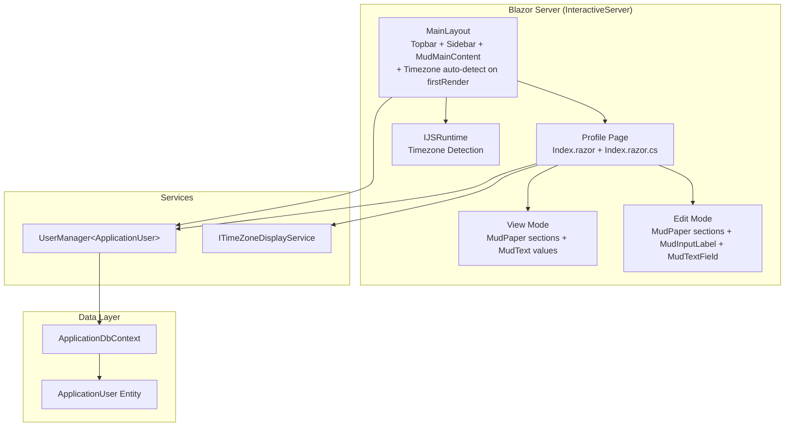

# Design Document: User Profile

## Overview

This design describes the technical implementation of a User Profile page that allows authenticated users to view and edit their personal information, preferences, and timezone settings. The page uses the standard `MainLayout` (with sidebar visible) and features a cover banner with overlapping avatar, followed by flat `MudPaper` containers (`Elevation="0"`) for section grouping — consistent with the container patterns used by UserManagement/Details and RoleManagement/Details pages.

The page implements a **unified view/edit mode toggle**: it loads in read-only View Mode showing profile data as plain text, and transitions to Edit Mode with form inputs when the user clicks the edit icon. Both modes use **identical** `MudPaper` containers, section headers, and field positions — only the field interactivity changes (plain text vs. active input). No layout shift occurs between modes. Edit Mode uses `MudInputLabel` components above inputs (not the built-in `Label` prop on `MudTextField`).

The edit action is a **pencil icon button** in the profile header card (next to the avatar, pushed right via `Justify.SpaceBetween`), not a text button inline with the name. The profile header follows a LinkedIn-style layout: cover banner → overlapping avatar (bottom-left) → name/username below avatar. Content sections span full page width (no column constraint).

The design accounts for two user types: **Local** users who can edit all editable fields, and **LDAP** users whose identity fields are synced from Active Directory and therefore read-only.

**Timezone auto-detection in MainLayout:** Timezone detection logic lives directly in `MainLayout.razor.cs` (no separate component). On `OnAfterRenderAsync(firstRender)`, MainLayout detects the browser timezone via JS interop and, if the authenticated user's `TimeZoneId` is null, auto-saves it via `UserManager`. If the timezone is already set, it does nothing. JS interop failures are handled silently (log warning, no user-facing error). This runs once per Blazor circuit (on first render only), ensuring correct date display from the first page load. The Profile page provides a searchable timezone dropdown for manual selection if auto-detection did not succeed.

A reusable `TimeZoneDisplayService` provides UTC-to-local conversion for rendering dates throughout the application. The implementation has XML documentation on the class and public members (using `<inheritdoc />`).

The `DropdownProfile` component is updated to add a "Profile" link to `/profile` and rename "Manage Account" to "Settings". Both items are always visible.

## Architecture

The feature follows the existing Blazor Server architecture with code-behind pattern. The profile page uses the standard `MainLayout` (with sidebar and topbar visible), consistent with all other authenticated pages. Timezone auto-detection runs directly in `MainLayout.razor.cs` on first render — it detects the browser timezone via JS interop and persists it to the user profile if `TimeZoneId` is null:



**Key architectural decisions:**

1. **Standard MainLayout** — The profile page uses the default `MainLayout` (with sidebar/drawer and topbar visible), just like all other authenticated pages. No custom layout is needed.
2. **New page at `Components/Pages/Profile/`** — The profile page lives at `Components/Pages/Profile/Index.razor` with route `/profile`. Since `MainLayout` is the default layout, no explicit `@layout` directive is required.
3. **InteractiveServer render mode** — Required for form interactions, JS interop, view/edit mode toggling, and real-time validation without full page reloads.
4. **Unified view/edit layout** — Both modes use identical `MudPaper Class="pa-4 mb-4" Elevation="0"` containers and section headers. Only field content changes (plain text → input). No container type change, no layout shift.
5. **MudPaper consistency** — All section containers use `<MudPaper Class="pa-4 mb-4" Elevation="0">` matching UserManagement/Details and RoleManagement/Details. No `MudCard` components with non-zero elevation.
6. **Profile Header Card with Edit button** — The banner and header card are visually connected (`rounded-t-lg` on banner, `rounded-b-lg` on header card). The header card uses `<MudPaper Class="pa-0 pb-4 px-5 mb-4 rounded-b-lg" Elevation="0" Square>` containing `<MudStack Row Justify="Justify.SpaceBetween" AlignItems="AlignItems.Start">` with avatar on left and Edit icon button on right. Name/summary info appears below the avatar row.
7. **Timezone auto-detection in MainLayout** — `MainLayout.razor.cs` detects the browser timezone via JS interop on `OnAfterRenderAsync(firstRender)`. If the authenticated user's `TimeZoneId` is null, it auto-saves the detected timezone via `UserManager`. This runs once per Blazor circuit (first render only), ensuring correct date display from the first page load. No separate component is needed — the logic is ~15 lines added directly to MainLayout's code-behind.
8. **UserManager for persistence** — Leverages ASP.NET Core Identity's `UserManager<ApplicationUser>` for user updates, consistent with the existing codebase.
9. **Service in Core project** — The `ITimeZoneDisplayService` lives in `AspireWebAppTemplate.Core` so it can be consumed by any layer needing timezone conversion.
10. **JS interop module** — A small JavaScript file in `wwwroot/js` provides browser timezone detection via `Intl.DateTimeFormat().resolvedOptions().timeZone`.
11. **DropdownProfile update** — A "Profile" menu item is added pointing to `/profile`, and "Manage Account" is renamed to "Settings". Both items are always visible.

## Components and Interfaces

### DropdownProfile Component (Updated)

**Location:** `AspireWebAppTemplate.Web/Components/Layout/DropdownProfile.razor`

Change: Add a "Profile" menu item and rename "Manage Account" to "Settings". The menu uses `PopoverClass="mud-elevation-25 p-2 action-menu"` for rounded styling:

```razor
@* Menu items (Class="" for default styling, action-menu on popover handles border-radius): *@
<MudMenuItem Class=""
             Icon="@Icons.Material.Rounded.Person"
             Label="Profile"
             Href="/profile" />
<MudMenuItem Class=""
             Icon="@Icons.Material.Rounded.Settings"
             Label="Settings"
             Href="Account/Manage" />
<MudDivider Class="my-1" />
<MudMenuItem Class=""
             Icon="material-symbols-rounded/logout"
             Label="Log Out"
             Href="Account/Logout" />
```

The "Log Out" item remains unchanged. Both "Profile" and "Settings" are always visible to authenticated users.

### Timezone Auto-Detection in MainLayout (New Logic)

**Location:** `AspireWebAppTemplate.Web/Components/Layout/MainLayout.razor.cs`

Timezone detection is performed directly in MainLayout's `OnAfterRenderAsync(firstRender)`. Since MainLayout uses InteractiveServer render mode, JS interop is available. The logic runs once per Blazor circuit (first render only).

**MainLayout.razor.cs — Added logic:**
```csharp
// Additional injected services for timezone detection
[Inject] private IJSRuntime JS { get; set; } = default!;
[Inject] private UserManager<ApplicationUser> UserManager { get; set; } = default!;
[Inject] private ILogger<MainLayout> Logger { get; set; } = default!;

[CascadingParameter]
private Task<AuthenticationState> AuthStateTask { get; set; } = default!;

protected override async Task OnAfterRenderAsync(bool firstRender)
{
    if (!firstRender) return;

    try
    {
        var authState = await AuthStateTask;
        if (authState.User.Identity?.IsAuthenticated != true) return;

        var user = await UserManager.GetUserAsync(authState.User);
        if (user is null || user.TimeZoneId is not null) return;

        var module = await JS.InvokeAsync<IJSObjectReference>("import", "./js/timezone.js");
        var detectedTimeZone = await module.InvokeAsync<string?>("getBrowserTimeZone");

        if (string.IsNullOrWhiteSpace(detectedTimeZone)) return;

        user.TimeZoneId = detectedTimeZone;
        await UserManager.UpdateAsync(user);
    }
    catch (Exception ex)
    {
        Logger.LogWarning(ex, "Failed to auto-detect and save browser timezone.");
    }
}
```

**Key behaviors:**
- Runs only on `firstRender` (once per Blazor circuit/session)
- Checks authentication first — skips for unauthenticated users
- If user's `TimeZoneId` is already set → does nothing (no overwrite)
- If user's `TimeZoneId` is null AND detected timezone is non-null → saves via `UserManager.UpdateAsync`
- JS interop failure → logs warning, no user-facing error
- No separate component needed — logic lives directly in MainLayout code-behind
- No visible UI impact — this is purely background logic

### Profile Page Component

**Location:** `AspireWebAppTemplate.Web/Components/Pages/Profile/Index.razor` + `Index.razor.cs`

Route: `/profile` — accessible to all authenticated users.
Layout: Standard `MainLayout` (default, no explicit `@layout` directive needed).

The page uses a cover banner with overlapping avatar, then flat `MudPaper` sections matching the app's detail page pattern:

```
┌─────────────────────────────────────────────────────────────�
│  ┌─────────────────────────────────────────────────────────�│
│  │          COVER BANNER (gradient, rounded-t-lg)           ││
│  │  height: 160px                                          ││
│  └─────────────────────────────────────────────────────────┘│
│  ┌─ MudPaper: Profile Header Card (rounded-b-lg) ────────� │
│  │  <MudStack Row Justify="SpaceBetween" AlignItems="Start">│
│  │    ┌───────────�                                       │ │
│  │    │  Avatar   │  � margin-top: -48px (overlaps banner)│ │
│  │    │  (96px)   │                          [�� Edit]    │ │
│  │    └───────────┘                                       │ │
│  │  </MudStack>                                           │ │
│  │                                                        │ │
│  │  <MudStack Class="mt-2">                              │ │
│  │    DisplayName (h5, font-weight: 600)                  │ │
│  │    JobTitle · Department (body2)                        │ │
│  │    Email (body2, Color.Secondary)                      │ │
│  │  </MudStack>                                           │ │
│  └────────────────────────────────────────────────────────┘ │
│                                                             │
│  ┌─ MudPaper: Personal Information (pa-4 mb-4 Elev=0) ──�  │
│  │  <MudText Typo="Typo.h6" Class="mb-3">               │  │
│  │    Personal Information                                │  │
│  │  </MudText>                                           │  │
│  │                                                       │  │
│  │  VIEW MODE:                                           │  │
│  │    Label (MudText caption)    Value (MudText body1)   │  │
│  │    "Display Name"             "John Doe"              │  │
│  │    "First Name"               "John"                  │  │
│  │    "Last Name"                "Doe"                   │  │
│  │    "Email"                    "john@example.com"      │  │
│  │    "Phone"                    "+1234567890"           │  │
│  │                                                       │  │
│  │  EDIT MODE (same container, same header):             │  │
│  │    <MudInputLabel>Display Name</MudInputLabel>        │  │
│  │    <MudTextField @bind-Value="Input.DisplayName" />   │  │
│  │    <MudInputLabel>First Name</MudInputLabel>          │  │
│  │    <MudTextField @bind-Value="Input.FirstName" />     │  │
│  │    ...                                                │  │
│  └───────────────────────────────────────────────────────┘  │
│  ┌─ MudPaper: Preferences (pa-4 mb-4 Elev=0) ───────────�  │
│  │  <MudText Typo="Typo.h6" Class="mb-3">               │  │
│  │    Preferences                                         │  │
│  │  </MudText>                                           │  │
│  │                                                       │  │
│  │  VIEW MODE:                                           │  │
│  │    "Time Zone"                "(UTC+08:00) Asia/KL"   │  │
│  │    "Locale"                   "en-US"                 │  │
│  │                                                       │  │
│  │  EDIT MODE (same container, same header):             │  │
│  │    <MudInputLabel>Time Zone</MudInputLabel>           │  │
│  │    <MudAutocomplete ... />                            │  │
│  │    <MudInputLabel>Locale</MudInputLabel>              │  │
│  │    <MudTextField @bind-Value="Input.Locale" />        │  │
│  └───────────────────────────────────────────────────────┘  │
│  ┌─ MudPaper: Organization (pa-4 mb-4 Elev=0) ──────────�  │
│  │  <MudText Typo="Typo.h6" Class="mb-3">               │  │
│  │    Organization                                        │  │
│  │  </MudText>                                           │  │
│  │                                                       │  │
│  │  (always read-only in both modes)                     │  │
│  │    "Job Title"                "Software Engineer"      │  │
│  │    "Department"               "Engineering"            │  │
│  │    "Employee Number"          "EMP-001"                │  │
│  └───────────────────────────────────────────────────────┘  │
│                                                             │
│  EDIT MODE ONLY:  [Save] [Cancel] buttons                   │
└─────────────────────────────────────────────────────────────┘
```

**Key UI patterns:**
- **Cover Banner**: A `<div>` wrapping a `MudPaper` with `Class="rounded-t-lg"`, a gradient background (`linear-gradient(135deg, #667eea 0%, #764ba2 100%)`), `Elevation="0"`, and `Square`. Fixed height (160px).
- **Profile Header Card**: A `<MudPaper Class="pa-0 pb-4 px-5 mb-4 rounded-b-lg" Elevation="0" Square>` visually connected to the banner above. Contains the avatar row and name/summary info.
- **Avatar overlap**: The `MudAvatar` (96×96px, 4px solid white border) is positioned with `margin-top: -48px` so it straddles the banner's bottom edge.
- **Edit button placement**: In View Mode, the Edit icon button (`MudIconButton` with `Icons.Material.Outlined.Edit`, `Size.Small`) is in the avatar row, pushed right via `MudStack Row Justify="Justify.SpaceBetween"`. It is NOT overlaid on the banner or placed below the avatar section.
- **Name/summary info**: Below the avatar row, a `MudStack Class="mt-2"` displays DisplayName (h5, font-weight 600), JobTitle · Department (body2), and Email (body2, Color.Secondary).
- **Section containers**: Each section (Personal Info, Preferences, Organization) is wrapped in `<MudPaper Class="pa-4 mb-4" Elevation="0">` — NOT `MudCard`. Section headers use `<MudText Typo="Typo.h6" Class="mb-3">`.
- **Unified layout**: Both View Mode and Edit Mode render inside the **same** `MudPaper` containers with the **same** section headers. Only the field content changes:
  - **View Mode**: Labels as `MudText Typo="Typo.caption"` + values as `MudText Typo="Typo.body1"`. Null/empty values display `"-"`.
  - **Edit Mode**: `MudInputLabel` component above each `MudTextField` (no `Label` prop on the text field). Fields use `Variant.Outlined` and `Margin.Dense`.
- **No layout shift**: Transitioning between modes does not change container type, section structure, or field positions.
- **No PageHeader**: The page does NOT use the `PageHeader` shared component. The banner + Profile Header Card serves as the visual header.

### Code-Behind Structure

**Location:** `AspireWebAppTemplate.Web/Components/Pages/Profile/Index.razor.cs`

```csharp
public partial class Index : ComponentBase
{
    [Inject] private UserManager<ApplicationUser> UserManager { get; set; } = default!;
    [Inject] private ITimeZoneDisplayService TimeZoneService { get; set; } = default!;
    [Inject] private NavigationManager NavigationManager { get; set; } = default!;
    [Inject] private ILogger<Index> Logger { get; set; } = default!;

    [CascadingParameter]
    private Task<AuthenticationState> AuthStateTask { get; set; } = default!;

    private ApplicationUser? User { get; set; }
    private ProfileFormModel Input { get; set; } = new();
    private EditContext editContext = default!;
    private bool IsEditing { get; set; } = false;
    private bool IsBusy { get; set; } = false;
    private string? StatusMessage { get; set; }
    private string AvatarText => /* first char of DisplayName or UserName */;

    // View/Edit mode methods
    private void EnterEditMode() { IsEditing = true; /* populate Input from User */ }
    private void CancelEdit() { IsEditing = false; /* discard Input changes, restore from User */ }
    private async Task OnValidSubmitAsync() { /* save, set IsEditing = false */ }

    // Timezone helpers
    private Task<IEnumerable<string>> SearchTimeZones(string value, CancellationToken ct);
    private string TimeZoneToString(string id);

    // Field editability
    private bool IsFieldDisabled(string fieldName);
    private string? GetLdapHelperText(string fieldName);
}
```

**Note:** The Profile page does NOT inject `IJSRuntime` or perform any browser timezone detection. Timezone auto-detection is handled exclusively by `MainLayout.razor.cs`. If the user's `TimeZoneId` is null when they visit the profile page, the timezone field simply appears empty and the user can manually select one from the searchable dropdown.

### ITimeZoneDisplayService

**Location:** `AspireWebAppTemplate.Core/Application/Abstractions/ITimeZoneDisplayService.cs`

```csharp
/// <summary>
/// Provides timezone conversion utilities for displaying UTC dates
/// in the user's configured timezone.
/// </summary>
public interface ITimeZoneDisplayService
{
    /// <summary>
    /// Converts a UTC DateTime to the specified IANA timezone.
    /// </summary>
    DateTime ConvertFromUtc(DateTime utcDateTime, string ianaTimeZoneId);

    /// <summary>
    /// Converts a UTC DateTime to the specified IANA timezone,
    /// returning null if the input is null.
    /// </summary>
    DateTime? ConvertFromUtc(DateTime? utcDateTime, string ianaTimeZoneId);

    /// <summary>
    /// Gets all available IANA timezone identifiers with their UTC offsets.
    /// </summary>
    IReadOnlyList<TimeZoneOption> GetAllTimeZones();
}

/// <summary>
/// Represents a timezone option for display in dropdowns.
/// </summary>
public record TimeZoneOption(string Id, string DisplayName, TimeSpan BaseUtcOffset);
```

### TimeZoneDisplayService Implementation

**Location:** `AspireWebAppTemplate.Core/Application/Services/TimeZoneDisplayService.cs`

Uses `TimeZoneInfo.FindSystemTimeZoneById` with IANA identifiers (supported natively on .NET 6+ cross-platform). The `GetAllTimeZones()` method returns all system timezones formatted as `"(UTC±HH:mm) Area/Location"` and sorted by offset then name.

**XML Documentation:** The class has a `<summary>` on the class declaration and uses `<inheritdoc />` on public members (since the interface already documents the contract). Private members (`_allTimeZones`, `BuildTimeZoneList`, `FormatDisplayName`) do not have XML documentation.

### JavaScript Interop Module

**Location:** `AspireWebAppTemplate.Web/wwwroot/js/timezone.js`

```javascript
export function getBrowserTimeZone() {
    try {
        return Intl.DateTimeFormat().resolvedOptions().timeZone;
    } catch {
        return null;
    }
}
```

Invoked from the page code-behind via `IJSRuntime.InvokeAsync<string?>`.

### ProfileFormModel (Input Model)

**Location:** Nested class within `Index.razor.cs`

```csharp
private sealed class ProfileFormModel
{
    [Display(Name = "Display Name")]
    [MaxLength(100)]
    public string? DisplayName { get; set; }

    [Display(Name = "First Name")]
    [MaxLength(100)]
    public string? FirstName { get; set; }

    [Display(Name = "Last Name")]
    [MaxLength(100)]
    public string? LastName { get; set; }

    [Phone]
    [Display(Name = "Phone Number")]
    public string? PhoneNumber { get; set; }

    [Display(Name = "Time Zone")]
    public string? TimeZoneId { get; set; }

    [Display(Name = "Locale")]
    public string? Locale { get; set; }
}
```

## Data Models

### ApplicationUser (Existing — No Changes)

The `ApplicationUser` entity already contains all required fields. No schema migration is needed:

| Field | Type | Editable (Local) | Editable (LDAP) |
|-------|------|:-----------------:|:----------------:|
| DisplayName | string? | ✓ | ✗ (LDAP-synced) |
| FirstName | string? | ✓ | ✗ (LDAP-synced) |
| LastName | string? | ✓ | ✗ (LDAP-synced) |
| Email | string? | ✗ (read-only) | ✗ (LDAP-synced) |
| PhoneNumber | string? | ✓ | ✓ |
| TimeZoneId | string? | ✓ | ✓ |
| Locale | string? | ✓ | ✓ |
| JobTitle | string? | ✗ (read-only) | ✗ (read-only) |
| Department | string? | ✗ (read-only) | ✗ (read-only) |
| EmployeeNumber | string? | ✗ (read-only) | ✗ (read-only) |
| AvatarUrl | string? | ✗ (display only) | ✗ (display only) |

### TimeZoneOption (Value Object)

```csharp
public record TimeZoneOption(string Id, string DisplayName, TimeSpan BaseUtcOffset);
```

Represents a timezone entry for the searchable dropdown. `Id` is the IANA identifier (e.g., `"Asia/Kuala_Lumpur"`), `DisplayName` is the formatted label (e.g., `"(UTC+08:00) Asia/Kuala_Lumpur"`), and `BaseUtcOffset` is used for sorting.

## Correctness Properties

*A property is a characteristic or behavior that should hold true across all valid executions of a system — essentially, a formal statement about what the system should do. Properties serve as the bridge between human-readable specifications and machine-verifiable correctness guarantees.*

### Property 1: Profile save round-trip

*For any* valid set of editable field values (DisplayName, FirstName, LastName, PhoneNumber, TimeZoneId, Locale), saving those values to a user profile and then reloading the user should return the exact same field values.

**Validates: Requirements 6.2**

### Property 2: Field editability rules based on AuthSource

*For any* user profile and any field, the field's enabled/disabled state in Edit Mode is determined by the combination of the user's `AuthSource` and whether the field belongs to the LDAP-synced set. Specifically: for a Local user, all Editable_Fields are enabled; for an LDAP user, only non-LDAP-synced fields (PhoneNumber, Locale, TimeZoneId) are enabled while LDAP_Synced_Fields (DisplayName, FirstName, LastName) are disabled.

**Validates: Requirements 6.1, 7.1, 7.2**

### Property 3: Timezone display format

*For any* timezone returned by `GetAllTimeZones()`, the `DisplayName` property shall match the pattern `"(UTC±HH:mm) Area/Location"` where the offset corresponds to the timezone's base UTC offset and the identifier is a valid IANA timezone name.

**Validates: Requirements 9.3**

### Property 4: Timezone search filtering

*For any* non-empty search string, filtering the timezone list should return only entries whose `DisplayName` or `Id` contains the search string (case-insensitive), and no matching entries should be excluded from the results.

**Validates: Requirements 9.2**

### Property 5: MaxLength validation rejects oversized input

*For any* string longer than 100 characters assigned to DisplayName, FirstName, or LastName, the form model validation shall report a validation error on that field, and the form shall not be submitted.

**Validates: Requirements 10.2, 10.3**

### Property 6: Fallback avatar character derivation

*For any* user with a null or empty `AvatarUrl`, the fallback avatar character shall be the first character of `DisplayName` if non-empty, otherwise the first character of `UserName`, ensuring a visible character is always produced.

**Validates: Requirements 11.2**

### Property 7: Null field placeholder display

*For any* user profile field that is null or empty, the display representation in View Mode shall be the placeholder indicator `"-"` rather than blank space or null text.

**Validates: Requirements 3.4**

### Property 8: Cancel discards modifications

*For any* set of field modifications made in Edit Mode, clicking Cancel shall restore all field values to their pre-edit state and transition the page to View Mode, with no changes persisted.

**Validates: Requirements 4.4, 4.5**

### Property 9: Timezone auto-save conditional on null TimeZoneId

*For any* authenticated user and any detected browser timezone, the MainLayout timezone auto-detection logic shall save the detected timezone to the user's profile if and only if the user's existing `TimeZoneId` is null. If `TimeZoneId` is already set to a non-null value, it shall remain unchanged regardless of the detected value.

**Validates: Requirements 8.2, 8.3**

## Error Handling

| Scenario | Handling Strategy |
|----------|-------------------|
| User not found (deleted mid-session) | Redirect to `Account/InvalidUser` page (existing pattern) |
| `UserManager.UpdateAsync` fails | Display error message from `IdentityResult.Errors` in a `MudAlert` with `Severity.Error`; remain in Edit Mode |
| JS interop for timezone detection throws (MainLayout) | Catch exception, log warning, no user-facing error, leave TimeZoneId unchanged |
| JS interop returns unrecognized timezone ID | Validate against `TimeZoneInfo.FindSystemTimeZoneById`; if invalid, treat as null and leave field empty |
| MainLayout timezone save fails (UserManager error) | Catch exception, log warning, no user-facing error — user can still set timezone manually on profile page |
| Network/database timeout during save | Catch `DbUpdateException` or `TaskCanceledException`, display generic "Save failed, please try again" message |
| Concurrent modification (another admin updates user) | `UserManager.UpdateAsync` uses concurrency stamp; if stale, display "Profile was modified elsewhere, please reload" |
| Invalid phone number format | `DataAnnotationsValidator` catches `[Phone]` attribute violation, displays inline validation error |
| Field exceeds max length | `DataAnnotationsValidator` catches `[MaxLength]` violation, displays inline validation error |
| Cancel during unsaved changes | Discard all modifications, restore original values from loaded user entity, transition to View Mode |

**Error display pattern:** Errors are shown using a `MudAlert` component above the section containers (consistent with the existing `StatusMessage` pattern). Validation errors appear inline on each field via MudBlazor's `For` parameter binding (in Edit Mode only).

## Testing Strategy

### Unit Tests

Unit tests cover specific examples and edge cases:

- Profile page renders cover banner and overlapping avatar
- Profile page renders `MudPaper Class="pa-4 mb-4" Elevation="0"` sections (NOT MudCard)
- Profile page does NOT render PageHeader component
- Page loads in View Mode (MudText values, no form inputs visible)
- Profile Header Card contains avatar and Edit icon button in same row (Justify.SpaceBetween)
- Edit icon button is in the Profile Header Card (not overlaid on banner or in separate section)
- Edit button transitions to Edit Mode (form inputs appear in same containers)
- View Mode and Edit Mode use identical MudPaper containers and section headers
- No layout shift between View Mode and Edit Mode (same container structure)
- Cancel button reverts to View Mode with original values
- Save button persists changes and transitions to View Mode
- Avatar displays image when `AvatarUrl` is set
- Avatar displays fallback character when `AvatarUrl` is null
- LDAP user sees helper text on synced fields in Edit Mode
- Success message appears after valid save
- Error message appears when save fails
- Submit button is disabled during save operation
- MainLayout auto-saves timezone when user's TimeZoneId is null (on first render)
- MainLayout does nothing when user's TimeZoneId is already set
- MainLayout handles JS interop failure silently (logs warning, no error)
- Profile page does NOT inject IJSRuntime or perform browser timezone detection
- Timezone dropdown contains all system timezones
- Edit Mode uses MudInputLabel above inputs (not Label prop on MudTextField)
- DropdownProfile renders "Profile" item with href="/profile"
- DropdownProfile renders "Settings" item (renamed from "Manage Account")

### Property-Based Tests

Property-based tests verify universal correctness properties using **FsCheck** (via `FsCheck.Xunit` for .NET):

- **Minimum 100 iterations** per property test
- Each test references its design property via tag comment
- Tests focus on the service layer (`TimeZoneDisplayService`), validation model (`ProfileFormModel`), display logic, and timezone auto-detection logic

| Property | Test Target | What Varies |
|----------|-------------|-------------|
| Property 1: Save round-trip | `UserManager.UpdateAsync` + reload | Random valid field values |
| Property 2: Field editability | `IsFieldDisabled` logic function | AuthSource × field combinations |
| Property 3: Timezone format | `TimeZoneDisplayService.GetAllTimeZones()` | All system timezones |
| Property 4: Timezone filtering | `SearchTimeZones` filter function | Random search strings |
| Property 5: MaxLength validation | `ProfileFormModel` + `Validator` | Random strings > 100 chars |
| Property 6: Fallback avatar | Avatar derivation logic | Random DisplayName/UserName combinations |
| Property 7: Null placeholder | View Mode display rendering logic | Random null/non-null field combinations |
| Property 8: Cancel discards | Edit/Cancel cycle | Random field modifications |
| Property 9: Timezone auto-save | `TimeZoneDetector` logic | Random users with null/non-null TimeZoneId × random detected timezones |

### Integration Tests

Integration tests verify end-to-end behavior with the database:

- Authenticated user can load profile page (Requirement 1.1)
- Unauthenticated user is redirected to login (Requirement 1.2)
- Profile changes persist across page reloads
- LDAP user cannot modify synced fields via form submission (server-side guard)
- TimeZoneDetector saves timezone on first authenticated render when TimeZoneId is null
- TimeZoneDetector does not overwrite existing timezone on subsequent renders

### Test Project Setup

A new test project `AspireWebAppTemplate.Tests` using:
- **xUnit** as the test framework
- **FsCheck.Xunit** for property-based testing (minimum 100 iterations)
- **bUnit** for Blazor component rendering tests
- **Moq** for mocking `UserManager`, `IJSRuntime`, and other dependencies

Tag format for property tests:
```
// Feature: user-profile, Property {number}: {property_text}
```


---

## Phase 3: Typography, Label, and Validation Bugfixes

### Bug Analysis

Three visual and functional inconsistencies were identified and fixed:

1. **Typography Mismatch**: View Mode field values used `Typo="Typo.body1"` (16px) instead of `Typo="Typo.body2"` (14px), inconsistent with data grid text elsewhere in the application.

2. **Label Element Mismatch**: View Mode labels used `<MudText Typo="Typo.caption">` while Edit Mode used `<MudInputLabel>`, causing visual inconsistency when toggling between modes.

3. **Phone Validation Too Strict**: The built-in `[Phone]` DataAnnotation attribute blocked users from clearing a previously-saved phone number (rejected empty string).

### Fix Implementation

- **Bug 1**: Changed all 10 field value `<MudText>` elements in View Mode from `Typo="Typo.body1"` to `Typo="Typo.body2"`.
- **Bug 2**: Replaced all 10 `<MudText Typo="Typo.caption">` label elements in View Mode with `<MudInputLabel>` elements.
- **Bug 3**: Created `OptionalPhoneAttribute` at `AspireWebAppTemplate.Core/Utilities/OptionalPhoneAttribute.cs` that allows null/empty/whitespace and validates non-empty values against regex `^\+?[\d\s\-\(\)\.]+$`. Applied to both Profile page and Account/Manage page.

### Correctness Properties (Bugfix)

**Property 10: View Mode Typography Consistency** — For any profile page render in View Mode, all field value `<MudText>` elements SHALL use `Typo="Typo.body2"`.

**Property 11: View Mode Label Consistency** — For any profile page render in View Mode, all field labels SHALL use `<MudInputLabel>`.

**Property 12: Phone Number Clearing Allowed** — For any form submission where the phone number field is empty or null, validation SHALL pass.

**Property 13: Phone Validation for Non-Empty Values** — For any non-empty string, `OptionalPhoneAttribute` SHALL accept values matching the phone regex and reject values not matching it.

---

## Phase 4: Label Visual Hierarchy Styling

### Design

Applied the `fw-bold` CSS class to all `<MudInputLabel>` elements on the Profile page in both View Mode and Edit Mode. This creates a clear visual hierarchy: labels appear in bold font weight while values appear in normal weight.

- No custom CSS needed — `fw-bold` is a standard utility class applying `font-weight: bold`.
- The same class is applied in both modes, ensuring no visual jarring when switching.
- Labels use `Class="fw-bold"` for bold weight contrast against normal-weight values.

---

## Post-Implementation Changes

> **Note:** The following changes were made after the original implementation of this spec. They are documented here for traceability.

1. **Preferences section moved to Settings page** — The Preferences section (Time Zone, Locale) was extracted from the Profile page and moved to a new Settings page at `Components/Pages/Settings/`. The Profile page no longer contains Time Zone or Locale fields.

2. **`ITimeZoneDisplayService` renamed to `ITimeZoneService`** — The interface and implementation were renamed (`TimeZoneDisplayService` ? `TimeZoneService`). The service now also includes `TryConvertWindowsIdToIanaId()` for Windows-to-IANA timezone ID conversion.

3. **`ProfileFormModel` renamed to `InputModel`** — The nested form model class in the Profile page code-behind was renamed from `ProfileFormModel` to `InputModel` for consistency with all other pages.

4. **`IUserTimeZoneContext` added** — A new scoped service `IUserTimeZoneContext` (in `Abstractions/`) was created to provide user-aware datetime formatting throughout the application.

5. **DropdownProfile menu updated** — The menu was simplified from "Profile ? Preferences ? Settings ? Divider ? Log Out" to "Profile ? Settings ? Divider ? Log Out", where "Settings" now navigates to `/settings`.

6. **Label counts reduced** — After Preferences extraction, the Profile page has 8 labels (5 Personal Information + 3 Organization) instead of the original 10.
